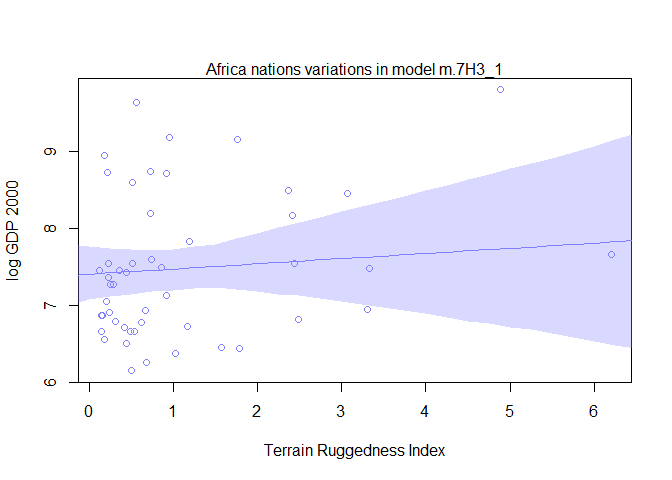
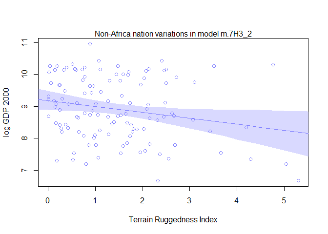
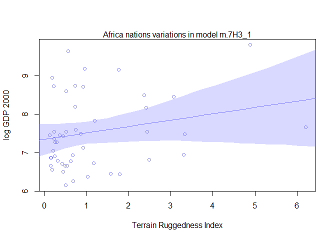
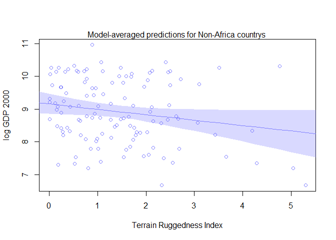
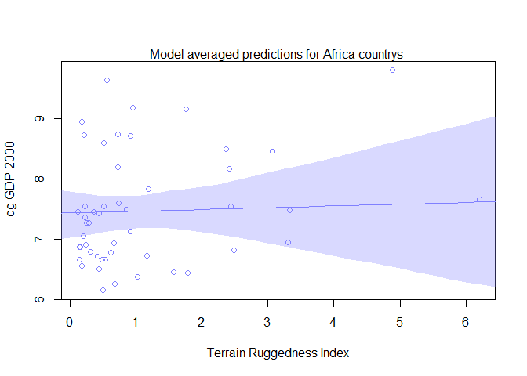
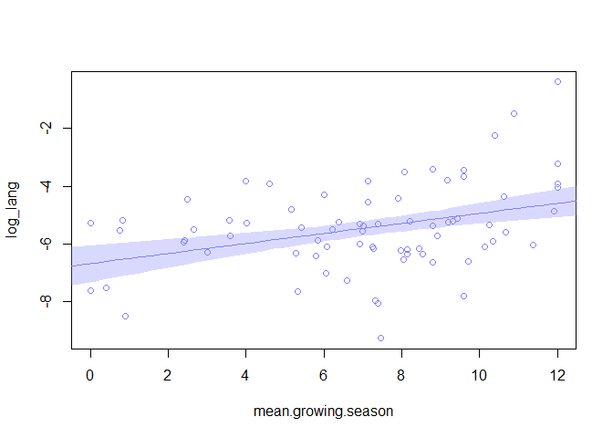
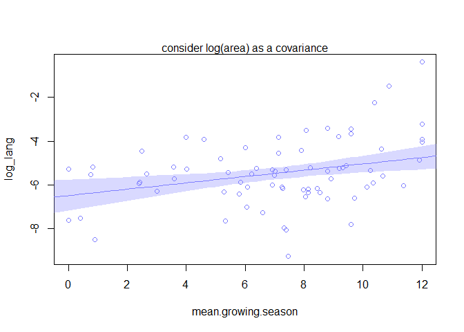
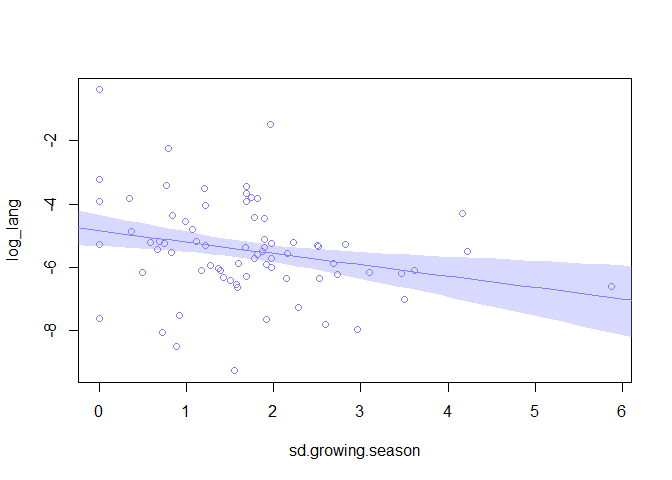
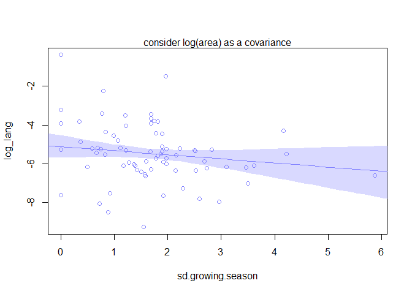

# Assignment_Chapter_07
XIAOYAN YUE  
06/04/2016  
###7E1. For each of the causal relationships below, name a hypothetical third variable that would lead to an interaction effect.

####(1) Bread dough rises because of yeast.
time, temperature

####(2) Education leads to higher income.
family background,country

####(3) Gasoline makes a car go.
physical situation of the car

###7E2. Which of the following explanations invokes an interaction?
\(2)

###7E3. For each of the explanations in 7E2, write a linear model that expresses the stated relationship.
(1)caramelized ~ Normal(mu,sigma)  
mu = a + b.h\*heat + b.w\*water

(2)car_faster ~ Normal(mu,sigma)  
mu = a + b_c\*cylinder + b_f\*fuel_injector + b_cf\*cylinder\*fuel_injector

(3)politicol_beliefs ~ Normal(mu,sigma)  
mu = a + b_p\*parent_beliefs + b_f\*friends_beliefs (because their friends' beliefs didnot effect their parents' beliefs)

(4)intelligent_animal ~ Normal(mu,sigma)  
mu = a + b_s\*social+b_a*appendages

###7M1
Under hot temperature, at any water and light conditionsno tupips could grow blooms. 

###7M2
temperature <- c(0,1)  
regression equiation:
bloom_size ~ water:shade:cool + water:cool + shade:cool

###7M3

```r
##invent a set of data? not just creat a model?
```

###7H1

```r
library(rethinking)
```

```
## Loading required package: rstan
```

```
## Loading required package: ggplot2
```

```
## rstan (Version 2.9.0-3, packaged: 2016-02-11 15:54:41 UTC, GitRev: 05c3d0058b6a)
```

```
## For execution on a local, multicore CPU with excess RAM we recommend calling
## rstan_options(auto_write = TRUE)
## options(mc.cores = parallel::detectCores())
```

```
## Loading required package: parallel
```

```
## rethinking (Version 1.58)
```

```r
data(tulips)
d <- tulips

##make centered verison of shade and water
d$shade.c <- d$shade - mean(d$shade)
d$water.c <- d$water - mean(d$water)

#set the dummy variable for the data
d$bed_a <- ifelse(d$bed=="a",1,0)
d$bed_b <- ifelse(d$bed=="b",1,0)
d$bed_c <- ifelse(d$bed=="c",1,0)

##creat the model
m.7H1 <- map(
  alist(
    blooms ~ dnorm( mu , sigma ) ,
    mu <- a + bW*water.c + bS*shade.c + bWS*water.c*shade.c + bA*bed_a + bB*bed_b + bC*bed_c, 
    a ~ dnorm( 130 , 100 ) ,
    bW ~ dnorm( 0 , 100 ) ,
    bS ~ dnorm( 0 , 100 ) ,
    bWS ~ dnorm( 0 , 100 ) ,
    bA ~ dnorm( 0, 1 ),
    bB ~ dnorm( 0, 1 ),
    bC ~ dnorm( 0, 1),#set the prior for the added parameter
    sigma ~ dunif( 0 , 100 )
  ) ,
  data=d ,
  start=list(a=mean(d$blooms),bW=0,bS=0,bWS=0,bA=0,bB=0,bC=0,sigma=sd(d$blooms)) )
precis(m.7H1)
```

```
##         Mean StdDev   5.5%  94.5%
## a     129.00   8.68 115.12 142.88
## bW     74.94  10.60  58.01  91.88
## bS    -41.13  10.59 -58.06 -24.20
## bWS   -51.96  12.94 -72.64 -31.28
## bA     -0.14   1.00  -1.74   1.46
## bB      0.06   1.00  -1.54   1.66
## bC      0.08   1.00  -1.52   1.68
## sigma  45.20   6.16  35.35  55.04
```

####7H2

```r
#fit the model omited bed
m.7H2 <- map(
  alist(
    blooms ~ dnorm( mu , sigma ) ,
    mu <- a + bW*water.c + bS*shade.c + bWS*water.c*shade.c ,
    a ~ dnorm( 130 , 100 ) ,
    bW ~ dnorm( 0 , 100 ) ,
    bS ~ dnorm( 0 , 100 ) ,
    bWS ~ dnorm( 0 , 100 ) ,
    sigma ~ dunif( 0 , 100 )
  ) ,
  data=d ,
  start=list(a=mean(d$blooms),bW=0,bS=0,bWS=0,sigma=sd(d$blooms)) )

compare(m.7H1,m.7H2)#compare these two models using WAIC
```

```
##        WAIC pWAIC dWAIC weight    SE  dSE
## m.7H2 295.6   6.4   0.0   0.64 10.31   NA
## m.7H1 296.8   7.0   1.1   0.36 10.72 0.49
```
It seems the bed variable did not effect the outcomes in this study.


```r
#what means reconcile the WAIC results?
```

####7H3

```r
library(rethinking)
data(rugged)
d <- rugged

# make log version of outcome
d$log_gdp <- log( d$rgdppc_2000 )

# extract countries with GDP data
dd <- d[ complete.cases(d$rgdppc_2000) , ]

#(a) using map to fit just the interaction model without country Seychelles

# extract country Seychelles
dd1 <- dd[dd$country!="Seychelles",]
#fit the model
m.7H3_1 <- map(
  alist(
    log_gdp ~ dnorm( mu , sigma ) ,
    mu <- a + bR*rugged + bAR*rugged*cont_africa + bA*cont_africa,
    a ~ dnorm( 8 , 100 ) ,
    bA ~ dnorm( 0 , 1 ) ,
    bR ~ dnorm( 0 , 1 ) ,
    bAR ~ dnorm( 0 , 1 ) ,
    sigma ~ dunif( 0 , 10 )
  ) ,
  data=dd1 )

#using the same model fit to the full data
m.7H3_2 <- map(
  alist(
    log_gdp ~ dnorm( mu , sigma ) ,
    mu <- a + bR*rugged + bAR*rugged*cont_africa + bA*cont_africa,
    a ~ dnorm( 8 , 100 ) ,
    bA ~ dnorm( 0 , 1 ) ,
    bR ~ dnorm( 0 , 1 ) ,
    bAR ~ dnorm( 0 , 1 ) ,
    sigma ~ dunif( 0 , 10 )
  ) ,
  data=dd )
#compare the inference of two models
precis(m.7H3_1)
```

```
##        Mean StdDev  5.5% 94.5%
## a      9.19   0.14  8.97  9.40
## bA    -1.78   0.22 -2.13 -1.43
## bR    -0.19   0.08 -0.31 -0.07
## bAR    0.25   0.14  0.04  0.47
## sigma  0.93   0.05  0.85  1.01
```

```r
precis(m.7H3_2)
```

```
##        Mean StdDev  5.5% 94.5%
## a      9.18   0.14  8.97  9.40
## bA    -1.85   0.22 -2.20 -1.50
## bR    -0.18   0.08 -0.31 -0.06
## bAR    0.35   0.13  0.14  0.55
## sigma  0.93   0.05  0.85  1.01
```

```r
#it seems the only difference is the interaction effect is smaller in the model without country Seychelles
```

(b)plot the posterior predictions for above two models

```r
#set the value of rugged
rugged.seq <- seq(from=-1,to=8,by=0.25)

# compute mu over samples from model m.7H3_1 (without country Seychelles)
mu.NotAfrica <- link( m.7H3_1 , data=data.frame(cont_africa=0,rugged=rugged.seq) )#based on model m.7H3_1 calculating mu 
```

```
## [ 100 / 1000 ]
[ 200 / 1000 ]
[ 300 / 1000 ]
[ 400 / 1000 ]
[ 500 / 1000 ]
[ 600 / 1000 ]
[ 700 / 1000 ]
[ 800 / 1000 ]
[ 900 / 1000 ]
[ 1000 / 1000 ]
```

```r
mu.Africa <- link( m.7H3_1 , data=data.frame(cont_africa=1,rugged=rugged.seq) )
```

```
## [ 100 / 1000 ]
[ 200 / 1000 ]
[ 300 / 1000 ]
[ 400 / 1000 ]
[ 500 / 1000 ]
[ 600 / 1000 ]
[ 700 / 1000 ]
[ 800 / 1000 ]
[ 900 / 1000 ]
[ 1000 / 1000 ]
```

```r
# summarize to means and intervals
mu.NotAfrica.mean <- apply( mu.NotAfrica , 2 , mean )
mu.NotAfrica.PI <- apply( mu.NotAfrica , 2 , PI , prob=0.97 )
mu.Africa.mean <- apply( mu.Africa , 2 , mean )
mu.Africa.PI <- apply( mu.Africa , 2 , PI , prob=0.97 )

#plot the posterior predictions for the model m.7H3_1 for non-africa country
d.A0 <- dd[dd$cont_africa==0,]
plot(log_gdp ~ rugged, data=d.A0,col=rangi2,ylab="log GDP 2000",xlab="Terrain Ruggedness Index")
mtext("Non-Africa nation variations in model m.7H3_1")
lines(rugged.seq,mu.NotAfrica.mean,col=rangi2)
shade(mu.NotAfrica.PI,rugged.seq,col = col.alpha(rangi2,0.3))
```


```r
#plot the posterior predictions for The model m.7H3_1 for Africa country
d.A1 <- dd[dd$cont_africa==1,]
plot(log_gdp ~ rugged, data=d.A1,col=rangi2,ylab="log GDP 2000",xlab="Terrain Ruggedness Index")
mtext("Africa nations variations in model m.7H3_1")
lines(rugged.seq,mu.Africa.mean,col=rangi2)
shade(mu.Africa.PI,rugged.seq,col = col.alpha(rangi2,0.3))
```



```r
###################
# compute mu over samples from model m.7H3_2 (full data)
mu.NotAfrica <- link( m.7H3_2 , data=data.frame(cont_africa=0,rugged=rugged.seq) )#based on model m.7H3_1 calculating mu 
```

```
## [ 100 / 1000 ]
[ 200 / 1000 ]
[ 300 / 1000 ]
[ 400 / 1000 ]
[ 500 / 1000 ]
[ 600 / 1000 ]
[ 700 / 1000 ]
[ 800 / 1000 ]
[ 900 / 1000 ]
[ 1000 / 1000 ]
```

```r
mu.Africa <- link( m.7H3_2 , data=data.frame(cont_africa=1,rugged=rugged.seq) )
```

```
## [ 100 / 1000 ]
[ 200 / 1000 ]
[ 300 / 1000 ]
[ 400 / 1000 ]
[ 500 / 1000 ]
[ 600 / 1000 ]
[ 700 / 1000 ]
[ 800 / 1000 ]
[ 900 / 1000 ]
[ 1000 / 1000 ]
```

```r
# summarize to means and intervals
mu.NotAfrica.mean <- apply( mu.NotAfrica , 2 , mean )
mu.NotAfrica.PI <- apply( mu.NotAfrica , 2 , PI , prob=0.97 )
mu.Africa.mean <- apply( mu.Africa , 2 , mean )
mu.Africa.PI <- apply( mu.Africa , 2 , PI , prob=0.97 )

#plot the posterior predictions for the model m.7H3_2 for Non-Africa country
d.A0 <- dd[dd$cont_africa==0,]
plot(log_gdp ~ rugged, data=d.A0,col=rangi2,ylab="log GDP 2000",xlab="Terrain Ruggedness Index")
mtext("Non-Africa nation variations in model m.7H3_2")
lines(rugged.seq,mu.NotAfrica.mean,col=rangi2)
shade(mu.NotAfrica.PI,rugged.seq,col = col.alpha(rangi2,0.3))
```



```r
#plot the posterior predictions for THE model m.7H3_2 for Africa country
d.A1 <- dd[dd$cont_africa==1,]
plot(log_gdp ~ rugged, data=d.A1,col=rangi2,ylab="log GDP 2000",xlab="Terrain Ruggedness Index")
mtext("Africa nations variations in model m.7H3_1")
lines(rugged.seq,mu.Africa.mean,col=rangi2)
shade(mu.Africa.PI,rugged.seq,col = col.alpha(rangi2,0.3))
```


(c)Fit three models to the data without Seychelles and conduct a model comparison analysis using WAIC.

```r
# extract country Seychelles
dd1 <- dd[dd$country!="Seychelles",]

#model 1:y ~ Normal(mu,sigma)
       #mu = a + bR*R

#fit the model 1
m.c1 <- map(
  alist(
    log_gdp ~ dnorm( mu , sigma ) ,
    mu <- a + bR*rugged,
    a ~ dnorm( 8 , 100 ) ,
    bR ~ dnorm( 0 , 1 ) ,
    sigma ~ dunif( 0 , 10 )
  ) ,
  data=dd1 )

#model 2:y ~ Normal(mu,sigma)
       #mu = a + bA*A + bR*R 

#fit the model 2
m.c2 <- map(
  alist(
    log_gdp ~ dnorm( mu , sigma ) ,
    mu <- a + bR*rugged + bA*cont_africa,
    a ~ dnorm( 8 , 100 ) ,
    bA ~ dnorm( 0 , 1 ) ,
    bR ~ dnorm( 0 , 1 ) ,
    sigma ~ dunif( 0 , 10 )
  ) ,
  data=dd1 )

#model 3:y ~ Normal(mu,sigma)
       #mu = a + bA*A + bR*R + bAR*A*R 

#fit the model 3
m.c3 <- map (
  alist(
    log_gdp ~ dnorm( mu , sigma ) ,
    mu <- a + bR*rugged + bAR*rugged*cont_africa + bA*cont_africa,
    a ~ dnorm( 8 , 100 ) ,
    bA ~ dnorm( 0 , 1 ) ,
    bR ~ dnorm( 0 , 1 ) ,
    bAR ~ dnorm( 0 , 1 ) ,
    sigma ~ dunif( 0 , 10 )
  ) ,
  data=dd1 )

compare(m.c1,m.c2,m.c3)
```

```
##       WAIC pWAIC dWAIC weight    SE   dSE
## m.c3 463.3   4.6   0.0    0.8 15.12    NA
## m.c2 466.1   3.9   2.8    0.2 14.24  3.42
## m.c1 536.1   2.7  72.8    0.0 13.34 15.24
```

```r
##plot the model-averaged predictions of this model set

#(1)averaged-model for Non-Africa
rugged.seq <- seq(from=-1,to=8,by=0.25)
rugged.ensemble1 <- ensemble(m.c1,m.c2,m.c3,data=data.frame(cont_africa=0,rugged=rugged.seq))
```

```
## Constructing posterior predictions
```

```
## [ 100 / 1000 ]
[ 200 / 1000 ]
[ 300 / 1000 ]
[ 400 / 1000 ]
[ 500 / 1000 ]
[ 600 / 1000 ]
[ 700 / 1000 ]
[ 800 / 1000 ]
[ 900 / 1000 ]
[ 1000 / 1000 ]
```

```
## Constructing posterior predictions
```

```
## [ 100 / 1000 ]
[ 200 / 1000 ]
[ 300 / 1000 ]
[ 400 / 1000 ]
[ 500 / 1000 ]
[ 600 / 1000 ]
[ 700 / 1000 ]
[ 800 / 1000 ]
[ 900 / 1000 ]
[ 1000 / 1000 ]
```

```
## Constructing posterior predictions
```

```
## [ 100 / 1000 ]
[ 200 / 1000 ]
[ 300 / 1000 ]
[ 400 / 1000 ]
[ 500 / 1000 ]
[ 600 / 1000 ]
[ 700 / 1000 ]
[ 800 / 1000 ]
[ 900 / 1000 ]
[ 1000 / 1000 ]
```

```r
# compute mu over samples from averaged-model for Non-Africa country
mu.NotAfrica <- apply (rugged.ensemble1$link, 2, mean )#based on averaged-model calculating mu 

# summarize to intervals
mu.NotAfrica.PI <- apply( rugged.ensemble1$link , 2 , PI , prob=0.97 )

#plot the posterior predictions for THE averaged-model for non-africa country
d.A0 <- dd[dd$cont_africa==0,]
plot(log_gdp ~ rugged, data=d.A0,col=rangi2,ylab="log GDP 2000",xlab="Terrain Ruggedness Index")
mtext("Model-averaged predictions for Non-Africa countrys ")
lines(rugged.seq,mu.NotAfrica,col=rangi2)
shade(mu.NotAfrica.PI,rugged.seq,col = col.alpha(rangi2,0.3))
```



```r
#(2)averaged-model for Africa country
rugged.seq <- seq(from=-1,to=8,by=0.25)
rugged.ensemble2 <- ensemble(m.c1,m.c2,m.c3,data=data.frame(cont_africa=1,rugged=rugged.seq))
```

```
## Constructing posterior predictions
```

```
## [ 100 / 1000 ]
[ 200 / 1000 ]
[ 300 / 1000 ]
[ 400 / 1000 ]
[ 500 / 1000 ]
[ 600 / 1000 ]
[ 700 / 1000 ]
[ 800 / 1000 ]
[ 900 / 1000 ]
[ 1000 / 1000 ]
```

```
## Constructing posterior predictions
```

```
## [ 100 / 1000 ]
[ 200 / 1000 ]
[ 300 / 1000 ]
[ 400 / 1000 ]
[ 500 / 1000 ]
[ 600 / 1000 ]
[ 700 / 1000 ]
[ 800 / 1000 ]
[ 900 / 1000 ]
[ 1000 / 1000 ]
```

```
## Constructing posterior predictions
```

```
## [ 100 / 1000 ]
[ 200 / 1000 ]
[ 300 / 1000 ]
[ 400 / 1000 ]
[ 500 / 1000 ]
[ 600 / 1000 ]
[ 700 / 1000 ]
[ 800 / 1000 ]
[ 900 / 1000 ]
[ 1000 / 1000 ]
```

```r
# compute mu over samples from averaged-model for Africa country
mu.Africa <- apply (rugged.ensemble2$link , 2, mean )#based on averaged-model calculating mu 

# summarize to intervals
mu.Africa.PI <- apply( rugged.ensemble2$link , 2 , PI , prob=0.97 )

#plot the posterior predictions for The averaged-model for Africa country
d.A1 <- dd[dd$cont_africa==1,]
plot(log_gdp ~ rugged, data=d.A1,col=rangi2,ylab="log GDP 2000",xlab="Terrain Ruggedness Index")
mtext("Model-averaged predictions for Africa countrys ")
lines(rugged.seq,mu.Africa,col=rangi2)
shade(mu.Africa.PI,rugged.seq,col = col.alpha(rangi2,0.3))
```



```r
#
```
###7H4

```r
library(rethinking)
##loads the data sets
data(nettle)
d <- nettle

#model the number of languages per capita as the outcome variable
d$lang.per.cap <- d$num.lang / d$k.pop

#(a)
# make log version of outcome and covariate
d$log_lang <- log( d$lang.per.cap )
d$log_area <- log(d$area)
summary(d)
```

```
##        country      num.lang           area             k.pop       
##  Algeria   : 1   Min.   :  1.00   Min.   :  12189   Min.   :   102  
##  Angola    : 1   1st Qu.: 17.25   1st Qu.: 167708   1st Qu.:  3829  
##  Australia : 1   Median : 40.00   Median : 434796   Median :  9487  
##  Bangladesh: 1   Mean   : 89.73   Mean   : 880698   Mean   : 33574  
##  Benin     : 1   3rd Qu.: 93.75   3rd Qu.:1080316   3rd Qu.: 24745  
##  Bolivia   : 1   Max.   :862.00   Max.   :8511965   Max.   :849638  
##  (Other)   :68                                                      
##   num.stations    mean.growing.season sd.growing.season
##  Min.   :  1.00   Min.   : 0.000      Min.   :0.0000   
##  1st Qu.: 10.00   1st Qu.: 5.348      1st Qu.:0.9375   
##  Median : 20.50   Median : 7.355      Median :1.6900   
##  Mean   : 37.91   Mean   : 7.041      Mean   :1.6992   
##  3rd Qu.: 44.75   3rd Qu.: 9.283      3rd Qu.:2.1075   
##  Max.   :272.00   Max.   :12.000      Max.   :5.8700   
##                                                        
##   lang.per.cap          log_lang          log_area     
##  Min.   :0.0000931   Min.   :-9.2814   Min.   : 9.408  
##  1st Qu.:0.0019901   1st Qu.:-6.2196   1st Qu.:12.029  
##  Median :0.0041066   Median :-5.4952   Median :12.981  
##  Mean   :0.0206464   Mean   :-5.4566   Mean   :12.935  
##  3rd Qu.:0.0100059   3rd Qu.:-4.6111   3rd Qu.:13.892  
##  Max.   :0.6809816   Max.   :-0.3842   Max.   :15.957  
## 
```

```r
##set the model for 7H4(a)
m.1.1 <- map(
  alist(
    log_lang ~ dnorm( mu , sigma ) ,
    mu <- a + bS*mean.growing.season ,
    a ~ dnorm( -6 , 100 ) ,
    bS ~ dnorm( 0 , 1 ) ,
    sigma ~ dunif( 0 , 10 )
  ) ,
  data=d )
precis(m.1.1)
```

```
##        Mean StdDev  5.5% 94.5%
## a     -6.68   0.40 -7.32 -6.03
## bS     0.17   0.05  0.09  0.26
## sigma  1.41   0.12  1.22  1.59
```

```r
#plot postrior predictions
mean.growing.season.seq <- seq(from=-1,to=13,length.out = 50)
d.predict <- list(
  log_lang = rep(0,50),#empty outcome
  mean.growing.season = mean.growing.season.seq
)
pred.m.1.1 <- link(m.1.1,data=d.predict)
```

```
## [ 100 / 1000 ]
[ 200 / 1000 ]
[ 300 / 1000 ]
[ 400 / 1000 ]
[ 500 / 1000 ]
[ 600 / 1000 ]
[ 700 / 1000 ]
[ 800 / 1000 ]
[ 900 / 1000 ]
[ 1000 / 1000 ]
```

```r
mu <- apply(pred.m.1.1,2, mean)
mu.PI <- apply(pred.m.1.1, 2, PI)

plot(log_lang ~ mean.growing.season,d,col=rangi2)
lines(mean.growing.season.seq,mu,col=rangi2)
shade(mu.PI,mean.growing.season.seq,col = col.alpha(rangi2,0.3))
```



```r
#log_lang ~ Normal(mu, sigma)
#mu = a + bS*mean.growing.season + bA*log_area
m.1.2 <- map(
  alist(
    log_lang ~ dnorm( mu , sigma ) ,
    mu <- a + bS*mean.growing.season + bA*log_area,
    a ~ dnorm( -6 , 100 ) ,
    bS ~ dnorm( 0 , 1 ) ,
    bA ~ dnorm( 0 , 1 ) ,
    sigma ~ dunif( 0 , 10 )
  ) ,
  data=d )
precis(m.1.2)
```

```
##        Mean StdDev  5.5% 94.5%
## a     -3.88   1.95 -6.99 -0.78
## bS     0.14   0.06  0.05  0.23
## bA    -0.20   0.14 -0.42  0.02
## sigma  1.39   0.11  1.21  1.57
```

```r
#plot postrior predictions
mean.growing.season.seq <- seq(from=-1,to=13,length.out = 50)
d.predict <- list(
  log_lang = rep(0,50),#empty outcome
  mean.growing.season = mean.growing.season.seq,
  log_area = rep (13,50)#average log_area
)
pred.m.1.2 <- link(m.1.2,data=d.predict)
```

```
## [ 100 / 1000 ]
[ 200 / 1000 ]
[ 300 / 1000 ]
[ 400 / 1000 ]
[ 500 / 1000 ]
[ 600 / 1000 ]
[ 700 / 1000 ]
[ 800 / 1000 ]
[ 900 / 1000 ]
[ 1000 / 1000 ]
```

```r
mu <- apply(pred.m.1.2,2, mean)
mu.PI <- apply(pred.m.1.2, 2, PI)

plot(log_lang ~ mean.growing.season,d,col=rangi2)
mtext("consider log(area) as a covariance")
lines(mean.growing.season.seq,mu,col=rangi2)
shade(mu.PI,mean.growing.season.seq,col = col.alpha(rangi2,0.3))
```



```r
#compare two models
coeftab(m.1.1,m.1.2)
```

```
##       m.1.1   m.1.2  
## a       -6.68   -3.88
## bS       0.17    0.14
## sigma    1.41    1.39
## bA         NA    -0.2
## nobs       74      74
```

```r
compare(m.1.1,m.1.2)
```

```
##        WAIC pWAIC dWAIC weight    SE  dSE
## m.1.1 268.0   3.8   0.0   0.66 15.20   NA
## m.1.2 269.3   5.5   1.3   0.34 16.32 3.97
```

```r
##set the model for 7H4(b)
##langrage diversity ~ standard deviation of length of growing season
m.2.1 <- map(
  alist(
    log_lang ~ dnorm( mu , sigma ) ,
    mu <- a + bS*sd.growing.season ,
    a ~ dnorm( -6 , 100 ) ,
    bS ~ dnorm( 0 , 1 ) ,
    sigma ~ dunif( 0 , 10 )
  ) ,
  data=d )
precis(m.2.1)
```

```
##        Mean StdDev  5.5% 94.5%
## a     -4.86   0.32 -5.37 -4.35
## bS    -0.35   0.16 -0.61 -0.10
## sigma  1.46   0.12  1.27  1.65
```

```r
#plot postrior predictions
sd.growing.season.seq <- seq(from=-1,to=7,length.out = 50)
d.predict <- list(
  log_lang = rep(0,50),#empty outcome
  sd.growing.season = sd.growing.season.seq
)
pred.m.2.1 <- link(m.2.1,data=d.predict)
```

```
## [ 100 / 1000 ]
[ 200 / 1000 ]
[ 300 / 1000 ]
[ 400 / 1000 ]
[ 500 / 1000 ]
[ 600 / 1000 ]
[ 700 / 1000 ]
[ 800 / 1000 ]
[ 900 / 1000 ]
[ 1000 / 1000 ]
```

```r
mu <- apply(pred.m.2.1,2, mean)
mu.PI <- apply(pred.m.2.1, 2, PI)

plot(log_lang ~ sd.growing.season,d,col=rangi2)
lines(sd.growing.season.seq,mu,col=rangi2)
shade(mu.PI,sd.growing.season.seq,col = col.alpha(rangi2,0.3))
```



```r
##consider log area as a covariance
#log_lang ~ Normal(mu, sigma)
#mu = a + bS*sd.growing.season + bA*log_area
m.2.2 <- map(
  alist(
    log_lang ~ dnorm( mu , sigma ) ,
    mu <- a + bS*sd.growing.season + bA*log_area,
    a ~ dnorm( -6 , 100 ) ,
    bS ~ dnorm( 0 , 1 ) ,
    bA ~ dnorm( 0 , 1 ) ,
    sigma ~ dunif( 0 , 10 )
  ) ,
  data=d )
precis(m.2.2)
```

```
##        Mean StdDev  5.5% 94.5%
## a     -2.05   1.85 -5.01  0.91
## bS    -0.21   0.18 -0.50  0.09
## bA    -0.24   0.15 -0.48  0.01
## sigma  1.44   0.12  1.25  1.63
```

```r
#plot postrior predictions
sd.growing.season.seq <- seq(from=-1,to=7,length.out = 50)
d.predict <- list(
  log_lang = rep(0,50),#empty outcome
  sd.growing.season = sd.growing.season.seq,
  log_area = rep (13,50)#average log_area
)
pred.m.2.2 <- link(m.2.2,data=d.predict)
```

```
## [ 100 / 1000 ]
[ 200 / 1000 ]
[ 300 / 1000 ]
[ 400 / 1000 ]
[ 500 / 1000 ]
[ 600 / 1000 ]
[ 700 / 1000 ]
[ 800 / 1000 ]
[ 900 / 1000 ]
[ 1000 / 1000 ]
```

```r
mu <- apply(pred.m.2.2,2, mean)
mu.PI <- apply(pred.m.2.2, 2, PI)

plot(log_lang ~ sd.growing.season,d,col=rangi2)
mtext("consider log(area) as a covariance")
lines(sd.growing.season.seq,mu,col=rangi2)
shade(mu.PI,sd.growing.season.seq,col = col.alpha(rangi2,0.3))
```



```r
#compare two models 
coeftab(m.2.1,m.2.2)
```

```
##       m.2.1   m.2.2  
## a       -4.86   -2.05
## bS      -0.35   -0.21
## sigma    1.46    1.44
## bA         NA   -0.24
## nobs       74      74
```

```r
compare(m.2.1,m.2.2)
```

```
##        WAIC pWAIC dWAIC weight    SE  dSE
## m.2.1 273.7   4.0   0.0   0.55 17.18   NA
## m.2.2 274.1   5.5   0.4   0.45 17.15 3.86
```

```r
##set the model for 7H4(c)
m.3.1 <- map(
  alist(
    log_lang ~ dnorm( mu , sigma ) ,
    mu <- a + bM*mean.growing.season + bS*sd.growing.season + bMS*mean.growing.season*sd.growing.season ,
    a ~ dnorm( -6 , 100 ) ,
    bM ~ dnorm( 0 , 1 ) ,
    bS ~ dnorm( 0 , 1 ) ,
    bMS ~ dnorm( 0 , 1 ) ,
    sigma ~ dunif( 0 , 10 )
  ) ,
  data=d )
precis(m.3.1)
```

```
##        Mean StdDev  5.5% 94.5%
## a     -6.90   0.57 -7.81 -5.99
## bM     0.29   0.07  0.18  0.40
## bS     0.36   0.35 -0.19  0.92
## bMS   -0.10   0.04 -0.17 -0.03
## sigma  1.31   0.11  1.14  1.48
```

```r
#consider log area as a covariance
#log_lang ~ Normal(mu, sigma)
#mu = a + bM*mean.growing.season + bS*sd.growing.season + bA*log_area
m.3.2 <- map(
  alist(
    log_lang ~ dnorm( mu , sigma ) ,
    mu <- a + bM*mean.growing.season + bS*sd.growing.season + bMS*mean.growing.season*sd.growing.season + bA*log_area,
    a ~ dnorm( -6 , 100 ) ,
    bM ~ dnorm( 0 , 1 ) ,
    bS ~ dnorm( 0 , 1 ) ,
    bA ~ dnorm( 0 , 1 ) ,
    bMS ~ dnorm( 0 , 1 ) ,
    sigma ~ dunif( 0 , 10 )
  ) ,
  data=d )
precis(m.3.2)
```

```
##        Mean StdDev   5.5% 94.5%
## a     -6.89   2.12 -10.27 -3.51
## bM     0.29   0.07   0.17  0.41
## bS     0.37   0.36  -0.21  0.94
## bA     0.00   0.16  -0.25  0.25
## bMS   -0.10   0.04  -0.17 -0.03
## sigma  1.31   0.11   1.14  1.48
```

```r
#compare two models 
coeftab(m.3.1,m.3.2)
```

```
##       m.3.1   m.3.2  
## a       -6.90   -6.89
## bM       0.29    0.29
## bS       0.36    0.37
## bMS      -0.1    -0.1
## sigma    1.31    1.31
## bA         NA       0
## nobs       74      74
```

```r
compare(m.3.1,m.3.2)
```

```
##        WAIC pWAIC dWAIC weight    SE  dSE
## m.3.1 260.7   5.5   0.0    0.8 15.74   NA
## m.3.2 263.4   6.9   2.8    0.2 16.34 0.75
```

```r
#averaged-model
models.ensemble <- ensemble(m.3.1,m.3.2,data=d)
```

```
## Constructing posterior predictions
```

```
## [ 100 / 1000 ]
[ 200 / 1000 ]
[ 300 / 1000 ]
[ 400 / 1000 ]
[ 500 / 1000 ]
[ 600 / 1000 ]
[ 700 / 1000 ]
[ 800 / 1000 ]
[ 900 / 1000 ]
[ 1000 / 1000 ]
```

```
## Constructing posterior predictions
```

```
## [ 100 / 1000 ]
[ 200 / 1000 ]
[ 300 / 1000 ]
[ 400 / 1000 ]
[ 500 / 1000 ]
[ 600 / 1000 ]
[ 700 / 1000 ]
[ 800 / 1000 ]
[ 900 / 1000 ]
[ 1000 / 1000 ]
```

```r
#plot posterior predictions
mean.growing.season.seq <- seq(from=-1,to=13,length.out = 50)
sd.growing.season.seq <- seq(from=-1,to=7,length.out = 50)
#......
```

