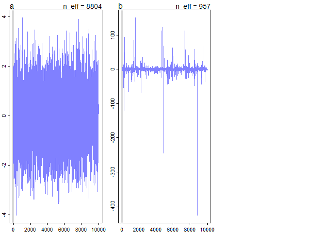
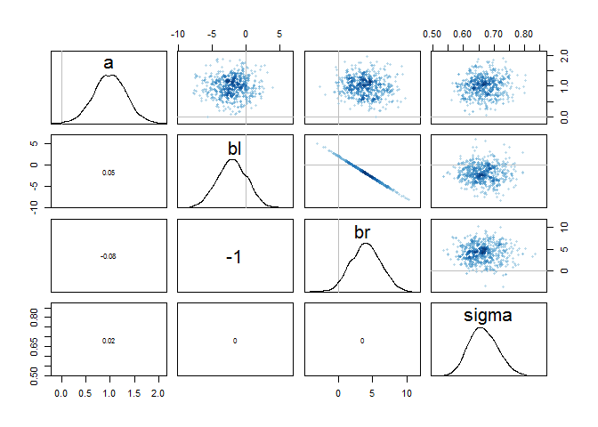
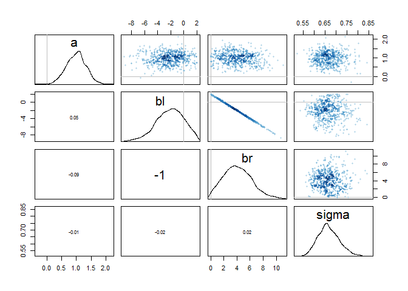

# Assignment_Chapter_08
XIAOYAN YUE  
6/11/2016  

###8E1.Which of the following is a requirement of the simple Metropolis algorithm?
(3) The proposal distribution must be symmetric.  
###8E2.Gibbs sampling is more efficient than the Metropolis algorithm. How does it achieve this extra efficiency? Are there any limitations to the Gibbs sampling strategy?  
The improvement of Gibbs sampling arises from adaptive proposals, which depends upon using conjugate pairs allowing Gibbs sampling to make smart jumps around the joint posterior distribution of all parameters, so the distribution of proposed parameter values can adjust itself intelligently and we can get a good estimate of the posterior from Gibbs sampling with many fewer samples than a comparaple Metropolis approach.  
Limitations: (1)some conjugate priors seem silly. (2)As models become more complex and contain hundreds or thousands or tens of thousands of parameters, Gibbs sampling becomes shockingly inefficient.  
###8E3.Which sort of parameters can Hamiltonian Monte Carlo not handle?  
The discrete parameters.  
###8E4.Explain the difference between the effective number of samples, n_eff as calculated by Stan, and the actual number of samples.  
n_eff is a crude estimate of the number of independent samples you managed to get  
###8E5.Which value should Rhat approach, when a chain is sampling the posterior distribution correctly?  
Rhat should approach 1.00 in a healthy set of chains.  
###8E6.Sketch a good trace plot for a Markov chain, one that is effectively sampling from the posterior distribution. What is good about its shape? Then sketch a trace plot for a malfunctioning Markov chain. What about its shape indicates malfunction?  

###8M1.

```r
library(rethinking)
```

```
## Loading required package: rstan
```

```
## Loading required package: ggplot2
```

```
## Loading required package: StanHeaders
```

```
## rstan (Version 2.10.1, packaged: 2016-06-24 13:22:16 UTC, GitRev: 85f7a56811da)
```

```
## For execution on a local, multicore CPU with excess RAM we recommend calling
## rstan_options(auto_write = TRUE)
## options(mc.cores = parallel::detectCores())
```

```
## Loading required package: parallel
```

```
## rethinking (Version 1.59)
```

```r
data(rugged)
d <- rugged
d$log_gdp <- log(d$rgdppc_2000)
dd <- d[ complete.cases(d$rgdppc_2000) , ]

## trim the data
dd.trim <- dd[ , c("log_gdp","rugged","cont_africa") ]
str(dd.trim)
```

```
## 'data.frame':	170 obs. of  3 variables:
##  $ log_gdp    : num  7.49 8.22 9.93 9.41 7.79 ...
##  $ rugged     : num  0.858 3.427 0.769 0.775 2.688 ...
##  $ cont_africa: int  1 0 0 0 0 0 0 0 0 1 ...
```

```r
## make the model by a uniform prior
m8.M1stan_unif <- map2stan(
  alist(
    log_gdp ~ dnorm( mu , sigma ) ,
    mu <- a + bR*rugged + bA*cont_africa + bAR*rugged*cont_africa ,
    a ~ dnorm(0,100),
    bR ~ dnorm(0,10),
    bA ~ dnorm(0,10),
    bAR ~ dnorm(0,10),
    sigma ~ dunif(0,2)
  ) ,
  data=dd.trim )
```

```
## 
## SAMPLING FOR MODEL 'log_gdp ~ dnorm(mu, sigma)' NOW (CHAIN 1).
## 
## Chain 1, Iteration:    1 / 2000 [  0%]  (Warmup)
## Chain 1, Iteration:  200 / 2000 [ 10%]  (Warmup)
## Chain 1, Iteration:  400 / 2000 [ 20%]  (Warmup)
## Chain 1, Iteration:  600 / 2000 [ 30%]  (Warmup)
## Chain 1, Iteration:  800 / 2000 [ 40%]  (Warmup)
## Chain 1, Iteration: 1000 / 2000 [ 50%]  (Warmup)
## Chain 1, Iteration: 1001 / 2000 [ 50%]  (Sampling)
## Chain 1, Iteration: 1200 / 2000 [ 60%]  (Sampling)
## Chain 1, Iteration: 1400 / 2000 [ 70%]  (Sampling)
## Chain 1, Iteration: 1600 / 2000 [ 80%]  (Sampling)
## Chain 1, Iteration: 1800 / 2000 [ 90%]  (Sampling)
## Chain 1, Iteration: 2000 / 2000 [100%]  (Sampling)
##  Elapsed Time: 0.794 seconds (Warm-up)
##                0.484 seconds (Sampling)
##                1.278 seconds (Total)
## 
## 
## SAMPLING FOR MODEL 'log_gdp ~ dnorm(mu, sigma)' NOW (CHAIN 1).
## WARNING: No variance estimation is
##          performed for num_warmup < 20
## 
## 
## Chain 1, Iteration: 1 / 1 [100%]  (Sampling)
##  Elapsed Time: 0 seconds (Warm-up)
##                0 seconds (Sampling)
##                0 seconds (Total)
```

```
## Computing WAIC
```

```
## Constructing posterior predictions
```

```
## [ 100 / 1000 ]
[ 200 / 1000 ]
[ 300 / 1000 ]
[ 400 / 1000 ]
[ 500 / 1000 ]
[ 600 / 1000 ]
[ 700 / 1000 ]
[ 800 / 1000 ]
[ 900 / 1000 ]
[ 1000 / 1000 ]
```

```r
#### make a model by an exponential prior
m8.M1stan_exp <- map2stan(
  alist(
    log_gdp ~ dnorm( mu , sigma ) ,
    mu <- a + bR*rugged + bA*cont_africa + bAR*rugged*cont_africa ,
    a ~ dnorm(0,100),
    bR ~ dnorm(0,10),
    bA ~ dnorm(0,10),
    bAR ~ dnorm(0,10),
    sigma ~ dexp(1)
  ) ,
  data=dd.trim )
```

```
## 
## SAMPLING FOR MODEL 'log_gdp ~ dnorm(mu, sigma)' NOW (CHAIN 1).
## 
## Chain 1, Iteration:    1 / 2000 [  0%]  (Warmup)
## Chain 1, Iteration:  200 / 2000 [ 10%]  (Warmup)
## Chain 1, Iteration:  400 / 2000 [ 20%]  (Warmup)
## Chain 1, Iteration:  600 / 2000 [ 30%]  (Warmup)
## Chain 1, Iteration:  800 / 2000 [ 40%]  (Warmup)
## Chain 1, Iteration: 1000 / 2000 [ 50%]  (Warmup)
## Chain 1, Iteration: 1001 / 2000 [ 50%]  (Sampling)
## Chain 1, Iteration: 1200 / 2000 [ 60%]  (Sampling)
## Chain 1, Iteration: 1400 / 2000 [ 70%]  (Sampling)
## Chain 1, Iteration: 1600 / 2000 [ 80%]  (Sampling)
## Chain 1, Iteration: 1800 / 2000 [ 90%]  (Sampling)
## Chain 1, Iteration: 2000 / 2000 [100%]  (Sampling)
##  Elapsed Time: 1.166 seconds (Warm-up)
##                0.682 seconds (Sampling)
##                1.848 seconds (Total)
## 
## 
## SAMPLING FOR MODEL 'log_gdp ~ dnorm(mu, sigma)' NOW (CHAIN 1).
## WARNING: No variance estimation is
##          performed for num_warmup < 20
## 
## 
## Chain 1, Iteration: 1 / 1 [100%]  (Sampling)
##  Elapsed Time: 0 seconds (Warm-up)
##                0 seconds (Sampling)
##                0 seconds (Total)
```

```
## Computing WAIC
## Constructing posterior predictions
```

```
## [ 100 / 1000 ]
[ 200 / 1000 ]
[ 300 / 1000 ]
[ 400 / 1000 ]
[ 500 / 1000 ]
[ 600 / 1000 ]
[ 700 / 1000 ]
[ 800 / 1000 ]
[ 900 / 1000 ]
[ 1000 / 1000 ]
```

```r
## test the model
precis(m8.M1stan_unif)
```

```
##        Mean StdDev lower 0.89 upper 0.89 n_eff Rhat
## a      9.21   0.14       9.00       9.43   422    1
## bR    -0.20   0.08      -0.32      -0.08   436    1
## bA    -1.93   0.22      -2.30      -1.61   372    1
## bAR    0.39   0.13       0.18       0.58   382    1
## sigma  0.95   0.05       0.86       1.03   509    1
```

```r
precis(m8.M1stan_exp)
```

```
##        Mean StdDev lower 0.89 upper 0.89 n_eff Rhat
## a      9.21   0.14       9.02       9.45   266    1
## bR    -0.19   0.07      -0.33      -0.09   261    1
## bA    -1.93   0.23      -2.27      -1.53   243    1
## bAR    0.38   0.14       0.16       0.59   300    1
## sigma  0.95   0.05       0.87       1.02   569    1
```
###8M2.

```r
## make the model by a stronger uniform prior
m8.M2stan_unif <- map2stan(
  alist(
    log_gdp ~ dnorm( mu , sigma ) ,
    mu <- a + bR*rugged + bA*cont_africa + bAR*rugged*cont_africa ,
    a ~ dnorm(0,100),
    bR ~ dnorm(0,10),
    bA ~ dnorm(0,10),
    bAR ~ dnorm(0,10),
    sigma ~ dunif(0,0.5)
  ) ,
  data=dd.trim )
```

```
## 
## SAMPLING FOR MODEL 'log_gdp ~ dnorm(mu, sigma)' NOW (CHAIN 1).
## 
## Chain 1, Iteration:    1 / 2000 [  0%]  (Warmup)
## Chain 1, Iteration:  200 / 2000 [ 10%]  (Warmup)
## Chain 1, Iteration:  400 / 2000 [ 20%]  (Warmup)
## Chain 1, Iteration:  600 / 2000 [ 30%]  (Warmup)
## Chain 1, Iteration:  800 / 2000 [ 40%]  (Warmup)
## Chain 1, Iteration: 1000 / 2000 [ 50%]  (Warmup)
## Chain 1, Iteration: 1001 / 2000 [ 50%]  (Sampling)
## Chain 1, Iteration: 1200 / 2000 [ 60%]  (Sampling)
## Chain 1, Iteration: 1400 / 2000 [ 70%]  (Sampling)
## Chain 1, Iteration: 1600 / 2000 [ 80%]  (Sampling)
## Chain 1, Iteration: 1800 / 2000 [ 90%]  (Sampling)
## Chain 1, Iteration: 2000 / 2000 [100%]  (Sampling)
##  Elapsed Time: 0.945 seconds (Warm-up)
##                0.737 seconds (Sampling)
##                1.682 seconds (Total)
## 
## 
## SAMPLING FOR MODEL 'log_gdp ~ dnorm(mu, sigma)' NOW (CHAIN 1).
## WARNING: No variance estimation is
##          performed for num_warmup < 20
## 
## 
## Chain 1, Iteration: 1 / 1 [100%]  (Sampling)
##  Elapsed Time: 0 seconds (Warm-up)
##                0 seconds (Sampling)
##                0 seconds (Total)
```

```
## Computing WAIC
```

```
## Constructing posterior predictions
```

```
## [ 100 / 1000 ]
[ 200 / 1000 ]
[ 300 / 1000 ]
[ 400 / 1000 ]
[ 500 / 1000 ]
[ 600 / 1000 ]
[ 700 / 1000 ]
[ 800 / 1000 ]
[ 900 / 1000 ]
[ 1000 / 1000 ]
```

```r
#### make a model by a stronger exponential prior
m8.M2stan_exp <- map2stan(
  alist(
    log_gdp ~ dnorm( mu , sigma ) ,
    mu <- a + bR*rugged + bA*cont_africa + bAR*rugged*cont_africa ,
    a ~ dnorm(0,100),
    bR ~ dnorm(0,10),
    bA ~ dnorm(0,10),
    bAR ~ dnorm(0,10),
    sigma ~ dexp(5)
  ) ,
  data=dd.trim )
```

```
## 
## SAMPLING FOR MODEL 'log_gdp ~ dnorm(mu, sigma)' NOW (CHAIN 1).
## 
## Chain 1, Iteration:    1 / 2000 [  0%]  (Warmup)
## Chain 1, Iteration:  200 / 2000 [ 10%]  (Warmup)
## Chain 1, Iteration:  400 / 2000 [ 20%]  (Warmup)
## Chain 1, Iteration:  600 / 2000 [ 30%]  (Warmup)
## Chain 1, Iteration:  800 / 2000 [ 40%]  (Warmup)
## Chain 1, Iteration: 1000 / 2000 [ 50%]  (Warmup)
## Chain 1, Iteration: 1001 / 2000 [ 50%]  (Sampling)
## Chain 1, Iteration: 1200 / 2000 [ 60%]  (Sampling)
## Chain 1, Iteration: 1400 / 2000 [ 70%]  (Sampling)
## Chain 1, Iteration: 1600 / 2000 [ 80%]  (Sampling)
## Chain 1, Iteration: 1800 / 2000 [ 90%]  (Sampling)
## Chain 1, Iteration: 2000 / 2000 [100%]  (Sampling)
##  Elapsed Time: 1.212 seconds (Warm-up)
##                0.723 seconds (Sampling)
##                1.935 seconds (Total)
## 
## 
## SAMPLING FOR MODEL 'log_gdp ~ dnorm(mu, sigma)' NOW (CHAIN 1).
## WARNING: No variance estimation is
##          performed for num_warmup < 20
## 
## 
## Chain 1, Iteration: 1 / 1 [100%]  (Sampling)
##  Elapsed Time: 0 seconds (Warm-up)
##                0 seconds (Sampling)
##                0 seconds (Total)
```

```
## Computing WAIC
## Constructing posterior predictions
```

```
## [ 100 / 1000 ]
[ 200 / 1000 ]
[ 300 / 1000 ]
[ 400 / 1000 ]
[ 500 / 1000 ]
[ 600 / 1000 ]
[ 700 / 1000 ]
[ 800 / 1000 ]
[ 900 / 1000 ]
[ 1000 / 1000 ]
```

```r
## test the model
precis(m8.M2stan_unif)
```

```
##        Mean StdDev lower 0.89 upper 0.89 n_eff Rhat
## a      9.23   0.07       9.12       9.34   339    1
## bR    -0.21   0.04      -0.26      -0.14   379    1
## bA    -1.96   0.11      -2.14      -1.77   407    1
## bAR    0.40   0.07       0.29       0.50   445    1
## sigma  0.50   0.00       0.50       0.50   873    1
```

```r
precis(m8.M2stan_exp)
```

```
##        Mean StdDev lower 0.89 upper 0.89 n_eff Rhat
## a      9.22   0.13       9.00       9.41   346    1
## bR    -0.20   0.07      -0.31      -0.08   311    1
## bA    -1.94   0.21      -2.26      -1.60   327    1
## bAR    0.39   0.12       0.21       0.59   319    1
## sigma  0.94   0.05       0.86       1.02   685    1
```
###8M3.

###8H1.

```r
mp <- map2stan(
alist(
a ~ dnorm(0,1),
b ~ dcauchy(0,1)
),
data=list(y=1),
start=list(a=0,b=0),
iter=1e4, warmup=100 , WAIC=FALSE )
```

```
## 
## SAMPLING FOR MODEL 'a ~ dnorm(0, 1)' NOW (CHAIN 1).
## WARNING: The initial buffer, adaptation window, and terminal buffer
##          overflow the total number of warmup iterations.
##          Defaulting to a 15%/75%/10% partition,
##            init_buffer = 15
##            adapt_window = 75
##            term_buffer = 10
## 
## 
## Chain 1, Iteration:    1 / 10000 [  0%]  (Warmup)
## Chain 1, Iteration:  101 / 10000 [  1%]  (Sampling)
## Chain 1, Iteration: 1100 / 10000 [ 11%]  (Sampling)
## Chain 1, Iteration: 2100 / 10000 [ 21%]  (Sampling)
## Chain 1, Iteration: 3100 / 10000 [ 31%]  (Sampling)
## Chain 1, Iteration: 4100 / 10000 [ 41%]  (Sampling)
## Chain 1, Iteration: 5100 / 10000 [ 51%]  (Sampling)
## Chain 1, Iteration: 6100 / 10000 [ 61%]  (Sampling)
## Chain 1, Iteration: 7100 / 10000 [ 71%]  (Sampling)
## Chain 1, Iteration: 8100 / 10000 [ 81%]  (Sampling)
## Chain 1, Iteration: 9100 / 10000 [ 91%]  (Sampling)
## Chain 1, Iteration: 10000 / 10000 [100%]  (Sampling)
##  Elapsed Time: 0 seconds (Warm-up)
##                0.982 seconds (Sampling)
##                0.982 seconds (Total)
## 
## 
## SAMPLING FOR MODEL 'a ~ dnorm(0, 1)' NOW (CHAIN 1).
## WARNING: No variance estimation is
##          performed for num_warmup < 20
## 
## 
## Chain 1, Iteration: 1 / 1 [100%]  (Sampling)
##  Elapsed Time: 0 seconds (Warm-up)
##                0 seconds (Sampling)
##                0 seconds (Total)
```

```r
precis(mp)
```

```
##    Mean StdDev lower 0.89 upper 0.89 n_eff Rhat
## a -0.01   1.08      -1.67       1.78  8804    1
## b  0.42  15.44      -5.65       6.95   957    1
```

```r
plot(mp)
```

<!-- -->

###8H2.

```r
# load data
library(rethinking)
data(WaffleDivorce)
d <- WaffleDivorce
# standardize predictor
d$MedianAgeMarriage.s <- (d$MedianAgeMarriage-mean(d$MedianAgeMarriage))/
sd(d$MedianAgeMarriage)
# fit model by map
m5.1 <- map(
alist(
Divorce ~ dnorm( mu , sigma ) ,
mu <- a + bA * MedianAgeMarriage.s ,
a ~ dnorm( 10 , 10 ) ,
bA ~ dnorm( 0 , 1 ) ,
sigma ~ dunif( 0 , 10 )
) , data = d )


d$Marriage.s <- (d$Marriage - mean(d$Marriage))/sd(d$Marriage)
m5.2 <- map(
alist(
Divorce ~ dnorm( mu , sigma ) ,
mu <- a + bR * Marriage.s ,
a ~ dnorm( 10 , 10 ) ,
bR ~ dnorm( 0 , 1 ) ,
sigma ~ dunif( 0 , 10 )
) , data = d )


m5.3 <- map(
alist(
Divorce ~ dnorm( mu , sigma ) ,
mu <- a + bR*Marriage.s + bA*MedianAgeMarriage.s ,
a ~ dnorm( 10 , 10 ) ,
bR ~ dnorm( 0 , 1 ) ,
bA ~ dnorm( 0 , 1 ) ,
sigma ~ dunif( 0 , 10 )
) ,
data = d )

##fit the model by map2stan
m5.1stan <- map2stan(
alist(
Divorce ~ dnorm( mu , sigma ) ,
mu <- a + bA * MedianAgeMarriage.s ,
a ~ dnorm( 10 , 10 ) ,
bA ~ dnorm( 0 , 1 ) ,
sigma ~ dunif( 0 , 10 )
) , data = d )
```

```
## Warning: Variable 'Marriage.SE' contains dots '.'.
## Will attempt to remove dots internally.
```

```
## Warning: Variable 'Divorce.SE' contains dots '.'.
## Will attempt to remove dots internally.
```

```
## Warning: Variable 'MedianAgeMarriage.s' contains dots '.'.
## Will attempt to remove dots internally.
```

```
## Warning: Variable 'Marriage.s' contains dots '.'.
## Will attempt to remove dots internally.
```

```
## Warning in FUN(X[[i]], ...): data with name Location is not numeric and not
## used
```

```
## Warning in FUN(X[[i]], ...): data with name Loc is not numeric and not used
```

```
## 
## SAMPLING FOR MODEL 'Divorce ~ dnorm(mu, sigma)' NOW (CHAIN 1).
## 
## Chain 1, Iteration:    1 / 2000 [  0%]  (Warmup)
## Chain 1, Iteration:  200 / 2000 [ 10%]  (Warmup)
## Chain 1, Iteration:  400 / 2000 [ 20%]  (Warmup)
## Chain 1, Iteration:  600 / 2000 [ 30%]  (Warmup)
## Chain 1, Iteration:  800 / 2000 [ 40%]  (Warmup)
## Chain 1, Iteration: 1000 / 2000 [ 50%]  (Warmup)
## Chain 1, Iteration: 1001 / 2000 [ 50%]  (Sampling)
## Chain 1, Iteration: 1200 / 2000 [ 60%]  (Sampling)
## Chain 1, Iteration: 1400 / 2000 [ 70%]  (Sampling)
## Chain 1, Iteration: 1600 / 2000 [ 80%]  (Sampling)
## Chain 1, Iteration: 1800 / 2000 [ 90%]  (Sampling)
## Chain 1, Iteration: 2000 / 2000 [100%]  (Sampling)
##  Elapsed Time: 0.115 seconds (Warm-up)
##                0.101 seconds (Sampling)
##                0.216 seconds (Total)
```

```
## Warning in FUN(X[[i]], ...): data with name Location is not numeric and not
## used

## Warning in FUN(X[[i]], ...): data with name Loc is not numeric and not used
```

```
## 
## SAMPLING FOR MODEL 'Divorce ~ dnorm(mu, sigma)' NOW (CHAIN 1).
## WARNING: No variance estimation is
##          performed for num_warmup < 20
## 
## 
## Chain 1, Iteration: 1 / 1 [100%]  (Sampling)
##  Elapsed Time: 0 seconds (Warm-up)
##                0 seconds (Sampling)
##                0 seconds (Total)
```

```
## Computing WAIC
```

```
## Constructing posterior predictions
```

```
## [ 100 / 1000 ]
[ 200 / 1000 ]
[ 300 / 1000 ]
[ 400 / 1000 ]
[ 500 / 1000 ]
[ 600 / 1000 ]
[ 700 / 1000 ]
[ 800 / 1000 ]
[ 900 / 1000 ]
[ 1000 / 1000 ]
```

```r
d$Marriage.s <- (d$Marriage - mean(d$Marriage))/sd(d$Marriage)
m5.2stan <- map2stan(
alist(
Divorce ~ dnorm( mu , sigma ) ,
mu <- a + bR * Marriage.s ,
a ~ dnorm( 10 , 10 ) ,
bR ~ dnorm( 0 , 1 ) ,
sigma ~ dunif( 0 , 10 )
) , data = d )
```

```
## Warning: Variable 'Marriage.SE' contains dots '.'.
## Will attempt to remove dots internally.
```

```
## Warning: Variable 'Divorce.SE' contains dots '.'.
## Will attempt to remove dots internally.
```

```
## Warning: Variable 'MedianAgeMarriage.s' contains dots '.'.
## Will attempt to remove dots internally.
```

```
## Warning: Variable 'Marriage.s' contains dots '.'.
## Will attempt to remove dots internally.
```

```
## Warning in FUN(X[[i]], ...): data with name Location is not numeric and not
## used

## Warning in FUN(X[[i]], ...): data with name Loc is not numeric and not used
```

```
## 
## SAMPLING FOR MODEL 'Divorce ~ dnorm(mu, sigma)' NOW (CHAIN 1).
## 
## Chain 1, Iteration:    1 / 2000 [  0%]  (Warmup)
## Chain 1, Iteration:  200 / 2000 [ 10%]  (Warmup)
## Chain 1, Iteration:  400 / 2000 [ 20%]  (Warmup)
## Chain 1, Iteration:  600 / 2000 [ 30%]  (Warmup)
## Chain 1, Iteration:  800 / 2000 [ 40%]  (Warmup)
## Chain 1, Iteration: 1000 / 2000 [ 50%]  (Warmup)
## Chain 1, Iteration: 1001 / 2000 [ 50%]  (Sampling)
## Chain 1, Iteration: 1200 / 2000 [ 60%]  (Sampling)
## Chain 1, Iteration: 1400 / 2000 [ 70%]  (Sampling)
## Chain 1, Iteration: 1600 / 2000 [ 80%]  (Sampling)
## Chain 1, Iteration: 1800 / 2000 [ 90%]  (Sampling)
## Chain 1, Iteration: 2000 / 2000 [100%]  (Sampling)
##  Elapsed Time: 0.084 seconds (Warm-up)
##                0.101 seconds (Sampling)
##                0.185 seconds (Total)
```

```
## Warning in FUN(X[[i]], ...): data with name Location is not numeric and not
## used

## Warning in FUN(X[[i]], ...): data with name Loc is not numeric and not used
```

```
## 
## SAMPLING FOR MODEL 'Divorce ~ dnorm(mu, sigma)' NOW (CHAIN 1).
## WARNING: No variance estimation is
##          performed for num_warmup < 20
## 
## 
## Chain 1, Iteration: 1 / 1 [100%]  (Sampling)
##  Elapsed Time: 0 seconds (Warm-up)
##                0 seconds (Sampling)
##                0 seconds (Total)
```

```
## Computing WAIC
```

```
## Constructing posterior predictions
```

```
## [ 100 / 1000 ]
[ 200 / 1000 ]
[ 300 / 1000 ]
[ 400 / 1000 ]
[ 500 / 1000 ]
[ 600 / 1000 ]
[ 700 / 1000 ]
[ 800 / 1000 ]
[ 900 / 1000 ]
[ 1000 / 1000 ]
```

```r
m5.3stan <- map2stan(
alist(
Divorce ~ dnorm( mu , sigma ) ,
mu <- a + bR*Marriage.s + bA*MedianAgeMarriage.s ,
a ~ dnorm( 10 , 10 ) ,
bR ~ dnorm( 0 , 1 ) ,
bA ~ dnorm( 0 , 1 ) ,
sigma ~ dunif( 0 , 10 )
) ,
data = d )
```

```
## Warning: Variable 'Marriage.SE' contains dots '.'.
## Will attempt to remove dots internally.
```

```
## Warning: Variable 'Divorce.SE' contains dots '.'.
## Will attempt to remove dots internally.
```

```
## Warning: Variable 'MedianAgeMarriage.s' contains dots '.'.
## Will attempt to remove dots internally.
```

```
## Warning: Variable 'Marriage.s' contains dots '.'.
## Will attempt to remove dots internally.
```

```
## Warning in FUN(X[[i]], ...): data with name Location is not numeric and not
## used

## Warning in FUN(X[[i]], ...): data with name Loc is not numeric and not used
```

```
## 
## SAMPLING FOR MODEL 'Divorce ~ dnorm(mu, sigma)' NOW (CHAIN 1).
## 
## Chain 1, Iteration:    1 / 2000 [  0%]  (Warmup)
## Chain 1, Iteration:  200 / 2000 [ 10%]  (Warmup)
## Chain 1, Iteration:  400 / 2000 [ 20%]  (Warmup)
## Chain 1, Iteration:  600 / 2000 [ 30%]  (Warmup)
## Chain 1, Iteration:  800 / 2000 [ 40%]  (Warmup)
## Chain 1, Iteration: 1000 / 2000 [ 50%]  (Warmup)
## Chain 1, Iteration: 1001 / 2000 [ 50%]  (Sampling)
## Chain 1, Iteration: 1200 / 2000 [ 60%]  (Sampling)
## Chain 1, Iteration: 1400 / 2000 [ 70%]  (Sampling)
## Chain 1, Iteration: 1600 / 2000 [ 80%]  (Sampling)
## Chain 1, Iteration: 1800 / 2000 [ 90%]  (Sampling)
## Chain 1, Iteration: 2000 / 2000 [100%]  (Sampling)
##  Elapsed Time: 0.256 seconds (Warm-up)
##                0.205 seconds (Sampling)
##                0.461 seconds (Total)
```

```
## Warning in FUN(X[[i]], ...): data with name Location is not numeric and not
## used

## Warning in FUN(X[[i]], ...): data with name Loc is not numeric and not used
```

```
## 
## SAMPLING FOR MODEL 'Divorce ~ dnorm(mu, sigma)' NOW (CHAIN 1).
## WARNING: No variance estimation is
##          performed for num_warmup < 20
## 
## 
## Chain 1, Iteration: 1 / 1 [100%]  (Sampling)
##  Elapsed Time: 0 seconds (Warm-up)
##                0 seconds (Sampling)
##                0 seconds (Total)
```

```
## Computing WAIC
```

```
## Constructing posterior predictions
```

```
## [ 100 / 1000 ]
[ 200 / 1000 ]
[ 300 / 1000 ]
[ 400 / 1000 ]
[ 500 / 1000 ]
[ 600 / 1000 ]
[ 700 / 1000 ]
[ 800 / 1000 ]
[ 900 / 1000 ]
[ 1000 / 1000 ]
```

```r
#

compare(m5.1,m5.2,m5.3)
```

```
##       WAIC pWAIC dWAIC weight    SE   dSE
## m5.1 187.4   4.7   0.0   0.73 14.29    NA
## m5.3 189.4   6.0   2.0   0.27 14.44  0.97
## m5.2 200.6   3.8  13.2   0.00 10.77 10.59
```

```r
compare(m5.1stan,m5.2stan,m5.3stan)
```

```
##           WAIC pWAIC dWAIC weight    SE  dSE
## m5.1stan 186.3   3.9   0.0   0.67 12.40   NA
## m5.3stan 187.7   4.7   1.4   0.33 12.30 0.76
## m5.2stan 200.4   3.3  14.1   0.00  9.46 9.08
```

```r
compare(m5.1,m5.1stan)
```

```
## Warning in compare(m5.1, m5.1stan): Not all model fits of same class.
## This is usually a bad idea, because it implies they were fit by different algorithms.
## Check yourself, before you wreck yourself.
```

```
##           WAIC pWAIC dWAIC weight    SE  dSE
## m5.1stan 186.3   3.9   0.0   0.64 12.40   NA
## m5.1     187.4   4.6   1.1   0.36 14.18 1.83
```

```r
compare(m5.2,m5.2stan)
```

```
## Warning in compare(m5.2, m5.2stan): Not all model fits of same class.
## This is usually a bad idea, because it implies they were fit by different algorithms.
## Check yourself, before you wreck yourself.
```

```
##           WAIC pWAIC dWAIC weight    SE  dSE
## m5.2stan 200.4   3.3   0.0   0.52  9.46   NA
## m5.2     200.6   3.7   0.2   0.48 10.65 1.22
```

```r
compare(m5.3,m5.3stan)
```

```
## Warning in compare(m5.3, m5.3stan): Not all model fits of same class.
## This is usually a bad idea, because it implies they were fit by different algorithms.
## Check yourself, before you wreck yourself.
```

```
##           WAIC pWAIC dWAIC weight    SE  dSE
## m5.3stan 187.7   4.7   0.0   0.77 12.30   NA
## m5.3     190.1   6.3   2.4   0.23 14.96 2.74
```

###8H3.

```r
#simulates height and leg length for 100 imagined individuals
N <- 100 # number of individuals
height <- rnorm(N,10,2) # sim total height of each
leg_prop <- runif(N,0.4,0.5) # leg as proportion of height
leg_left <- leg_prop*height + # sim left leg as proportion + error
rnorm( N , 0 , 0.02 )
leg_right <- leg_prop*height + # sim right leg as proportion + error
rnorm( N , 0 , 0.02 )
# combine into data frame
d <- data.frame(height,leg_left,leg_right)

#fit the model
m5.8s <- map2stan(
alist(
height ~ dnorm( mu , sigma ) ,
mu <- a + bl*leg_left + br*leg_right ,
a ~ dnorm( 10 , 100 ) ,
bl ~ dnorm( 2 , 10 ) ,
br ~ dnorm( 2 , 10 ) ,
sigma ~ dcauchy( 0 , 1 )
) ,
data=d, chains=4,
start=list(a=10,bl=0,br=0,sigma=1) )
```

```
## 
## SAMPLING FOR MODEL 'height ~ dnorm(mu, sigma)' NOW (CHAIN 1).
## 
## Chain 1, Iteration:    1 / 2000 [  0%]  (Warmup)
## Chain 1, Iteration:  200 / 2000 [ 10%]  (Warmup)
## Chain 1, Iteration:  400 / 2000 [ 20%]  (Warmup)
## Chain 1, Iteration:  600 / 2000 [ 30%]  (Warmup)
## Chain 1, Iteration:  800 / 2000 [ 40%]  (Warmup)
## Chain 1, Iteration: 1000 / 2000 [ 50%]  (Warmup)
## Chain 1, Iteration: 1001 / 2000 [ 50%]  (Sampling)
## Chain 1, Iteration: 1200 / 2000 [ 60%]  (Sampling)
## Chain 1, Iteration: 1400 / 2000 [ 70%]  (Sampling)
## Chain 1, Iteration: 1600 / 2000 [ 80%]  (Sampling)
## Chain 1, Iteration: 1800 / 2000 [ 90%]  (Sampling)
## Chain 1, Iteration: 2000 / 2000 [100%]  (Sampling)
##  Elapsed Time: 10.024 seconds (Warm-up)
##                14.432 seconds (Sampling)
##                24.456 seconds (Total)
## 
## 
## SAMPLING FOR MODEL 'height ~ dnorm(mu, sigma)' NOW (CHAIN 2).
## 
## Chain 2, Iteration:    1 / 2000 [  0%]  (Warmup)
## Chain 2, Iteration:  200 / 2000 [ 10%]  (Warmup)
## Chain 2, Iteration:  400 / 2000 [ 20%]  (Warmup)
## Chain 2, Iteration:  600 / 2000 [ 30%]  (Warmup)
## Chain 2, Iteration:  800 / 2000 [ 40%]  (Warmup)
## Chain 2, Iteration: 1000 / 2000 [ 50%]  (Warmup)
## Chain 2, Iteration: 1001 / 2000 [ 50%]  (Sampling)
## Chain 2, Iteration: 1200 / 2000 [ 60%]  (Sampling)
## Chain 2, Iteration: 1400 / 2000 [ 70%]  (Sampling)
## Chain 2, Iteration: 1600 / 2000 [ 80%]  (Sampling)
## Chain 2, Iteration: 1800 / 2000 [ 90%]  (Sampling)
## Chain 2, Iteration: 2000 / 2000 [100%]  (Sampling)
##  Elapsed Time: 11.371 seconds (Warm-up)
##                14.095 seconds (Sampling)
##                25.466 seconds (Total)
## 
## 
## SAMPLING FOR MODEL 'height ~ dnorm(mu, sigma)' NOW (CHAIN 3).
## 
## Chain 3, Iteration:    1 / 2000 [  0%]  (Warmup)
## Chain 3, Iteration:  200 / 2000 [ 10%]  (Warmup)
## Chain 3, Iteration:  400 / 2000 [ 20%]  (Warmup)
## Chain 3, Iteration:  600 / 2000 [ 30%]  (Warmup)
## Chain 3, Iteration:  800 / 2000 [ 40%]  (Warmup)
## Chain 3, Iteration: 1000 / 2000 [ 50%]  (Warmup)
## Chain 3, Iteration: 1001 / 2000 [ 50%]  (Sampling)
## Chain 3, Iteration: 1200 / 2000 [ 60%]  (Sampling)
## Chain 3, Iteration: 1400 / 2000 [ 70%]  (Sampling)
## Chain 3, Iteration: 1600 / 2000 [ 80%]  (Sampling)
## Chain 3, Iteration: 1800 / 2000 [ 90%]  (Sampling)
## Chain 3, Iteration: 2000 / 2000 [100%]  (Sampling)
##  Elapsed Time: 11.993 seconds (Warm-up)
##                14.224 seconds (Sampling)
##                26.217 seconds (Total)
## 
## 
## SAMPLING FOR MODEL 'height ~ dnorm(mu, sigma)' NOW (CHAIN 4).
## 
## Chain 4, Iteration:    1 / 2000 [  0%]  (Warmup)
## Chain 4, Iteration:  200 / 2000 [ 10%]  (Warmup)
## Chain 4, Iteration:  400 / 2000 [ 20%]  (Warmup)
## Chain 4, Iteration:  600 / 2000 [ 30%]  (Warmup)
## Chain 4, Iteration:  800 / 2000 [ 40%]  (Warmup)
## Chain 4, Iteration: 1000 / 2000 [ 50%]  (Warmup)
## Chain 4, Iteration: 1001 / 2000 [ 50%]  (Sampling)
## Chain 4, Iteration: 1200 / 2000 [ 60%]  (Sampling)
## Chain 4, Iteration: 1400 / 2000 [ 70%]  (Sampling)
## Chain 4, Iteration: 1600 / 2000 [ 80%]  (Sampling)
## Chain 4, Iteration: 1800 / 2000 [ 90%]  (Sampling)
## Chain 4, Iteration: 2000 / 2000 [100%]  (Sampling)
##  Elapsed Time: 10.699 seconds (Warm-up)
##                17.993 seconds (Sampling)
##                28.692 seconds (Total)
## 
## 
## SAMPLING FOR MODEL 'height ~ dnorm(mu, sigma)' NOW (CHAIN 1).
## WARNING: No variance estimation is
##          performed for num_warmup < 20
## 
## 
## Chain 1, Iteration: 1 / 1 [100%]  (Sampling)
##  Elapsed Time: 0 seconds (Warm-up)
##                0 seconds (Sampling)
##                0 seconds (Total)
```

```
## Computing WAIC
```

```
## Constructing posterior predictions
```

```
## [ 400 / 4000 ]
[ 800 / 4000 ]
[ 1200 / 4000 ]
[ 1600 / 4000 ]
[ 2000 / 4000 ]
[ 2400 / 4000 ]
[ 2800 / 4000 ]
[ 3200 / 4000 ]
[ 3600 / 4000 ]
[ 4000 / 4000 ]
```

```r
#fit the model with a strictly positive prior
m5.8s2 <- map2stan(
alist(
height ~ dnorm( mu , sigma ) ,
mu <- a + bl*leg_left + br*leg_right ,
a ~ dnorm( 10 , 100 ) ,
bl ~ dnorm( 2 , 10 ) ,
br ~ dnorm( 2 , 10 ) & T[0,] ,
sigma ~ dcauchy( 0 , 1 )
) ,
data=d, chains=4,
start=list(a=10,bl=0,br=0,sigma=1) )
```

```
## 
## SAMPLING FOR MODEL 'height ~ dnorm(mu, sigma)' NOW (CHAIN 1).
## 
## Chain 1, Iteration:    1 / 2000 [  0%]  (Warmup)
## Chain 1, Iteration:  200 / 2000 [ 10%]  (Warmup)
## Chain 1, Iteration:  400 / 2000 [ 20%]  (Warmup)
## Chain 1, Iteration:  600 / 2000 [ 30%]  (Warmup)
## Chain 1, Iteration:  800 / 2000 [ 40%]  (Warmup)
## Chain 1, Iteration: 1000 / 2000 [ 50%]  (Warmup)
## Chain 1, Iteration: 1001 / 2000 [ 50%]  (Sampling)
## Chain 1, Iteration: 1200 / 2000 [ 60%]  (Sampling)
## Chain 1, Iteration: 1400 / 2000 [ 70%]  (Sampling)
## Chain 1, Iteration: 1600 / 2000 [ 80%]  (Sampling)
## Chain 1, Iteration: 1800 / 2000 [ 90%]  (Sampling)
## Chain 1, Iteration: 2000 / 2000 [100%]  (Sampling)
##  Elapsed Time: 10.451 seconds (Warm-up)
##                9.38 seconds (Sampling)
##                19.831 seconds (Total)
## 
## [1] "The following numerical problems occured the indicated number of times after warmup on chain 1"
##                                                                                 count
## Exception thrown at line 22: normal_log: Scale parameter is 0, but must be > 0!     2
## [1] "When a numerical problem occurs, the Metropolis proposal gets rejected."
## [1] "However, by design Metropolis proposals sometimes get rejected  even when there are no numerical problems."
## [1] "Thus, if the number in the 'count' column is small,  do not ask about this message on stan-users."
## 
## SAMPLING FOR MODEL 'height ~ dnorm(mu, sigma)' NOW (CHAIN 2).
## 
## Chain 2, Iteration:    1 / 2000 [  0%]  (Warmup)
## Chain 2, Iteration:  200 / 2000 [ 10%]  (Warmup)
## Chain 2, Iteration:  400 / 2000 [ 20%]  (Warmup)
## Chain 2, Iteration:  600 / 2000 [ 30%]  (Warmup)
## Chain 2, Iteration:  800 / 2000 [ 40%]  (Warmup)
## Chain 2, Iteration: 1000 / 2000 [ 50%]  (Warmup)
## Chain 2, Iteration: 1001 / 2000 [ 50%]  (Sampling)
## Chain 2, Iteration: 1200 / 2000 [ 60%]  (Sampling)
## Chain 2, Iteration: 1400 / 2000 [ 70%]  (Sampling)
## Chain 2, Iteration: 1600 / 2000 [ 80%]  (Sampling)
## Chain 2, Iteration: 1800 / 2000 [ 90%]  (Sampling)
## Chain 2, Iteration: 2000 / 2000 [100%]  (Sampling)
##  Elapsed Time: 8.919 seconds (Warm-up)
##                10.756 seconds (Sampling)
##                19.675 seconds (Total)
## 
## 
## SAMPLING FOR MODEL 'height ~ dnorm(mu, sigma)' NOW (CHAIN 3).
## 
## Chain 3, Iteration:    1 / 2000 [  0%]  (Warmup)
## Chain 3, Iteration:  200 / 2000 [ 10%]  (Warmup)
## Chain 3, Iteration:  400 / 2000 [ 20%]  (Warmup)
## Chain 3, Iteration:  600 / 2000 [ 30%]  (Warmup)
## Chain 3, Iteration:  800 / 2000 [ 40%]  (Warmup)
## Chain 3, Iteration: 1000 / 2000 [ 50%]  (Warmup)
## Chain 3, Iteration: 1001 / 2000 [ 50%]  (Sampling)
## Chain 3, Iteration: 1200 / 2000 [ 60%]  (Sampling)
## Chain 3, Iteration: 1400 / 2000 [ 70%]  (Sampling)
## Chain 3, Iteration: 1600 / 2000 [ 80%]  (Sampling)
## Chain 3, Iteration: 1800 / 2000 [ 90%]  (Sampling)
## Chain 3, Iteration: 2000 / 2000 [100%]  (Sampling)
##  Elapsed Time: 8.925 seconds (Warm-up)
##                10.299 seconds (Sampling)
##                19.224 seconds (Total)
## 
## 
## SAMPLING FOR MODEL 'height ~ dnorm(mu, sigma)' NOW (CHAIN 4).
## 
## Chain 4, Iteration:    1 / 2000 [  0%]  (Warmup)
## Chain 4, Iteration:  200 / 2000 [ 10%]  (Warmup)
## Chain 4, Iteration:  400 / 2000 [ 20%]  (Warmup)
## Chain 4, Iteration:  600 / 2000 [ 30%]  (Warmup)
## Chain 4, Iteration:  800 / 2000 [ 40%]  (Warmup)
## Chain 4, Iteration: 1000 / 2000 [ 50%]  (Warmup)
## Chain 4, Iteration: 1001 / 2000 [ 50%]  (Sampling)
## Chain 4, Iteration: 1200 / 2000 [ 60%]  (Sampling)
## Chain 4, Iteration: 1400 / 2000 [ 70%]  (Sampling)
## Chain 4, Iteration: 1600 / 2000 [ 80%]  (Sampling)
## Chain 4, Iteration: 1800 / 2000 [ 90%]  (Sampling)
## Chain 4, Iteration: 2000 / 2000 [100%]  (Sampling)
##  Elapsed Time: 9.891 seconds (Warm-up)
##                12.088 seconds (Sampling)
##                21.979 seconds (Total)
## 
## 
## SAMPLING FOR MODEL 'height ~ dnorm(mu, sigma)' NOW (CHAIN 1).
## WARNING: No variance estimation is
##          performed for num_warmup < 20
## 
## 
## Chain 1, Iteration: 1 / 1 [100%]  (Sampling)
##  Elapsed Time: 0 seconds (Warm-up)
##                0 seconds (Sampling)
##                0 seconds (Total)
```

```
## Computing WAIC
## Constructing posterior predictions
```

```
## [ 400 / 4000 ]
[ 800 / 4000 ]
[ 1200 / 4000 ]
[ 1600 / 4000 ]
[ 2000 / 4000 ]
[ 2400 / 4000 ]
[ 2800 / 4000 ]
[ 3200 / 4000 ]
[ 3600 / 4000 ]
[ 4000 / 4000 ]
```

```
## Warning in map2stan(alist(height ~ dnorm(mu, sigma), mu <- a + bl * leg_left + : There were 322 divergent iterations during sampling.
## Check the chains (trace plots, n_eff, Rhat) carefully to ensure they are valid.
```

```r
pairs(m5.8s)
```

<!-- -->

```r
pairs(m5.8s2)
```

<!-- -->
###8H4.

```r
precis(m5.8s)
```

```
##        Mean StdDev lower 0.89 upper 0.89 n_eff Rhat
## a      0.99   0.33       0.47       1.54  1700    1
## bl    -2.01   2.21      -5.88       1.15  1197    1
## br     4.02   2.21       0.66       7.67  1200    1
## sigma  0.67   0.05       0.60       0.74  1664    1
```

```r
precis(m5.8s2)
```

```
## Warning in precis(m5.8s2): There were 322 divergent iterations during sampling.
## Check the chains (trace plots, n_eff, Rhat) carefully to ensure they are valid.
```

```
##        Mean StdDev lower 0.89 upper 0.89 n_eff Rhat
## a      0.99   0.33       0.45       1.49  1220 1.00
## bl    -2.12   2.13      -5.06       1.68   663 1.01
## br     4.13   2.14       0.35       7.07   663 1.01
## sigma  0.67   0.05       0.59       0.74  1452 1.00
```

###8H5.

