# Assignment_Chapter_09
XIAOYAN YUE  


```r
##load the data and libraries
setwd("D:/")
data <- read.csv("TomatoR2CSHL.csv")

library(rethinking)
```

```
## Loading required package: rstan
```

```
## Loading required package: ggplot2
```

```
## Loading required package: StanHeaders
```

```
## rstan (Version 2.10.1, packaged: 2016-06-24 13:22:16 UTC, GitRev: 85f7a56811da)
```

```
## For execution on a local, multicore CPU with excess RAM we recommend calling
## rstan_options(auto_write = TRUE)
## options(mc.cores = parallel::detectCores())
```

```
## Loading required package: parallel
```

```
## rethinking (Version 1.59)
```

```r
library(ggplot2)
library(reshape2)

#take a look at the data TO figure out if the data are normal distribution 
head(data)
```

```
##   shelf flat col row    acs trt days   date   hyp int1 int2 int3 int4
## 1     Z    1   B   1 LA2580   H   28 5/5/08 19.46 2.37 1.59 1.87 0.51
## 2     Z    1   C   1 LA1305   H   28 5/5/08 31.28 3.34 0.01 9.19 1.62
## 3     Z    1   D   1 LA1973   H   28 5/5/08 56.65 8.43 2.39 6.70 3.69
## 4     Z    1   E   1 LA2748   H   28 5/5/08 35.18 0.56 0.00 1.60 0.61
## 5     Z    1   F   1 LA2931   H   28 5/5/08 35.32 0.82 0.02 1.49 0.46
## 6     Z    1   G   1 LA1317   H   28 5/5/08 28.74 1.07 6.69 5.72 4.76
##   intleng totleng petleng leafleng leafwid leafnum ndvi      lat      lon
## 1    6.34   25.80   15.78    30.53   34.44       5  111  -9.5167 -78.0083
## 2   14.16   45.44   12.36    22.93   13.99       4  120 -13.3833 -75.3583
## 3   21.21   77.86   13.05    46.71   43.78       5  110 -16.2333 -71.7000
## 4    2.77   37.95    8.08    26.82   33.28       5  105 -20.4833 -69.9833
## 5    2.79   38.11    7.68    22.40   23.61       5  106 -20.9167 -69.0667
## 6   18.24   46.98   23.66    42.35   42.35       5  132 -13.4167 -73.8417
##    alt         species who
## 1  740    S. pennellii Dan
## 2 3360   S. peruvianum Dan
## 3 2585   S. peruvianum Dan
## 4 1020     S. chilense Dan
## 5 2460     S. chilense Dan
## 6 2000 S. chmielewskii Dan
```

```r
summary(data)
```

```
##  shelf        flat            col           row            acs     
##  U:161   Min.   : 1.00   G      :133   Min.   :1.00   LA1954 : 40  
##  V:174   1st Qu.: 9.00   H      :127   1st Qu.:2.00   LA2695 : 39  
##  W:178   Median :17.00   F      :125   Median :3.00   LA1361 : 37  
##  X:174   Mean   :17.89   C      :117   Mean   :2.56   LA2167 : 37  
##  Y:125   3rd Qu.:28.00   D      :117   3rd Qu.:4.00   LA2773 : 37  
##  Z:196   Max.   :36.00   E      :107   Max.   :4.00   LA1474 : 36  
##                          (Other):282                  (Other):782  
##  trt          days           date          hyp             int1      
##  H:495   Min.   :28.00   5/5/08:716   Min.   : 6.17   Min.   : 0.00  
##  L:513   1st Qu.:28.00   5/6/08:292   1st Qu.:26.81   1st Qu.: 1.74  
##          Median :28.00                Median :32.02   Median : 3.59  
##          Mean   :28.29                Mean   :33.36   Mean   : 4.71  
##          3rd Qu.:29.00                3rd Qu.:38.56   3rd Qu.: 6.46  
##          Max.   :29.00                Max.   :74.60   Max.   :39.01  
##                                                       NA's   :1      
##       int2             int3             int4           intleng      
##  Min.   : 0.000   Min.   : 0.010   Min.   : 0.030   Min.   : 0.000  
##  1st Qu.: 1.060   1st Qu.: 2.975   1st Qu.: 2.163   1st Qu.: 9.637  
##  Median : 3.120   Median : 5.625   Median : 3.995   Median :17.255  
##  Mean   : 4.287   Mean   : 6.794   Mean   : 5.102   Mean   :20.340  
##  3rd Qu.: 6.320   3rd Qu.: 9.367   3rd Qu.: 7.018   3rd Qu.:28.145  
##  Max.   :28.980   Max.   :27.760   Max.   :23.280   Max.   :92.420  
##  NA's   :1        NA's   :4        NA's   :102                      
##     totleng          petleng         leafleng        leafwid     
##  Min.   : 13.59   Min.   : 1.53   Min.   : 9.74   Min.   : 8.29  
##  1st Qu.: 39.25   1st Qu.:11.20   1st Qu.:27.43   1st Qu.:29.48  
##  Median : 50.98   Median :15.13   Median :34.59   Median :39.62  
##  Mean   : 53.70   Mean   :15.92   Mean   :35.54   Mean   :39.29  
##  3rd Qu.: 64.76   3rd Qu.:20.48   3rd Qu.:42.98   3rd Qu.:47.75  
##  Max.   :129.43   Max.   :44.44   Max.   :95.19   Max.   :90.27  
##                   NA's   :2       NA's   :1       NA's   :1      
##     leafnum           ndvi          lat               lon        
##  Min.   :3.000   Min.   :100   Min.   :-25.400   Min.   :-78.52  
##  1st Qu.:5.000   1st Qu.:108   1st Qu.:-16.607   1st Qu.:-75.92  
##  Median :5.000   Median :115   Median :-14.152   Median :-73.63  
##  Mean   :5.063   Mean   :118   Mean   :-14.490   Mean   :-73.71  
##  3rd Qu.:6.000   3rd Qu.:128   3rd Qu.:-12.450   3rd Qu.:-71.70  
##  Max.   :8.000   Max.   :137   Max.   : -5.767   Max.   :-68.07  
##  NA's   :1                                                       
##       alt                  species      who     
##  Min.   :   0   S. chilense    :207   Dan :402  
##  1st Qu.:1020   S. chmielewskii:226   Pepe:606  
##  Median :2240   S. habrochaites:226             
##  Mean   :2035   S. pennellii   :132             
##  3rd Qu.:3110   S. peruvianum  :217             
##  Max.   :3540                                   
## 
```

```r
#denSity plots
pl <- ggplot(data = data, aes(x=hyp,fill=trt))
pl <- pl + geom_density()
pl <- pl + facet_grid(species ~ trt)
pl
```

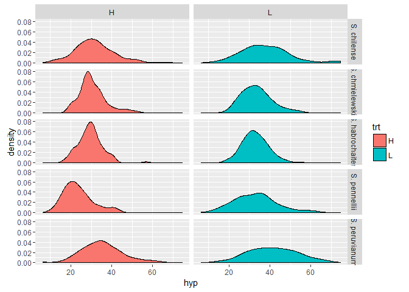<!-- -->

```r
#box plots
pl <- ggplot(data = data, aes(y=hyp,x=species,fill=trt))
pl <- pl + geom_boxplot()
pl
```

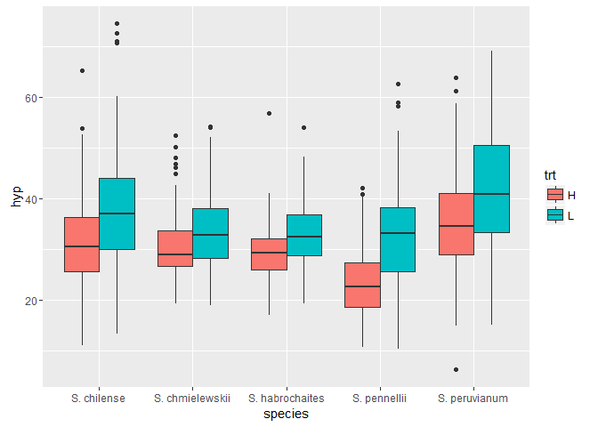<!-- -->

```r
##data transformation (if the original data are not so normal distribution)

#Square root transformation
pl <- ggplot(data = data, aes(x=sqrt(hyp),fill=trt))
pl <- pl + geom_density()
pl <- pl + facet_grid(species ~ trt)
pl + ggtitle("sqrt transformed")
```

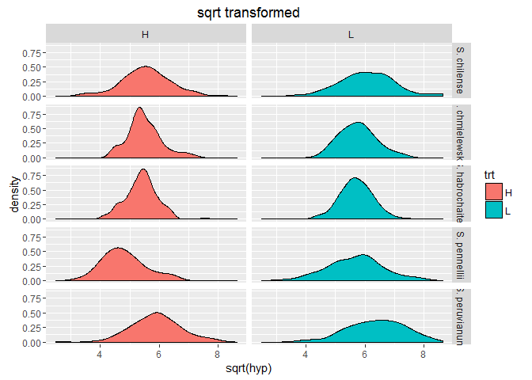<!-- -->

```r
#Log2 transformation
pl <- ggplot(data = data, aes(x=log2(hyp),fill=trt))
pl <- pl + geom_density()
pl <- pl + facet_grid(species ~ trt)
pl + ggtitle("log2 transformed")
```

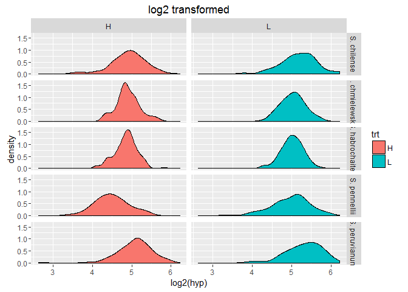<!-- -->

```r
##except by plotting the data to see if it is normal distribution, we can use normality test by shapiro.test
by(data$hyp,list(data$trt,data$species),shapiro.test)
```

```
## : H
## : S. chilense
## 
## 	Shapiro-Wilk normality test
## 
## data:  dd[x, ]
## W = 0.97615, p-value = 0.06157
## 
## -------------------------------------------------------- 
## : L
## : S. chilense
## 
## 	Shapiro-Wilk normality test
## 
## data:  dd[x, ]
## W = 0.96132, p-value = 0.003754
## 
## -------------------------------------------------------- 
## : H
## : S. chmielewskii
## 
## 	Shapiro-Wilk normality test
## 
## data:  dd[x, ]
## W = 0.93713, p-value = 6.374e-05
## 
## -------------------------------------------------------- 
## : L
## : S. chmielewskii
## 
## 	Shapiro-Wilk normality test
## 
## data:  dd[x, ]
## W = 0.97217, p-value = 0.01553
## 
## -------------------------------------------------------- 
## : H
## : S. habrochaites
## 
## 	Shapiro-Wilk normality test
## 
## data:  dd[x, ]
## W = 0.95978, p-value = 0.001285
## 
## -------------------------------------------------------- 
## : L
## : S. habrochaites
## 
## 	Shapiro-Wilk normality test
## 
## data:  dd[x, ]
## W = 0.98706, p-value = 0.3921
## 
## -------------------------------------------------------- 
## : H
## : S. pennellii
## 
## 	Shapiro-Wilk normality test
## 
## data:  dd[x, ]
## W = 0.93801, p-value = 0.004416
## 
## -------------------------------------------------------- 
## : L
## : S. pennellii
## 
## 	Shapiro-Wilk normality test
## 
## data:  dd[x, ]
## W = 0.97952, p-value = 0.2895
## 
## -------------------------------------------------------- 
## : H
## : S. peruvianum
## 
## 	Shapiro-Wilk normality test
## 
## data:  dd[x, ]
## W = 0.98393, p-value = 0.2357
## 
## -------------------------------------------------------- 
## : L
## : S. peruvianum
## 
## 	Shapiro-Wilk normality test
## 
## data:  dd[x, ]
## W = 0.99081, p-value = 0.6571
```

```r
by(sqrt(data$hyp),list(data$trt,data$species),shapiro.test)
```

```
## : H
## : S. chilense
## 
## 	Shapiro-Wilk normality test
## 
## data:  dd[x, ]
## W = 0.98965, p-value = 0.6224
## 
## -------------------------------------------------------- 
## : L
## : S. chilense
## 
## 	Shapiro-Wilk normality test
## 
## data:  dd[x, ]
## W = 0.98696, p-value = 0.3991
## 
## -------------------------------------------------------- 
## : H
## : S. chmielewskii
## 
## 	Shapiro-Wilk normality test
## 
## data:  dd[x, ]
## W = 0.96342, p-value = 0.004341
## 
## -------------------------------------------------------- 
## : L
## : S. chmielewskii
## 
## 	Shapiro-Wilk normality test
## 
## data:  dd[x, ]
## W = 0.9881, p-value = 0.399
## 
## -------------------------------------------------------- 
## : H
## : S. habrochaites
## 
## 	Shapiro-Wilk normality test
## 
## data:  dd[x, ]
## W = 0.97928, p-value = 0.06305
## 
## -------------------------------------------------------- 
## : L
## : S. habrochaites
## 
## 	Shapiro-Wilk normality test
## 
## data:  dd[x, ]
## W = 0.99519, p-value = 0.9731
## 
## -------------------------------------------------------- 
## : H
## : S. pennellii
## 
## 	Shapiro-Wilk normality test
## 
## data:  dd[x, ]
## W = 0.96999, p-value = 0.1457
## 
## -------------------------------------------------------- 
## : L
## : S. pennellii
## 
## 	Shapiro-Wilk normality test
## 
## data:  dd[x, ]
## W = 0.99243, p-value = 0.9467
## 
## -------------------------------------------------------- 
## : H
## : S. peruvianum
## 
## 	Shapiro-Wilk normality test
## 
## data:  dd[x, ]
## W = 0.97994, p-value = 0.1125
## 
## -------------------------------------------------------- 
## : L
## : S. peruvianum
## 
## 	Shapiro-Wilk normality test
## 
## data:  dd[x, ]
## W = 0.98796, p-value = 0.4209
```

```r
by(log2(data$hyp),list(data$trt,data$species),shapiro.test)
```

```
## : H
## : S. chilense
## 
## 	Shapiro-Wilk normality test
## 
## data:  dd[x, ]
## W = 0.97087, p-value = 0.02352
## 
## -------------------------------------------------------- 
## : L
## : S. chilense
## 
## 	Shapiro-Wilk normality test
## 
## data:  dd[x, ]
## W = 0.98253, p-value = 0.1827
## 
## -------------------------------------------------------- 
## : H
## : S. chmielewskii
## 
## 	Shapiro-Wilk normality test
## 
## data:  dd[x, ]
## W = 0.97867, p-value = 0.07747
## 
## -------------------------------------------------------- 
## : L
## : S. chmielewskii
## 
## 	Shapiro-Wilk normality test
## 
## data:  dd[x, ]
## W = 0.9949, p-value = 0.9493
## 
## -------------------------------------------------------- 
## : H
## : S. habrochaites
## 
## 	Shapiro-Wilk normality test
## 
## data:  dd[x, ]
## W = 0.98243, p-value = 0.123
## 
## -------------------------------------------------------- 
## : L
## : S. habrochaites
## 
## 	Shapiro-Wilk normality test
## 
## data:  dd[x, ]
## W = 0.99303, p-value = 0.8653
## 
## -------------------------------------------------------- 
## : H
## : S. pennellii
## 
## 	Shapiro-Wilk normality test
## 
## data:  dd[x, ]
## W = 0.98586, p-value = 0.7146
## 
## -------------------------------------------------------- 
## : L
## : S. pennellii
## 
## 	Shapiro-Wilk normality test
## 
## data:  dd[x, ]
## W = 0.97622, p-value = 0.1895
## 
## -------------------------------------------------------- 
## : H
## : S. peruvianum
## 
## 	Shapiro-Wilk normality test
## 
## data:  dd[x, ]
## W = 0.91602, p-value = 5.466e-06
## 
## -------------------------------------------------------- 
## : L
## : S. peruvianum
## 
## 	Shapiro-Wilk normality test
## 
## data:  dd[x, ]
## W = 0.96537, p-value = 0.005283
```

```r
?by #function 'by' is an object-oriented wrapper for tapply applied to data frame
```

```
## starting httpd help server ...
```

```
##  done
```

```r
#so, squrt transformed is the best

#categorical variable for trt
data$trtL <- ifelse(data$trt=="L",1,0)

#alternative way
levels(data$trt)
```

```
## [1] "H" "L"
```

```r
data$trt2 <- as.numeric(data$trt)-1 #0 = H, 1=L

#################################################
###what I did for the variables
#set the dummy variable for the data
##trt
#data$trt <- ifelse(dat1$trt=="H",1,0)
#summary(dat1)
##species
#data$species_chilense <- ifelse(dat1$species=="S. chilense",1,0)
#data$species_chimielewskii <- ifelse(dat1$species=="S. chimielewskii",1,0)
#data$species_habrochaites <- ifelse(dat1$species=="S. habrochaites",1,0)
#data$species_pennellii <- ifelse(dat1$species=="S. pennellii",1,0)
#data$species_peruvianum <- ifelse(dat1$species=="S. peruvianum",1,0)
###what I did for the variables
####################################################

#categorical variables for species
#almost the same thing as the last step, set the dummy variable "species" into different column, which is really useful when you have a lot of species, you can not do it one by one
data$index <- 1:nrow(data)
data2 <- dcast(data,index + hyp + trt2 ~ species, value.var = "species",fun.aggregate = length)

head(data2)
```

```
##   index   hyp trt2 S. chilense S. chmielewskii S. habrochaites
## 1     1 19.46    0           0               0               0
## 2     2 31.28    0           0               0               0
## 3     3 56.65    0           0               0               0
## 4     4 35.18    0           1               0               0
## 5     5 35.32    0           1               0               0
## 6     6 28.74    0           0               1               0
##   S. pennellii S. peruvianum
## 1            1             0
## 2            0             1
## 3            0             1
## 4            0             0
## 5            0             0
## 6            0             0
```

```r
#set a model with a prior distribution using map2stan
##stan needs a "clear data", we must subset the data frame to contain only the relevant columns and get rid of the other variables
data2.trt <- data2[, c("hyp","trt2")]
head(data2.trt)
```

```
##     hyp trt2
## 1 19.46    0
## 2 31.28    0
## 3 56.65    0
## 4 35.18    0
## 5 35.32    0
## 6 28.74    0
```

```r
#set the model for hyp and trt
#trt model
trt.stan <- map2stan(alist(
  hyp ~ dnorm(mu,sigma),
  mu <- a + bT * trt2,
  a ~ dnorm(0,100),
  bT ~ dnorm(0,10),
  sigma ~ dunif(0,20)),
  data2.trt,
  chains = 4)
```

```
## 
## SAMPLING FOR MODEL 'hyp ~ dnorm(mu, sigma)' NOW (CHAIN 1).
## 
## Chain 1, Iteration:    1 / 2000 [  0%]  (Warmup)
## Chain 1, Iteration:  200 / 2000 [ 10%]  (Warmup)
## Chain 1, Iteration:  400 / 2000 [ 20%]  (Warmup)
## Chain 1, Iteration:  600 / 2000 [ 30%]  (Warmup)
## Chain 1, Iteration:  800 / 2000 [ 40%]  (Warmup)
## Chain 1, Iteration: 1000 / 2000 [ 50%]  (Warmup)
## Chain 1, Iteration: 1001 / 2000 [ 50%]  (Sampling)
## Chain 1, Iteration: 1200 / 2000 [ 60%]  (Sampling)
## Chain 1, Iteration: 1400 / 2000 [ 70%]  (Sampling)
## Chain 1, Iteration: 1600 / 2000 [ 80%]  (Sampling)
## Chain 1, Iteration: 1800 / 2000 [ 90%]  (Sampling)
## Chain 1, Iteration: 2000 / 2000 [100%]  (Sampling)
##  Elapsed Time: 1.041 seconds (Warm-up)
##                0.717 seconds (Sampling)
##                1.758 seconds (Total)
## 
## 
## SAMPLING FOR MODEL 'hyp ~ dnorm(mu, sigma)' NOW (CHAIN 2).
## 
## Chain 2, Iteration:    1 / 2000 [  0%]  (Warmup)
## Chain 2, Iteration:  200 / 2000 [ 10%]  (Warmup)
## Chain 2, Iteration:  400 / 2000 [ 20%]  (Warmup)
## Chain 2, Iteration:  600 / 2000 [ 30%]  (Warmup)
## Chain 2, Iteration:  800 / 2000 [ 40%]  (Warmup)
## Chain 2, Iteration: 1000 / 2000 [ 50%]  (Warmup)
## Chain 2, Iteration: 1001 / 2000 [ 50%]  (Sampling)
## Chain 2, Iteration: 1200 / 2000 [ 60%]  (Sampling)
## Chain 2, Iteration: 1400 / 2000 [ 70%]  (Sampling)
## Chain 2, Iteration: 1600 / 2000 [ 80%]  (Sampling)
## Chain 2, Iteration: 1800 / 2000 [ 90%]  (Sampling)
## Chain 2, Iteration: 2000 / 2000 [100%]  (Sampling)
##  Elapsed Time: 0.782 seconds (Warm-up)
##                0.719 seconds (Sampling)
##                1.501 seconds (Total)
## 
## 
## SAMPLING FOR MODEL 'hyp ~ dnorm(mu, sigma)' NOW (CHAIN 3).
## 
## Chain 3, Iteration:    1 / 2000 [  0%]  (Warmup)
## Chain 3, Iteration:  200 / 2000 [ 10%]  (Warmup)
## Chain 3, Iteration:  400 / 2000 [ 20%]  (Warmup)
## Chain 3, Iteration:  600 / 2000 [ 30%]  (Warmup)
## Chain 3, Iteration:  800 / 2000 [ 40%]  (Warmup)
## Chain 3, Iteration: 1000 / 2000 [ 50%]  (Warmup)
## Chain 3, Iteration: 1001 / 2000 [ 50%]  (Sampling)
## Chain 3, Iteration: 1200 / 2000 [ 60%]  (Sampling)
## Chain 3, Iteration: 1400 / 2000 [ 70%]  (Sampling)
## Chain 3, Iteration: 1600 / 2000 [ 80%]  (Sampling)
## Chain 3, Iteration: 1800 / 2000 [ 90%]  (Sampling)
## Chain 3, Iteration: 2000 / 2000 [100%]  (Sampling)
##  Elapsed Time: 0.764 seconds (Warm-up)
##                0.702 seconds (Sampling)
##                1.466 seconds (Total)
## 
## 
## SAMPLING FOR MODEL 'hyp ~ dnorm(mu, sigma)' NOW (CHAIN 4).
## 
## Chain 4, Iteration:    1 / 2000 [  0%]  (Warmup)
## Chain 4, Iteration:  200 / 2000 [ 10%]  (Warmup)
## Chain 4, Iteration:  400 / 2000 [ 20%]  (Warmup)
## Chain 4, Iteration:  600 / 2000 [ 30%]  (Warmup)
## Chain 4, Iteration:  800 / 2000 [ 40%]  (Warmup)
## Chain 4, Iteration: 1000 / 2000 [ 50%]  (Warmup)
## Chain 4, Iteration: 1001 / 2000 [ 50%]  (Sampling)
## Chain 4, Iteration: 1200 / 2000 [ 60%]  (Sampling)
## Chain 4, Iteration: 1400 / 2000 [ 70%]  (Sampling)
## Chain 4, Iteration: 1600 / 2000 [ 80%]  (Sampling)
## Chain 4, Iteration: 1800 / 2000 [ 90%]  (Sampling)
## Chain 4, Iteration: 2000 / 2000 [100%]  (Sampling)
##  Elapsed Time: 0.786 seconds (Warm-up)
##                0.718 seconds (Sampling)
##                1.504 seconds (Total)
## 
## 
## SAMPLING FOR MODEL 'hyp ~ dnorm(mu, sigma)' NOW (CHAIN 1).
## WARNING: No variance estimation is
##          performed for num_warmup < 20
## 
## 
## Chain 1, Iteration: 1 / 1 [100%]  (Sampling)
##  Elapsed Time: 0 seconds (Warm-up)
##                0 seconds (Sampling)
##                0 seconds (Total)
```

```
## Computing WAIC
```

```
## Constructing posterior predictions
```

```
## [ 400 / 4000 ]
[ 800 / 4000 ]
[ 1200 / 4000 ]
[ 1600 / 4000 ]
[ 2000 / 4000 ]
[ 2400 / 4000 ]
[ 2800 / 4000 ]
[ 3200 / 4000 ]
[ 3600 / 4000 ]
[ 4000 / 4000 ]
```

```r
#test the model
plot(trt.stan)
```

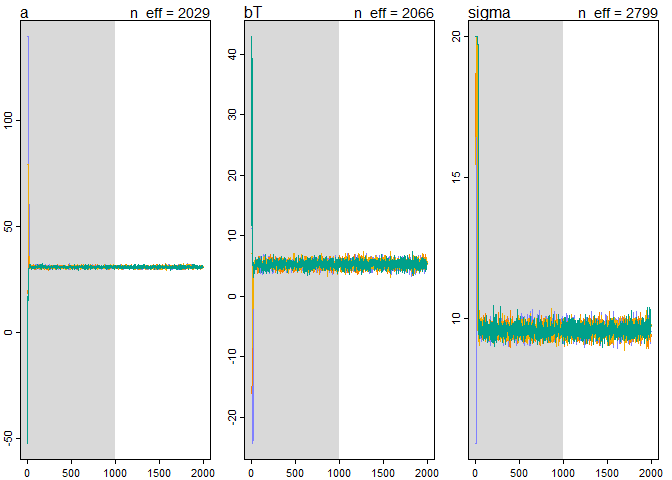<!-- -->

```r
precis(trt.stan)
```

```
##        Mean StdDev lower 0.89 upper 0.89 n_eff Rhat
## a     30.66   0.43      29.95      31.33  2029    1
## bT     5.29   0.60       4.29       6.19  2066    1
## sigma  9.61   0.21       9.27       9.93  2799    1
```

```r
par(mfrow=c(1,1),mfcol=c(1,1))
plot(precis(trt.stan))
```

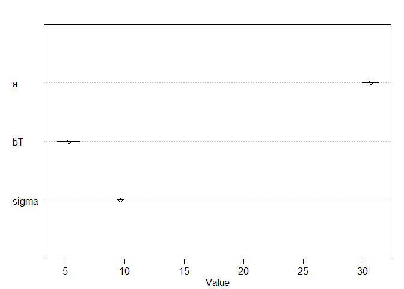<!-- -->

```r
##set the model for hyp and species
#first, fix species names to get rid of space 
colnames(data2) <- sub(". ","_",colnames(data2))
head(data2)
```

```
##   index   hyp trt2 S_chilense S_chmielewskii S_habrochaites S_pennellii
## 1     1 19.46    0          0              0              0           1
## 2     2 31.28    0          0              0              0           0
## 3     3 56.65    0          0              0              0           0
## 4     4 35.18    0          1              0              0           0
## 5     5 35.32    0          1              0              0           0
## 6     6 28.74    0          0              1              0           0
##   S_peruvianum
## 1            0
## 2            1
## 3            1
## 4            0
## 5            0
## 6            0
```

```r
#model where each species has its own intercept
data2.species.all <- data2[,c(2,4:8)]
head(data2.species.all)
```

```
##     hyp S_chilense S_chmielewskii S_habrochaites S_pennellii S_peruvianum
## 1 19.46          0              0              0           1            0
## 2 31.28          0              0              0           0            1
## 3 56.65          0              0              0           0            1
## 4 35.18          1              0              0           0            0
## 5 35.32          1              0              0           0            0
## 6 28.74          0              1              0           0            0
```

```r
#set the model for hyp and species
species.stan <- map2stan(alist(
  hyp ~ dnorm(mu, sigma),
  mu <- bChil*S_chilense + bChmi*S_chmielewskii + bHab*S_habrochaites + bPen*S_pennellii + bPer*S_peruvianum,
  c(bChil, bChmi, bHab, bPen, bPer) ~ dnorm(33.35, 20),
  sigma ~ dunif(0,20)),
  data2.species.all,
  chains = 4)
```

```
## 
## SAMPLING FOR MODEL 'hyp ~ dnorm(mu, sigma)' NOW (CHAIN 1).
## 
## Chain 1, Iteration:    1 / 2000 [  0%]  (Warmup)
## Chain 1, Iteration:  200 / 2000 [ 10%]  (Warmup)
## Chain 1, Iteration:  400 / 2000 [ 20%]  (Warmup)
## Chain 1, Iteration:  600 / 2000 [ 30%]  (Warmup)
## Chain 1, Iteration:  800 / 2000 [ 40%]  (Warmup)
## Chain 1, Iteration: 1000 / 2000 [ 50%]  (Warmup)
## Chain 1, Iteration: 1001 / 2000 [ 50%]  (Sampling)
## Chain 1, Iteration: 1200 / 2000 [ 60%]  (Sampling)
## Chain 1, Iteration: 1400 / 2000 [ 70%]  (Sampling)
## Chain 1, Iteration: 1600 / 2000 [ 80%]  (Sampling)
## Chain 1, Iteration: 1800 / 2000 [ 90%]  (Sampling)
## Chain 1, Iteration: 2000 / 2000 [100%]  (Sampling)
##  Elapsed Time: 3.77 seconds (Warm-up)
##                2.106 seconds (Sampling)
##                5.876 seconds (Total)
## 
## 
## SAMPLING FOR MODEL 'hyp ~ dnorm(mu, sigma)' NOW (CHAIN 2).
## 
## Chain 2, Iteration:    1 / 2000 [  0%]  (Warmup)
## Chain 2, Iteration:  200 / 2000 [ 10%]  (Warmup)
## Chain 2, Iteration:  400 / 2000 [ 20%]  (Warmup)
## Chain 2, Iteration:  600 / 2000 [ 30%]  (Warmup)
## Chain 2, Iteration:  800 / 2000 [ 40%]  (Warmup)
## Chain 2, Iteration: 1000 / 2000 [ 50%]  (Warmup)
## Chain 2, Iteration: 1001 / 2000 [ 50%]  (Sampling)
## Chain 2, Iteration: 1200 / 2000 [ 60%]  (Sampling)
## Chain 2, Iteration: 1400 / 2000 [ 70%]  (Sampling)
## Chain 2, Iteration: 1600 / 2000 [ 80%]  (Sampling)
## Chain 2, Iteration: 1800 / 2000 [ 90%]  (Sampling)
## Chain 2, Iteration: 2000 / 2000 [100%]  (Sampling)
##  Elapsed Time: 4.24 seconds (Warm-up)
##                2.172 seconds (Sampling)
##                6.412 seconds (Total)
## 
## 
## SAMPLING FOR MODEL 'hyp ~ dnorm(mu, sigma)' NOW (CHAIN 3).
## 
## Chain 3, Iteration:    1 / 2000 [  0%]  (Warmup)
## Chain 3, Iteration:  200 / 2000 [ 10%]  (Warmup)
## Chain 3, Iteration:  400 / 2000 [ 20%]  (Warmup)
## Chain 3, Iteration:  600 / 2000 [ 30%]  (Warmup)
## Chain 3, Iteration:  800 / 2000 [ 40%]  (Warmup)
## Chain 3, Iteration: 1000 / 2000 [ 50%]  (Warmup)
## Chain 3, Iteration: 1001 / 2000 [ 50%]  (Sampling)
## Chain 3, Iteration: 1200 / 2000 [ 60%]  (Sampling)
## Chain 3, Iteration: 1400 / 2000 [ 70%]  (Sampling)
## Chain 3, Iteration: 1600 / 2000 [ 80%]  (Sampling)
## Chain 3, Iteration: 1800 / 2000 [ 90%]  (Sampling)
## Chain 3, Iteration: 2000 / 2000 [100%]  (Sampling)
##  Elapsed Time: 4.395 seconds (Warm-up)
##                2.321 seconds (Sampling)
##                6.716 seconds (Total)
## 
## 
## SAMPLING FOR MODEL 'hyp ~ dnorm(mu, sigma)' NOW (CHAIN 4).
## 
## Chain 4, Iteration:    1 / 2000 [  0%]  (Warmup)
## Chain 4, Iteration:  200 / 2000 [ 10%]  (Warmup)
## Chain 4, Iteration:  400 / 2000 [ 20%]  (Warmup)
## Chain 4, Iteration:  600 / 2000 [ 30%]  (Warmup)
## Chain 4, Iteration:  800 / 2000 [ 40%]  (Warmup)
## Chain 4, Iteration: 1000 / 2000 [ 50%]  (Warmup)
## Chain 4, Iteration: 1001 / 2000 [ 50%]  (Sampling)
## Chain 4, Iteration: 1200 / 2000 [ 60%]  (Sampling)
## Chain 4, Iteration: 1400 / 2000 [ 70%]  (Sampling)
## Chain 4, Iteration: 1600 / 2000 [ 80%]  (Sampling)
## Chain 4, Iteration: 1800 / 2000 [ 90%]  (Sampling)
## Chain 4, Iteration: 2000 / 2000 [100%]  (Sampling)
##  Elapsed Time: 4.399 seconds (Warm-up)
##                2.591 seconds (Sampling)
##                6.99 seconds (Total)
## 
## 
## SAMPLING FOR MODEL 'hyp ~ dnorm(mu, sigma)' NOW (CHAIN 1).
## WARNING: No variance estimation is
##          performed for num_warmup < 20
## 
## 
## Chain 1, Iteration: 1 / 1 [100%]  (Sampling)
##  Elapsed Time: 0 seconds (Warm-up)
##                0.015 seconds (Sampling)
##                0.015 seconds (Total)
```

```
## Computing WAIC
## Constructing posterior predictions
```

```
## [ 400 / 4000 ]
[ 800 / 4000 ]
[ 1200 / 4000 ]
[ 1600 / 4000 ]
[ 2000 / 4000 ]
[ 2400 / 4000 ]
[ 2800 / 4000 ]
[ 3200 / 4000 ]
[ 3600 / 4000 ]
[ 4000 / 4000 ]
```

```r
#test the model
plot(species.stan)
```

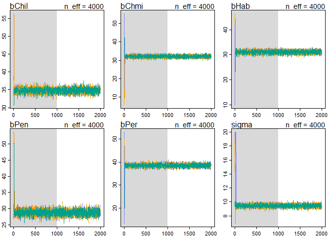<!-- -->

```r
precis(species.stan)
```

```
##        Mean StdDev lower 0.89 upper 0.89 n_eff Rhat
## bChil 34.77   0.67      33.72      35.86  4000    1
## bChmi 32.11   0.62      31.14      33.15  4000    1
## bHab  31.09   0.62      30.14      32.15  4000    1
## bPen  28.78   0.83      27.50      30.09  4000    1
## bPer  38.50   0.65      37.46      39.52  4000    1
## sigma  9.44   0.22       9.11       9.79  4000    1
```

```r
par(mfrow=c(1,1),mfcol=c(1,1))
plot(precis(species.stan))
```

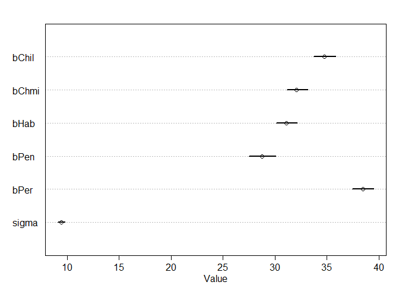<!-- -->

```r
#use S. chmi as intercept
data2.species.intercept <- data2[,c(2,4,6:8)]

head(data2.species.intercept)
```

```
##     hyp S_chilense S_habrochaites S_pennellii S_peruvianum
## 1 19.46          0              0           1            0
## 2 31.28          0              0           0            1
## 3 56.65          0              0           0            1
## 4 35.18          1              0           0            0
## 5 35.32          1              0           0            0
## 6 28.74          0              0           0            0
```

```r
species.stan.intercept <- map2stan(alist(
  hyp ~ dnorm(mu,sigma),
  mu <- a + bChil*S_chilense + bHab*S_habrochaites + bPen * S_pennellii + bPer*S_peruvianum,
  a ~ dnorm(33.35,10),
  c(bChil,bHab,bPen,bPer) ~ dnorm(0,10),
  sigma ~ dunif(0,20)),
  data2.species.intercept,
  chains = 4)
```

```
## 
## SAMPLING FOR MODEL 'hyp ~ dnorm(mu, sigma)' NOW (CHAIN 1).
## 
## Chain 1, Iteration:    1 / 2000 [  0%]  (Warmup)
## Chain 1, Iteration:  200 / 2000 [ 10%]  (Warmup)
## Chain 1, Iteration:  400 / 2000 [ 20%]  (Warmup)
## Chain 1, Iteration:  600 / 2000 [ 30%]  (Warmup)
## Chain 1, Iteration:  800 / 2000 [ 40%]  (Warmup)
## Chain 1, Iteration: 1000 / 2000 [ 50%]  (Warmup)
## Chain 1, Iteration: 1001 / 2000 [ 50%]  (Sampling)
## Chain 1, Iteration: 1200 / 2000 [ 60%]  (Sampling)
## Chain 1, Iteration: 1400 / 2000 [ 70%]  (Sampling)
## Chain 1, Iteration: 1600 / 2000 [ 80%]  (Sampling)
## Chain 1, Iteration: 1800 / 2000 [ 90%]  (Sampling)
## Chain 1, Iteration: 2000 / 2000 [100%]  (Sampling)
##  Elapsed Time: 5.289 seconds (Warm-up)
##                3.809 seconds (Sampling)
##                9.098 seconds (Total)
## 
## 
## SAMPLING FOR MODEL 'hyp ~ dnorm(mu, sigma)' NOW (CHAIN 2).
## 
## Chain 2, Iteration:    1 / 2000 [  0%]  (Warmup)
## Chain 2, Iteration:  200 / 2000 [ 10%]  (Warmup)
## Chain 2, Iteration:  400 / 2000 [ 20%]  (Warmup)
## Chain 2, Iteration:  600 / 2000 [ 30%]  (Warmup)
## Chain 2, Iteration:  800 / 2000 [ 40%]  (Warmup)
## Chain 2, Iteration: 1000 / 2000 [ 50%]  (Warmup)
## Chain 2, Iteration: 1001 / 2000 [ 50%]  (Sampling)
## Chain 2, Iteration: 1200 / 2000 [ 60%]  (Sampling)
## Chain 2, Iteration: 1400 / 2000 [ 70%]  (Sampling)
## Chain 2, Iteration: 1600 / 2000 [ 80%]  (Sampling)
## Chain 2, Iteration: 1800 / 2000 [ 90%]  (Sampling)
## Chain 2, Iteration: 2000 / 2000 [100%]  (Sampling)
##  Elapsed Time: 4.997 seconds (Warm-up)
##                3.671 seconds (Sampling)
##                8.668 seconds (Total)
## 
## 
## SAMPLING FOR MODEL 'hyp ~ dnorm(mu, sigma)' NOW (CHAIN 3).
## 
## Chain 3, Iteration:    1 / 2000 [  0%]  (Warmup)
## Chain 3, Iteration:  200 / 2000 [ 10%]  (Warmup)
## Chain 3, Iteration:  400 / 2000 [ 20%]  (Warmup)
## Chain 3, Iteration:  600 / 2000 [ 30%]  (Warmup)
## Chain 3, Iteration:  800 / 2000 [ 40%]  (Warmup)
## Chain 3, Iteration: 1000 / 2000 [ 50%]  (Warmup)
## Chain 3, Iteration: 1001 / 2000 [ 50%]  (Sampling)
## Chain 3, Iteration: 1200 / 2000 [ 60%]  (Sampling)
## Chain 3, Iteration: 1400 / 2000 [ 70%]  (Sampling)
## Chain 3, Iteration: 1600 / 2000 [ 80%]  (Sampling)
## Chain 3, Iteration: 1800 / 2000 [ 90%]  (Sampling)
## Chain 3, Iteration: 2000 / 2000 [100%]  (Sampling)
##  Elapsed Time: 4.996 seconds (Warm-up)
##                3.63 seconds (Sampling)
##                8.626 seconds (Total)
## 
## 
## SAMPLING FOR MODEL 'hyp ~ dnorm(mu, sigma)' NOW (CHAIN 4).
## 
## Chain 4, Iteration:    1 / 2000 [  0%]  (Warmup)
## Chain 4, Iteration:  200 / 2000 [ 10%]  (Warmup)
## Chain 4, Iteration:  400 / 2000 [ 20%]  (Warmup)
## Chain 4, Iteration:  600 / 2000 [ 30%]  (Warmup)
## Chain 4, Iteration:  800 / 2000 [ 40%]  (Warmup)
## Chain 4, Iteration: 1000 / 2000 [ 50%]  (Warmup)
## Chain 4, Iteration: 1001 / 2000 [ 50%]  (Sampling)
## Chain 4, Iteration: 1200 / 2000 [ 60%]  (Sampling)
## Chain 4, Iteration: 1400 / 2000 [ 70%]  (Sampling)
## Chain 4, Iteration: 1600 / 2000 [ 80%]  (Sampling)
## Chain 4, Iteration: 1800 / 2000 [ 90%]  (Sampling)
## Chain 4, Iteration: 2000 / 2000 [100%]  (Sampling)
##  Elapsed Time: 4.986 seconds (Warm-up)
##                3.346 seconds (Sampling)
##                8.332 seconds (Total)
## 
## 
## SAMPLING FOR MODEL 'hyp ~ dnorm(mu, sigma)' NOW (CHAIN 1).
## WARNING: No variance estimation is
##          performed for num_warmup < 20
## 
## 
## Chain 1, Iteration: 1 / 1 [100%]  (Sampling)
##  Elapsed Time: 0 seconds (Warm-up)
##                0 seconds (Sampling)
##                0 seconds (Total)
```

```
## Computing WAIC
## Constructing posterior predictions
```

```
## [ 400 / 4000 ]
[ 800 / 4000 ]
[ 1200 / 4000 ]
[ 1600 / 4000 ]
[ 2000 / 4000 ]
[ 2400 / 4000 ]
[ 2800 / 4000 ]
[ 3200 / 4000 ]
[ 3600 / 4000 ]
[ 4000 / 4000 ]
```

```r
#test the model
plot(species.stan.intercept)
```

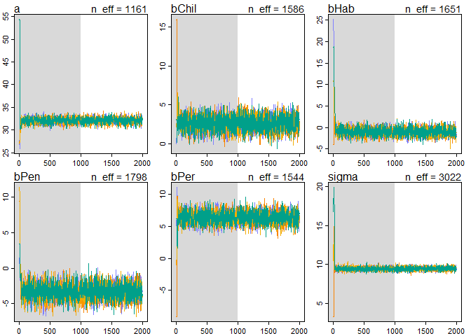<!-- -->

```r
precis(species.stan.intercept)
```

```
##        Mean StdDev lower 0.89 upper 0.89 n_eff Rhat
## a     32.10   0.60      31.12      33.02  1161    1
## bChil  2.64   0.89       1.15       4.00  1586    1
## bHab  -1.02   0.86      -2.41       0.32  1651    1
## bPen  -3.29   1.00      -4.79      -1.62  1798    1
## bPer   6.39   0.87       4.96       7.72  1544    1
## sigma  9.44   0.20       9.11       9.75  3022    1
```

```r
par(mfrow=c(1,1),mfcol=c(1,1))
plot(precis(species.stan.intercept))
```

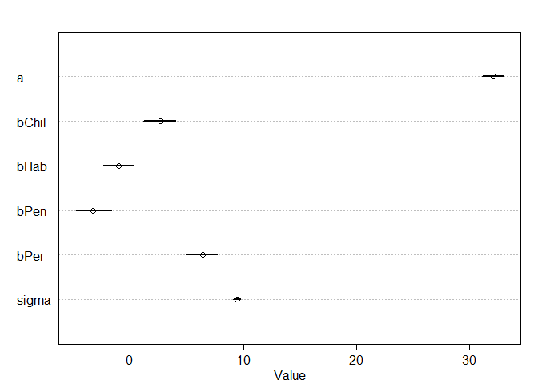<!-- -->

```r
#set the model with species and trt, except the intercept

data2.species.trt <- data2[,c(2:4,6:8)]

head(data2.species.trt)
```

```
##     hyp trt2 S_chilense S_habrochaites S_pennellii S_peruvianum
## 1 19.46    0          0              0           1            0
## 2 31.28    0          0              0           0            1
## 3 56.65    0          0              0           0            1
## 4 35.18    0          1              0           0            0
## 5 35.32    0          1              0           0            0
## 6 28.74    0          0              0           0            0
```

```r
species.trt.stan <- map2stan(alist(
  hyp ~ dnorm(mu,sigma),
  mu <- a + bT*trt2 + bChil*S_chilense + bHab*S_habrochaites + bPen * S_pennellii + bPer*S_peruvianum,
  a ~ dnorm(33.35,10),
  c(bT,bChil,bHab,bPen,bPer) ~ dnorm(0,10),
  sigma ~ dunif(0,20)),
  data2.species.trt,
  chains = 4)
```

```
## 
## SAMPLING FOR MODEL 'hyp ~ dnorm(mu, sigma)' NOW (CHAIN 1).
## 
## Chain 1, Iteration:    1 / 2000 [  0%]  (Warmup)
## Chain 1, Iteration:  200 / 2000 [ 10%]  (Warmup)
## Chain 1, Iteration:  400 / 2000 [ 20%]  (Warmup)
## Chain 1, Iteration:  600 / 2000 [ 30%]  (Warmup)
## Chain 1, Iteration:  800 / 2000 [ 40%]  (Warmup)
## Chain 1, Iteration: 1000 / 2000 [ 50%]  (Warmup)
## Chain 1, Iteration: 1001 / 2000 [ 50%]  (Sampling)
## Chain 1, Iteration: 1200 / 2000 [ 60%]  (Sampling)
## Chain 1, Iteration: 1400 / 2000 [ 70%]  (Sampling)
## Chain 1, Iteration: 1600 / 2000 [ 80%]  (Sampling)
## Chain 1, Iteration: 1800 / 2000 [ 90%]  (Sampling)
## Chain 1, Iteration: 2000 / 2000 [100%]  (Sampling)
##  Elapsed Time: 6.951 seconds (Warm-up)
##                5.375 seconds (Sampling)
##                12.326 seconds (Total)
## 
## 
## SAMPLING FOR MODEL 'hyp ~ dnorm(mu, sigma)' NOW (CHAIN 2).
## 
## Chain 2, Iteration:    1 / 2000 [  0%]  (Warmup)
## Chain 2, Iteration:  200 / 2000 [ 10%]  (Warmup)
## Chain 2, Iteration:  400 / 2000 [ 20%]  (Warmup)
## Chain 2, Iteration:  600 / 2000 [ 30%]  (Warmup)
## Chain 2, Iteration:  800 / 2000 [ 40%]  (Warmup)
## Chain 2, Iteration: 1000 / 2000 [ 50%]  (Warmup)
## Chain 2, Iteration: 1001 / 2000 [ 50%]  (Sampling)
## Chain 2, Iteration: 1200 / 2000 [ 60%]  (Sampling)
## Chain 2, Iteration: 1400 / 2000 [ 70%]  (Sampling)
## Chain 2, Iteration: 1600 / 2000 [ 80%]  (Sampling)
## Chain 2, Iteration: 1800 / 2000 [ 90%]  (Sampling)
## Chain 2, Iteration: 2000 / 2000 [100%]  (Sampling)
##  Elapsed Time: 7.147 seconds (Warm-up)
##                5.259 seconds (Sampling)
##                12.406 seconds (Total)
## 
## 
## SAMPLING FOR MODEL 'hyp ~ dnorm(mu, sigma)' NOW (CHAIN 3).
## 
## Chain 3, Iteration:    1 / 2000 [  0%]  (Warmup)
## Chain 3, Iteration:  200 / 2000 [ 10%]  (Warmup)
## Chain 3, Iteration:  400 / 2000 [ 20%]  (Warmup)
## Chain 3, Iteration:  600 / 2000 [ 30%]  (Warmup)
## Chain 3, Iteration:  800 / 2000 [ 40%]  (Warmup)
## Chain 3, Iteration: 1000 / 2000 [ 50%]  (Warmup)
## Chain 3, Iteration: 1001 / 2000 [ 50%]  (Sampling)
## Chain 3, Iteration: 1200 / 2000 [ 60%]  (Sampling)
## Chain 3, Iteration: 1400 / 2000 [ 70%]  (Sampling)
## Chain 3, Iteration: 1600 / 2000 [ 80%]  (Sampling)
## Chain 3, Iteration: 1800 / 2000 [ 90%]  (Sampling)
## Chain 3, Iteration: 2000 / 2000 [100%]  (Sampling)
##  Elapsed Time: 7.887 seconds (Warm-up)
##                5.391 seconds (Sampling)
##                13.278 seconds (Total)
## 
## 
## SAMPLING FOR MODEL 'hyp ~ dnorm(mu, sigma)' NOW (CHAIN 4).
## 
## Chain 4, Iteration:    1 / 2000 [  0%]  (Warmup)
## Chain 4, Iteration:  200 / 2000 [ 10%]  (Warmup)
## Chain 4, Iteration:  400 / 2000 [ 20%]  (Warmup)
## Chain 4, Iteration:  600 / 2000 [ 30%]  (Warmup)
## Chain 4, Iteration:  800 / 2000 [ 40%]  (Warmup)
## Chain 4, Iteration: 1000 / 2000 [ 50%]  (Warmup)
## Chain 4, Iteration: 1001 / 2000 [ 50%]  (Sampling)
## Chain 4, Iteration: 1200 / 2000 [ 60%]  (Sampling)
## Chain 4, Iteration: 1400 / 2000 [ 70%]  (Sampling)
## Chain 4, Iteration: 1600 / 2000 [ 80%]  (Sampling)
## Chain 4, Iteration: 1800 / 2000 [ 90%]  (Sampling)
## Chain 4, Iteration: 2000 / 2000 [100%]  (Sampling)
##  Elapsed Time: 6.839 seconds (Warm-up)
##                5.718 seconds (Sampling)
##                12.557 seconds (Total)
## 
## 
## SAMPLING FOR MODEL 'hyp ~ dnorm(mu, sigma)' NOW (CHAIN 1).
## WARNING: No variance estimation is
##          performed for num_warmup < 20
## 
## 
## Chain 1, Iteration: 1 / 1 [100%]  (Sampling)
##  Elapsed Time: 0 seconds (Warm-up)
##                0 seconds (Sampling)
##                0 seconds (Total)
```

```
## Computing WAIC
## Constructing posterior predictions
```

```
## [ 400 / 4000 ]
[ 800 / 4000 ]
[ 1200 / 4000 ]
[ 1600 / 4000 ]
[ 2000 / 4000 ]
[ 2400 / 4000 ]
[ 2800 / 4000 ]
[ 3200 / 4000 ]
[ 3600 / 4000 ]
[ 4000 / 4000 ]
```

```r
plot(species.trt.stan)
precis(species.trt.stan)
```

```
##        Mean StdDev lower 0.89 upper 0.89 n_eff Rhat
## a     29.38   0.65      28.40      30.48  1515    1
## bT     5.30   0.56       4.45       6.22  3208    1
## bChil  2.68   0.82       1.39       4.02  1823    1
## bHab  -0.80   0.81      -2.17       0.42  1786    1
## bPen  -3.48   0.95      -4.95      -1.93  2270    1
## bPer   6.38   0.83       4.90       7.59  1672    1
## sigma  9.06   0.20       8.74       9.39  3736    1
```

```r
par(mfrow=c(1,1),mfcol=c(1,1))
```

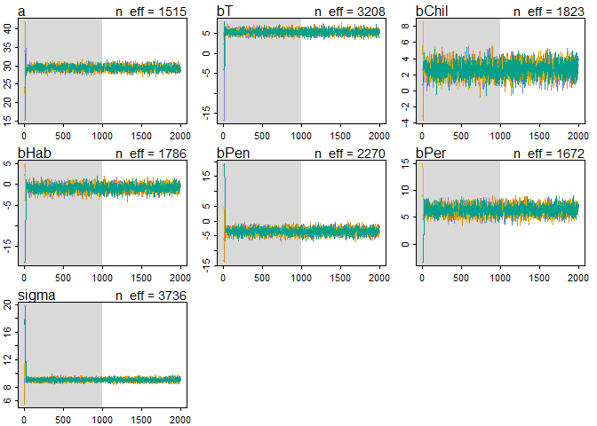<!-- -->

```r
plot(precis(species.trt.stan))
```

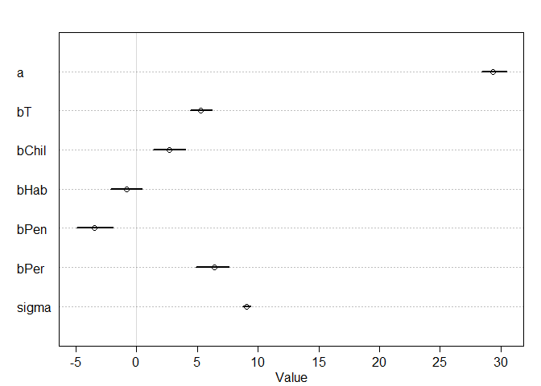<!-- -->

```r
#compare the models

compare(trt.stan,species.trt.stan,species.stan.intercept,species.stan)
```

```
##                          WAIC pWAIC dWAIC weight    SE   dSE
## species.trt.stan       7308.5   7.4   0.0      1 57.37    NA
## species.stan.intercept 7390.7   6.6  82.2      0 57.20 17.19
## species.stan           7391.3   6.9  82.8      0 57.15 17.18
## trt.stan               7422.5   3.7 114.0      0 56.34 23.48
```

```r
plot(compare(trt.stan,species.trt.stan,species.stan.intercept,species.stan))
```

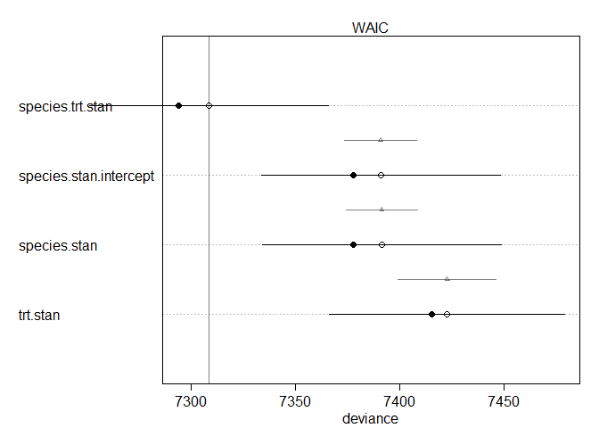<!-- -->

```r
coeftab(trt.stan,species.trt.stan,species.stan.intercept,species.stan)
```

```
##       trt.stan species.trt.stan species.stan.intercept species.stan
## a       30.66    29.38            32.10                     NA     
## bT       5.29     5.30               NA                     NA     
## sigma    9.61     9.06             9.44                   9.44     
## bChil      NA     2.68             2.64                  34.77     
## bHab       NA    -0.80            -1.02                  31.09     
## bPen       NA    -3.48            -3.29                  28.78     
## bPer       NA     6.38             6.39                  38.50     
## bChmi      NA       NA               NA                  32.11     
## nobs     1008     1008             1008                   1008
```

```r
plot(coeftab(trt.stan,species.trt.stan,species.stan.intercept,species.stan))
```

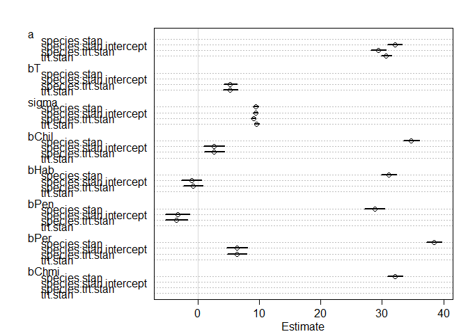<!-- -->

```r
#what can we say about the treatment effect?

#get the posterior distribution of bT, the treatment coefficient.

post.bT <- extract.samples(species.trt.stan)$bT

dens(post.bT,show.HPDI = 0.95)
```

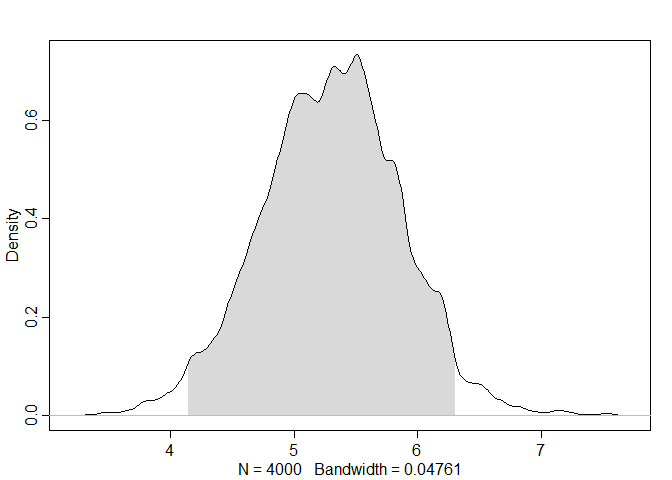<!-- -->

```r
#the fact that the 95% HDPI intervals are far away from 0 is strong evidence that bT is positive

# what percent of the posterior distribution of bT is less than or equal to ?
sum(post.bT <= 0) / length(post.bT) 
```

```
## [1] 0
```

```r
# turns out None of the posterior distribution for bT is less than or equal to 0.
```
##2a) Redo the tomato hyp analysis (or at least the final model with species and treatment) but using square root transformation.  Are model fits improved?  Does it change the parameter estimates?  

```r
#set the square root transformation
data2$hyp_sqrt <- sqrt(data2$hyp)

head(data2)
```

```
##   index   hyp trt2 S_chilense S_chmielewskii S_habrochaites S_pennellii
## 1     1 19.46    0          0              0              0           1
## 2     2 31.28    0          0              0              0           0
## 3     3 56.65    0          0              0              0           0
## 4     4 35.18    0          1              0              0           0
## 5     5 35.32    0          1              0              0           0
## 6     6 28.74    0          0              1              0           0
##   S_peruvianum hyp_sqrt
## 1            0 4.411349
## 2            1 5.592853
## 3            1 7.526619
## 4            0 5.931273
## 5            0 5.943063
## 6            0 5.360970
```

```r
#set the model with species and trt, except the intercept

data2_sqrt <- data2[,c(3:4,6:9)]

head(data2_sqrt) 
```

```
##   trt2 S_chilense S_habrochaites S_pennellii S_peruvianum hyp_sqrt
## 1    0          0              0           1            0 4.411349
## 2    0          0              0           0            1 5.592853
## 3    0          0              0           0            1 7.526619
## 4    0          1              0           0            0 5.931273
## 5    0          1              0           0            0 5.943063
## 6    0          0              0           0            0 5.360970
```

```r
mean(data2_sqrt$hyp_sqrt)
```

```
## [1] 5.712914
```

```r
data2_sqrt.stan <- map2stan(alist(
  hyp_sqrt ~ dnorm(mu,sigma),
  mu <- a + bT*trt2 + bChil*S_chilense + bHab*S_habrochaites + bPen * S_pennellii + bPer*S_peruvianum,
  a ~ dnorm(5.7,10),
  c(bT,bChil,bHab,bPen,bPer) ~ dnorm(0,10),
  sigma ~ dunif(0,20)),
  data2_sqrt,
  chains = 4)
```

```
## 
## SAMPLING FOR MODEL 'hyp_sqrt ~ dnorm(mu, sigma)' NOW (CHAIN 1).
## 
## Chain 1, Iteration:    1 / 2000 [  0%]  (Warmup)
## Chain 1, Iteration:  200 / 2000 [ 10%]  (Warmup)
## Chain 1, Iteration:  400 / 2000 [ 20%]  (Warmup)
## Chain 1, Iteration:  600 / 2000 [ 30%]  (Warmup)
## Chain 1, Iteration:  800 / 2000 [ 40%]  (Warmup)
## Chain 1, Iteration: 1000 / 2000 [ 50%]  (Warmup)
## Chain 1, Iteration: 1001 / 2000 [ 50%]  (Sampling)
## Chain 1, Iteration: 1200 / 2000 [ 60%]  (Sampling)
## Chain 1, Iteration: 1400 / 2000 [ 70%]  (Sampling)
## Chain 1, Iteration: 1600 / 2000 [ 80%]  (Sampling)
## Chain 1, Iteration: 1800 / 2000 [ 90%]  (Sampling)
## Chain 1, Iteration: 2000 / 2000 [100%]  (Sampling)
##  Elapsed Time: 5.226 seconds (Warm-up)
##                5.295 seconds (Sampling)
##                10.521 seconds (Total)
## 
## 
## SAMPLING FOR MODEL 'hyp_sqrt ~ dnorm(mu, sigma)' NOW (CHAIN 2).
## 
## Chain 2, Iteration:    1 / 2000 [  0%]  (Warmup)
## Chain 2, Iteration:  200 / 2000 [ 10%]  (Warmup)
## Chain 2, Iteration:  400 / 2000 [ 20%]  (Warmup)
## Chain 2, Iteration:  600 / 2000 [ 30%]  (Warmup)
## Chain 2, Iteration:  800 / 2000 [ 40%]  (Warmup)
## Chain 2, Iteration: 1000 / 2000 [ 50%]  (Warmup)
## Chain 2, Iteration: 1001 / 2000 [ 50%]  (Sampling)
## Chain 2, Iteration: 1200 / 2000 [ 60%]  (Sampling)
## Chain 2, Iteration: 1400 / 2000 [ 70%]  (Sampling)
## Chain 2, Iteration: 1600 / 2000 [ 80%]  (Sampling)
## Chain 2, Iteration: 1800 / 2000 [ 90%]  (Sampling)
## Chain 2, Iteration: 2000 / 2000 [100%]  (Sampling)
##  Elapsed Time: 4.924 seconds (Warm-up)
##                4.794 seconds (Sampling)
##                9.718 seconds (Total)
## 
## 
## SAMPLING FOR MODEL 'hyp_sqrt ~ dnorm(mu, sigma)' NOW (CHAIN 3).
## 
## Chain 3, Iteration:    1 / 2000 [  0%]  (Warmup)
## Chain 3, Iteration:  200 / 2000 [ 10%]  (Warmup)
## Chain 3, Iteration:  400 / 2000 [ 20%]  (Warmup)
## Chain 3, Iteration:  600 / 2000 [ 30%]  (Warmup)
## Chain 3, Iteration:  800 / 2000 [ 40%]  (Warmup)
## Chain 3, Iteration: 1000 / 2000 [ 50%]  (Warmup)
## Chain 3, Iteration: 1001 / 2000 [ 50%]  (Sampling)
## Chain 3, Iteration: 1200 / 2000 [ 60%]  (Sampling)
## Chain 3, Iteration: 1400 / 2000 [ 70%]  (Sampling)
## Chain 3, Iteration: 1600 / 2000 [ 80%]  (Sampling)
## Chain 3, Iteration: 1800 / 2000 [ 90%]  (Sampling)
## Chain 3, Iteration: 2000 / 2000 [100%]  (Sampling)
##  Elapsed Time: 5.05 seconds (Warm-up)
##                4.795 seconds (Sampling)
##                9.845 seconds (Total)
## 
## 
## SAMPLING FOR MODEL 'hyp_sqrt ~ dnorm(mu, sigma)' NOW (CHAIN 4).
## 
## Chain 4, Iteration:    1 / 2000 [  0%]  (Warmup)
## Chain 4, Iteration:  200 / 2000 [ 10%]  (Warmup)
## Chain 4, Iteration:  400 / 2000 [ 20%]  (Warmup)
## Chain 4, Iteration:  600 / 2000 [ 30%]  (Warmup)
## Chain 4, Iteration:  800 / 2000 [ 40%]  (Warmup)
## Chain 4, Iteration: 1000 / 2000 [ 50%]  (Warmup)
## Chain 4, Iteration: 1001 / 2000 [ 50%]  (Sampling)
## Chain 4, Iteration: 1200 / 2000 [ 60%]  (Sampling)
## Chain 4, Iteration: 1400 / 2000 [ 70%]  (Sampling)
## Chain 4, Iteration: 1600 / 2000 [ 80%]  (Sampling)
## Chain 4, Iteration: 1800 / 2000 [ 90%]  (Sampling)
## Chain 4, Iteration: 2000 / 2000 [100%]  (Sampling)
##  Elapsed Time: 5.019 seconds (Warm-up)
##                4.367 seconds (Sampling)
##                9.386 seconds (Total)
## 
## 
## SAMPLING FOR MODEL 'hyp_sqrt ~ dnorm(mu, sigma)' NOW (CHAIN 1).
## WARNING: No variance estimation is
##          performed for num_warmup < 20
## 
## 
## Chain 1, Iteration: 1 / 1 [100%]  (Sampling)
##  Elapsed Time: 0 seconds (Warm-up)
##                0 seconds (Sampling)
##                0 seconds (Total)
```

```
## Computing WAIC
```

```
## Constructing posterior predictions
```

```
## [ 400 / 4000 ]
[ 800 / 4000 ]
[ 1200 / 4000 ]
[ 1600 / 4000 ]
[ 2000 / 4000 ]
[ 2400 / 4000 ]
[ 2800 / 4000 ]
[ 3200 / 4000 ]
[ 3600 / 4000 ]
[ 4000 / 4000 ]
```

```r
plot(data2_sqrt.stan)
precis(data2_sqrt.stan)
```

```
##        Mean StdDev lower 0.89 upper 0.89 n_eff Rhat
## a      5.40   0.06       5.31       5.49  1353 1.00
## bT     0.46   0.05       0.38       0.54  2850 1.00
## bChil  0.19   0.07       0.08       0.31  1940 1.00
## bHab  -0.07   0.07      -0.19       0.04  1642 1.01
## bPen  -0.37   0.08      -0.50      -0.24  2111 1.00
## bPer   0.50   0.07       0.39       0.62  1764 1.00
## sigma  0.77   0.02       0.75       0.80  3808 1.00
```

```r
par(mfrow=c(1,1),mfcol=c(1,1))
```

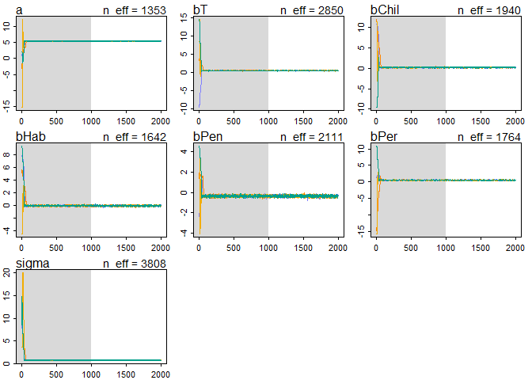<!-- -->

```r
plot(precis(data2_sqrt.stan))
```

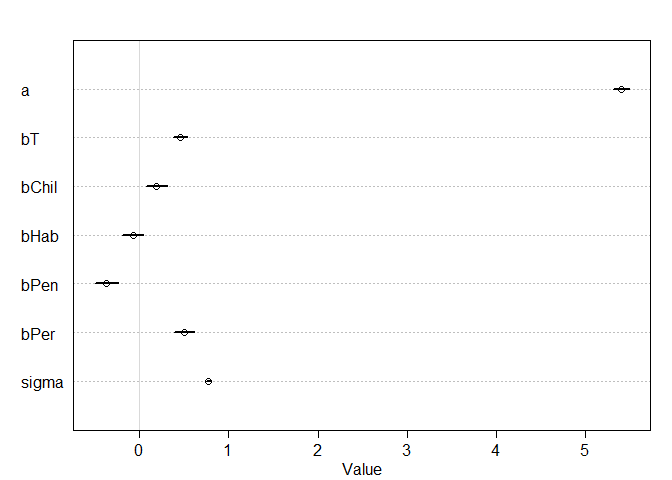<!-- -->

```r
#compare the model using square root transformation and the original data
compare(data2_sqrt.stan,species.trt.stan)
```

```
##                    WAIC pWAIC  dWAIC weight    SE   dSE
## data2_sqrt.stan  2349.3   7.3    0.0      1 54.11    NA
## species.trt.stan 7308.5   7.4 4959.2      0 57.37 18.86
```

```r
plot(compare(data2_sqrt.stan,species.trt.stan))
```

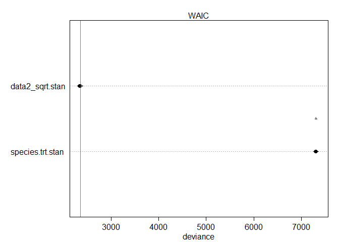<!-- -->

```r
coeftab(data2_sqrt.stan,species.trt.stan)
```

```
##       data2_sqrt.stan species.trt.stan
## a        5.40           29.38         
## bT       0.46            5.30         
## bChil    0.19            2.68         
## bHab    -0.07           -0.80         
## bPen    -0.37           -3.48         
## bPer     0.50            6.38         
## sigma    0.77            9.06         
## nobs     1008            1008
```

```r
plot(coeftab(data2_sqrt.stan,species.trt.stan))
```

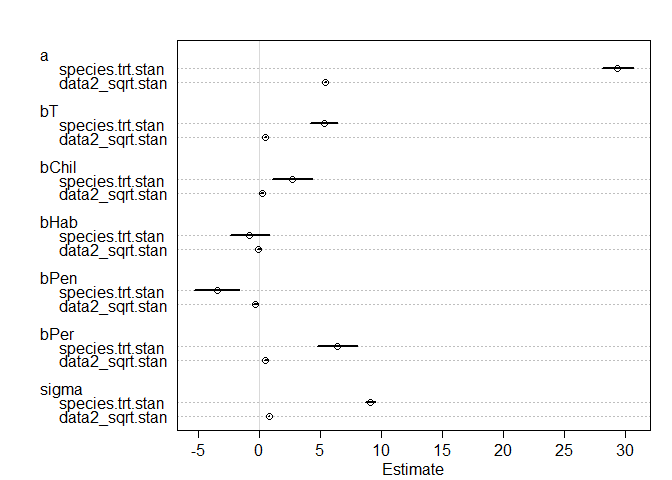<!-- -->

##2b) Is WAIC an appropriate way to compare the model fits with untransformed and transformed data?  How can you test this?  
For the results of compare, we see the model fits with tranformed data has a much lower WAIC and the largest weight value.  
  
How to test?

##2c) How do you get sqrt transformed parameter estimates (especially when they are < 1) back on the original scale (I don't know the answer to this)  


##3)  Fit a model with a species by treatment interaction.  Which species have a trt response that is different from S. chm?  


```r
head(data2)
```

```
##   index   hyp trt2 S_chilense S_chmielewskii S_habrochaites S_pennellii
## 1     1 19.46    0          0              0              0           1
## 2     2 31.28    0          0              0              0           0
## 3     3 56.65    0          0              0              0           0
## 4     4 35.18    0          1              0              0           0
## 5     5 35.32    0          1              0              0           0
## 6     6 28.74    0          0              1              0           0
##   S_peruvianum hyp_sqrt
## 1            0 4.411349
## 2            1 5.592853
## 3            1 7.526619
## 4            0 5.931273
## 5            0 5.943063
## 6            0 5.360970
```

```r
#Fit a model with a species by treatment interaction.
#S. chm?
```


