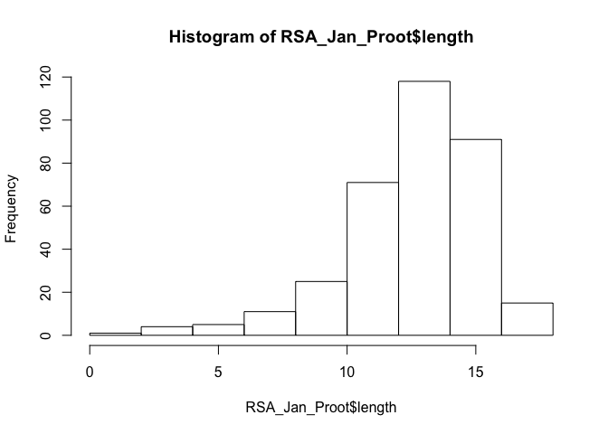
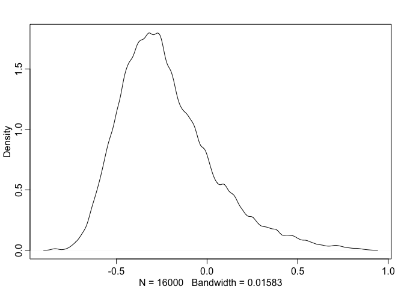
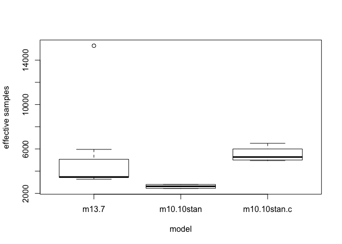
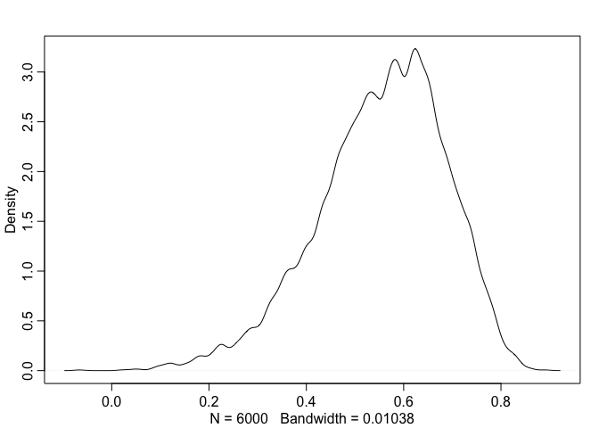

# Chapter_13
Xiaoyan Yue  
1/24/2017  


##13E1 Add to the following model varying slopes on the predictor
Yi ~ Normal(mu,sigma)  
mu = a_cafe[cafe_id] + b_cafe*Xi  
a_cafe[cafe_id] ~ Normal(a,sigma_a)  
a ~ Normal(0,10)  
b_cafe ~ Normal(0,1)  
sigma ~ HalfCauchy(0,2)  
sigma_a ~ HalfCauchy(0,2)

###Adding varying slops
Yi ~ Normal(mu,sigma)  
mu = a_cafe[cafe_id] + b_cafe[cafe_id]*Xi  
c(a_cafe,b_cafe)[cafe_id] ~ MVNormal(c(a,b),S)  
S=matrix(sigma_a,0,0,sigma_b) R matrix(sigma_a,0,0,sigma_b)  
a ~ Normal(0,10)  
b ~ Normal(0,1)  
sigma ~ HalfCauchy(0,2)  
sigma_a ~ HalfCauchy(0,2)  
sigma_b ~ HalfCauchy(0,2)  
R ~ LKJcorr(2)
##13E2 Think up a context in which varying intercepts will be positively correlated with varying slopes. Provide a mechnistic explaination for correlation.

##13M1 Repeat the cafe robot simulation from the beginning of the chapter. This time, set rho to zero, so that there is no correlation between intercepts and slops. How does the posterior distribution of the correlation reflect in the underlying simulation?

###repeat the simulation in the chapter

```r
a <- 3.5            ## average morning wait time
b <- (-1)           ## average difference afternoon wait time
sigma_a <- 1        ## std dev in intercepts
sigma_b <- 0.5      ## std dev in slopes
rho <- (-0.7)       ## correlation between intercepts and slopes

##simulate a sample of cafe for the robot, to build a 2D multivate Gaussian distribution
Mu <- c( a , b )# create a vector of two means

cov_ab <- sigma_a*sigma_b*rho#build the entire covariance matrix
Sigma <- matrix( c(sigma_a^2,cov_ab,cov_ab,sigma_b^2) , ncol=2 )

## simulate some cafes
N_cafes <- 20

## simulate their properties by sampling randomly from the multivariate Gaussian distribution
library(MASS)
set.seed(5) # used to replicate example
vary_effects <- mvrnorm( N_cafes , Mu , Sigma )
a_cafe <- vary_effects[,1]
b_cafe <- vary_effects[,2]
#simulate the observations
N_visits <- 10
afternoon <- rep(0:1,N_visits*N_cafes/2)
cafe_id <- rep( 1:N_cafes , each=N_visits )
mu <- a_cafe[cafe_id] + b_cafe[cafe_id]*afternoon
sigma <- 0.5  # std dev within cafes
wait <- rnorm( N_visits*N_cafes , mu , sigma )
d <- data.frame( cafe=cafe_id , afternoon=afternoon , wait=wait )

## fit the model for the observation data, d
m13.1 <- map2stan(
  alist(
    wait ~ dnorm( mu , sigma ),
    mu <- a_cafe[cafe] + b_cafe[cafe]*afternoon,
    c(a_cafe,b_cafe)[cafe] ~ dmvnorm2(c(a,b),sigma_cafe,Rho),
    a ~ dnorm(0,10),
    b ~ dnorm(0,10),
    sigma_cafe ~ dcauchy(0,2),
    sigma ~ dcauchy(0,2),
    Rho ~ dlkjcorr(2)
  ) ,
  data=d ,
  iter=5000 , warmup=2000 , chains=2 )
```

```
## In file included from file116a41fb2d66.cpp:8:
## In file included from /Library/Frameworks/R.framework/Versions/3.3/Resources/library/StanHeaders/include/src/stan/model/model_header.hpp:4:
## In file included from /Library/Frameworks/R.framework/Versions/3.3/Resources/library/StanHeaders/include/stan/math.hpp:4:
## In file included from /Library/Frameworks/R.framework/Versions/3.3/Resources/library/StanHeaders/include/stan/math/rev/mat.hpp:4:
## In file included from /Library/Frameworks/R.framework/Versions/3.3/Resources/library/StanHeaders/include/stan/math/rev/core.hpp:12:
## In file included from /Library/Frameworks/R.framework/Versions/3.3/Resources/library/StanHeaders/include/stan/math/rev/core/gevv_vvv_vari.hpp:5:
## In file included from /Library/Frameworks/R.framework/Versions/3.3/Resources/library/StanHeaders/include/stan/math/rev/core/var.hpp:7:
## In file included from /Library/Frameworks/R.framework/Versions/3.3/Resources/library/BH/include/boost/math/tools/config.hpp:13:
## In file included from /Library/Frameworks/R.framework/Versions/3.3/Resources/library/BH/include/boost/config.hpp:39:
## /Library/Frameworks/R.framework/Versions/3.3/Resources/library/BH/include/boost/config/compiler/clang.hpp:196:11: warning: 'BOOST_NO_CXX11_RVALUE_REFERENCES' macro redefined [-Wmacro-redefined]
## #  define BOOST_NO_CXX11_RVALUE_REFERENCES
##           ^
## <command line>:6:9: note: previous definition is here
## #define BOOST_NO_CXX11_RVALUE_REFERENCES 1
##         ^
## 1 warning generated.
## 
## SAMPLING FOR MODEL 'wait ~ dnorm(mu, sigma)' NOW (CHAIN 1).
## 
## Chain 1, Iteration:    1 / 5000 [  0%]  (Warmup)
## Chain 1, Iteration:  500 / 5000 [ 10%]  (Warmup)
## Chain 1, Iteration: 1000 / 5000 [ 20%]  (Warmup)
## Chain 1, Iteration: 1500 / 5000 [ 30%]  (Warmup)
## Chain 1, Iteration: 2000 / 5000 [ 40%]  (Warmup)
## Chain 1, Iteration: 2001 / 5000 [ 40%]  (Sampling)
## Chain 1, Iteration: 2500 / 5000 [ 50%]  (Sampling)
## Chain 1, Iteration: 3000 / 5000 [ 60%]  (Sampling)
## Chain 1, Iteration: 3500 / 5000 [ 70%]  (Sampling)
## Chain 1, Iteration: 4000 / 5000 [ 80%]  (Sampling)
## Chain 1, Iteration: 4500 / 5000 [ 90%]  (Sampling)
## Chain 1, Iteration: 5000 / 5000 [100%]  (Sampling)
##  Elapsed Time: 2.17696 seconds (Warm-up)
##                2.34132 seconds (Sampling)
##                4.51828 seconds (Total)
## 
## 
## SAMPLING FOR MODEL 'wait ~ dnorm(mu, sigma)' NOW (CHAIN 2).
## 
## Chain 2, Iteration:    1 / 5000 [  0%]  (Warmup)
## Chain 2, Iteration:  500 / 5000 [ 10%]  (Warmup)
## Chain 2, Iteration: 1000 / 5000 [ 20%]  (Warmup)
## Chain 2, Iteration: 1500 / 5000 [ 30%]  (Warmup)
## Chain 2, Iteration: 2000 / 5000 [ 40%]  (Warmup)
## Chain 2, Iteration: 2001 / 5000 [ 40%]  (Sampling)
## Chain 2, Iteration: 2500 / 5000 [ 50%]  (Sampling)
## Chain 2, Iteration: 3000 / 5000 [ 60%]  (Sampling)
## Chain 2, Iteration: 3500 / 5000 [ 70%]  (Sampling)
## Chain 2, Iteration: 4000 / 5000 [ 80%]  (Sampling)
## Chain 2, Iteration: 4500 / 5000 [ 90%]  (Sampling)
## Chain 2, Iteration: 5000 / 5000 [100%]  (Sampling)
##  Elapsed Time: 1.84624 seconds (Warm-up)
##                2.66044 seconds (Sampling)
##                4.50668 seconds (Total)
```

```
## Warning: There were 37 divergent transitions after warmup. Increasing adapt_delta above 0.8 may help. See
## http://mc-stan.org/misc/warnings.html#divergent-transitions-after-warmup
```

```
## Warning: Examine the pairs() plot to diagnose sampling problems
```

```
## 
## SAMPLING FOR MODEL 'wait ~ dnorm(mu, sigma)' NOW (CHAIN 1).
## WARNING: No variance estimation is
##          performed for num_warmup < 20
## 
## 
## Chain 1, Iteration: 1 / 1 [100%]  (Sampling)
##  Elapsed Time: 4e-06 seconds (Warm-up)
##                0.000142 seconds (Sampling)
##                0.000146 seconds (Total)
```

```
## Computing WAIC
```

```
## Constructing posterior predictions
```

```
## [ 600 / 6000 ]
[ 1200 / 6000 ]
[ 1800 / 6000 ]
[ 2400 / 6000 ]
[ 3000 / 6000 ]
[ 3600 / 6000 ]
[ 4200 / 6000 ]
[ 4800 / 6000 ]
[ 5400 / 6000 ]
[ 6000 / 6000 ]
```

```
## Warning in map2stan(alist(wait ~ dnorm(mu, sigma), mu <- a_cafe[cafe] + : There were 37 divergent iterations during sampling.
## Check the chains (trace plots, n_eff, Rhat) carefully to ensure they are valid.
```

```r
precis(m13.1,depth = 2)
```

```
## Warning in precis(m13.1, depth = 2): There were 37 divergent iterations during sampling.
## Check the chains (trace plots, n_eff, Rhat) carefully to ensure they are valid.
```

```
##                Mean StdDev lower 0.89 upper 0.89 n_eff Rhat
## b_cafe[1]     -1.30   0.19      -1.60      -0.99  2864    1
## b_cafe[2]     -1.20   0.20      -1.52      -0.88  3517    1
## b_cafe[3]     -1.26   0.18      -1.57      -0.98  3669    1
## b_cafe[4]     -1.29   0.19      -1.60      -0.99  3725    1
## b_cafe[5]     -1.26   0.20      -1.58      -0.96  3503    1
## b_cafe[6]     -1.28   0.19      -1.59      -0.99  4225    1
## b_cafe[7]     -1.23   0.18      -1.51      -0.94  4486    1
## b_cafe[8]     -1.26   0.18      -1.52      -0.94  4259    1
## b_cafe[9]     -1.12   0.19      -1.41      -0.81  2279    1
## b_cafe[10]    -1.19   0.19      -1.50      -0.90  4179    1
## b_cafe[11]    -1.02   0.22      -1.36      -0.67  1595    1
## b_cafe[12]    -1.21   0.18      -1.50      -0.92  3970    1
## b_cafe[13]    -1.33   0.19      -1.63      -1.04  2456    1
## b_cafe[14]    -1.38   0.20      -1.70      -1.07  1277    1
## b_cafe[15]    -1.56   0.26      -1.99      -1.18   745    1
## b_cafe[16]    -1.18   0.19      -1.45      -0.86  3883    1
## b_cafe[17]    -1.15   0.20      -1.47      -0.85  3187    1
## b_cafe[18]    -1.29   0.22      -1.64      -0.95  3281    1
## b_cafe[19]    -1.03   0.22      -1.37      -0.68  1600    1
## b_cafe[20]    -1.08   0.20      -1.39      -0.77  1829    1
## a_cafe[1]      4.09   0.18       3.81       4.39  4117    1
## a_cafe[2]      2.37   0.18       2.08       2.66  4464    1
## a_cafe[3]      3.94   0.18       3.65       4.23  3241    1
## a_cafe[4]      3.45   0.18       3.16       3.72  3511    1
## a_cafe[5]      2.15   0.18       1.85       2.43  4260    1
## a_cafe[6]      4.26   0.18       3.97       4.54  2877    1
## a_cafe[7]      3.56   0.18       3.29       3.85  6000    1
## a_cafe[8]      3.79   0.18       3.52       4.08  4093    1
## a_cafe[9]      3.88   0.18       3.60       4.17  3576    1
## a_cafe[10]     3.69   0.18       3.39       3.98  2405    1
## a_cafe[11]     2.46   0.19       2.15       2.76  2797    1
## a_cafe[12]     4.08   0.18       3.81       4.38  6000    1
## a_cafe[13]     3.88   0.18       3.60       4.18  3080    1
## a_cafe[14]     3.34   0.18       3.04       3.62  3098    1
## a_cafe[15]     4.25   0.21       3.92       4.58  1118    1
## a_cafe[16]     3.59   0.18       3.31       3.89  6000    1
## a_cafe[17]     4.43   0.18       4.15       4.74  3243    1
## a_cafe[18]     6.10   0.19       5.79       6.40  4022    1
## a_cafe[19]     3.49   0.19       3.20       3.80  2584    1
## a_cafe[20]     3.89   0.18       3.61       4.19  2978    1
## a              3.72   0.22       3.38       4.06  6000    1
## b             -1.23   0.09      -1.36      -1.08  1905    1
## sigma_cafe[1]  0.92   0.17       0.66       1.16  3987    1
## sigma_cafe[2]  0.23   0.11       0.05       0.36   497    1
## sigma          0.49   0.03       0.45       0.53  6000    1
## Rho[1,1]       1.00   0.00       1.00       1.00  6000  NaN
## Rho[1,2]      -0.18   0.32      -0.72       0.29  1343    1
## Rho[2,1]      -0.18   0.32      -0.72       0.29  1343    1
## Rho[2,2]       1.00   0.00       1.00       1.00  5506    1
```

###simulate the data by setting rho to zero

```r
rho <- 0       ## correlation between intercepts and slopes

##simulate a sample of cafe for the robot, to build a 2D multivate Gaussian distribution
Mu <- c( a , b )# create a vector of two means

cov_abM1 <- sigma_a*sigma_b*rho #build the entire covariance matrix
SigmaM1 <- matrix( c(sigma_a^2,cov_abM1,cov_abM1,sigma_b^2) , ncol=2 )

## simulate some cafes
N_cafes <- 20

## simulate their properties by sampling randomly from the multivariate Gaussian distribution
vary_effectsM1 <- mvrnorm( N_cafes , Mu , SigmaM1 )
a_cafe_M1 <- vary_effectsM1[,1]
b_cafe_M1 <- vary_effectsM1[,2]

#simulate the observations
N_visits <- 10
afternoon <- rep(0:1,N_visits*N_cafes/2)
cafe_id <- rep( 1:N_cafes , each=N_visits )
mu_M1 <- a_cafe_M1[cafe_id] + b_cafe_M1[cafe_id]*afternoon
sigma <- 0.5  # std dev within cafes
wait_M1 <- rnorm( N_visits*N_cafes , mu_M1 , sigma )
d2 <- data.frame( cafe=cafe_id , afternoon=afternoon , wait=wait_M1 )

## fit the model for the observation data, d2
m13.1.M1 <- map2stan(
  alist(
    wait ~ dnorm( mu , sigma ),
    mu <- a_cafe[cafe] + b_cafe[cafe]*afternoon,
    c(a_cafe,b_cafe)[cafe] ~ dmvnorm2(c(a,b),sigma_cafe,Rho),
    a ~ dnorm(0,10),
    b ~ dnorm(0,10),
    sigma_cafe ~ dcauchy(0,2),
    sigma ~ dcauchy(0,2),
    Rho ~ dlkjcorr(2)
  ) ,
  data=d2 ,
  iter=5000 , warmup=2000 , chains=2 )
```

```
## In file included from file13f566789a4d.cpp:8:
## In file included from /Library/Frameworks/R.framework/Versions/3.3/Resources/library/StanHeaders/include/src/stan/model/model_header.hpp:4:
## In file included from /Library/Frameworks/R.framework/Versions/3.3/Resources/library/StanHeaders/include/stan/math.hpp:4:
## In file included from /Library/Frameworks/R.framework/Versions/3.3/Resources/library/StanHeaders/include/stan/math/rev/mat.hpp:4:
## In file included from /Library/Frameworks/R.framework/Versions/3.3/Resources/library/StanHeaders/include/stan/math/rev/core.hpp:12:
## In file included from /Library/Frameworks/R.framework/Versions/3.3/Resources/library/StanHeaders/include/stan/math/rev/core/gevv_vvv_vari.hpp:5:
## In file included from /Library/Frameworks/R.framework/Versions/3.3/Resources/library/StanHeaders/include/stan/math/rev/core/var.hpp:7:
## In file included from /Library/Frameworks/R.framework/Versions/3.3/Resources/library/BH/include/boost/math/tools/config.hpp:13:
## In file included from /Library/Frameworks/R.framework/Versions/3.3/Resources/library/BH/include/boost/config.hpp:39:
## /Library/Frameworks/R.framework/Versions/3.3/Resources/library/BH/include/boost/config/compiler/clang.hpp:196:11: warning: 'BOOST_NO_CXX11_RVALUE_REFERENCES' macro redefined [-Wmacro-redefined]
## #  define BOOST_NO_CXX11_RVALUE_REFERENCES
##           ^
## <command line>:6:9: note: previous definition is here
## #define BOOST_NO_CXX11_RVALUE_REFERENCES 1
##         ^
## 1 warning generated.
## 
## SAMPLING FOR MODEL 'wait ~ dnorm(mu, sigma)' NOW (CHAIN 1).
## 
## Chain 1, Iteration:    1 / 5000 [  0%]  (Warmup)
## Chain 1, Iteration:  500 / 5000 [ 10%]  (Warmup)
## Chain 1, Iteration: 1000 / 5000 [ 20%]  (Warmup)
## Chain 1, Iteration: 1500 / 5000 [ 30%]  (Warmup)
## Chain 1, Iteration: 2000 / 5000 [ 40%]  (Warmup)
## Chain 1, Iteration: 2001 / 5000 [ 40%]  (Sampling)
## Chain 1, Iteration: 2500 / 5000 [ 50%]  (Sampling)
## Chain 1, Iteration: 3000 / 5000 [ 60%]  (Sampling)
## Chain 1, Iteration: 3500 / 5000 [ 70%]  (Sampling)
## Chain 1, Iteration: 4000 / 5000 [ 80%]  (Sampling)
## Chain 1, Iteration: 4500 / 5000 [ 90%]  (Sampling)
## Chain 1, Iteration: 5000 / 5000 [100%]  (Sampling)
##  Elapsed Time: 1.62373 seconds (Warm-up)
##                1.8974 seconds (Sampling)
##                3.52113 seconds (Total)
```

```
## The following numerical problems occured the indicated number of times on chain 1
```

```
##                                                                        count
## Exception thrown at line 33: lkj_corr_log: y is not positive definite.     1
```

```
## When a numerical problem occurs, the Hamiltonian proposal gets rejected.
```

```
## See http://mc-stan.org/misc/warnings.html#exception-hamiltonian-proposal-rejected
```

```
## If the number in the 'count' column is small, do not ask about this message on stan-users.
```

```
## 
## SAMPLING FOR MODEL 'wait ~ dnorm(mu, sigma)' NOW (CHAIN 2).
## 
## Chain 2, Iteration:    1 / 5000 [  0%]  (Warmup)
## Chain 2, Iteration:  500 / 5000 [ 10%]  (Warmup)
## Chain 2, Iteration: 1000 / 5000 [ 20%]  (Warmup)
## Chain 2, Iteration: 1500 / 5000 [ 30%]  (Warmup)
## Chain 2, Iteration: 2000 / 5000 [ 40%]  (Warmup)
## Chain 2, Iteration: 2001 / 5000 [ 40%]  (Sampling)
## Chain 2, Iteration: 2500 / 5000 [ 50%]  (Sampling)
## Chain 2, Iteration: 3000 / 5000 [ 60%]  (Sampling)
## Chain 2, Iteration: 3500 / 5000 [ 70%]  (Sampling)
## Chain 2, Iteration: 4000 / 5000 [ 80%]  (Sampling)
## Chain 2, Iteration: 4500 / 5000 [ 90%]  (Sampling)
## Chain 2, Iteration: 5000 / 5000 [100%]  (Sampling)
##  Elapsed Time: 1.59753 seconds (Warm-up)
##                2.07688 seconds (Sampling)
##                3.67441 seconds (Total)
```

```
## The following numerical problems occured the indicated number of times on chain 2
```

```
##                                                                        count
## Exception thrown at line 33: lkj_corr_log: y is not positive definite.     1
```

```
## When a numerical problem occurs, the Hamiltonian proposal gets rejected.
```

```
## See http://mc-stan.org/misc/warnings.html#exception-hamiltonian-proposal-rejected
```

```
## If the number in the 'count' column is small, do not ask about this message on stan-users.
```

```
## 
## SAMPLING FOR MODEL 'wait ~ dnorm(mu, sigma)' NOW (CHAIN 1).
## WARNING: No variance estimation is
##          performed for num_warmup < 20
## 
## 
## Chain 1, Iteration: 1 / 1 [100%]  (Sampling)
##  Elapsed Time: 3e-06 seconds (Warm-up)
##                0.000121 seconds (Sampling)
##                0.000124 seconds (Total)
```

```
## Computing WAIC
```

```
## Constructing posterior predictions
```

```
## [ 600 / 6000 ]
[ 1200 / 6000 ]
[ 1800 / 6000 ]
[ 2400 / 6000 ]
[ 3000 / 6000 ]
[ 3600 / 6000 ]
[ 4200 / 6000 ]
[ 4800 / 6000 ]
[ 5400 / 6000 ]
[ 6000 / 6000 ]
```

```r
precis(m13.1.M1,depth = 2)
```

```
##                Mean StdDev lower 0.89 upper 0.89 n_eff Rhat
## b_cafe[1]     -0.62   0.27      -1.04      -0.19  6000    1
## b_cafe[2]     -0.34   0.28      -0.79       0.11  6000    1
## b_cafe[3]     -1.26   0.27      -1.68      -0.83  6000    1
## b_cafe[4]     -1.74   0.29      -2.20      -1.27  6000    1
## b_cafe[5]     -0.48   0.27      -0.90      -0.04  6000    1
## b_cafe[6]     -0.50   0.27      -0.91      -0.04  6000    1
## b_cafe[7]     -0.92   0.26      -1.31      -0.48  6000    1
## b_cafe[8]     -1.00   0.28      -1.47      -0.56  6000    1
## b_cafe[9]     -1.29   0.27      -1.75      -0.89  6000    1
## b_cafe[10]    -0.64   0.26      -1.08      -0.23  6000    1
## b_cafe[11]    -1.33   0.28      -1.78      -0.90  6000    1
## b_cafe[12]    -0.85   0.27      -1.26      -0.41  6000    1
## b_cafe[13]    -1.25   0.27      -1.69      -0.84  6000    1
## b_cafe[14]    -0.58   0.28      -1.00      -0.11  6000    1
## b_cafe[15]    -1.00   0.27      -1.44      -0.59  6000    1
## b_cafe[16]    -1.31   0.28      -1.76      -0.89  6000    1
## b_cafe[17]    -1.12   0.27      -1.56      -0.69  6000    1
## b_cafe[18]    -1.03   0.25      -1.44      -0.64  6000    1
## b_cafe[19]    -1.25   0.27      -1.70      -0.85  6000    1
## b_cafe[20]    -0.49   0.32      -1.00       0.00  4045    1
## a_cafe[1]      4.67   0.21       4.34       4.99  6000    1
## a_cafe[2]      3.87   0.21       3.56       4.24  6000    1
## a_cafe[3]      3.33   0.21       3.00       3.67  6000    1
## a_cafe[4]      2.56   0.22       2.20       2.88  6000    1
## a_cafe[5]      4.31   0.21       3.96       4.62  6000    1
## a_cafe[6]      3.96   0.21       3.62       4.29  6000    1
## a_cafe[7]      4.27   0.20       3.96       4.60  6000    1
## a_cafe[8]      4.99   0.22       4.65       5.34  6000    1
## a_cafe[9]      3.39   0.21       3.05       3.71  6000    1
## a_cafe[10]     3.91   0.21       3.58       4.25  6000    1
## a_cafe[11]     2.84   0.21       2.52       3.18  6000    1
## a_cafe[12]     3.15   0.21       2.84       3.50  6000    1
## a_cafe[13]     2.83   0.21       2.51       3.17  6000    1
## a_cafe[14]     5.23   0.21       4.88       5.57  6000    1
## a_cafe[15]     3.69   0.21       3.36       4.03  6000    1
## a_cafe[16]     3.92   0.21       3.59       4.27  6000    1
## a_cafe[17]     3.35   0.21       3.02       3.67  6000    1
## a_cafe[18]     3.56   0.20       3.25       3.89  6000    1
## a_cafe[19]     3.13   0.21       2.78       3.45  6000    1
## a_cafe[20]     2.14   0.23       1.80       2.54  6000    1
## a              3.65   0.21       3.32       3.97  6000    1
## b             -0.95   0.14      -1.17      -0.73  6000    1
## sigma_cafe[1]  0.88   0.17       0.63       1.14  6000    1
## sigma_cafe[2]  0.49   0.13       0.28       0.70  2814    1
## sigma          0.53   0.03       0.48       0.58  6000    1
## Rho[1,1]       1.00   0.00       1.00       1.00  6000  NaN
## Rho[1,2]       0.23   0.25      -0.15       0.65  3748    1
## Rho[2,1]       0.23   0.25      -0.15       0.65  3748    1
## Rho[2,2]       1.00   0.00       1.00       1.00  6000    1
```

## look at the posterior distribution of the correlation

```r
par(mfrow=c(1,2))
post1 <- extract.samples(m13.1)
dens( post1$Rho[,1,2] )
post2 <- extract.samples(m13.1.M1)
dens( post2$Rho[,1,2] )
```

<!-- -->

##13M2 Fit the mutilevel model to the simulated cafe data

```r
m13.1.M2 <- map2stan(
  alist(
    wait ~ dnorm( mu , sigma ),
    mu <- a_cafe[cafe] + b_cafe[cafe]*afternoon,
    a_cafe[cafe] ~ dnorm(a,sigma_a),
    b_cafe[cafe] ~ dnorm(b,sigma_b),
    a ~ dnorm(0,10),
    b ~ dnorm(0,10),
    sigma_a ~ dcauchy(0,1),
    sigma_b ~ dcauchy(0,1),
    sigma ~ dcauchy(0,1)
  ) ,
  data=d ,
  iter=5000 , warmup=2000 , chains=2 )
```

```
## In file included from file13f5138730d6.cpp:8:
## In file included from /Library/Frameworks/R.framework/Versions/3.3/Resources/library/StanHeaders/include/src/stan/model/model_header.hpp:4:
## In file included from /Library/Frameworks/R.framework/Versions/3.3/Resources/library/StanHeaders/include/stan/math.hpp:4:
## In file included from /Library/Frameworks/R.framework/Versions/3.3/Resources/library/StanHeaders/include/stan/math/rev/mat.hpp:4:
## In file included from /Library/Frameworks/R.framework/Versions/3.3/Resources/library/StanHeaders/include/stan/math/rev/core.hpp:12:
## In file included from /Library/Frameworks/R.framework/Versions/3.3/Resources/library/StanHeaders/include/stan/math/rev/core/gevv_vvv_vari.hpp:5:
## In file included from /Library/Frameworks/R.framework/Versions/3.3/Resources/library/StanHeaders/include/stan/math/rev/core/var.hpp:7:
## In file included from /Library/Frameworks/R.framework/Versions/3.3/Resources/library/BH/include/boost/math/tools/config.hpp:13:
## In file included from /Library/Frameworks/R.framework/Versions/3.3/Resources/library/BH/include/boost/config.hpp:39:
## /Library/Frameworks/R.framework/Versions/3.3/Resources/library/BH/include/boost/config/compiler/clang.hpp:196:11: warning: 'BOOST_NO_CXX11_RVALUE_REFERENCES' macro redefined [-Wmacro-redefined]
## #  define BOOST_NO_CXX11_RVALUE_REFERENCES
##           ^
## <command line>:6:9: note: previous definition is here
## #define BOOST_NO_CXX11_RVALUE_REFERENCES 1
##         ^
## 1 warning generated.
## 
## SAMPLING FOR MODEL 'wait ~ dnorm(mu, sigma)' NOW (CHAIN 1).
## 
## Chain 1, Iteration:    1 / 5000 [  0%]  (Warmup)
## Chain 1, Iteration:  500 / 5000 [ 10%]  (Warmup)
## Chain 1, Iteration: 1000 / 5000 [ 20%]  (Warmup)
## Chain 1, Iteration: 1500 / 5000 [ 30%]  (Warmup)
## Chain 1, Iteration: 2000 / 5000 [ 40%]  (Warmup)
## Chain 1, Iteration: 2001 / 5000 [ 40%]  (Sampling)
## Chain 1, Iteration: 2500 / 5000 [ 50%]  (Sampling)
## Chain 1, Iteration: 3000 / 5000 [ 60%]  (Sampling)
## Chain 1, Iteration: 3500 / 5000 [ 70%]  (Sampling)
## Chain 1, Iteration: 4000 / 5000 [ 80%]  (Sampling)
## Chain 1, Iteration: 4500 / 5000 [ 90%]  (Sampling)
## Chain 1, Iteration: 5000 / 5000 [100%]  (Sampling)
##  Elapsed Time: 0.521395 seconds (Warm-up)
##                0.689124 seconds (Sampling)
##                1.21052 seconds (Total)
## 
## 
## SAMPLING FOR MODEL 'wait ~ dnorm(mu, sigma)' NOW (CHAIN 2).
## 
## Chain 2, Iteration:    1 / 5000 [  0%]  (Warmup)
## Chain 2, Iteration:  500 / 5000 [ 10%]  (Warmup)
## Chain 2, Iteration: 1000 / 5000 [ 20%]  (Warmup)
## Chain 2, Iteration: 1500 / 5000 [ 30%]  (Warmup)
## Chain 2, Iteration: 2000 / 5000 [ 40%]  (Warmup)
## Chain 2, Iteration: 2001 / 5000 [ 40%]  (Sampling)
## Chain 2, Iteration: 2500 / 5000 [ 50%]  (Sampling)
## Chain 2, Iteration: 3000 / 5000 [ 60%]  (Sampling)
## Chain 2, Iteration: 3500 / 5000 [ 70%]  (Sampling)
## Chain 2, Iteration: 4000 / 5000 [ 80%]  (Sampling)
## Chain 2, Iteration: 4500 / 5000 [ 90%]  (Sampling)
## Chain 2, Iteration: 5000 / 5000 [100%]  (Sampling)
##  Elapsed Time: 0.555801 seconds (Warm-up)
##                0.6901 seconds (Sampling)
##                1.2459 seconds (Total)
```

```
## Warning: There were 17 divergent transitions after warmup. Increasing adapt_delta above 0.8 may help. See
## http://mc-stan.org/misc/warnings.html#divergent-transitions-after-warmup
```

```
## Warning: Examine the pairs() plot to diagnose sampling problems
```

```
## 
## SAMPLING FOR MODEL 'wait ~ dnorm(mu, sigma)' NOW (CHAIN 1).
## WARNING: No variance estimation is
##          performed for num_warmup < 20
## 
## 
## Chain 1, Iteration: 1 / 1 [100%]  (Sampling)
##  Elapsed Time: 4e-06 seconds (Warm-up)
##                7.5e-05 seconds (Sampling)
##                7.9e-05 seconds (Total)
```

```
## Computing WAIC
```

```
## Constructing posterior predictions
```

```
## [ 600 / 6000 ]
[ 1200 / 6000 ]
[ 1800 / 6000 ]
[ 2400 / 6000 ]
[ 3000 / 6000 ]
[ 3600 / 6000 ]
[ 4200 / 6000 ]
[ 4800 / 6000 ]
[ 5400 / 6000 ]
[ 6000 / 6000 ]
```

```
## Warning in map2stan(alist(wait ~ dnorm(mu, sigma), mu <- a_cafe[cafe] + : There were 17 divergent iterations during sampling.
## Check the chains (trace plots, n_eff, Rhat) carefully to ensure they are valid.
```

#compare this model to the model from the chapter

```r
#WAIC(m13.1, m13.1.M2) 
#Error in UseMethod("WAIC") : no applicable method for 'WAIC' applied to an object of class "map2stan"
compare(m13.1, m13.1.M2) #looks almost the same
```

```
##           WAIC pWAIC dWAIC weight    SE  dSE
## m13.1.M2 308.4  26.5   0.0   0.61 20.05   NA
## m13.1    309.4  27.0   0.9   0.39 20.10 0.75
```

##13M3 Using a non-centered parameterization, to re-estimate the varing slops model for UCBadmit data
###repeat the varing slops model in the chapter

```r
data(UCBadmit)
d <- UCBadmit
d$male <- ifelse( d$applicant.gender=="male" , 1 , 0 )
d$dept_id <- coerce_index( d$dept )
colnames(d) <- sub(".","_",colnames(d),fixed = TRUE)

m13.3 <- map2stan(
  alist(
    admit ~ dbinom( applications , p ),
    logit(p) <- a_dept[dept_id] +
      bm_dept[dept_id]*male,
    c(a_dept,bm_dept)[dept_id] ~ dmvnorm2( c(a,bm) , sigma_dept , Rho ),
    a ~ dnorm(0,10),
    bm ~ dnorm(0,1),
    sigma_dept ~ dcauchy(0,2),
    Rho ~ dlkjcorr(2)
  ) ,
  data=d , warmup=1000 , iter=5000 , chains=4 , cores=3 )
```

```
## In file included from file116a5d0f4136.cpp:8:
## In file included from /Library/Frameworks/R.framework/Versions/3.3/Resources/library/StanHeaders/include/src/stan/model/model_header.hpp:4:
## In file included from /Library/Frameworks/R.framework/Versions/3.3/Resources/library/StanHeaders/include/stan/math.hpp:4:
## In file included from /Library/Frameworks/R.framework/Versions/3.3/Resources/library/StanHeaders/include/stan/math/rev/mat.hpp:4:
## In file included from /Library/Frameworks/R.framework/Versions/3.3/Resources/library/StanHeaders/include/stan/math/rev/core.hpp:12:
## In file included from /Library/Frameworks/R.framework/Versions/3.3/Resources/library/StanHeaders/include/stan/math/rev/core/gevv_vvv_vari.hpp:5:
## In file included from /Library/Frameworks/R.framework/Versions/3.3/Resources/library/StanHeaders/include/stan/math/rev/core/var.hpp:7:
## In file included from /Library/Frameworks/R.framework/Versions/3.3/Resources/library/BH/include/boost/math/tools/config.hpp:13:
## In file included from /Library/Frameworks/R.framework/Versions/3.3/Resources/library/BH/include/boost/config.hpp:39:
## /Library/Frameworks/R.framework/Versions/3.3/Resources/library/BH/include/boost/config/compiler/clang.hpp:196:11: warning: 'BOOST_NO_CXX11_RVALUE_REFERENCES' macro redefined [-Wmacro-redefined]
## #  define BOOST_NO_CXX11_RVALUE_REFERENCES
##           ^
## <command line>:6:9: note: previous definition is here
## #define BOOST_NO_CXX11_RVALUE_REFERENCES 1
##         ^
## 1 warning generated.
```

```
## Warning: There were 65 divergent transitions after warmup. Increasing adapt_delta above 0.8 may help. See
## http://mc-stan.org/misc/warnings.html#divergent-transitions-after-warmup
```

```
## Warning: Examine the pairs() plot to diagnose sampling problems
```

```
## 
## SAMPLING FOR MODEL 'admit ~ dbinom(applications, p)' NOW (CHAIN 1).
## WARNING: No variance estimation is
##          performed for num_warmup < 20
## 
## 
## Chain 1, Iteration: 1 / 1 [100%]  (Sampling)
##  Elapsed Time: 3e-06 seconds (Warm-up)
##                7.8e-05 seconds (Sampling)
##                8.1e-05 seconds (Total)
```

```
## Computing WAIC
```

```
## Constructing posterior predictions
```

```
## [ 1600 / 16000 ]
[ 3200 / 16000 ]
[ 4800 / 16000 ]
[ 6400 / 16000 ]
[ 8000 / 16000 ]
[ 9600 / 16000 ]
[ 11200 / 16000 ]
[ 12800 / 16000 ]
[ 14400 / 16000 ]
[ 16000 / 16000 ]
```

```
## Aggregated binomial counts detected. Splitting to 0/1 outcome for WAIC calculation.
```

```
## Warning in map2stan(alist(admit ~ dbinom(applications, p), logit(p) <- a_dept[dept_id] + : There were 65 divergent iterations during sampling.
## Check the chains (trace plots, n_eff, Rhat) carefully to ensure they are valid.
```
##non-centered parameterization

```r
m13.3.NC <- map2stan(
  alist(
    admit ~ dbinom( applications , p ),
    logit(p) <- a + a_dept[dept_id] + bm * male + 
      bm_dept[dept_id]*male,
    c(a_dept,bm_dept)[dept_id] ~ dmvnormNC( sigma_dept , Rho ),
    a ~ dnorm(0,10),
    bm ~ dnorm(0,1),
    sigma_dept ~ dcauchy(0,2),
    Rho ~ dlkjcorr(2)
  ) ,
  data=d , warmup=1000 , iter=5000 , chains=4 , cores=3 )
```

```
## In file included from file14722198f914.cpp:8:
## In file included from /Library/Frameworks/R.framework/Versions/3.3/Resources/library/StanHeaders/include/src/stan/model/model_header.hpp:4:
## In file included from /Library/Frameworks/R.framework/Versions/3.3/Resources/library/StanHeaders/include/stan/math.hpp:4:
## In file included from /Library/Frameworks/R.framework/Versions/3.3/Resources/library/StanHeaders/include/stan/math/rev/mat.hpp:4:
## In file included from /Library/Frameworks/R.framework/Versions/3.3/Resources/library/StanHeaders/include/stan/math/rev/core.hpp:12:
## In file included from /Library/Frameworks/R.framework/Versions/3.3/Resources/library/StanHeaders/include/stan/math/rev/core/gevv_vvv_vari.hpp:5:
## In file included from /Library/Frameworks/R.framework/Versions/3.3/Resources/library/StanHeaders/include/stan/math/rev/core/var.hpp:7:
## In file included from /Library/Frameworks/R.framework/Versions/3.3/Resources/library/BH/include/boost/math/tools/config.hpp:13:
## In file included from /Library/Frameworks/R.framework/Versions/3.3/Resources/library/BH/include/boost/config.hpp:39:
## /Library/Frameworks/R.framework/Versions/3.3/Resources/library/BH/include/boost/config/compiler/clang.hpp:196:11: warning: 'BOOST_NO_CXX11_RVALUE_REFERENCES' macro redefined [-Wmacro-redefined]
## #  define BOOST_NO_CXX11_RVALUE_REFERENCES
##           ^
## <command line>:6:9: note: previous definition is here
## #define BOOST_NO_CXX11_RVALUE_REFERENCES 1
##         ^
## 1 warning generated.
```

```
## Warning: There were 8 divergent transitions after warmup. Increasing adapt_delta above 0.8 may help. See
## http://mc-stan.org/misc/warnings.html#divergent-transitions-after-warmup
```

```
## Warning: Examine the pairs() plot to diagnose sampling problems
```

```
## 
## SAMPLING FOR MODEL 'admit ~ dbinom(applications, p)' NOW (CHAIN 1).
## WARNING: No variance estimation is
##          performed for num_warmup < 20
## 
## 
## Chain 1, Iteration: 1 / 1 [100%]  (Sampling)
##  Elapsed Time: 5e-06 seconds (Warm-up)
##                7.3e-05 seconds (Sampling)
##                7.8e-05 seconds (Total)
```

```
## Computing WAIC
```

```
## Constructing posterior predictions
```

```
## [ 1600 / 16000 ]
[ 3200 / 16000 ]
[ 4800 / 16000 ]
[ 6400 / 16000 ]
[ 8000 / 16000 ]
[ 9600 / 16000 ]
[ 11200 / 16000 ]
[ 12800 / 16000 ]
[ 14400 / 16000 ]
[ 16000 / 16000 ]
```

```
## Aggregated binomial counts detected. Splitting to 0/1 outcome for WAIC calculation.
```

```
## Warning in map2stan(alist(admit ~ dbinom(applications, p), logit(p) <- a + : There were 8 divergent iterations during sampling.
## Check the chains (trace plots, n_eff, Rhat) carefully to ensure they are valid.
```
## extract n_eff values for each model

```r
neff_c <- precis(m13.3,2)@output$n_eff
```

```
## Warning in precis(m13.3, 2): There were 65 divergent iterations during sampling.
## Check the chains (trace plots, n_eff, Rhat) carefully to ensure they are valid.
```

```r
neff_c
```

```
##  [1]  4189.445 10007.855  9881.163 12747.736  8167.071 10693.149  5117.732
##  [8] 10147.957 10852.067 13188.889  4389.116 10839.845  9854.363  9909.219
## [15]  9038.032  5905.413 16000.000 10235.380 10235.380 15440.779
```

```r
neff_nc <- precis(m13.3.NC,2)@output$n_eff
```

```
## Warning in precis(m13.3.NC, 2): There were 8 divergent iterations during sampling.
## Check the chains (trace plots, n_eff, Rhat) carefully to ensure they are valid.
```

```r
neff_nc
```

```
##  [1]  5466.503  5675.417  4572.462  4601.287  4520.472  4652.765 10356.720
##  [8] 12179.468  9941.136  9285.987  9743.905 11164.662 16000.000 16000.000
## [15] 10954.310  9542.997  4306.074  4915.215  4385.445  5033.602  4474.952
## [22]  4909.091  4339.095  4374.161  4403.627  4623.850  5912.601 11682.557
## [29]  6141.476  5465.024  6666.146  8871.097 16000.000 10954.310 10954.310
## [36] 15599.304
```
## plot distributions

```r
boxplot( list( 'm13.3'=neff_c , 'm13.3.NC'=neff_nc ) ,
         ylab="effective samples" , xlab="model" )
```

<!-- -->

##13H1 Revisit the Bangladesh fertility data

```r
#load the data
data("bangladesh")
summary(bangladesh)
```

```
##      woman           district     use.contraception living.children
##  Min.   :   1.0   Min.   : 1.00   Min.   :0.0000    Min.   :1.000  
##  1st Qu.: 484.2   1st Qu.:14.00   1st Qu.:0.0000    1st Qu.:1.000  
##  Median : 967.5   Median :29.00   Median :0.0000    Median :3.000  
##  Mean   : 967.5   Mean   :29.35   Mean   :0.3925    Mean   :2.652  
##  3rd Qu.:1450.8   3rd Qu.:45.00   3rd Qu.:1.0000    3rd Qu.:4.000  
##  Max.   :1934.0   Max.   :61.00   Max.   :1.0000    Max.   :4.000  
##   age.centered            urban       
##  Min.   :-13.560000   Min.   :0.0000  
##  1st Qu.: -7.559900   1st Qu.:0.0000  
##  Median : -1.559900   Median :0.0000  
##  Mean   :  0.002198   Mean   :0.2906  
##  3rd Qu.:  6.440000   3rd Qu.:1.0000  
##  Max.   : 19.440000   Max.   :1.0000
```

```r
bangladesh$district_id <- coerce_index( bangladesh$district )
names(bangladesh) <- sub(".","_",fixed = TRUE,names(bangladesh))

###fit the model with varying slops
m13H1 <- map2stan(
  alist(
    use_contraception ~ dnorm( mu , sigma ),
    mu <- a_district[district_id] + b_district[district_id]*urban,
    c(a_district,b_district)[district_id] ~ dmvnorm2(c(a,b),sigma_district,Rho),
    a ~ dnorm(0,10),
    b ~ dnorm(0,10),
    sigma_district ~ dcauchy(0,2),
    sigma ~ dcauchy(0,2),
    Rho ~ dlkjcorr(2)
  ) ,
  data=bangladesh ,
  iter=5000 , warmup=2000 , chains=2 )
```

```
## In file included from file1472a33e205.cpp:8:
## In file included from /Library/Frameworks/R.framework/Versions/3.3/Resources/library/StanHeaders/include/src/stan/model/model_header.hpp:4:
## In file included from /Library/Frameworks/R.framework/Versions/3.3/Resources/library/StanHeaders/include/stan/math.hpp:4:
## In file included from /Library/Frameworks/R.framework/Versions/3.3/Resources/library/StanHeaders/include/stan/math/rev/mat.hpp:4:
## In file included from /Library/Frameworks/R.framework/Versions/3.3/Resources/library/StanHeaders/include/stan/math/rev/core.hpp:12:
## In file included from /Library/Frameworks/R.framework/Versions/3.3/Resources/library/StanHeaders/include/stan/math/rev/core/gevv_vvv_vari.hpp:5:
## In file included from /Library/Frameworks/R.framework/Versions/3.3/Resources/library/StanHeaders/include/stan/math/rev/core/var.hpp:7:
## In file included from /Library/Frameworks/R.framework/Versions/3.3/Resources/library/BH/include/boost/math/tools/config.hpp:13:
## In file included from /Library/Frameworks/R.framework/Versions/3.3/Resources/library/BH/include/boost/config.hpp:39:
## /Library/Frameworks/R.framework/Versions/3.3/Resources/library/BH/include/boost/config/compiler/clang.hpp:196:11: warning: 'BOOST_NO_CXX11_RVALUE_REFERENCES' macro redefined [-Wmacro-redefined]
## #  define BOOST_NO_CXX11_RVALUE_REFERENCES
##           ^
## <command line>:6:9: note: previous definition is here
## #define BOOST_NO_CXX11_RVALUE_REFERENCES 1
##         ^
## 1 warning generated.
## 
## SAMPLING FOR MODEL 'use_contraception ~ dnorm(mu, sigma)' NOW (CHAIN 1).
## 
## Chain 1, Iteration:    1 / 5000 [  0%]  (Warmup)
## Chain 1, Iteration:  500 / 5000 [ 10%]  (Warmup)
## Chain 1, Iteration: 1000 / 5000 [ 20%]  (Warmup)
## Chain 1, Iteration: 1500 / 5000 [ 30%]  (Warmup)
## Chain 1, Iteration: 2000 / 5000 [ 40%]  (Warmup)
## Chain 1, Iteration: 2001 / 5000 [ 40%]  (Sampling)
## Chain 1, Iteration: 2500 / 5000 [ 50%]  (Sampling)
## Chain 1, Iteration: 3000 / 5000 [ 60%]  (Sampling)
## Chain 1, Iteration: 3500 / 5000 [ 70%]  (Sampling)
## Chain 1, Iteration: 4000 / 5000 [ 80%]  (Sampling)
## Chain 1, Iteration: 4500 / 5000 [ 90%]  (Sampling)
## Chain 1, Iteration: 5000 / 5000 [100%]  (Sampling)
##  Elapsed Time: 9.68673 seconds (Warm-up)
##                13.0354 seconds (Sampling)
##                22.7221 seconds (Total)
```

```
## The following numerical problems occured the indicated number of times on chain 1
```

```
##                                                                        count
## Exception thrown at line 33: lkj_corr_log: y is not positive definite.     3
```

```
## When a numerical problem occurs, the Hamiltonian proposal gets rejected.
```

```
## See http://mc-stan.org/misc/warnings.html#exception-hamiltonian-proposal-rejected
```

```
## If the number in the 'count' column is small, do not ask about this message on stan-users.
```

```
## 
## SAMPLING FOR MODEL 'use_contraception ~ dnorm(mu, sigma)' NOW (CHAIN 2).
## 
## Chain 2, Iteration:    1 / 5000 [  0%]  (Warmup)
## Chain 2, Iteration:  500 / 5000 [ 10%]  (Warmup)
## Chain 2, Iteration: 1000 / 5000 [ 20%]  (Warmup)
## Chain 2, Iteration: 1500 / 5000 [ 30%]  (Warmup)
## Chain 2, Iteration: 2000 / 5000 [ 40%]  (Warmup)
## Chain 2, Iteration: 2001 / 5000 [ 40%]  (Sampling)
## Chain 2, Iteration: 2500 / 5000 [ 50%]  (Sampling)
## Chain 2, Iteration: 3000 / 5000 [ 60%]  (Sampling)
## Chain 2, Iteration: 3500 / 5000 [ 70%]  (Sampling)
## Chain 2, Iteration: 4000 / 5000 [ 80%]  (Sampling)
## Chain 2, Iteration: 4500 / 5000 [ 90%]  (Sampling)
## Chain 2, Iteration: 5000 / 5000 [100%]  (Sampling)
##  Elapsed Time: 8.6874 seconds (Warm-up)
##                14.7918 seconds (Sampling)
##                23.4792 seconds (Total)
```

```
## The following numerical problems occured the indicated number of times on chain 2
```

```
##                                                                        count
## Exception thrown at line 33: lkj_corr_log: y is not positive definite.     3
```

```
## When a numerical problem occurs, the Hamiltonian proposal gets rejected.
```

```
## See http://mc-stan.org/misc/warnings.html#exception-hamiltonian-proposal-rejected
```

```
## If the number in the 'count' column is small, do not ask about this message on stan-users.
```

```
## 
## SAMPLING FOR MODEL 'use_contraception ~ dnorm(mu, sigma)' NOW (CHAIN 1).
## WARNING: No variance estimation is
##          performed for num_warmup < 20
## 
## 
## Chain 1, Iteration: 1 / 1 [100%]  (Sampling)
##  Elapsed Time: 4e-06 seconds (Warm-up)
##                0.000495 seconds (Sampling)
##                0.000499 seconds (Total)
```

```
## Computing WAIC
```

```
## Constructing posterior predictions
```

```
## [ 600 / 6000 ]
[ 1200 / 6000 ]
[ 1800 / 6000 ]
[ 2400 / 6000 ]
[ 3000 / 6000 ]
[ 3600 / 6000 ]
[ 4200 / 6000 ]
[ 4800 / 6000 ]
[ 5400 / 6000 ]
[ 6000 / 6000 ]
```

```r
###Inspect the correlation between the intercept and slopes
post <- extract.samples(m13H1)
dens( post$Rho[,1,2])
```

<!-- -->
###Plot the mean varying effect estimates for both the intercepts and slopes by district

```r
#### compute unpooled estimates directly from data

a1 <- sapply( c(unique(bangladesh$district_id)) ,
              function(i) mean(bangladesh$use_contraception[bangladesh$district_id==i & bangladesh$urban==0]) )
a1[is.nan(a1)] <- 0 #some NaN in data making some errors later

b1 <- sapply( c(unique(bangladesh$district_id)) ,
              function(i) mean(bangladesh$use_contraception[bangladesh$district_id==i & bangladesh$urban==1]) ) - a1
b1[is.nan(b1)] <- 0
#### compute mean of partially pooled estimates
a2 <- apply(post$a_district,2,mean)
b2 <- apply(post$b_district,2,mean)

#### plot both and connect with lines
plot( a1 , b1 , xlab="intercept" , ylab="slope" ,
      pch=16 , col=rangi2 , ylim=c( min(b1)-0.1 , max(b1)+0.1 ) ,
      xlim=c( min(a1)-0.1 , max(a1)+0.1 ) )
points( a2 , b2 , pch=1 )
for ( i in c(unique(bangladesh$district_id)) ) lines( c(a1[i],a2[i]) , c(b1[i],b2[i]) )

#compute posterior mean bivariate Gaussian
Mu_est <- c( mean(post$a) , mean(post$b) )
rho_est <- mean( post$Rho[,1,2] )
sa_est <- mean( post$sigma_district[,1] )
sb_est <- mean( post$sigma_district[,2] )
cov_ab <- sa_est*sb_est*rho_est
Sigma_est <- matrix( c(sa_est^2,cov_ab,cov_ab,sb_est^2) , ncol=2 )

# draw contours
library(ellipse)
for ( l in c(0.1,0.3,0.5,0.8,0.99) )
  lines(ellipse(Sigma_est,centre=Mu_est,level=l),
        col=col.alpha("black",0.2))
```

<!-- -->
###Plot predicted proportion of woman using contraception, with urban woman on one axies and rural on the other

```r
## convert varying effects to the proportion of woman using contraception
use_contraception_rural_1 <- (a1)
use_contraception_urban_1 <- (a1 + b1)

use_contraception_rural_2 <- (a2)
use_contraception_urban_2 <- (a2 + b2)

# plot both and connect with lines
plot( use_contraception_rural_1 , use_contraception_urban_1 , xlab="rural woman" , ylab="urban woman" ,
      pch=16 , col=rangi2 , ylim=c( min(use_contraception_urban_1)-0.1 , max(use_contraception_urban_1)+0.1 ) ,
      xlim=c( min(use_contraception_rural_1)-0.1 , max(use_contraception_rural_1)+0.1 ) )
points( use_contraception_rural_2 , use_contraception_urban_2 , pch=1 )
for ( i in c(unique(bangladesh$district_id)) ) lines( c(use_contraception_rural_1[i],use_contraception_rural_2[i]) , c(use_contraception_urban_1[i],use_contraception_urban_2[i]) )

#compute posterior mean bivariate Gaussian
Mu_est <- c( mean(post$a) , mean(post$b) )
rho_est <- mean( post$Rho[,1,2] )
sa_est <- mean( post$sigma_district[,1] )
sb_est <- mean( post$sigma_district[,2] )
cov_ab <- sa_est*sb_est*rho_est
Sigma_est <- matrix( c(sa_est^2,cov_ab,cov_ab,sb_est^2) , ncol=2 )

#draw contours
library(ellipse)
for ( l in c(0.1,0.3,0.5,0.8,0.99) )
  lines(ellipse(Sigma_est,centre=Mu_est,level=l),
        col=col.alpha("black",0.2))
```

<!-- -->


##Try to fit the varing slopes model for my own data
###Let's look at the whole data

```r
#load the data
RSA_Jan <- read.csv("/Users/xyyue/Documents/Phosphrous_project/Data_Jan6th/results_rsa_all.csv")

#subset the data for primary root length
RSA_Jan_Proot <- RSA_Jan[,c("length","treatment","sample")] #length, which is the primary root length

#look at the data
head(RSA_Jan_Proot)
```

```
##      length treatment sample
## 1  1.698664 P_limited   Penn
## 2  2.117296 P_limited   Penn
## 3 11.513583 P_limited   Penn
## 4 11.638615 P_limited IL11.2
## 5 10.552052 P_limited IL11.2
## 6 12.348566 P_limited IL11.2
```

```r
str(RSA_Jan_Proot)
```

```
## 'data.frame':	341 obs. of  3 variables:
##  $ length   : num  1.7 2.12 11.51 11.64 10.55 ...
##  $ treatment: Factor w/ 2 levels "P_limited","P_sufficient": 1 1 1 1 1 1 1 1 1 1 ...
##  $ sample   : Factor w/ 76 levels "IL1.1","IL1.1.2",..: 76 76 76 14 14 14 3 68 68 70 ...
```

```r
summary(RSA_Jan_Proot)
```

```
##      length              treatment        sample   
##  Min.   : 1.699   P_limited   :177   Penn    : 10  
##  1st Qu.:10.919   P_sufficient:164   IL11.2  :  8  
##  Median :12.798                      IL1.1   :  6  
##  Mean   :12.468                      IL1.2   :  6  
##  3rd Qu.:14.375                      IL1.4.18:  6  
##  Max.   :17.495                      IL10.1  :  6  
##                                      (Other) :299
```

```r
hist(RSA_Jan_Proot$length)
```

<!-- -->
###Plot the raw data (it looks so crowded,how can I split them into several subsets?)

```r
###set the reference
RSA_Jan$sample <- relevel(RSA_Jan$sample,ref = "M82")
RSA_Jan$treatment <- relevel(RSA_Jan$treatment,ref = "P_sufficient")

source("/Users/xyyue/function.R")
p <- ggplot(data=RSA_Jan,aes(x=treatment,y=length,color=treatment)) 
p <- p + geom_jitter()
p <- p + stat_summary(fun.y="mean",geom="bar",alpha=0.5)
p <- p + stat_summary(fun.data="calc.sem",geom="errorbar",position="dodge") 
p <- p + facet_grid(.~sample)
p <- p + labs(title="Primary Root Length")
p
```

```
## Warning: Removed 21 rows containing missing values (geom_errorbar).
```

<!-- -->
  
###fit model by map2stan  
####fit the model with varing slopes

```r
RSA_Jan_Proot$P_limited <- ifelse( RSA_Jan_Proot$treatment=="P_limited" , 1 , 0 )
RSA_Jan_Proot$genotype_id <- coerce_index( RSA_Jan_Proot$sample)

m_rsa_pl.with <- map2stan(
  alist(
    length ~ dnorm( mu , sigma ),
    mu <- a_genotype[genotype_id] + b_genotype[genotype_id]*P_limited,
    c(a_genotype,b_genotype)[genotype_id] ~ dmvnorm2(c(a,b),sigma_genotype,Rho),
    a ~ dnorm(10,20),
    b ~ dnorm(0,10),
    sigma_genotype ~ dcauchy(0,2),
    sigma ~ dcauchy(0,2),
    Rho ~ dlkjcorr(2)
  ) ,
  data=RSA_Jan_Proot , warmup=1000 , iter=5000 , chains=4 , cores=3 )
```

```
## In file included from file14724258d492.cpp:8:
## In file included from /Library/Frameworks/R.framework/Versions/3.3/Resources/library/StanHeaders/include/src/stan/model/model_header.hpp:4:
## In file included from /Library/Frameworks/R.framework/Versions/3.3/Resources/library/StanHeaders/include/stan/math.hpp:4:
## In file included from /Library/Frameworks/R.framework/Versions/3.3/Resources/library/StanHeaders/include/stan/math/rev/mat.hpp:4:
## In file included from /Library/Frameworks/R.framework/Versions/3.3/Resources/library/StanHeaders/include/stan/math/rev/core.hpp:12:
## In file included from /Library/Frameworks/R.framework/Versions/3.3/Resources/library/StanHeaders/include/stan/math/rev/core/gevv_vvv_vari.hpp:5:
## In file included from /Library/Frameworks/R.framework/Versions/3.3/Resources/library/StanHeaders/include/stan/math/rev/core/var.hpp:7:
## In file included from /Library/Frameworks/R.framework/Versions/3.3/Resources/library/BH/include/boost/math/tools/config.hpp:13:
## In file included from /Library/Frameworks/R.framework/Versions/3.3/Resources/library/BH/include/boost/config.hpp:39:
## /Library/Frameworks/R.framework/Versions/3.3/Resources/library/BH/include/boost/config/compiler/clang.hpp:196:11: warning: 'BOOST_NO_CXX11_RVALUE_REFERENCES' macro redefined [-Wmacro-redefined]
## #  define BOOST_NO_CXX11_RVALUE_REFERENCES
##           ^
## <command line>:6:9: note: previous definition is here
## #define BOOST_NO_CXX11_RVALUE_REFERENCES 1
##         ^
## 1 warning generated.
```

```
## Warning: There were 12 divergent transitions after warmup. Increasing adapt_delta above 0.8 may help. See
## http://mc-stan.org/misc/warnings.html#divergent-transitions-after-warmup
```

```
## Warning: There were 4 chains where the estimated Bayesian Fraction of Missing Information was low. See
## http://mc-stan.org/misc/warnings.html#bfmi-low
```

```
## Warning: Examine the pairs() plot to diagnose sampling problems
```

```
## 
## SAMPLING FOR MODEL 'length ~ dnorm(mu, sigma)' NOW (CHAIN 1).
## WARNING: No variance estimation is
##          performed for num_warmup < 20
## 
## 
## Chain 1, Iteration: 1 / 1 [100%]  (Sampling)
##  Elapsed Time: 5e-06 seconds (Warm-up)
##                0.000371 seconds (Sampling)
##                0.000376 seconds (Total)
```

```
## Computing WAIC
```

```
## Constructing posterior predictions
```

```
## [ 1600 / 16000 ]
[ 3200 / 16000 ]
[ 4800 / 16000 ]
[ 6400 / 16000 ]
[ 8000 / 16000 ]
[ 9600 / 16000 ]
[ 11200 / 16000 ]
[ 12800 / 16000 ]
[ 14400 / 16000 ]
[ 16000 / 16000 ]
```

```
## Warning in map2stan(alist(length ~ dnorm(mu, sigma), mu <- a_genotype[genotype_id] + : There were 12 divergent iterations during sampling.
## Check the chains (trace plots, n_eff, Rhat) carefully to ensure they are valid.
```

  
###Inspect the correlation between the intercept and slopes

```r
post <- extract.samples(m_rsa_pl.with)
dens( post$Rho[,1,2])
```

<!-- -->
  
###Plot the mean varying effect estimates for both the intercepts and slopes by genotypes

```r
#### compute unpooled estimates directly from data
a1 <- sapply( c(unique(RSA_Jan_Proot$genotype_id)) ,
              function(i) mean(RSA_Jan_Proot$length[RSA_Jan_Proot$genotype_id==i & RSA_Jan_Proot$P_limited==0]) )
a1[is.nan(a1)] <- 0 #some NaN in data making some errors later

b1 <- sapply( c(unique(RSA_Jan_Proot$genotype_id)) ,
              function(i) mean(RSA_Jan_Proot$length[RSA_Jan_Proot$genotype_id==i & RSA_Jan_Proot$P_limited==1]) ) - a1
b1[is.nan(b1)] <- 0
#### compute mean of partially pooled estimates
a2 <- apply(post$a_genotype,2,mean)
b2 <- apply(post$b_genotype,2,mean)

#### plot both and connect with lines
plot( a1 , b1 , xlab="intercept" , ylab="slope" ,
      pch=16 , col=rangi2 , ylim=c( min(b1)-0.1 , max(b1)+0.1 ) ,
      xlim=c( min(a1)-0.1 , max(a1)+0.1 ) )
points( a2 , b2 , pch=1 )
for ( i in c(unique(RSA_Jan_Proot$genotype_id)) ) lines( c(a1[i],a2[i]) , c(b1[i],b2[i]) )

#compute posterior mean bivariate Gaussian
Mu_est <- c( mean(post$a) , mean(post$b) )
rho_est <- mean( post$Rho[,1,2] )
sa_est <- mean( post$sigma_genotype[,1] )
sb_est <- mean( post$sigma_genotype[,2] )
cov_ab <- sa_est*sb_est*rho_est
Sigma_est <- matrix( c(sa_est^2,cov_ab,cov_ab,sb_est^2) , ncol=2 )

# draw contours
library(ellipse)
for ( l in c(0.1,0.3,0.5,0.8,0.99) )
  lines(ellipse(Sigma_est,centre=Mu_est,level=l),
        col=col.alpha("black",0.2))
```

<!-- -->
  
###look into the model

```r
precis(m_rsa_pl.with,depth = 2)
```

```
## Warning in precis(m_rsa_pl.with, depth = 2): There were 12 divergent iterations during sampling.
## Check the chains (trace plots, n_eff, Rhat) carefully to ensure they are valid.
```

```
##                    Mean StdDev lower 0.89 upper 0.89 n_eff Rhat
## b_genotype[1]     -1.88   0.88      -3.33      -0.52 16000 1.00
## b_genotype[2]     -1.76   0.90      -3.20      -0.32 16000 1.00
## b_genotype[3]     -2.36   1.04      -4.10      -0.85 16000 1.00
## b_genotype[4]     -0.97   0.93      -2.38       0.51  2462 1.00
## b_genotype[5]     -2.03   0.98      -3.66      -0.53 16000 1.00
## b_genotype[6]     -1.75   0.92      -3.24      -0.31 16000 1.00
## b_genotype[7]     -1.15   0.89      -2.58       0.25 16000 1.00
## b_genotype[8]     -1.02   0.91      -2.44       0.45 16000 1.00
## b_genotype[9]     -1.66   0.90      -3.06      -0.18 16000 1.00
## b_genotype[10]    -1.93   0.90      -3.37      -0.48 16000 1.00
## b_genotype[11]    -2.13   0.88      -3.49      -0.71 16000 1.00
## b_genotype[12]    -1.59   0.92      -3.03      -0.09 16000 1.00
## b_genotype[13]    -1.90   1.12      -3.73      -0.19 16000 1.00
## b_genotype[14]    -1.82   0.82      -3.11      -0.49 16000 1.00
## b_genotype[15]    -1.83   0.96      -3.34      -0.27 16000 1.00
## b_genotype[16]    -2.02   0.98      -3.58      -0.43 16000 1.00
## b_genotype[17]    -2.09   0.95      -3.68      -0.65 16000 1.00
## b_genotype[18]    -1.99   0.90      -3.40      -0.53 16000 1.00
## b_genotype[19]    -1.09   1.12      -2.75       0.80  3663 1.00
## b_genotype[20]    -2.09   0.91      -3.51      -0.61 16000 1.00
## b_genotype[21]    -1.75   0.85      -3.07      -0.36 16000 1.00
## b_genotype[22]    -1.30   0.88      -2.58       0.21 16000 1.00
## b_genotype[23]    -1.19   0.99      -2.71       0.41 16000 1.00
## b_genotype[24]    -1.18   0.96      -2.65       0.36 16000 1.00
## b_genotype[25]    -1.00   1.04      -2.57       0.66 16000 1.00
## b_genotype[26]    -1.00   1.01      -2.51       0.62  2127 1.00
## b_genotype[27]    -0.84   0.97      -2.29       0.70  1714 1.00
## b_genotype[28]    -1.41   0.89      -2.80       0.05 16000 1.00
## b_genotype[29]    -1.41   0.98      -2.96       0.17 16000 1.00
## b_genotype[30]    -1.85   0.96      -3.47      -0.37 16000 1.00
## b_genotype[31]    -2.19   0.95      -3.75      -0.75 16000 1.00
## b_genotype[32]    -1.62   0.85      -2.91      -0.19 16000 1.00
## b_genotype[33]    -1.78   0.97      -3.37      -0.27 16000 1.00
## b_genotype[34]    -2.57   0.96      -4.04      -1.05  1927 1.00
## b_genotype[35]    -2.01   0.94      -3.53      -0.53 16000 1.00
## b_genotype[36]    -1.58   0.93      -3.14      -0.14 16000 1.00
## b_genotype[37]    -1.90   1.00      -3.53      -0.33 16000 1.00
## b_genotype[38]    -1.49   0.91      -2.98      -0.08 16000 1.00
## b_genotype[39]    -1.64   0.94      -3.09      -0.10 16000 1.00
## b_genotype[40]    -2.25   0.94      -3.77      -0.79 16000 1.00
## b_genotype[41]    -1.56   0.88      -2.91      -0.13 16000 1.00
## b_genotype[42]    -3.14   1.15      -4.96      -1.44   974 1.00
## b_genotype[43]    -1.14   0.92      -2.50       0.40 16000 1.00
## b_genotype[44]    -2.07   0.94      -3.62      -0.62 16000 1.00
## b_genotype[45]    -1.91   0.94      -3.46      -0.46 16000 1.00
## b_genotype[46]    -2.01   0.94      -3.55      -0.55 16000 1.00
## b_genotype[47]    -1.01   0.96      -2.45       0.55  2526 1.00
## b_genotype[48]    -0.54   1.03      -2.12       1.06  1154 1.00
## b_genotype[49]    -1.78   1.06      -3.61      -0.19 16000 1.00
## b_genotype[50]    -1.52   0.86      -2.83      -0.09 16000 1.00
## b_genotype[51]    -1.06   0.97      -2.51       0.56 16000 1.00
## b_genotype[52]    -1.72   1.06      -3.36       0.01 16000 1.00
## b_genotype[53]    -1.19   0.94      -2.66       0.28 16000 1.00
## b_genotype[54]    -1.11   1.04      -2.65       0.63 16000 1.00
## b_genotype[55]    -1.39   0.95      -2.83       0.23 16000 1.00
## b_genotype[56]    -1.64   1.10      -3.36       0.16 16000 1.00
## b_genotype[57]    -2.02   1.15      -3.88      -0.23 16000 1.00
## b_genotype[58]    -2.13   1.07      -3.79      -0.37  8579 1.00
## b_genotype[59]    -1.88   1.12      -3.66      -0.12 16000 1.00
## b_genotype[60]    -1.28   0.91      -2.68       0.20 16000 1.00
## b_genotype[61]    -3.25   1.13      -4.95      -1.44   829 1.00
## b_genotype[62]    -1.90   0.98      -3.52      -0.39 16000 1.00
## b_genotype[63]    -2.25   1.04      -4.01      -0.70 16000 1.00
## b_genotype[64]    -1.61   0.88      -2.98      -0.15 16000 1.00
## b_genotype[65]    -1.61   1.10      -3.33       0.16 16000 1.00
## b_genotype[66]    -1.67   0.86      -3.04      -0.25 16000 1.00
## b_genotype[67]    -1.86   0.90      -3.30      -0.43 16000 1.00
## b_genotype[68]    -1.19   1.13      -3.00       0.53  3370 1.00
## b_genotype[69]    -1.43   1.06      -3.09       0.28 16000 1.00
## b_genotype[70]    -2.30   0.96      -3.91      -0.89  2370 1.00
## b_genotype[71]    -2.56   0.99      -4.21      -1.14  1751 1.00
## b_genotype[72]    -1.53   0.97      -3.05       0.08 16000 1.00
## b_genotype[73]    -0.24   1.12      -1.96       1.50   918 1.00
## b_genotype[74]    -2.95   1.04      -4.58      -1.37  1130 1.00
## b_genotype[75]    -2.59   0.95      -4.10      -1.14  1783 1.00
## b_genotype[76]    -2.18   0.95      -3.68      -0.64  5108 1.00
## a_genotype[1]     11.33   0.79      10.12      12.63 16000 1.00
## a_genotype[2]     14.04   0.87      12.68      15.43 16000 1.00
## a_genotype[3]     12.99   0.94      11.48      14.48 16000 1.00
## a_genotype[4]     13.32   0.80      12.07      14.62 16000 1.00
## a_genotype[5]     13.82   1.04      12.09      15.39 16000 1.00
## a_genotype[6]     11.48   0.90      10.06      12.91 16000 1.00
## a_genotype[7]     14.11   0.79      12.85      15.38 16000 1.00
## a_genotype[8]     13.53   0.80      12.24      14.78 16000 1.00
## a_genotype[9]     12.87   0.80      11.61      14.16 16000 1.00
## a_genotype[10]    12.29   0.88      10.92      13.71 16000 1.00
## a_genotype[11]    13.30   0.79      12.06      14.61 16000 1.00
## a_genotype[12]    15.25   0.81      13.96      16.52 16000 1.00
## a_genotype[13]    14.39   1.00      12.79      15.99 16000 1.00
## a_genotype[14]    14.35   0.77      13.16      15.62 16000 1.00
## a_genotype[15]    13.32   0.82      12.00      14.60 16000 1.00
## a_genotype[16]    12.57   1.04      10.92      14.20 16000 1.00
## a_genotype[17]    15.47   0.81      14.18      16.80 16000 1.00
## a_genotype[18]    13.99   0.87      12.62      15.38 16000 1.00
## a_genotype[19]    15.12   1.25      13.18      17.15  7544 1.00
## a_genotype[20]    13.41   0.79      12.08      14.61 16000 1.00
## a_genotype[21]    13.02   0.78      11.79      14.25 16000 1.00
## a_genotype[22]    13.24   0.79      11.94      14.44 16000 1.00
## a_genotype[23]    13.43   1.03      11.85      15.11 16000 1.00
## a_genotype[24]    13.78   0.90      12.40      15.26 16000 1.00
## a_genotype[25]    12.67   0.83      11.40      14.06 16000 1.00
## a_genotype[26]    11.70   0.84      10.34      13.02 16000 1.00
## a_genotype[27]    13.19   0.82      11.86      14.47 16000 1.00
## a_genotype[28]    13.05   0.86      11.76      14.48 16000 1.00
## a_genotype[29]    13.92   0.93      12.42      15.40 16000 1.00
## a_genotype[30]    14.04   1.02      12.44      15.69 16000 1.00
## a_genotype[31]    14.71   0.82      13.35      15.97 16000 1.00
## a_genotype[32]    13.85   0.77      12.61      15.07 16000 1.00
## a_genotype[33]    13.53   1.01      11.98      15.22 16000 1.00
## a_genotype[34]    13.61   0.81      12.33      14.93 16000 1.00
## a_genotype[35]    13.56   0.90      12.06      14.93 16000 1.00
## a_genotype[36]    13.17   0.99      11.58      14.72 16000 1.00
## a_genotype[37]    13.82   0.93      12.36      15.33 16000 1.00
## a_genotype[38]    14.68   0.87      13.30      16.05 16000 1.00
## a_genotype[39]    12.99   0.98      11.48      14.62 16000 1.00
## a_genotype[40]    14.22   0.80      12.90      15.46 16000 1.00
## a_genotype[41]    12.07   0.79      10.82      13.36 16000 1.00
## a_genotype[42]    13.52   0.86      12.16      14.89 16000 1.00
## a_genotype[43]    13.70   0.87      12.37      15.15 16000 1.00
## a_genotype[44]    14.42   0.90      13.00      15.84 16000 1.00
## a_genotype[45]    12.53   0.99      10.92      14.10 16000 1.00
## a_genotype[46]    12.84   0.90      11.38      14.27 16000 1.00
## a_genotype[47]    13.00   0.89      11.55      14.39 16000 1.00
## a_genotype[48]    13.49   0.83      12.15      14.82 16000 1.00
## a_genotype[49]    13.26   1.26      11.25      15.27 16000 1.00
## a_genotype[50]    14.74   0.78      13.54      16.02 16000 1.00
## a_genotype[51]    14.27   0.89      12.92      15.75 16000 1.00
## a_genotype[52]    13.43   1.25      11.48      15.46 16000 1.00
## a_genotype[53]    13.98   0.81      12.75      15.32 16000 1.00
## a_genotype[54]    13.22   0.93      11.72      14.69 16000 1.00
## a_genotype[55]    13.84   1.00      12.23      15.41 16000 1.00
## a_genotype[56]    13.04   1.18      11.14      14.89 16000 1.00
## a_genotype[57]    15.15   1.01      13.57      16.81 16000 1.00
## a_genotype[58]    12.37   1.23      10.39      14.31 16000 1.00
## a_genotype[59]    14.31   1.19      12.48      16.26 16000 1.00
## a_genotype[60]    13.92   0.88      12.56      15.34 16000 1.00
## a_genotype[61]    14.10   0.86      12.76      15.48  1799 1.00
## a_genotype[62]    11.57   1.04       9.89      13.22 16000 1.00
## a_genotype[63]    15.07   0.96      13.56      16.61 16000 1.00
## a_genotype[64]    15.04   0.80      13.82      16.35 16000 1.00
## a_genotype[65]    12.87   0.99      11.28      14.42 16000 1.00
## a_genotype[66]    13.16   0.78      11.92      14.41 16000 1.00
## a_genotype[67]    14.30   0.80      13.05      15.60 16000 1.00
## a_genotype[68]     9.90   1.18       8.07      11.81  4197 1.00
## a_genotype[69]    14.17   1.26      12.18      16.20 16000 1.00
## a_genotype[70]    15.25   0.91      13.81      16.75 16000 1.00
## a_genotype[71]    14.71   0.92      13.30      16.21 16000 1.00
## a_genotype[72]    13.65   0.83      12.30      14.96 16000 1.00
## a_genotype[73]    12.78   0.87      11.42      14.19  2293 1.00
## a_genotype[74]    12.99   0.84      11.69      14.36 16000 1.00
## a_genotype[75]    13.47   0.81      12.18      14.72 16000 1.00
## a_genotype[76]     7.19   0.82       5.89       8.51  6638 1.00
## a                 13.45   0.23      13.08      13.83  7513 1.00
## b                 -1.71   0.25      -2.10      -1.32  4434 1.00
## sigma_genotype[1]  1.55   0.21       1.22       1.89  2376 1.00
## sigma_genotype[2]  1.05   0.39       0.40       1.66   344 1.01
## sigma              1.84   0.09       1.68       1.98  1519 1.00
## Rho[1,1]           1.00   0.00       1.00       1.00 16000  NaN
## Rho[1,2]          -0.22   0.26      -0.62       0.16   878 1.00
## Rho[2,1]          -0.22   0.26      -0.62       0.16   878 1.00
## Rho[2,2]           1.00   0.00       1.00       1.00 15413 1.00
```
  
###fit the model without varing slopes

```r
m_rsa_pl.without <- map2stan(
  alist(
    length ~ dnorm( mu , sigma ),
    mu <- a_genotype[genotype_id] + bT*P_limited,
    a_genotype[genotype_id] ~ dnorm(a,sigma_genotype),
    a ~ dnorm(10,20),
    bT ~ dnorm(0,10),
    sigma_genotype ~ dcauchy(0,2),
    sigma ~ dcauchy(0,2)
  ) ,
  data=RSA_Jan_Proot , warmup=1000 , iter=5000 , chains=4 , cores=3 )
```

```
## In file included from file1472534071c8.cpp:8:
## In file included from /Library/Frameworks/R.framework/Versions/3.3/Resources/library/StanHeaders/include/src/stan/model/model_header.hpp:4:
## In file included from /Library/Frameworks/R.framework/Versions/3.3/Resources/library/StanHeaders/include/stan/math.hpp:4:
## In file included from /Library/Frameworks/R.framework/Versions/3.3/Resources/library/StanHeaders/include/stan/math/rev/mat.hpp:4:
## In file included from /Library/Frameworks/R.framework/Versions/3.3/Resources/library/StanHeaders/include/stan/math/rev/core.hpp:12:
## In file included from /Library/Frameworks/R.framework/Versions/3.3/Resources/library/StanHeaders/include/stan/math/rev/core/gevv_vvv_vari.hpp:5:
## In file included from /Library/Frameworks/R.framework/Versions/3.3/Resources/library/StanHeaders/include/stan/math/rev/core/var.hpp:7:
## In file included from /Library/Frameworks/R.framework/Versions/3.3/Resources/library/BH/include/boost/math/tools/config.hpp:13:
## In file included from /Library/Frameworks/R.framework/Versions/3.3/Resources/library/BH/include/boost/config.hpp:39:
## /Library/Frameworks/R.framework/Versions/3.3/Resources/library/BH/include/boost/config/compiler/clang.hpp:196:11: warning: 'BOOST_NO_CXX11_RVALUE_REFERENCES' macro redefined [-Wmacro-redefined]
## #  define BOOST_NO_CXX11_RVALUE_REFERENCES
##           ^
## <command line>:6:9: note: previous definition is here
## #define BOOST_NO_CXX11_RVALUE_REFERENCES 1
##         ^
## 1 warning generated.
## 
## SAMPLING FOR MODEL 'length ~ dnorm(mu, sigma)' NOW (CHAIN 1).
## WARNING: No variance estimation is
##          performed for num_warmup < 20
## 
## 
## Chain 1, Iteration: 1 / 1 [100%]  (Sampling)
##  Elapsed Time: 4e-06 seconds (Warm-up)
##                9.1e-05 seconds (Sampling)
##                9.5e-05 seconds (Total)
```

```
## Computing WAIC
```

```
## Constructing posterior predictions
```

```
## [ 1600 / 16000 ]
[ 3200 / 16000 ]
[ 4800 / 16000 ]
[ 6400 / 16000 ]
[ 8000 / 16000 ]
[ 9600 / 16000 ]
[ 11200 / 16000 ]
[ 12800 / 16000 ]
[ 14400 / 16000 ]
[ 16000 / 16000 ]
```

  
###compare two models

```r
compare(m_rsa_pl.with,m_rsa_pl.without)
```

```
##                    WAIC pWAIC dWAIC weight    SE  dSE
## m_rsa_pl.with    1460.7  67.9   0.0   0.99 32.81   NA
## m_rsa_pl.without 1471.3  49.8  10.5   0.01 30.84 6.56
```
  
###fit the model by brms

```r
RSA_Jan_Proot$sample <- relevel(RSA_Jan_Proot$sample,ref = "M82")
RSA_Jan_Proot$treatment <- relevel(RSA_Jan_Proot$treatment,ref = "P_sufficient")

m_rsa_pl.brms <- brm(length ~ sample * treatment ,#the average of random effect is 0, so the estimate is the standard deviation
            data = RSA_Jan_Proot,
            prior = c(
              set_prior("normal(10,20)",class="Intercept"),
              set_prior("normal(0,10)",class="b"),
              set_prior("cauchy(0,2)", class = "sigma"))) #half cauchy prior for sigma))#sets the same prior for beta coefficients, the others are as default
```

```
## Compiling the C++ model
```

```
## Start sampling
```

```r
summary(m_rsa_pl.brms)
```

```
##  Family: gaussian (identity) 
## Formula: length ~ sample * treatment 
##    Data: RSA_Jan_Proot (Number of observations: 341) 
## Samples: 4 chains, each with iter = 2000; warmup = 1000; thin = 1; 
##          total post-warmup samples = 4000
##    WAIC: Not computed
##  
## Population-Level Effects: 
##                                   Estimate Est.Error l-95% CI u-95% CI
## Intercept                            13.46      0.68    12.14    14.80
## sampleIL1.1                          -2.65      1.21    -5.01    -0.26
## sampleIL1.1.2                         0.92      1.41    -1.76     3.69
## sampleIL1.1.3                         0.11      1.45    -2.71     2.88
## sampleIL1.2                          -0.85      1.22    -3.26     1.47
## sampleIL1.3                           1.49      1.85    -2.10     5.10
## sampleIL1.4                          -2.84      1.40    -5.65     0.03
## sampleIL1.4.18                        0.35      1.22    -2.01     2.80
## sampleIL10.1                         -0.48      1.25    -2.90     2.03
## sampleIL10.1.1                       -0.82      1.21    -3.24     1.55
## sampleIL10.2                         -1.40      1.40    -4.18     1.32
## sampleIL10.2.2                        0.15      1.23    -2.27     2.56
## sampleIL10.3                          2.24      1.22    -0.10     4.68
## sampleIL11.1                          1.60      1.42    -1.19     4.33
## sampleIL11.2                          1.28      1.20    -1.03     3.62
## sampleIL11.3                         -0.07      1.22    -2.46     2.36
## sampleIL11.4                         -0.88      1.87    -4.61     2.72
## sampleIL11.4.1                        2.99      1.22     0.61     5.43
## sampleIL12.1                          1.17      1.43    -1.57     3.94
## sampleIL12.1.1                        2.06      7.21   -11.94    16.34
## sampleIL12.2                          0.28      1.23    -2.14     2.67
## sampleIL12.3                         -0.54      1.23    -2.98     1.80
## sampleIL12.3.1                       -0.63      1.25    -3.14     1.86
## sampleIL12.4                         -1.26      1.86    -4.84     2.52
## sampleIL12.4.1                       -0.16      1.40    -2.91     2.63
## sampleIL2.1                          -1.61      1.20    -3.89     0.76
## sampleIL2.1.1                        -2.94      1.24    -5.38    -0.55
## sampleIL2.2                          -1.14      1.22    -3.55     1.26
## sampleIL2.3                          -0.93      1.43    -3.78     1.77
## sampleIL2.4                           0.32      1.42    -2.39     3.10
## sampleIL2.5                           1.46      1.85    -2.09     5.15
## sampleIL2.6                           2.08      1.22    -0.28     4.43
## sampleIL2.6.5                         0.44      1.21    -1.88     2.93
## sampleIL3.1                           0.32      1.89    -3.41     3.98
## sampleIL3.2                           0.97      1.26    -1.50     3.40
## sampleIL3.4                           0.54      1.41    -2.22     3.23
## sampleIL3.5                          -0.83      1.82    -4.41     2.64
## sampleIL4.1                           0.76      1.42    -2.01     3.57
## sampleIL4.1.1                         1.52      1.44    -1.34     4.32
## sampleIL4.2                          -1.03      1.90    -4.68     2.62
## sampleIL4.3                           1.51      1.24    -0.90     3.94
## sampleIL4.3.2                        -1.94      1.24    -4.34     0.45
## sampleIL4.4                           1.33      1.22    -1.01     3.78
## sampleIL5.1                          -0.35      1.41    -2.99     2.48
## sampleIL5.2                           1.89      1.43    -0.83     4.69
## sampleIL5.3                          -1.25      1.89    -5.01     2.36
## sampleIL5.4                          -0.55      1.41    -3.29     2.18
## sampleIL5.5                          -1.59      1.42    -4.40     1.24
## sampleIL6.1                          -1.00      1.24    -3.35     1.40
## sampleIL6.2                           0.35      7.33   -13.76    14.93
## sampleIL6.2.2                         1.52      1.22    -0.87     3.88
## sampleIL6.3                           0.39      1.39    -2.29     3.04
## sampleIL6.4                           0.43      6.95   -13.01    13.84
## sampleIL7.1                           0.25      1.20    -2.13     2.56
## sampleIL7.2                          -1.06      1.42    -3.81     1.61
## sampleIL7.3                          -0.07      1.88    -3.71     3.63
## sampleIL7.4                          -0.98      1.84    -4.70     2.61
## sampleIL7.4.1                         2.85      1.46     0.00     5.66
## sampleIL7.5                          -0.46      7.07   -14.25    13.49
## sampleIL7.5.5                         2.04      1.91    -1.71     5.81
## sampleIL8.1                           0.11      1.43    -2.63     2.93
## sampleIL8.1.1                         2.22      1.24    -0.22     4.57
## sampleIL8.1.5                        -3.10      1.88    -6.76     0.65
## sampleIL8.2                           3.07      1.45     0.18     5.89
## sampleIL8.2.1                         2.03      1.24    -0.43     4.41
## sampleIL8.3                          -0.97      1.43    -3.71     1.91
## sampleIL8.3.1                        -0.42      1.24    -2.84     1.95
## sampleIL9.1                           1.25      1.23    -1.23     3.66
## sampleIL9.1.2                        -7.92      1.81   -11.43    -4.33
## sampleIL9.1.3                         1.30      6.97   -12.47    14.64
## sampleIL9.2                           3.40      1.41     0.58     6.12
## sampleIL9.2.5                         2.94      1.45     0.08     5.87
## sampleIL9.2.6                         0.10      1.21    -2.33     2.46
## sampleIL9.3.1                        -2.21      1.22    -4.60     0.20
## sampleIL9.3.2                         0.49      1.24    -1.95     2.88
## samplePenn                           -7.45      1.13    -9.57    -5.18
## treatmentP_limited                   -2.74      0.89    -4.47    -0.99
## sampleIL1.1:treatmentP_limited        0.80      1.68    -2.39     4.15
## sampleIL1.1.2:treatmentP_limited      0.71      1.82    -2.89     4.11
## sampleIL1.1.3:treatmentP_limited     -2.44      2.36    -6.97     2.09
## sampleIL1.2:treatmentP_limited        3.26      1.68    -0.08     6.54
## sampleIL1.3:treatmentP_limited       -0.81      2.26    -5.20     3.71
## sampleIL1.4:treatmentP_limited        1.37      1.81    -2.25     4.95
## sampleIL1.4.18:treatmentP_limited     2.63      1.70    -0.69     5.93
## sampleIL10.1:treatmentP_limited       3.04      1.73    -0.33     6.40
## sampleIL10.1.1:treatmentP_limited     1.21      1.81    -2.39     4.77
## sampleIL10.2:treatmentP_limited       0.56      1.82    -3.07     4.15
## sampleIL10.2.2:treatmentP_limited    -0.18      1.68    -3.52     3.12
## sampleIL10.3:treatmentP_limited       1.38      1.81    -2.16     4.96
## sampleIL11.1:treatmentP_limited       0.08     10.21   -20.00    19.64
## sampleIL11.2:treatmentP_limited       0.55      1.54    -2.45     3.58
## sampleIL11.3:treatmentP_limited       0.43      2.18    -3.88     4.75
## sampleIL11.4:treatmentP_limited      -0.02      2.29    -4.45     4.50
## sampleIL11.4.1:treatmentP_limited    -0.35      1.80    -3.85     3.21
## sampleIL12.1:treatmentP_limited      -0.10      1.83    -3.73     3.45
## sampleIL12.1.1:treatmentP_limited     2.18      7.23   -12.26    16.23
## sampleIL12.2:treatmentP_limited      -0.28      1.83    -3.88     3.27
## sampleIL12.3:treatmentP_limited       0.94      1.69    -2.54     4.21
## sampleIL12.3.1:treatmentP_limited     2.22      1.74    -1.17     5.64
## sampleIL12.4:treatmentP_limited       3.53      2.31    -1.08     8.03
## sampleIL12.4.1:treatmentP_limited     2.99      1.92    -0.84     6.67
## sampleIL2.1:treatmentP_limited        4.25      2.17    -0.08     8.48
## sampleIL2.1.1:treatmentP_limited      3.60      1.85     0.06     7.26
## sampleIL2.2:treatmentP_limited        3.63      1.69     0.33     6.83
## sampleIL2.3:treatmentP_limited        2.10      1.84    -1.45     5.81
## sampleIL2.4:treatmentP_limited        2.63      2.34    -2.02     7.11
## sampleIL2.5:treatmentP_limited       -0.03      2.30    -4.60     4.57
## sampleIL2.6:treatmentP_limited       -0.65      1.84    -4.28     3.11
## sampleIL2.6.5:treatmentP_limited      1.26      1.67    -1.99     4.49
## sampleIL3.1:treatmentP_limited        0.59      2.31    -3.80     5.09
## sampleIL3.2:treatmentP_limited       -1.55      1.70    -4.91     1.71
## sampleIL3.4:treatmentP_limited       -0.16      1.96    -3.97     3.82
## sampleIL3.5:treatmentP_limited        1.77      2.17    -2.47     5.98
## sampleIL4.1:treatmentP_limited        0.06      2.33    -4.58     4.49
## sampleIL4.1.1:treatmentP_limited      1.43      1.87    -2.26     5.06
## sampleIL4.2:treatmentP_limited        1.61      2.20    -2.79     5.90
## sampleIL4.3:treatmentP_limited       -0.93      1.85    -4.55     2.77
## sampleIL4.3.2:treatmentP_limited      1.62      1.71    -1.73     5.00
## sampleIL4.4:treatmentP_limited       -3.96      1.84    -7.46    -0.38
## sampleIL5.1:treatmentP_limited        2.83      1.85    -0.78     6.37
## sampleIL5.2:treatmentP_limited       -0.55      1.97    -4.37     3.28
## sampleIL5.3:treatmentP_limited        0.75      2.23    -3.65     5.09
## sampleIL5.4:treatmentP_limited        0.03      1.98    -3.89     3.86
## sampleIL5.5:treatmentP_limited        3.50      1.82    -0.07     7.03
## sampleIL6.1:treatmentP_limited        4.53      1.71     1.08     7.76
## sampleIL6.2:treatmentP_limited        0.26      7.31   -14.09    14.27
## sampleIL6.2.2:treatmentP_limited      1.38      1.70    -2.04     4.58
## sampleIL6.3:treatmentP_limited        3.35      1.94    -0.44     7.15
## sampleIL6.4:treatmentP_limited        0.52      7.01   -13.01    14.07
## sampleIL7.1:treatmentP_limited        2.76      1.84    -0.75     6.28
## sampleIL7.2:treatmentP_limited        3.98      2.32    -0.67     8.46
## sampleIL7.3:treatmentP_limited        2.18      2.20    -2.16     6.32
## sampleIL7.4:treatmentP_limited       -0.01      9.83   -18.81    18.93
## sampleIL7.4.1:treatmentP_limited      0.06      9.97   -19.60    19.33
## sampleIL7.5:treatmentP_limited       -0.62      7.10   -14.57    13.22
## sampleIL7.5.5:treatmentP_limited      0.00     10.26   -19.82    19.93
## sampleIL8.1:treatmentP_limited        2.40      1.85    -1.26     6.02
## sampleIL8.1.1:treatmentP_limited     -3.66      1.72    -6.89    -0.16
## sampleIL8.1.5:treatmentP_limited      1.23      2.33    -3.53     5.80
## sampleIL8.2:treatmentP_limited       -1.64      2.32    -6.29     2.91
## sampleIL8.2.1:treatmentP_limited      1.09      1.72    -2.29     4.57
## sampleIL8.3:treatmentP_limited        0.00     10.20   -19.86    20.46
## sampleIL8.3.1:treatmentP_limited      1.16      1.70    -2.21     4.53
## sampleIL9.1:treatmentP_limited        0.48      1.87    -3.15     4.07
## sampleIL9.1.2:treatmentP_limited      5.61      2.20     1.28     9.87
## sampleIL9.1.3:treatmentP_limited      1.33      7.00   -12.65    14.78
## sampleIL9.2:treatmentP_limited       -1.47      1.84    -5.02     2.20
## sampleIL9.2.5:treatmentP_limited     -2.18      1.88    -5.85     1.54
## sampleIL9.2.6:treatmentP_limited      1.88      2.17    -2.36     6.08
## sampleIL9.3.1:treatmentP_limited      5.52      1.69     2.15     8.76
## sampleIL9.3.2:treatmentP_limited     -2.60      1.73    -6.00     0.74
## samplePenn:treatmentP_limited         0.86      1.44    -1.98     3.62
##                                   Eff.Sample Rhat
## Intercept                                561 1.00
## sampleIL1.1                             4000 1.00
## sampleIL1.1.2                           4000 1.00
## sampleIL1.1.3                           4000 1.00
## sampleIL1.2                             4000 1.00
## sampleIL1.3                             4000 1.00
## sampleIL1.4                             4000 1.00
## sampleIL1.4.18                          4000 1.00
## sampleIL10.1                            4000 1.00
## sampleIL10.1.1                          4000 1.00
## sampleIL10.2                            4000 1.00
## sampleIL10.2.2                          4000 1.00
## sampleIL10.3                            1654 1.00
## sampleIL11.1                            4000 1.00
## sampleIL11.2                            4000 1.00
## sampleIL11.3                            1641 1.00
## sampleIL11.4                            4000 1.00
## sampleIL11.4.1                          1483 1.00
## sampleIL12.1                            4000 1.00
## sampleIL12.1.1                          4000 1.00
## sampleIL12.2                            1553 1.00
## sampleIL12.3                            4000 1.00
## sampleIL12.3.1                          4000 1.00
## sampleIL12.4                            4000 1.00
## sampleIL12.4.1                          4000 1.00
## sampleIL2.1                             1532 1.00
## sampleIL2.1.1                           1598 1.00
## sampleIL2.2                             4000 1.00
## sampleIL2.3                             4000 1.00
## sampleIL2.4                             4000 1.00
## sampleIL2.5                             4000 1.00
## sampleIL2.6                             4000 1.00
## sampleIL2.6.5                           4000 1.00
## sampleIL3.1                             4000 1.00
## sampleIL3.2                             4000 1.00
## sampleIL3.4                             4000 1.00
## sampleIL3.5                             4000 1.00
## sampleIL4.1                             4000 1.00
## sampleIL4.1.1                           4000 1.00
## sampleIL4.2                             4000 1.00
## sampleIL4.3                             4000 1.00
## sampleIL4.3.2                           4000 1.00
## sampleIL4.4                             4000 1.00
## sampleIL5.1                             4000 1.00
## sampleIL5.2                             4000 1.00
## sampleIL5.3                             4000 1.00
## sampleIL5.4                             4000 1.00
## sampleIL5.5                             4000 1.00
## sampleIL6.1                             4000 1.00
## sampleIL6.2                             4000 1.00
## sampleIL6.2.2                           4000 1.00
## sampleIL6.3                             4000 1.00
## sampleIL6.4                             4000 1.00
## sampleIL7.1                             4000 1.00
## sampleIL7.2                             4000 1.00
## sampleIL7.3                             4000 1.00
## sampleIL7.4                             4000 1.00
## sampleIL7.4.1                           4000 1.00
## sampleIL7.5                             4000 1.00
## sampleIL7.5.5                           4000 1.00
## sampleIL8.1                             4000 1.00
## sampleIL8.1.1                           4000 1.00
## sampleIL8.1.5                           4000 1.00
## sampleIL8.2                             4000 1.00
## sampleIL8.2.1                           4000 1.00
## sampleIL8.3                             4000 1.00
## sampleIL8.3.1                           4000 1.00
## sampleIL9.1                             4000 1.00
## sampleIL9.1.2                           4000 1.00
## sampleIL9.1.3                           4000 1.00
## sampleIL9.2                             4000 1.00
## sampleIL9.2.5                           4000 1.00
## sampleIL9.2.6                           1509 1.00
## sampleIL9.3.1                           4000 1.00
## sampleIL9.3.2                           4000 1.00
## samplePenn                              1467 1.00
## treatmentP_limited                       530 1.01
## sampleIL1.1:treatmentP_limited          4000 1.00
## sampleIL1.1.2:treatmentP_limited        4000 1.00
## sampleIL1.1.3:treatmentP_limited        4000 1.00
## sampleIL1.2:treatmentP_limited          4000 1.00
## sampleIL1.3:treatmentP_limited          4000 1.00
## sampleIL1.4:treatmentP_limited          4000 1.00
## sampleIL1.4.18:treatmentP_limited       4000 1.00
## sampleIL10.1:treatmentP_limited         4000 1.00
## sampleIL10.1.1:treatmentP_limited       4000 1.00
## sampleIL10.2:treatmentP_limited         4000 1.00
## sampleIL10.2.2:treatmentP_limited       4000 1.00
## sampleIL10.3:treatmentP_limited         4000 1.00
## sampleIL11.1:treatmentP_limited         4000 1.00
## sampleIL11.2:treatmentP_limited         4000 1.00
## sampleIL11.3:treatmentP_limited         4000 1.00
## sampleIL11.4:treatmentP_limited         4000 1.00
## sampleIL11.4.1:treatmentP_limited       4000 1.00
## sampleIL12.1:treatmentP_limited         4000 1.00
## sampleIL12.1.1:treatmentP_limited       4000 1.00
## sampleIL12.2:treatmentP_limited         4000 1.00
## sampleIL12.3:treatmentP_limited         4000 1.00
## sampleIL12.3.1:treatmentP_limited       4000 1.00
## sampleIL12.4:treatmentP_limited         4000 1.00
## sampleIL12.4.1:treatmentP_limited       4000 1.00
## sampleIL2.1:treatmentP_limited          4000 1.00
## sampleIL2.1.1:treatmentP_limited        4000 1.00
## sampleIL2.2:treatmentP_limited          4000 1.00
## sampleIL2.3:treatmentP_limited          4000 1.00
## sampleIL2.4:treatmentP_limited          4000 1.00
## sampleIL2.5:treatmentP_limited          4000 1.00
## sampleIL2.6:treatmentP_limited          4000 1.00
## sampleIL2.6.5:treatmentP_limited        4000 1.00
## sampleIL3.1:treatmentP_limited          4000 1.00
## sampleIL3.2:treatmentP_limited          4000 1.00
## sampleIL3.4:treatmentP_limited          4000 1.00
## sampleIL3.5:treatmentP_limited          4000 1.00
## sampleIL4.1:treatmentP_limited          4000 1.00
## sampleIL4.1.1:treatmentP_limited        4000 1.00
## sampleIL4.2:treatmentP_limited          4000 1.00
## sampleIL4.3:treatmentP_limited          4000 1.00
## sampleIL4.3.2:treatmentP_limited        4000 1.00
## sampleIL4.4:treatmentP_limited          4000 1.00
## sampleIL5.1:treatmentP_limited          4000 1.00
## sampleIL5.2:treatmentP_limited          4000 1.00
## sampleIL5.3:treatmentP_limited          4000 1.00
## sampleIL5.4:treatmentP_limited          4000 1.00
## sampleIL5.5:treatmentP_limited          4000 1.00
## sampleIL6.1:treatmentP_limited          4000 1.00
## sampleIL6.2:treatmentP_limited          4000 1.00
## sampleIL6.2.2:treatmentP_limited        4000 1.00
## sampleIL6.3:treatmentP_limited          4000 1.00
## sampleIL6.4:treatmentP_limited          4000 1.00
## sampleIL7.1:treatmentP_limited          4000 1.00
## sampleIL7.2:treatmentP_limited          4000 1.00
## sampleIL7.3:treatmentP_limited          4000 1.00
## sampleIL7.4:treatmentP_limited          4000 1.00
## sampleIL7.4.1:treatmentP_limited        4000 1.00
## sampleIL7.5:treatmentP_limited          4000 1.00
## sampleIL7.5.5:treatmentP_limited        4000 1.00
## sampleIL8.1:treatmentP_limited          4000 1.00
## sampleIL8.1.1:treatmentP_limited        4000 1.00
## sampleIL8.1.5:treatmentP_limited        4000 1.00
## sampleIL8.2:treatmentP_limited          4000 1.00
## sampleIL8.2.1:treatmentP_limited        4000 1.00
## sampleIL8.3:treatmentP_limited          4000 1.00
## sampleIL8.3.1:treatmentP_limited        4000 1.00
## sampleIL9.1:treatmentP_limited          4000 1.00
## sampleIL9.1.2:treatmentP_limited        4000 1.00
## sampleIL9.1.3:treatmentP_limited        4000 1.00
## sampleIL9.2:treatmentP_limited          4000 1.00
## sampleIL9.2.5:treatmentP_limited        4000 1.00
## sampleIL9.2.6:treatmentP_limited        4000 1.00
## sampleIL9.3.1:treatmentP_limited        4000 1.00
## sampleIL9.3.2:treatmentP_limited        4000 1.00
## samplePenn:treatmentP_limited           1208 1.00
## 
## Family Specific Parameters: 
##       Estimate Est.Error l-95% CI u-95% CI Eff.Sample Rhat
## sigma      1.8      0.09     1.64     1.99       4000    1
## 
## Samples were drawn using sampling(NUTS). For each parameter, Eff.Sample 
## is a crude measure of effective sample size, and Rhat is the potential 
## scale reduction factor on split chains (at convergence, Rhat = 1).
```

##13M4 Use WAIC to compare the Gaussian process model of Oceanic tools to the models fit to the same data in Chapter 10.
###Repeat the model with Gaussian process in Chapter 13

```r
data(islandsDistMatrix)

data(Kline2) # load the ordinary data, now with coordinates
d <- Kline2
d$society <- 1:10 # index observations

m13.7 <- map2stan(
  alist(
    total_tools ~ dpois(lambda),
    log(lambda) <- a + g[society] + bp*logpop,
    g[society] ~ GPL2( Dmat , etasq , rhosq , 0.01 ),
    a ~ dnorm(0,10),
    bp ~ dnorm(0,1),
    etasq ~ dcauchy(0,1),
    rhosq ~ dcauchy(0,1)
  ),
  data=list(
    total_tools=d$total_tools,
    logpop=d$logpop,
    society=d$society,
    Dmat=islandsDistMatrix),
  warmup=2000 , iter=1e4 , chains=4 )
```

```
## In file included from file147260efaca1.cpp:8:
## In file included from /Library/Frameworks/R.framework/Versions/3.3/Resources/library/StanHeaders/include/src/stan/model/model_header.hpp:4:
## In file included from /Library/Frameworks/R.framework/Versions/3.3/Resources/library/StanHeaders/include/stan/math.hpp:4:
## In file included from /Library/Frameworks/R.framework/Versions/3.3/Resources/library/StanHeaders/include/stan/math/rev/mat.hpp:4:
## In file included from /Library/Frameworks/R.framework/Versions/3.3/Resources/library/StanHeaders/include/stan/math/rev/core.hpp:12:
## In file included from /Library/Frameworks/R.framework/Versions/3.3/Resources/library/StanHeaders/include/stan/math/rev/core/gevv_vvv_vari.hpp:5:
## In file included from /Library/Frameworks/R.framework/Versions/3.3/Resources/library/StanHeaders/include/stan/math/rev/core/var.hpp:7:
## In file included from /Library/Frameworks/R.framework/Versions/3.3/Resources/library/BH/include/boost/math/tools/config.hpp:13:
## In file included from /Library/Frameworks/R.framework/Versions/3.3/Resources/library/BH/include/boost/config.hpp:39:
## /Library/Frameworks/R.framework/Versions/3.3/Resources/library/BH/include/boost/config/compiler/clang.hpp:196:11: warning: 'BOOST_NO_CXX11_RVALUE_REFERENCES' macro redefined [-Wmacro-redefined]
## #  define BOOST_NO_CXX11_RVALUE_REFERENCES
##           ^
## <command line>:6:9: note: previous definition is here
## #define BOOST_NO_CXX11_RVALUE_REFERENCES 1
##         ^
## 1 warning generated.
## 
## SAMPLING FOR MODEL 'total_tools ~ dpois(lambda)' NOW (CHAIN 1).
## 
## Chain 1, Iteration:    1 / 10000 [  0%]  (Warmup)
## Chain 1, Iteration: 1000 / 10000 [ 10%]  (Warmup)
## Chain 1, Iteration: 2000 / 10000 [ 20%]  (Warmup)
## Chain 1, Iteration: 2001 / 10000 [ 20%]  (Sampling)
## Chain 1, Iteration: 3000 / 10000 [ 30%]  (Sampling)
## Chain 1, Iteration: 4000 / 10000 [ 40%]  (Sampling)
## Chain 1, Iteration: 5000 / 10000 [ 50%]  (Sampling)
## Chain 1, Iteration: 6000 / 10000 [ 60%]  (Sampling)
## Chain 1, Iteration: 7000 / 10000 [ 70%]  (Sampling)
## Chain 1, Iteration: 8000 / 10000 [ 80%]  (Sampling)
## Chain 1, Iteration: 9000 / 10000 [ 90%]  (Sampling)
## Chain 1, Iteration: 10000 / 10000 [100%]  (Sampling)
##  Elapsed Time: 2.14046 seconds (Warm-up)
##                8.28546 seconds (Sampling)
##                10.4259 seconds (Total)
## 
## 
## SAMPLING FOR MODEL 'total_tools ~ dpois(lambda)' NOW (CHAIN 2).
## 
## Chain 2, Iteration:    1 / 10000 [  0%]  (Warmup)
## Chain 2, Iteration: 1000 / 10000 [ 10%]  (Warmup)
## Chain 2, Iteration: 2000 / 10000 [ 20%]  (Warmup)
## Chain 2, Iteration: 2001 / 10000 [ 20%]  (Sampling)
## Chain 2, Iteration: 3000 / 10000 [ 30%]  (Sampling)
## Chain 2, Iteration: 4000 / 10000 [ 40%]  (Sampling)
## Chain 2, Iteration: 5000 / 10000 [ 50%]  (Sampling)
## Chain 2, Iteration: 6000 / 10000 [ 60%]  (Sampling)
## Chain 2, Iteration: 7000 / 10000 [ 70%]  (Sampling)
## Chain 2, Iteration: 8000 / 10000 [ 80%]  (Sampling)
## Chain 2, Iteration: 9000 / 10000 [ 90%]  (Sampling)
## Chain 2, Iteration: 10000 / 10000 [100%]  (Sampling)
##  Elapsed Time: 1.96194 seconds (Warm-up)
##                8.34821 seconds (Sampling)
##                10.3102 seconds (Total)
## 
## 
## SAMPLING FOR MODEL 'total_tools ~ dpois(lambda)' NOW (CHAIN 3).
## 
## Chain 3, Iteration:    1 / 10000 [  0%]  (Warmup)
## Chain 3, Iteration: 1000 / 10000 [ 10%]  (Warmup)
## Chain 3, Iteration: 2000 / 10000 [ 20%]  (Warmup)
## Chain 3, Iteration: 2001 / 10000 [ 20%]  (Sampling)
## Chain 3, Iteration: 3000 / 10000 [ 30%]  (Sampling)
## Chain 3, Iteration: 4000 / 10000 [ 40%]  (Sampling)
## Chain 3, Iteration: 5000 / 10000 [ 50%]  (Sampling)
## Chain 3, Iteration: 6000 / 10000 [ 60%]  (Sampling)
## Chain 3, Iteration: 7000 / 10000 [ 70%]  (Sampling)
## Chain 3, Iteration: 8000 / 10000 [ 80%]  (Sampling)
## Chain 3, Iteration: 9000 / 10000 [ 90%]  (Sampling)
## Chain 3, Iteration: 10000 / 10000 [100%]  (Sampling)
##  Elapsed Time: 2.0837 seconds (Warm-up)
##                9.40821 seconds (Sampling)
##                11.4919 seconds (Total)
## 
## 
## SAMPLING FOR MODEL 'total_tools ~ dpois(lambda)' NOW (CHAIN 4).
## 
## Chain 4, Iteration:    1 / 10000 [  0%]  (Warmup)
## Chain 4, Iteration: 1000 / 10000 [ 10%]  (Warmup)
## Chain 4, Iteration: 2000 / 10000 [ 20%]  (Warmup)
## Chain 4, Iteration: 2001 / 10000 [ 20%]  (Sampling)
## Chain 4, Iteration: 3000 / 10000 [ 30%]  (Sampling)
## Chain 4, Iteration: 4000 / 10000 [ 40%]  (Sampling)
## Chain 4, Iteration: 5000 / 10000 [ 50%]  (Sampling)
## Chain 4, Iteration: 6000 / 10000 [ 60%]  (Sampling)
## Chain 4, Iteration: 7000 / 10000 [ 70%]  (Sampling)
## Chain 4, Iteration: 8000 / 10000 [ 80%]  (Sampling)
## Chain 4, Iteration: 9000 / 10000 [ 90%]  (Sampling)
## Chain 4, Iteration: 10000 / 10000 [100%]  (Sampling)
##  Elapsed Time: 2.37197 seconds (Warm-up)
##                8.54807 seconds (Sampling)
##                10.92 seconds (Total)
## 
## 
## SAMPLING FOR MODEL 'total_tools ~ dpois(lambda)' NOW (CHAIN 1).
## WARNING: No variance estimation is
##          performed for num_warmup < 20
## 
## 
## Chain 1, Iteration: 1 / 1 [100%]  (Sampling)
##  Elapsed Time: 3e-06 seconds (Warm-up)
##                4.8e-05 seconds (Sampling)
##                5.1e-05 seconds (Total)
```

```
## Computing WAIC
```

```
## Constructing posterior predictions
```

```
## [ 3200 / 32000 ]
[ 6400 / 32000 ]
[ 9600 / 32000 ]
[ 12800 / 32000 ]
[ 16000 / 32000 ]
[ 19200 / 32000 ]
[ 22400 / 32000 ]
[ 25600 / 32000 ]
[ 28800 / 32000 ]
[ 32000 / 32000 ]
```
###Repeat the model in Chapter 10

```r
# log the population
d$log_pop <- log(d$population)
# dummy variable
d$contact_high <- ifelse( d$contact=="high" , 1 , 0 )

m10.10 <- map(
  alist(
    total_tools ~ dpois( lambda ),
    log(lambda) <- a + bp*log_pop +
      bc*contact_high + bpc*contact_high*log_pop,
    a ~ dnorm(0,100),
    c(bp,bc,bpc) ~ dnorm(0,1)
  ),
  data=d )

m10.10stan <- map2stan( m10.10 , iter=3000 , warmup=1000 , chains=4 )
```

```
## In file included from file14721417efec.cpp:8:
## In file included from /Library/Frameworks/R.framework/Versions/3.3/Resources/library/StanHeaders/include/src/stan/model/model_header.hpp:4:
## In file included from /Library/Frameworks/R.framework/Versions/3.3/Resources/library/StanHeaders/include/stan/math.hpp:4:
## In file included from /Library/Frameworks/R.framework/Versions/3.3/Resources/library/StanHeaders/include/stan/math/rev/mat.hpp:4:
## In file included from /Library/Frameworks/R.framework/Versions/3.3/Resources/library/StanHeaders/include/stan/math/rev/core.hpp:12:
## In file included from /Library/Frameworks/R.framework/Versions/3.3/Resources/library/StanHeaders/include/stan/math/rev/core/gevv_vvv_vari.hpp:5:
## In file included from /Library/Frameworks/R.framework/Versions/3.3/Resources/library/StanHeaders/include/stan/math/rev/core/var.hpp:7:
## In file included from /Library/Frameworks/R.framework/Versions/3.3/Resources/library/BH/include/boost/math/tools/config.hpp:13:
## In file included from /Library/Frameworks/R.framework/Versions/3.3/Resources/library/BH/include/boost/config.hpp:39:
## /Library/Frameworks/R.framework/Versions/3.3/Resources/library/BH/include/boost/config/compiler/clang.hpp:196:11: warning: 'BOOST_NO_CXX11_RVALUE_REFERENCES' macro redefined [-Wmacro-redefined]
## #  define BOOST_NO_CXX11_RVALUE_REFERENCES
##           ^
## <command line>:6:9: note: previous definition is here
## #define BOOST_NO_CXX11_RVALUE_REFERENCES 1
##         ^
## 1 warning generated.
## 
## SAMPLING FOR MODEL 'total_tools ~ dpois(lambda)' NOW (CHAIN 1).
## 
## Chain 1, Iteration:    1 / 3000 [  0%]  (Warmup)
## Chain 1, Iteration:  300 / 3000 [ 10%]  (Warmup)
## Chain 1, Iteration:  600 / 3000 [ 20%]  (Warmup)
## Chain 1, Iteration:  900 / 3000 [ 30%]  (Warmup)
## Chain 1, Iteration: 1001 / 3000 [ 33%]  (Sampling)
## Chain 1, Iteration: 1300 / 3000 [ 43%]  (Sampling)
## Chain 1, Iteration: 1600 / 3000 [ 53%]  (Sampling)
## Chain 1, Iteration: 1900 / 3000 [ 63%]  (Sampling)
## Chain 1, Iteration: 2200 / 3000 [ 73%]  (Sampling)
## Chain 1, Iteration: 2500 / 3000 [ 83%]  (Sampling)
## Chain 1, Iteration: 2800 / 3000 [ 93%]  (Sampling)
## Chain 1, Iteration: 3000 / 3000 [100%]  (Sampling)
##  Elapsed Time: 0.167433 seconds (Warm-up)
##                0.312702 seconds (Sampling)
##                0.480135 seconds (Total)
## 
## 
## SAMPLING FOR MODEL 'total_tools ~ dpois(lambda)' NOW (CHAIN 2).
## 
## Chain 2, Iteration:    1 / 3000 [  0%]  (Warmup)
## Chain 2, Iteration:  300 / 3000 [ 10%]  (Warmup)
## Chain 2, Iteration:  600 / 3000 [ 20%]  (Warmup)
## Chain 2, Iteration:  900 / 3000 [ 30%]  (Warmup)
## Chain 2, Iteration: 1001 / 3000 [ 33%]  (Sampling)
## Chain 2, Iteration: 1300 / 3000 [ 43%]  (Sampling)
## Chain 2, Iteration: 1600 / 3000 [ 53%]  (Sampling)
## Chain 2, Iteration: 1900 / 3000 [ 63%]  (Sampling)
## Chain 2, Iteration: 2200 / 3000 [ 73%]  (Sampling)
## Chain 2, Iteration: 2500 / 3000 [ 83%]  (Sampling)
## Chain 2, Iteration: 2800 / 3000 [ 93%]  (Sampling)
## Chain 2, Iteration: 3000 / 3000 [100%]  (Sampling)
##  Elapsed Time: 0.157336 seconds (Warm-up)
##                0.379559 seconds (Sampling)
##                0.536895 seconds (Total)
## 
## 
## SAMPLING FOR MODEL 'total_tools ~ dpois(lambda)' NOW (CHAIN 3).
## 
## Chain 3, Iteration:    1 / 3000 [  0%]  (Warmup)
## Chain 3, Iteration:  300 / 3000 [ 10%]  (Warmup)
## Chain 3, Iteration:  600 / 3000 [ 20%]  (Warmup)
## Chain 3, Iteration:  900 / 3000 [ 30%]  (Warmup)
## Chain 3, Iteration: 1001 / 3000 [ 33%]  (Sampling)
## Chain 3, Iteration: 1300 / 3000 [ 43%]  (Sampling)
## Chain 3, Iteration: 1600 / 3000 [ 53%]  (Sampling)
## Chain 3, Iteration: 1900 / 3000 [ 63%]  (Sampling)
## Chain 3, Iteration: 2200 / 3000 [ 73%]  (Sampling)
## Chain 3, Iteration: 2500 / 3000 [ 83%]  (Sampling)
## Chain 3, Iteration: 2800 / 3000 [ 93%]  (Sampling)
## Chain 3, Iteration: 3000 / 3000 [100%]  (Sampling)
##  Elapsed Time: 0.263373 seconds (Warm-up)
##                0.261409 seconds (Sampling)
##                0.524782 seconds (Total)
## 
## 
## SAMPLING FOR MODEL 'total_tools ~ dpois(lambda)' NOW (CHAIN 4).
## 
## Chain 4, Iteration:    1 / 3000 [  0%]  (Warmup)
## Chain 4, Iteration:  300 / 3000 [ 10%]  (Warmup)
## Chain 4, Iteration:  600 / 3000 [ 20%]  (Warmup)
## Chain 4, Iteration:  900 / 3000 [ 30%]  (Warmup)
## Chain 4, Iteration: 1001 / 3000 [ 33%]  (Sampling)
## Chain 4, Iteration: 1300 / 3000 [ 43%]  (Sampling)
## Chain 4, Iteration: 1600 / 3000 [ 53%]  (Sampling)
## Chain 4, Iteration: 1900 / 3000 [ 63%]  (Sampling)
## Chain 4, Iteration: 2200 / 3000 [ 73%]  (Sampling)
## Chain 4, Iteration: 2500 / 3000 [ 83%]  (Sampling)
## Chain 4, Iteration: 2800 / 3000 [ 93%]  (Sampling)
## Chain 4, Iteration: 3000 / 3000 [100%]  (Sampling)
##  Elapsed Time: 0.153223 seconds (Warm-up)
##                0.355339 seconds (Sampling)
##                0.508562 seconds (Total)
## 
## 
## SAMPLING FOR MODEL 'total_tools ~ dpois(lambda)' NOW (CHAIN 1).
## WARNING: No variance estimation is
##          performed for num_warmup < 20
## 
## 
## Chain 1, Iteration: 1 / 1 [100%]  (Sampling)
##  Elapsed Time: 6e-06 seconds (Warm-up)
##                2.1e-05 seconds (Sampling)
##                2.7e-05 seconds (Total)
```

```
## Computing WAIC
```

```
## Constructing posterior predictions
```

```
## [ 800 / 8000 ]
[ 1600 / 8000 ]
[ 2400 / 8000 ]
[ 3200 / 8000 ]
[ 4000 / 8000 ]
[ 4800 / 8000 ]
[ 5600 / 8000 ]
[ 6400 / 8000 ]
[ 7200 / 8000 ]
[ 8000 / 8000 ]
```
###Repeat the model in Chapter 10 with centered predictor

```r
# construct centered predictor
d$log_pop_c <- d$log_pop - mean(d$log_pop)

# re-estimate
m10.10stan.c <- map2stan(
  alist(
    total_tools ~ dpois( lambda ) ,
    log(lambda) <- a + bp*log_pop_c + bc*contact_high +
      bcp*log_pop_c*contact_high ,
    a ~ dnorm(0,10) ,
    bp ~ dnorm(0,1) ,
    bc ~ dnorm(0,1) ,
    bcp ~ dnorm(0,1)
  ) ,
  data=d , iter=3000 , warmup=1000 , chains=4 )
```

```
## In file included from file147239fa60d3.cpp:8:
## In file included from /Library/Frameworks/R.framework/Versions/3.3/Resources/library/StanHeaders/include/src/stan/model/model_header.hpp:4:
## In file included from /Library/Frameworks/R.framework/Versions/3.3/Resources/library/StanHeaders/include/stan/math.hpp:4:
## In file included from /Library/Frameworks/R.framework/Versions/3.3/Resources/library/StanHeaders/include/stan/math/rev/mat.hpp:4:
## In file included from /Library/Frameworks/R.framework/Versions/3.3/Resources/library/StanHeaders/include/stan/math/rev/core.hpp:12:
## In file included from /Library/Frameworks/R.framework/Versions/3.3/Resources/library/StanHeaders/include/stan/math/rev/core/gevv_vvv_vari.hpp:5:
## In file included from /Library/Frameworks/R.framework/Versions/3.3/Resources/library/StanHeaders/include/stan/math/rev/core/var.hpp:7:
## In file included from /Library/Frameworks/R.framework/Versions/3.3/Resources/library/BH/include/boost/math/tools/config.hpp:13:
## In file included from /Library/Frameworks/R.framework/Versions/3.3/Resources/library/BH/include/boost/config.hpp:39:
## /Library/Frameworks/R.framework/Versions/3.3/Resources/library/BH/include/boost/config/compiler/clang.hpp:196:11: warning: 'BOOST_NO_CXX11_RVALUE_REFERENCES' macro redefined [-Wmacro-redefined]
## #  define BOOST_NO_CXX11_RVALUE_REFERENCES
##           ^
## <command line>:6:9: note: previous definition is here
## #define BOOST_NO_CXX11_RVALUE_REFERENCES 1
##         ^
## 1 warning generated.
## 
## SAMPLING FOR MODEL 'total_tools ~ dpois(lambda)' NOW (CHAIN 1).
## 
## Chain 1, Iteration:    1 / 3000 [  0%]  (Warmup)
## Chain 1, Iteration:  300 / 3000 [ 10%]  (Warmup)
## Chain 1, Iteration:  600 / 3000 [ 20%]  (Warmup)
## Chain 1, Iteration:  900 / 3000 [ 30%]  (Warmup)
## Chain 1, Iteration: 1001 / 3000 [ 33%]  (Sampling)
## Chain 1, Iteration: 1300 / 3000 [ 43%]  (Sampling)
## Chain 1, Iteration: 1600 / 3000 [ 53%]  (Sampling)
## Chain 1, Iteration: 1900 / 3000 [ 63%]  (Sampling)
## Chain 1, Iteration: 2200 / 3000 [ 73%]  (Sampling)
## Chain 1, Iteration: 2500 / 3000 [ 83%]  (Sampling)
## Chain 1, Iteration: 2800 / 3000 [ 93%]  (Sampling)
## Chain 1, Iteration: 3000 / 3000 [100%]  (Sampling)
##  Elapsed Time: 0.031403 seconds (Warm-up)
##                0.060354 seconds (Sampling)
##                0.091757 seconds (Total)
## 
## 
## SAMPLING FOR MODEL 'total_tools ~ dpois(lambda)' NOW (CHAIN 2).
## 
## Chain 2, Iteration:    1 / 3000 [  0%]  (Warmup)
## Chain 2, Iteration:  300 / 3000 [ 10%]  (Warmup)
## Chain 2, Iteration:  600 / 3000 [ 20%]  (Warmup)
## Chain 2, Iteration:  900 / 3000 [ 30%]  (Warmup)
## Chain 2, Iteration: 1001 / 3000 [ 33%]  (Sampling)
## Chain 2, Iteration: 1300 / 3000 [ 43%]  (Sampling)
## Chain 2, Iteration: 1600 / 3000 [ 53%]  (Sampling)
## Chain 2, Iteration: 1900 / 3000 [ 63%]  (Sampling)
## Chain 2, Iteration: 2200 / 3000 [ 73%]  (Sampling)
## Chain 2, Iteration: 2500 / 3000 [ 83%]  (Sampling)
## Chain 2, Iteration: 2800 / 3000 [ 93%]  (Sampling)
## Chain 2, Iteration: 3000 / 3000 [100%]  (Sampling)
##  Elapsed Time: 0.032355 seconds (Warm-up)
##                0.056774 seconds (Sampling)
##                0.089129 seconds (Total)
## 
## 
## SAMPLING FOR MODEL 'total_tools ~ dpois(lambda)' NOW (CHAIN 3).
## 
## Chain 3, Iteration:    1 / 3000 [  0%]  (Warmup)
## Chain 3, Iteration:  300 / 3000 [ 10%]  (Warmup)
## Chain 3, Iteration:  600 / 3000 [ 20%]  (Warmup)
## Chain 3, Iteration:  900 / 3000 [ 30%]  (Warmup)
## Chain 3, Iteration: 1001 / 3000 [ 33%]  (Sampling)
## Chain 3, Iteration: 1300 / 3000 [ 43%]  (Sampling)
## Chain 3, Iteration: 1600 / 3000 [ 53%]  (Sampling)
## Chain 3, Iteration: 1900 / 3000 [ 63%]  (Sampling)
## Chain 3, Iteration: 2200 / 3000 [ 73%]  (Sampling)
## Chain 3, Iteration: 2500 / 3000 [ 83%]  (Sampling)
## Chain 3, Iteration: 2800 / 3000 [ 93%]  (Sampling)
## Chain 3, Iteration: 3000 / 3000 [100%]  (Sampling)
##  Elapsed Time: 0.03064 seconds (Warm-up)
##                0.059955 seconds (Sampling)
##                0.090595 seconds (Total)
## 
## 
## SAMPLING FOR MODEL 'total_tools ~ dpois(lambda)' NOW (CHAIN 4).
## 
## Chain 4, Iteration:    1 / 3000 [  0%]  (Warmup)
## Chain 4, Iteration:  300 / 3000 [ 10%]  (Warmup)
## Chain 4, Iteration:  600 / 3000 [ 20%]  (Warmup)
## Chain 4, Iteration:  900 / 3000 [ 30%]  (Warmup)
## Chain 4, Iteration: 1001 / 3000 [ 33%]  (Sampling)
## Chain 4, Iteration: 1300 / 3000 [ 43%]  (Sampling)
## Chain 4, Iteration: 1600 / 3000 [ 53%]  (Sampling)
## Chain 4, Iteration: 1900 / 3000 [ 63%]  (Sampling)
## Chain 4, Iteration: 2200 / 3000 [ 73%]  (Sampling)
## Chain 4, Iteration: 2500 / 3000 [ 83%]  (Sampling)
## Chain 4, Iteration: 2800 / 3000 [ 93%]  (Sampling)
## Chain 4, Iteration: 3000 / 3000 [100%]  (Sampling)
##  Elapsed Time: 0.030522 seconds (Warm-up)
##                0.062067 seconds (Sampling)
##                0.092589 seconds (Total)
## 
## 
## SAMPLING FOR MODEL 'total_tools ~ dpois(lambda)' NOW (CHAIN 1).
## WARNING: No variance estimation is
##          performed for num_warmup < 20
## 
## 
## Chain 1, Iteration: 1 / 1 [100%]  (Sampling)
##  Elapsed Time: 3e-06 seconds (Warm-up)
##                2.2e-05 seconds (Sampling)
##                2.5e-05 seconds (Total)
```

```
## Computing WAIC
```

```
## Constructing posterior predictions
```

```
## [ 800 / 8000 ]
[ 1600 / 8000 ]
[ 2400 / 8000 ]
[ 3200 / 8000 ]
[ 4000 / 8000 ]
[ 4800 / 8000 ]
[ 5600 / 8000 ]
[ 6400 / 8000 ]
[ 7200 / 8000 ]
[ 8000 / 8000 ]
```

### Compare the three models

```r
compare(m13.7,m10.10stan,m10.10stan.c)
```

```
##              WAIC pWAIC dWAIC weight    SE   dSE
## m13.7        67.3   4.0   0.0      1  2.14    NA
## m10.10stan   80.3   4.9  13.0      0 11.28 11.56
## m10.10stan.c 83.8   6.9  16.5      0 12.15 12.19
```
## extract n_eff values for each model

```r
neff_13.7 <- precis(m13.7,2)@output$n_eff
neff_13.7
```

```
##  [1]  3477.525  3376.236  3276.532  3470.100  3420.689  3440.976  3434.644
##  [8]  3453.044  3510.072  5103.066  4874.912  5960.435  5069.691 15296.801
```

```r
neff_10.10stan <- precis(m10.10stan)@output$n_eff
neff_10.10stan
```

```
## [1] 2793.275 2813.130 2435.562 2476.184
```

```r
neff_10.10stan.c <- precis(m10.10stan.c)@output$n_eff
neff_10.10stan.c
```

```
## [1] 4951.675 5493.513 5048.602 6505.656
```
## plot distributions

```r
boxplot( list( 'm13.7'=neff_13.7 , 'm10.10stan'=neff_10.10stan, 'm10.10stan.c' = neff_10.10stan.c) ,
         ylab="effective samples" , xlab="model" )
```

<!-- -->
  
###It seems that the model with Gaussian process has a higher level of the effective numbers of parameters.

##13H2 Fit a model with varying intercepts and slopes (on age)
###load the data

```r
data(Oxboys)
Oxboys
```

```
##     Subject     age height Occasion
## 1         1 -1.0000 140.50        1
## 2         1 -0.7479 143.40        2
## 3         1 -0.4630 144.80        3
## 4         1 -0.1643 147.10        4
## 5         1 -0.0027 147.70        5
## 6         1  0.2466 150.20        6
## 7         1  0.5562 151.70        7
## 8         1  0.7781 153.30        8
## 9         1  0.9945 155.80        9
## 10        2 -1.0000 136.90        1
## 11        2 -0.7479 139.10        2
## 12        2 -0.4630 140.10        3
## 13        2 -0.1643 142.60        4
## 14        2 -0.0027 143.20        5
## 15        2  0.2466 144.00        6
## 16        2  0.5562 145.80        7
## 17        2  0.7781 146.80        8
## 18        2  0.9945 148.30        9
## 19        3 -1.0000 150.00        1
## 20        3 -0.7479 152.10        2
## 21        3 -0.4630 153.90        3
## 22        3 -0.1643 155.80        4
## 23        3 -0.0027 156.00        5
## 24        3  0.2466 156.90        6
## 25        3  0.5562 157.40        7
## 26        3  0.7781 159.10        8
## 27        3  0.9945 160.60        9
## 28        4 -1.0000 155.70        1
## 29        4 -0.7479 158.70        2
## 30        4 -0.4630 160.60        3
## 31        4 -0.1643 163.30        4
## 32        4 -0.0027 164.40        5
## 33        4  0.2466 167.30        6
## 34        4  0.5562 170.70        7
## 35        4  0.7781 172.00        8
## 36        4  0.9945 174.80        9
## 37        5 -1.0000 145.80        1
## 38        5 -0.7479 147.30        2
## 39        5 -0.4493 148.70        3
## 40        5 -0.1643 149.78        4
## 41        5 -0.0027 150.22        5
## 42        5  0.2466 152.50        6
## 43        5  0.5562 154.80        7
## 44        5  0.7781 156.40        8
## 45        5  0.9973 158.70        9
## 46        6 -1.0000 142.40        1
## 47        6 -0.7479 143.80        2
## 48        6 -0.4630 145.20        3
## 49        6 -0.1643 146.30        4
## 50        6 -0.0027 147.10        5
## 51        6  0.2466 148.10        6
## 52        6  0.5562 148.90        7
## 53        6  0.7781 149.10        8
## 54        6  0.9945 151.00        9
## 55        7 -1.0000 141.30        1
## 56        7 -0.7479 142.40        2
## 57        7 -0.4493 144.30        3
## 58        7 -0.1643 145.20        4
## 59        7  0.0000 146.10        5
## 60        7  0.2466 146.80        6
## 61        7  0.5562 147.90        7
## 62        7  0.7945 150.50        8
## 63        7  0.9945 151.80        9
## 64        8 -1.0000 141.70        1
## 65        8 -0.7479 143.70        2
## 66        8 -0.4630 145.10        3
## 67        8 -0.1643 147.90        4
## 68        8 -0.0027 148.10        5
## 69        8  0.2466 149.60        6
## 70        8  0.5562 150.99        7
## 71        8  0.7945 154.10        8
## 72        8  1.0055 154.90        9
## 73        9 -1.0000 132.70        1
## 74        9 -0.7479 134.10        2
## 75        9 -0.4493 135.30        3
## 76        9 -0.1643 136.60        4
## 77        9 -0.0027 137.50        5
## 78        9  0.2466 139.10        6
## 79        9  0.5562 140.90        7
## 80        9  0.7945 143.70        8
## 81        9  0.9945 144.70        9
## 82       10 -1.0000 126.20        1
## 83       10 -0.7479 128.20        2
## 84       10 -0.4630 129.00        3
## 85       10 -0.1643 129.40        4
## 86       10 -0.0027 129.59        5
## 87       10  0.2466 130.60        6
## 88       10  0.5562 132.50        7
## 89       10  0.7781 133.40        8
## 90       10  0.9945 134.20        9
## 91       11 -1.0000 142.50        1
## 92       11 -0.7479 143.80        2
## 93       11 -0.4630 145.60        3
## 94       11 -0.1643 148.30        4
## 95       11 -0.0027 149.40        5
## 96       11  0.2466 151.60        6
## 97       11  0.5562 154.80        7
## 98       11  0.7781 156.90        8
## 99       11  0.9945 159.20        9
## 100      12 -1.0000 149.90        1
## 101      12 -0.7479 151.70        2
## 102      12 -0.4630 153.30        3
## 103      12 -0.1643 156.10        4
## 104      12  0.0000 156.70        5
## 105      12  0.2466 157.80        6
## 106      12  0.5562 160.70        7
## 107      12  0.7781 162.70        8
## 108      12  0.9945 163.80        9
## 109      13 -1.0000 148.90        1
## 110      13 -0.7150 149.80        2
## 111      13 -0.4630 151.70        3
## 112      13 -0.1643 154.40        4
## 113      13 -0.0027 155.50        5
## 114      13  0.2466 156.40        6
## 115      13  0.5562 161.40        7
## 116      13  0.7781 163.90        8
## 117      13  0.9945 164.60        9
## 118      14 -1.0000 151.60        1
## 119      14 -0.7479 153.20        2
## 120      14 -0.4630 155.20        3
## 121      14 -0.1643 157.30        4
## 122      14  0.0000 159.10        5
## 123      14  0.2466 160.90        6
## 124      14  0.5562 164.40        7
## 125      14  0.7781 166.90        8
## 126      14  0.9945 168.40        9
## 127      15 -1.0000 137.50        1
## 128      15 -0.7479 139.30        2
## 129      15 -0.4630 140.90        3
## 130      15 -0.1643 142.70        4
## 131      15 -0.0027 144.20        5
## 132      15  0.2466 145.70        6
## 133      15  0.5562 147.09        7
## 134      15  0.7781 150.20        8
## 135      15  0.9945 152.30        9
## 136      16 -1.0000 142.80        1
## 137      16 -0.7479 144.90        2
## 138      16 -0.4630 145.00        3
## 139      16 -0.1643 146.70        4
## 140      16 -0.0027 147.20        5
## 141      16  0.2466 148.90        6
## 142      16  0.5562 150.10        7
## 143      16  0.7781 151.00        8
## 144      16  0.9945 152.20        9
## 145      17 -1.0000 134.90        1
## 146      17 -0.7479 137.40        2
## 147      17 -0.4630 138.20        3
## 148      17 -0.1643 140.20        4
## 149      17 -0.0027 143.60        5
## 150      17  0.2466 144.20        6
## 151      17  0.5562 147.90        7
## 152      17  0.7781 150.30        8
## 153      17  0.9945 151.80        9
## 154      18 -1.0000 145.50        1
## 155      18 -0.7479 146.20        2
## 156      18 -0.4630 148.20        3
## 157      18 -0.1643 150.30        4
## 158      18 -0.0027 152.00        5
## 159      18  0.2466 152.30        6
## 160      18  0.5562 154.30        7
## 161      18  0.7781 156.20        8
## 162      18  0.9945 156.80        9
## 163      19 -1.0000 156.90        1
## 164      19 -0.7479 157.90        2
## 165      19 -0.4630 160.30        3
## 166      19 -0.1643 161.90        4
## 167      19  0.0000 163.80        5
## 168      19  0.2466 165.50        6
## 169      19  0.5562 169.90        7
## 170      19  0.7781 172.40        8
## 171      19  0.9945 174.40        9
## 172      20 -1.0000 146.50        1
## 173      20 -0.7479 148.40        2
## 174      20 -0.4630 149.30        3
## 175      20 -0.1643 151.20        4
## 176      20 -0.0027 152.10        5
## 177      20  0.2466 152.40        6
## 178      20  0.5562 153.90        7
## 179      20  0.7781 154.90        8
## 180      20  0.9945 155.40        9
## 181      21 -1.0000 143.90        1
## 182      21 -0.7479 145.10        2
## 183      21 -0.4630 147.00        3
## 184      21 -0.1643 149.20        4
## 185      21 -0.0027 149.80        5
## 186      21  0.2466 151.50        6
## 187      21  0.5562 153.17        7
## 188      21  0.7781 156.90        8
## 189      21  0.9945 159.60        9
## 190      22 -1.0000 147.40        1
## 191      22 -0.7479 148.80        2
## 192      22 -0.4630 150.10        3
## 193      22 -0.1643 152.50        4
## 194      22 -0.0027 154.70        5
## 195      22  0.2466 156.00        6
## 196      22  0.5562 158.40        7
## 197      22  0.7781 161.50        8
## 198      22  0.9945 163.30        9
## 199      23 -1.0000 144.50        1
## 200      23 -0.7479 146.00        2
## 201      23 -0.4630 147.40        3
## 202      23 -0.1643 149.20        4
## 203      23 -0.0027 150.80        5
## 204      23  0.2466 152.50        6
## 205      23  0.5562 155.00        7
## 206      23  0.7781 156.80        8
## 207      23  0.9945 158.80        9
## 208      24 -1.0000 147.80        1
## 209      24 -0.7479 148.20        2
## 210      24 -0.4630 150.20        3
## 211      24 -0.1643 151.00        4
## 212      24 -0.0027 152.20        5
## 213      24  0.2466 153.60        6
## 214      24  0.5562 155.80        7
## 215      24  0.7781 159.20        8
## 216      24  0.9945 161.60        9
## 217      25 -1.0000 135.50        1
## 218      25 -0.7479 136.60        2
## 219      25 -0.4630 137.30        3
## 220      25 -0.1643 138.20        4
## 221      25 -0.0027 139.00        5
## 222      25  0.2466 139.50        6
## 223      25  0.5562 141.00        7
## 224      25  0.7808 142.70        8
## 225      25  0.9945 143.90        9
## 226      26 -1.0000 132.20        1
## 227      26 -0.7479 134.30        2
## 228      26 -0.4630 135.10        3
## 229      26 -0.1643 136.70        4
## 230      26 -0.0027 138.40        5
## 231      26  0.2466 138.90        6
## 232      26  0.5562 141.80        7
## 233      26  0.7781 142.60        8
## 234      26  1.0055 143.10        9
```

```r
str(Oxboys)
```

```
## 'data.frame':	234 obs. of  4 variables:
##  $ Subject : int  1 1 1 1 1 1 1 1 1 2 ...
##  $ age     : num  -1 -0.7479 -0.463 -0.1643 -0.0027 ...
##  $ height  : num  140 143 145 147 148 ...
##  $ Occasion: int  1 2 3 4 5 6 7 8 9 1 ...
```

```r
summary(Oxboys)
```

```
##     Subject          age               height         Occasion
##  Min.   : 1.0   Min.   :-1.00000   Min.   :126.2   Min.   :1  
##  1st Qu.: 7.0   1st Qu.:-0.46300   1st Qu.:143.8   1st Qu.:3  
##  Median :13.5   Median :-0.00270   Median :149.5   Median :5  
##  Mean   :13.5   Mean   : 0.02263   Mean   :149.5   Mean   :5  
##  3rd Qu.:20.0   3rd Qu.: 0.55620   3rd Qu.:155.5   3rd Qu.:7  
##  Max.   :26.0   Max.   : 1.00550   Max.   :174.8   Max.   :9
```
### Fit the model

```r
m13H2 <- map2stan(
  alist(
    height ~ dnorm( mu , sigma ),
    mu <- a_subject[Subject] + b_subject[Subject]*age,
    c(a_subject,b_subject)[Subject] ~ dmvnorm2(c(a,b),sigma_subject,Rho),
    a ~ dnorm(150,30),
    b ~ dnorm(0,10),
    sigma_subject ~ dcauchy(0,2),
    sigma ~ dcauchy(0,2),
    Rho ~ dlkjcorr(2)
  ) ,
  data=Oxboys ,
  iter=5000 , warmup=2000 , chains=2 )
```

```
## In file included from file1472a9049e4.cpp:8:
## In file included from /Library/Frameworks/R.framework/Versions/3.3/Resources/library/StanHeaders/include/src/stan/model/model_header.hpp:4:
## In file included from /Library/Frameworks/R.framework/Versions/3.3/Resources/library/StanHeaders/include/stan/math.hpp:4:
## In file included from /Library/Frameworks/R.framework/Versions/3.3/Resources/library/StanHeaders/include/stan/math/rev/mat.hpp:4:
## In file included from /Library/Frameworks/R.framework/Versions/3.3/Resources/library/StanHeaders/include/stan/math/rev/core.hpp:12:
## In file included from /Library/Frameworks/R.framework/Versions/3.3/Resources/library/StanHeaders/include/stan/math/rev/core/gevv_vvv_vari.hpp:5:
## In file included from /Library/Frameworks/R.framework/Versions/3.3/Resources/library/StanHeaders/include/stan/math/rev/core/var.hpp:7:
## In file included from /Library/Frameworks/R.framework/Versions/3.3/Resources/library/BH/include/boost/math/tools/config.hpp:13:
## In file included from /Library/Frameworks/R.framework/Versions/3.3/Resources/library/BH/include/boost/config.hpp:39:
## /Library/Frameworks/R.framework/Versions/3.3/Resources/library/BH/include/boost/config/compiler/clang.hpp:196:11: warning: 'BOOST_NO_CXX11_RVALUE_REFERENCES' macro redefined [-Wmacro-redefined]
## #  define BOOST_NO_CXX11_RVALUE_REFERENCES
##           ^
## <command line>:6:9: note: previous definition is here
## #define BOOST_NO_CXX11_RVALUE_REFERENCES 1
##         ^
## 1 warning generated.
## 
## SAMPLING FOR MODEL 'height ~ dnorm(mu, sigma)' NOW (CHAIN 1).
## 
## Chain 1, Iteration:    1 / 5000 [  0%]  (Warmup)
## Chain 1, Iteration:  500 / 5000 [ 10%]  (Warmup)
## Chain 1, Iteration: 1000 / 5000 [ 20%]  (Warmup)
## Chain 1, Iteration: 1500 / 5000 [ 30%]  (Warmup)
## Chain 1, Iteration: 2000 / 5000 [ 40%]  (Warmup)
## Chain 1, Iteration: 2001 / 5000 [ 40%]  (Sampling)
## Chain 1, Iteration: 2500 / 5000 [ 50%]  (Sampling)
## Chain 1, Iteration: 3000 / 5000 [ 60%]  (Sampling)
## Chain 1, Iteration: 3500 / 5000 [ 70%]  (Sampling)
## Chain 1, Iteration: 4000 / 5000 [ 80%]  (Sampling)
## Chain 1, Iteration: 4500 / 5000 [ 90%]  (Sampling)
## Chain 1, Iteration: 5000 / 5000 [100%]  (Sampling)
##  Elapsed Time: 1.89264 seconds (Warm-up)
##                1.22719 seconds (Sampling)
##                3.11983 seconds (Total)
```

```
## The following numerical problems occured the indicated number of times on chain 1
```

```
##                                                                        count
## Exception thrown at line 33: lkj_corr_log: y is not positive definite.     2
```

```
## When a numerical problem occurs, the Hamiltonian proposal gets rejected.
```

```
## See http://mc-stan.org/misc/warnings.html#exception-hamiltonian-proposal-rejected
```

```
## If the number in the 'count' column is small, do not ask about this message on stan-users.
```

```
## 
## SAMPLING FOR MODEL 'height ~ dnorm(mu, sigma)' NOW (CHAIN 2).
## 
## Chain 2, Iteration:    1 / 5000 [  0%]  (Warmup)
## Chain 2, Iteration:  500 / 5000 [ 10%]  (Warmup)
## Chain 2, Iteration: 1000 / 5000 [ 20%]  (Warmup)
## Chain 2, Iteration: 1500 / 5000 [ 30%]  (Warmup)
## Chain 2, Iteration: 2000 / 5000 [ 40%]  (Warmup)
## Chain 2, Iteration: 2001 / 5000 [ 40%]  (Sampling)
## Chain 2, Iteration: 2500 / 5000 [ 50%]  (Sampling)
## Chain 2, Iteration: 3000 / 5000 [ 60%]  (Sampling)
## Chain 2, Iteration: 3500 / 5000 [ 70%]  (Sampling)
## Chain 2, Iteration: 4000 / 5000 [ 80%]  (Sampling)
## Chain 2, Iteration: 4500 / 5000 [ 90%]  (Sampling)
## Chain 2, Iteration: 5000 / 5000 [100%]  (Sampling)
##  Elapsed Time: 1.71028 seconds (Warm-up)
##                1.21338 seconds (Sampling)
##                2.92366 seconds (Total)
```

```
## The following numerical problems occured the indicated number of times on chain 2
```

```
##                                                                        count
## Exception thrown at line 33: lkj_corr_log: y is not positive definite.     1
```

```
## When a numerical problem occurs, the Hamiltonian proposal gets rejected.
```

```
## See http://mc-stan.org/misc/warnings.html#exception-hamiltonian-proposal-rejected
```

```
## If the number in the 'count' column is small, do not ask about this message on stan-users.
```

```
## 
## SAMPLING FOR MODEL 'height ~ dnorm(mu, sigma)' NOW (CHAIN 1).
## WARNING: No variance estimation is
##          performed for num_warmup < 20
## 
## 
## Chain 1, Iteration: 1 / 1 [100%]  (Sampling)
##  Elapsed Time: 3e-06 seconds (Warm-up)
##                0.000153 seconds (Sampling)
##                0.000156 seconds (Total)
```

```
## Computing WAIC
```

```
## Constructing posterior predictions
```

```
## [ 600 / 6000 ]
[ 1200 / 6000 ]
[ 1800 / 6000 ]
[ 2400 / 6000 ]
[ 3000 / 6000 ]
[ 3600 / 6000 ]
[ 4200 / 6000 ]
[ 4800 / 6000 ]
[ 5400 / 6000 ]
[ 6000 / 6000 ]
```
###look into this model

```r
precis(m13H2,depth = 2)
```

```
##                    Mean StdDev lower 0.89 upper 0.89 n_eff Rhat
## b_subject[1]       7.12   0.33       6.61       7.67  6000    1
## b_subject[2]       5.46   0.33       4.93       5.98  6000    1
## b_subject[3]       4.92   0.33       4.37       5.41  6000    1
## b_subject[4]       9.30   0.34       8.79       9.84  6000    1
## b_subject[5]       6.28   0.33       5.73       6.76  6000    1
## b_subject[6]       4.11   0.34       3.55       4.62  6000    1
## b_subject[7]       5.05   0.33       4.53       5.59  6000    1
## b_subject[8]       6.46   0.33       5.93       6.97  6000    1
## b_subject[9]       5.96   0.34       5.45       6.54  6000    1
## b_subject[10]      3.76   0.34       3.21       4.28  6000    1
## b_subject[11]      8.38   0.34       7.86       8.93  6000    1
## b_subject[12]      7.04   0.33       6.54       7.58  6000    1
## b_subject[13]      8.42   0.34       7.92       9.00  6000    1
## b_subject[14]      8.61   0.33       8.11       9.16  6000    1
## b_subject[15]      7.05   0.34       6.52       7.60  6000    1
## b_subject[16]      4.65   0.33       4.10       5.16  6000    1
## b_subject[17]      8.44   0.33       7.89       8.95  6000    1
## b_subject[18]      6.01   0.34       5.46       6.54  6000    1
## b_subject[19]      9.02   0.33       8.49       9.54  6000    1
## b_subject[20]      4.52   0.34       3.96       5.03  6000    1
## b_subject[21]      7.44   0.34       6.91       8.00  6000    1
## b_subject[22]      8.02   0.34       7.47       8.57  6000    1
## b_subject[23]      7.16   0.33       6.65       7.69  6000    1
## b_subject[24]      6.78   0.33       6.26       7.31  6000    1
## b_subject[25]      4.10   0.33       3.59       4.65  6000    1
## b_subject[26]      5.56   0.33       5.02       6.07  6000    1
## a_subject[1]     148.13   0.22     147.79     148.49  6000    1
## a_subject[2]     142.86   0.22     142.52     143.22  6000    1
## a_subject[3]     155.64   0.22     155.28     155.99  6000    1
## a_subject[4]     165.06   0.22     164.76     165.44  6000    1
## a_subject[5]     151.43   0.22     151.06     151.75  6000    1
## a_subject[6]     146.78   0.22     146.43     147.14  6000    1
## a_subject[7]     146.12   0.22     145.77     146.48  6000    1
## a_subject[8]     148.29   0.22     147.93     148.65  6000    1
## a_subject[9]     138.15   0.22     137.79     138.50  6000    1
## a_subject[10]    130.28   0.23     129.93     130.65  6000    1
## a_subject[11]    150.06   0.23     149.70     150.42  6000    1
## a_subject[12]    156.80   0.22     156.45     157.15  6000    1
## a_subject[13]    156.07   0.22     155.71     156.42  6000    1
## a_subject[14]    159.47   0.22     159.10     159.80  6000    1
## a_subject[15]    144.29   0.22     143.92     144.62  6000    1
## a_subject[16]    147.54   0.22     147.19     147.91  6000    1
## a_subject[17]    142.99   0.22     142.64     143.35  6000    1
## a_subject[18]    151.17   0.22     150.81     151.50  6000    1
## a_subject[19]    164.56   0.22     164.22     164.93  6000    1
## a_subject[20]    151.47   0.22     151.10     151.80  6000    1
## a_subject[21]    150.52   0.22     150.18     150.87  6000    1
## a_subject[22]    154.56   0.22     154.22     154.92  6000    1
## a_subject[23]    151.06   0.22     150.72     151.42  6000    1
## a_subject[24]    153.14   0.22     152.78     153.48  6000    1
## a_subject[25]    139.21   0.22     138.86     139.56  6000    1
## a_subject[26]    138.00   0.22     137.68     138.38  6000    1
## a                149.35   1.63     146.66     151.83  4952    1
## b                  6.51   0.35       5.97       7.07  5193    1
## sigma_subject[1]   8.09   1.12       6.30       9.77  6000    1
## sigma_subject[2]   1.70   0.25       1.31       2.07  4549    1
## sigma              0.66   0.04       0.61       0.72  6000    1
## Rho[1,1]           1.00   0.00       1.00       1.00  6000  NaN
## Rho[1,2]           0.55   0.13       0.35       0.75  6000    1
## Rho[2,1]           0.55   0.13       0.35       0.75  6000    1
## Rho[2,2]           1.00   0.00       1.00       1.00  5048    1
```
  
### From the estimated mean of sigma_suject[1] equals to 8, while the mean of sigma_subject[2] was around 1, I infer that the varying intercepts, subject, contribute more variations to the height.

##13H3 Now consider the correlation between the varying intercepts and slopes
### Plot the correlation between the varying intercepts and slopes

```r
postH2 <- extract.samples(m13H2)
dens( postH2$Rho[,1,2] )
```

<!-- -->
  
### The correlation value is positive, so may be I would predict that in the same subject who was older that might have a taller height???
