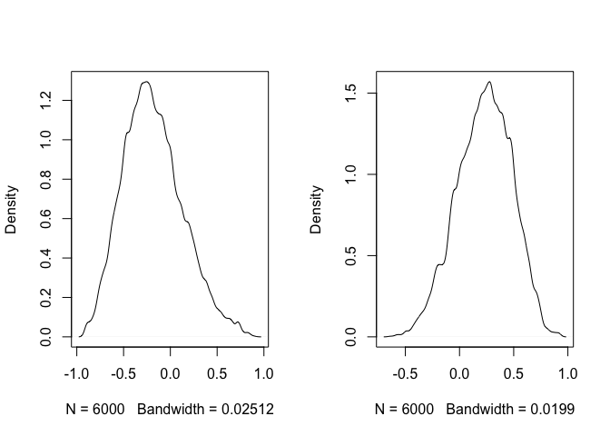
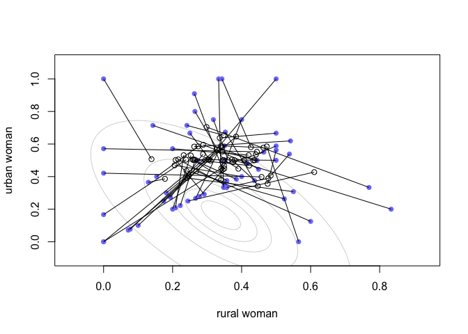

# Chapter_13
Xiaoyan Yue  
1/24/2017  


##13E1 Add to the following model varying slopes on the predictor
Yi ~ Normal(mu,sigma)  
mu = a_cafe[cafe_id] + b_cafe*Xi  
a_cafe[cafe_id] ~ Normal(a,sigma_a)  
a ~ Normal(0,10)  
b_cafe ~ Normal(0,1)  
sigma ~ HalfCauchy(0,2)  
sigma_a ~ HalfCauchy(0,2)

###Adding varying slops
Yi ~ Normal(mu,sigma)  
mu = a_cafe[cafe_id] + b_cafe[cafe_id]*Xi  
c(a_cafe,b_cafe)[cafe_id] ~ MVNormal(c(a,b),S)  
S=matrix(sigma_a,0,0,sigma_b) R matrix(sigma_a,0,0,sigma_b)  
a ~ Normal(0,10)  
b ~ Normal(0,1)  
sigma ~ HalfCauchy(0,2)  
sigma_a ~ HalfCauchy(0,2)  
sigma_b ~ HalfCauchy(0,2)  
R ~ LKJcorr(2)
##13E2 Think up a context in which varying intercepts will be positively correlated with varying slopes. Provide a mechnistic explaination for correlation.

##13M1 Repeat the cafe robot simulation from the beginning of the chapter. This time, set rho to zero, so that there is no correlation between intercepts and slops. How does the posterior distribution of the correlation reflect in the underlying simulation?

###repeat the simulation in the chapter

```r
a <- 3.5            ## average morning wait time
b <- (-1)           ## average difference afternoon wait time
sigma_a <- 1        ## std dev in intercepts
sigma_b <- 0.5      ## std dev in slopes
rho <- (-0.7)       ## correlation between intercepts and slopes

##simulate a sample of cafe for the robot, to build a 2D multivate Gaussian distribution
Mu <- c( a , b )# create a vector of two means

cov_ab <- sigma_a*sigma_b*rho#build the entire covariance matrix
Sigma <- matrix( c(sigma_a^2,cov_ab,cov_ab,sigma_b^2) , ncol=2 )

## simulate some cafes
N_cafes <- 20

## simulate their properties by sampling randomly from the multivariate Gaussian distribution
library(MASS)
set.seed(5) # used to replicate example
vary_effects <- mvrnorm( N_cafes , Mu , Sigma )
a_cafe <- vary_effects[,1]
b_cafe <- vary_effects[,2]
#simulate the observations
N_visits <- 10
afternoon <- rep(0:1,N_visits*N_cafes/2)
cafe_id <- rep( 1:N_cafes , each=N_visits )
mu <- a_cafe[cafe_id] + b_cafe[cafe_id]*afternoon
sigma <- 0.5  # std dev within cafes
wait <- rnorm( N_visits*N_cafes , mu , sigma )
d <- data.frame( cafe=cafe_id , afternoon=afternoon , wait=wait )

## fit the model for the observation data, d
m13.1 <- map2stan(
  alist(
    wait ~ dnorm( mu , sigma ),
    mu <- a_cafe[cafe] + b_cafe[cafe]*afternoon,
    c(a_cafe,b_cafe)[cafe] ~ dmvnorm2(c(a,b),sigma_cafe,Rho),
    a ~ dnorm(0,10),
    b ~ dnorm(0,10),
    sigma_cafe ~ dcauchy(0,2),
    sigma ~ dcauchy(0,2),
    Rho ~ dlkjcorr(2)
  ) ,
  data=d ,
  iter=5000 , warmup=2000 , chains=2 )
```

```
## In file included from file833166ef53d.cpp:8:
## In file included from /Library/Frameworks/R.framework/Versions/3.3/Resources/library/StanHeaders/include/src/stan/model/model_header.hpp:4:
## In file included from /Library/Frameworks/R.framework/Versions/3.3/Resources/library/StanHeaders/include/stan/math.hpp:4:
## In file included from /Library/Frameworks/R.framework/Versions/3.3/Resources/library/StanHeaders/include/stan/math/rev/mat.hpp:4:
## In file included from /Library/Frameworks/R.framework/Versions/3.3/Resources/library/StanHeaders/include/stan/math/rev/core.hpp:12:
## In file included from /Library/Frameworks/R.framework/Versions/3.3/Resources/library/StanHeaders/include/stan/math/rev/core/gevv_vvv_vari.hpp:5:
## In file included from /Library/Frameworks/R.framework/Versions/3.3/Resources/library/StanHeaders/include/stan/math/rev/core/var.hpp:7:
## In file included from /Library/Frameworks/R.framework/Versions/3.3/Resources/library/BH/include/boost/math/tools/config.hpp:13:
## In file included from /Library/Frameworks/R.framework/Versions/3.3/Resources/library/BH/include/boost/config.hpp:39:
## /Library/Frameworks/R.framework/Versions/3.3/Resources/library/BH/include/boost/config/compiler/clang.hpp:196:11: warning: 'BOOST_NO_CXX11_RVALUE_REFERENCES' macro redefined [-Wmacro-redefined]
## #  define BOOST_NO_CXX11_RVALUE_REFERENCES
##           ^
## <command line>:6:9: note: previous definition is here
## #define BOOST_NO_CXX11_RVALUE_REFERENCES 1
##         ^
## 1 warning generated.
## 
## SAMPLING FOR MODEL 'wait ~ dnorm(mu, sigma)' NOW (CHAIN 1).
## 
## Chain 1, Iteration:    1 / 5000 [  0%]  (Warmup)
## Chain 1, Iteration:  500 / 5000 [ 10%]  (Warmup)
## Chain 1, Iteration: 1000 / 5000 [ 20%]  (Warmup)
## Chain 1, Iteration: 1500 / 5000 [ 30%]  (Warmup)
## Chain 1, Iteration: 2000 / 5000 [ 40%]  (Warmup)
## Chain 1, Iteration: 2001 / 5000 [ 40%]  (Sampling)
## Chain 1, Iteration: 2500 / 5000 [ 50%]  (Sampling)
## Chain 1, Iteration: 3000 / 5000 [ 60%]  (Sampling)
## Chain 1, Iteration: 3500 / 5000 [ 70%]  (Sampling)
## Chain 1, Iteration: 4000 / 5000 [ 80%]  (Sampling)
## Chain 1, Iteration: 4500 / 5000 [ 90%]  (Sampling)
## Chain 1, Iteration: 5000 / 5000 [100%]  (Sampling)
##  Elapsed Time: 2.11756 seconds (Warm-up)
##                2.21007 seconds (Sampling)
##                4.32763 seconds (Total)
## 
## 
## SAMPLING FOR MODEL 'wait ~ dnorm(mu, sigma)' NOW (CHAIN 2).
## 
## Chain 2, Iteration:    1 / 5000 [  0%]  (Warmup)
## Chain 2, Iteration:  500 / 5000 [ 10%]  (Warmup)
## Chain 2, Iteration: 1000 / 5000 [ 20%]  (Warmup)
## Chain 2, Iteration: 1500 / 5000 [ 30%]  (Warmup)
## Chain 2, Iteration: 2000 / 5000 [ 40%]  (Warmup)
## Chain 2, Iteration: 2001 / 5000 [ 40%]  (Sampling)
## Chain 2, Iteration: 2500 / 5000 [ 50%]  (Sampling)
## Chain 2, Iteration: 3000 / 5000 [ 60%]  (Sampling)
## Chain 2, Iteration: 3500 / 5000 [ 70%]  (Sampling)
## Chain 2, Iteration: 4000 / 5000 [ 80%]  (Sampling)
## Chain 2, Iteration: 4500 / 5000 [ 90%]  (Sampling)
## Chain 2, Iteration: 5000 / 5000 [100%]  (Sampling)
##  Elapsed Time: 1.76208 seconds (Warm-up)
##                2.55439 seconds (Sampling)
##                4.31646 seconds (Total)
```

```
## Warning: There were 37 divergent transitions after warmup. Increasing adapt_delta above 0.8 may help. See
## http://mc-stan.org/misc/warnings.html#divergent-transitions-after-warmup
```

```
## Warning: Examine the pairs() plot to diagnose sampling problems
```

```
## 
## SAMPLING FOR MODEL 'wait ~ dnorm(mu, sigma)' NOW (CHAIN 1).
## WARNING: No variance estimation is
##          performed for num_warmup < 20
## 
## 
## Chain 1, Iteration: 1 / 1 [100%]  (Sampling)
##  Elapsed Time: 4e-06 seconds (Warm-up)
##                0.000136 seconds (Sampling)
##                0.00014 seconds (Total)
```

```
## Computing WAIC
```

```
## Constructing posterior predictions
```

```
## [ 600 / 6000 ]
[ 1200 / 6000 ]
[ 1800 / 6000 ]
[ 2400 / 6000 ]
[ 3000 / 6000 ]
[ 3600 / 6000 ]
[ 4200 / 6000 ]
[ 4800 / 6000 ]
[ 5400 / 6000 ]
[ 6000 / 6000 ]
```

```
## Warning in map2stan(alist(wait ~ dnorm(mu, sigma), mu <- a_cafe[cafe] + : There were 37 divergent iterations during sampling.
## Check the chains (trace plots, n_eff, Rhat) carefully to ensure they are valid.
```

###simulate the data by setting rho to zero

```r
rho <- 0

cov_abM1 <- sigma_a*sigma_b*rho
SigmaM1 <- matrix( c(sigma_a^2,cov_abM1,cov_abM1,sigma_b^2) , ncol=2 )

vary_effectsM1 <- mvrnorm( N_cafes , Mu , SigmaM1 )
a_cafeM1 <- vary_effectsM1[,1]
b_cafeM1 <- vary_effectsM1[,2]

#simulate d2
N_visits <- 10
afternoon <- rep(0:1,N_visits*N_cafes/2)
cafe_id <- rep( 1:N_cafes , each=N_visits )
mu_M1 <- a_cafeM1[cafe_id] + b_cafeM1[cafe_id]*afternoon
sigma <- 0.5  
wait_M1 <- rnorm( N_visits*N_cafes , mu_M1 , sigma )
d2 <- data.frame( cafe=cafe_id , afternoon=afternoon , wait=wait_M1 )

## fit the model for the observation data, d2
m13.1.M1 <- map2stan(
  alist(
    wait_M1 ~ dnorm( mu , sigma ),
    mu <- a_cafe[cafe] + b_cafe[cafe]*afternoon,
    c(a_cafe,b_cafe)[cafe] ~ dmvnorm2(c(a,b),sigma_cafe,Rho),
    a ~ dnorm(0,10),
    b ~ dnorm(0,10),
    sigma_cafe ~ dcauchy(0,2),
    sigma ~ dcauchy(0,2),
    Rho ~ dlkjcorr(2)
  ) ,
  data=d2 ,
  iter=5000 , warmup=2000 , chains=2 )
```

```
## In file included from file83332e5ee55.cpp:8:
## In file included from /Library/Frameworks/R.framework/Versions/3.3/Resources/library/StanHeaders/include/src/stan/model/model_header.hpp:4:
## In file included from /Library/Frameworks/R.framework/Versions/3.3/Resources/library/StanHeaders/include/stan/math.hpp:4:
## In file included from /Library/Frameworks/R.framework/Versions/3.3/Resources/library/StanHeaders/include/stan/math/rev/mat.hpp:4:
## In file included from /Library/Frameworks/R.framework/Versions/3.3/Resources/library/StanHeaders/include/stan/math/rev/core.hpp:12:
## In file included from /Library/Frameworks/R.framework/Versions/3.3/Resources/library/StanHeaders/include/stan/math/rev/core/gevv_vvv_vari.hpp:5:
## In file included from /Library/Frameworks/R.framework/Versions/3.3/Resources/library/StanHeaders/include/stan/math/rev/core/var.hpp:7:
## In file included from /Library/Frameworks/R.framework/Versions/3.3/Resources/library/BH/include/boost/math/tools/config.hpp:13:
## In file included from /Library/Frameworks/R.framework/Versions/3.3/Resources/library/BH/include/boost/config.hpp:39:
## /Library/Frameworks/R.framework/Versions/3.3/Resources/library/BH/include/boost/config/compiler/clang.hpp:196:11: warning: 'BOOST_NO_CXX11_RVALUE_REFERENCES' macro redefined [-Wmacro-redefined]
## #  define BOOST_NO_CXX11_RVALUE_REFERENCES
##           ^
## <command line>:6:9: note: previous definition is here
## #define BOOST_NO_CXX11_RVALUE_REFERENCES 1
##         ^
## 1 warning generated.
## 
## SAMPLING FOR MODEL 'wait_M1 ~ dnorm(mu, sigma)' NOW (CHAIN 1).
## 
## Chain 1, Iteration:    1 / 5000 [  0%]  (Warmup)
## Chain 1, Iteration:  500 / 5000 [ 10%]  (Warmup)
## Chain 1, Iteration: 1000 / 5000 [ 20%]  (Warmup)
## Chain 1, Iteration: 1500 / 5000 [ 30%]  (Warmup)
## Chain 1, Iteration: 2000 / 5000 [ 40%]  (Warmup)
## Chain 1, Iteration: 2001 / 5000 [ 40%]  (Sampling)
## Chain 1, Iteration: 2500 / 5000 [ 50%]  (Sampling)
## Chain 1, Iteration: 3000 / 5000 [ 60%]  (Sampling)
## Chain 1, Iteration: 3500 / 5000 [ 70%]  (Sampling)
## Chain 1, Iteration: 4000 / 5000 [ 80%]  (Sampling)
## Chain 1, Iteration: 4500 / 5000 [ 90%]  (Sampling)
## Chain 1, Iteration: 5000 / 5000 [100%]  (Sampling)
##  Elapsed Time: 45.2713 seconds (Warm-up)
##                67.6257 seconds (Sampling)
##                112.897 seconds (Total)
```

```
## The following numerical problems occured the indicated number of times on chain 1
```

```
##                                                                        count
## Exception thrown at line 33: lkj_corr_log: y is not positive definite.     1
```

```
## When a numerical problem occurs, the Hamiltonian proposal gets rejected.
```

```
## See http://mc-stan.org/misc/warnings.html#exception-hamiltonian-proposal-rejected
```

```
## If the number in the 'count' column is small, do not ask about this message on stan-users.
```

```
## 
## SAMPLING FOR MODEL 'wait_M1 ~ dnorm(mu, sigma)' NOW (CHAIN 2).
## 
## Chain 2, Iteration:    1 / 5000 [  0%]  (Warmup)
## Chain 2, Iteration:  500 / 5000 [ 10%]  (Warmup)
## Chain 2, Iteration: 1000 / 5000 [ 20%]  (Warmup)
## Chain 2, Iteration: 1500 / 5000 [ 30%]  (Warmup)
## Chain 2, Iteration: 2000 / 5000 [ 40%]  (Warmup)
## Chain 2, Iteration: 2001 / 5000 [ 40%]  (Sampling)
## Chain 2, Iteration: 2500 / 5000 [ 50%]  (Sampling)
## Chain 2, Iteration: 3000 / 5000 [ 60%]  (Sampling)
## Chain 2, Iteration: 3500 / 5000 [ 70%]  (Sampling)
## Chain 2, Iteration: 4000 / 5000 [ 80%]  (Sampling)
## Chain 2, Iteration: 4500 / 5000 [ 90%]  (Sampling)
## Chain 2, Iteration: 5000 / 5000 [100%]  (Sampling)
##  Elapsed Time: 46.1279 seconds (Warm-up)
##                62.8089 seconds (Sampling)
##                108.937 seconds (Total)
```

```
## The following numerical problems occured the indicated number of times on chain 2
```

```
##                                                                        count
## Exception thrown at line 33: lkj_corr_log: y is not positive definite.     1
```

```
## When a numerical problem occurs, the Hamiltonian proposal gets rejected.
```

```
## See http://mc-stan.org/misc/warnings.html#exception-hamiltonian-proposal-rejected
```

```
## If the number in the 'count' column is small, do not ask about this message on stan-users.
```

```
## 
## SAMPLING FOR MODEL 'wait_M1 ~ dnorm(mu, sigma)' NOW (CHAIN 1).
## WARNING: No variance estimation is
##          performed for num_warmup < 20
## 
## 
## Chain 1, Iteration: 1 / 1 [100%]  (Sampling)
##  Elapsed Time: 1e-06 seconds (Warm-up)
##                0.000142 seconds (Sampling)
##                0.000143 seconds (Total)
```

```
## The following numerical problems occured the indicated number of times on chain 1
```

```
##                                                                        count
## Exception thrown at line 33: lkj_corr_log: y is not positive definite.     2
```

```
## When a numerical problem occurs, the Hamiltonian proposal gets rejected.
```

```
## See http://mc-stan.org/misc/warnings.html#exception-hamiltonian-proposal-rejected
```

```
## If the number in the 'count' column is small, do not ask about this message on stan-users.
```

```
## Computing WAIC
```

```
## Constructing posterior predictions
```

## look at the posterior distribution of the correlation

```r
par(mfrow=c(1,2))
post1 <- extract.samples(m13.1)
dens( post1$Rho[,1,2] )
post2 <- extract.samples(m13.1.M1)
dens( post2$Rho[,1,2] )
```

<!-- -->

##13M2 Fit the mutilevel model to the simulated cafe data

```r
m13.1.M2 <- map2stan(
  alist(
    wait ~ dnorm( mu , sigma ),
    mu <- a_cafe[cafe] + b_cafe[cafe]*afternoon,
    a_cafe[cafe] ~ dnorm(a,sigma_a),
    b_cafe[cafe] ~ dnorm(b,sigma_b),
    a ~ dnorm(0,10),
    b ~ dnorm(0,10),
    sigma_a ~ dcauchy(0,1),
    sigma_b ~ dcauchy(0,1),
    sigma ~ dcauchy(0,1)
  ) ,
  data=d ,
  iter=5000 , warmup=2000 , chains=2 )
```

```
## In file included from file833781a04cc.cpp:8:
## In file included from /Library/Frameworks/R.framework/Versions/3.3/Resources/library/StanHeaders/include/src/stan/model/model_header.hpp:4:
## In file included from /Library/Frameworks/R.framework/Versions/3.3/Resources/library/StanHeaders/include/stan/math.hpp:4:
## In file included from /Library/Frameworks/R.framework/Versions/3.3/Resources/library/StanHeaders/include/stan/math/rev/mat.hpp:4:
## In file included from /Library/Frameworks/R.framework/Versions/3.3/Resources/library/StanHeaders/include/stan/math/rev/core.hpp:12:
## In file included from /Library/Frameworks/R.framework/Versions/3.3/Resources/library/StanHeaders/include/stan/math/rev/core/gevv_vvv_vari.hpp:5:
## In file included from /Library/Frameworks/R.framework/Versions/3.3/Resources/library/StanHeaders/include/stan/math/rev/core/var.hpp:7:
## In file included from /Library/Frameworks/R.framework/Versions/3.3/Resources/library/BH/include/boost/math/tools/config.hpp:13:
## In file included from /Library/Frameworks/R.framework/Versions/3.3/Resources/library/BH/include/boost/config.hpp:39:
## /Library/Frameworks/R.framework/Versions/3.3/Resources/library/BH/include/boost/config/compiler/clang.hpp:196:11: warning: 'BOOST_NO_CXX11_RVALUE_REFERENCES' macro redefined [-Wmacro-redefined]
## #  define BOOST_NO_CXX11_RVALUE_REFERENCES
##           ^
## <command line>:6:9: note: previous definition is here
## #define BOOST_NO_CXX11_RVALUE_REFERENCES 1
##         ^
## 1 warning generated.
## 
## SAMPLING FOR MODEL 'wait ~ dnorm(mu, sigma)' NOW (CHAIN 1).
## 
## Chain 1, Iteration:    1 / 5000 [  0%]  (Warmup)
## Chain 1, Iteration:  500 / 5000 [ 10%]  (Warmup)
## Chain 1, Iteration: 1000 / 5000 [ 20%]  (Warmup)
## Chain 1, Iteration: 1500 / 5000 [ 30%]  (Warmup)
## Chain 1, Iteration: 2000 / 5000 [ 40%]  (Warmup)
## Chain 1, Iteration: 2001 / 5000 [ 40%]  (Sampling)
## Chain 1, Iteration: 2500 / 5000 [ 50%]  (Sampling)
## Chain 1, Iteration: 3000 / 5000 [ 60%]  (Sampling)
## Chain 1, Iteration: 3500 / 5000 [ 70%]  (Sampling)
## Chain 1, Iteration: 4000 / 5000 [ 80%]  (Sampling)
## Chain 1, Iteration: 4500 / 5000 [ 90%]  (Sampling)
## Chain 1, Iteration: 5000 / 5000 [100%]  (Sampling)
##  Elapsed Time: 0.71519 seconds (Warm-up)
##                1.20536 seconds (Sampling)
##                1.92055 seconds (Total)
## 
## 
## SAMPLING FOR MODEL 'wait ~ dnorm(mu, sigma)' NOW (CHAIN 2).
## 
## Chain 2, Iteration:    1 / 5000 [  0%]  (Warmup)
## Chain 2, Iteration:  500 / 5000 [ 10%]  (Warmup)
## Chain 2, Iteration: 1000 / 5000 [ 20%]  (Warmup)
## Chain 2, Iteration: 1500 / 5000 [ 30%]  (Warmup)
## Chain 2, Iteration: 2000 / 5000 [ 40%]  (Warmup)
## Chain 2, Iteration: 2001 / 5000 [ 40%]  (Sampling)
## Chain 2, Iteration: 2500 / 5000 [ 50%]  (Sampling)
## Chain 2, Iteration: 3000 / 5000 [ 60%]  (Sampling)
## Chain 2, Iteration: 3500 / 5000 [ 70%]  (Sampling)
## Chain 2, Iteration: 4000 / 5000 [ 80%]  (Sampling)
## Chain 2, Iteration: 4500 / 5000 [ 90%]  (Sampling)
## Chain 2, Iteration: 5000 / 5000 [100%]  (Sampling)
##  Elapsed Time: 0.489319 seconds (Warm-up)
##                0.668534 seconds (Sampling)
##                1.15785 seconds (Total)
```

```
## The following numerical problems occured the indicated number of times on chain 2
```

```
##                                                                                 count
## Exception thrown at line 24: normal_log: Scale parameter is 0, but must be > 0!     1
```

```
## When a numerical problem occurs, the Hamiltonian proposal gets rejected.
```

```
## See http://mc-stan.org/misc/warnings.html#exception-hamiltonian-proposal-rejected
```

```
## If the number in the 'count' column is small, do not ask about this message on stan-users.
```

```
## Warning: There were 132 divergent transitions after warmup. Increasing adapt_delta above 0.8 may help. See
## http://mc-stan.org/misc/warnings.html#divergent-transitions-after-warmup
```

```
## Warning: Examine the pairs() plot to diagnose sampling problems
```

```
## 
## SAMPLING FOR MODEL 'wait ~ dnorm(mu, sigma)' NOW (CHAIN 1).
## WARNING: No variance estimation is
##          performed for num_warmup < 20
## 
## 
## Chain 1, Iteration: 1 / 1 [100%]  (Sampling)
##  Elapsed Time: 3e-06 seconds (Warm-up)
##                5.9e-05 seconds (Sampling)
##                6.2e-05 seconds (Total)
```

```
## Computing WAIC
```

```
## Constructing posterior predictions
```

```
## [ 600 / 6000 ]
[ 1200 / 6000 ]
[ 1800 / 6000 ]
[ 2400 / 6000 ]
[ 3000 / 6000 ]
[ 3600 / 6000 ]
[ 4200 / 6000 ]
[ 4800 / 6000 ]
[ 5400 / 6000 ]
[ 6000 / 6000 ]
```

```
## Warning in map2stan(alist(wait ~ dnorm(mu, sigma), mu <- a_cafe[cafe] + : There were 132 divergent iterations during sampling.
## Check the chains (trace plots, n_eff, Rhat) carefully to ensure they are valid.
```

#compare this model to the model from the chapter

```r
#WAIC(m13.1, m13.1.M2) 
#Error in UseMethod("WAIC") : no applicable method for 'WAIC' applied to an object of class "map2stan"
compare(m13.1, m13.1.M2) #looks almost the same
```

```
##           WAIC pWAIC dWAIC weight   SE  dSE
## m13.1.M2 309.4  26.7     0    0.5 20.0   NA
## m13.1    309.4  27.0     0    0.5 20.1 0.77
```

##13M3 Using a non-centered parameterization, to re-estimate the varing slops model for UCBadmit data
###repeat the varing slops model in the chapter

```r
data(UCBadmit)
d <- UCBadmit
d$male <- ifelse( d$applicant.gender=="male" , 1 , 0 )
d$dept_id <- coerce_index( d$dept )

m13.3 <- map2stan(
  alist(
    admit ~ dbinom( applications , p ),
    logit(p) <- a_dept[dept_id] +
      bm_dept[dept_id]*male,
    c(a_dept,bm_dept)[dept_id] ~ dmvnorm2( c(a,bm) , sigma_dept , Rho ),
    a ~ dnorm(0,10),
    bm ~ dnorm(0,1),
    sigma_dept ~ dcauchy(0,2),
    Rho ~ dlkjcorr(2)
  ) ,
  data=d , warmup=1000 , iter=5000 , chains=4 , cores=3 )
```

```
## Warning: Variable 'applicant.gender' contains dots '.'.
## Will attempt to remove dots internally.
```

```
## In file included from file8333800518e.cpp:8:
## In file included from /Library/Frameworks/R.framework/Versions/3.3/Resources/library/StanHeaders/include/src/stan/model/model_header.hpp:4:
## In file included from /Library/Frameworks/R.framework/Versions/3.3/Resources/library/StanHeaders/include/stan/math.hpp:4:
## In file included from /Library/Frameworks/R.framework/Versions/3.3/Resources/library/StanHeaders/include/stan/math/rev/mat.hpp:4:
## In file included from /Library/Frameworks/R.framework/Versions/3.3/Resources/library/StanHeaders/include/stan/math/rev/core.hpp:12:
## In file included from /Library/Frameworks/R.framework/Versions/3.3/Resources/library/StanHeaders/include/stan/math/rev/core/gevv_vvv_vari.hpp:5:
## In file included from /Library/Frameworks/R.framework/Versions/3.3/Resources/library/StanHeaders/include/stan/math/rev/core/var.hpp:7:
## In file included from /Library/Frameworks/R.framework/Versions/3.3/Resources/library/BH/include/boost/math/tools/config.hpp:13:
## In file included from /Library/Frameworks/R.framework/Versions/3.3/Resources/library/BH/include/boost/config.hpp:39:
## /Library/Frameworks/R.framework/Versions/3.3/Resources/library/BH/include/boost/config/compiler/clang.hpp:196:11: warning: 'BOOST_NO_CXX11_RVALUE_REFERENCES' macro redefined [-Wmacro-redefined]
## #  define BOOST_NO_CXX11_RVALUE_REFERENCES
##           ^
## <command line>:6:9: note: previous definition is here
## #define BOOST_NO_CXX11_RVALUE_REFERENCES 1
##         ^
## 1 warning generated.
```

```
## Warning: There were 65 divergent transitions after warmup. Increasing adapt_delta above 0.8 may help. See
## http://mc-stan.org/misc/warnings.html#divergent-transitions-after-warmup
```

```
## Warning: Examine the pairs() plot to diagnose sampling problems
```

```
## 
## SAMPLING FOR MODEL 'admit ~ dbinom(applications, p)' NOW (CHAIN 1).
## WARNING: No variance estimation is
##          performed for num_warmup < 20
## 
## 
## Chain 1, Iteration: 1 / 1 [100%]  (Sampling)
##  Elapsed Time: 3e-06 seconds (Warm-up)
##                0.000227 seconds (Sampling)
##                0.00023 seconds (Total)
```

```
## Computing WAIC
```

```
## Constructing posterior predictions
```

```
## [ 1600 / 16000 ]
[ 3200 / 16000 ]
[ 4800 / 16000 ]
[ 6400 / 16000 ]
[ 8000 / 16000 ]
[ 9600 / 16000 ]
[ 11200 / 16000 ]
[ 12800 / 16000 ]
[ 14400 / 16000 ]
[ 16000 / 16000 ]
```

```
## Aggregated binomial counts detected. Splitting to 0/1 outcome for WAIC calculation.
```

```
## Warning in map2stan(alist(admit ~ dbinom(applications, p), logit(p) <- a_dept[dept_id] + : There were 65 divergent iterations during sampling.
## Check the chains (trace plots, n_eff, Rhat) carefully to ensure they are valid.
```
##non-centered parameterization

```r
m13.3.M3 <- map2stan(
  alist(
    admit ~ dbinom( applications , p ),
    logit(p) <- a_dept[dept_id] +
      bm_dept[dept_id]*male,
    c(a_dept,bm_dept)[dept_id] ~ dmvnormNC( sigma_dept , Rho ),
    a ~ dnorm(0,10),
    bm ~ dnorm(0,1),
    sigma_dept ~ dcauchy(0,2),
    Rho ~ dlkjcorr(2)
  ) ,
  data=d , warmup=1000 , iter=5000 , chains=4 , cores=3 )
```

```
## Warning: Variable 'applicant.gender' contains dots '.'.
## Will attempt to remove dots internally.
```

```
## In file included from file8331c79d7d8.cpp:8:
## In file included from /Library/Frameworks/R.framework/Versions/3.3/Resources/library/StanHeaders/include/src/stan/model/model_header.hpp:4:
## In file included from /Library/Frameworks/R.framework/Versions/3.3/Resources/library/StanHeaders/include/stan/math.hpp:4:
## In file included from /Library/Frameworks/R.framework/Versions/3.3/Resources/library/StanHeaders/include/stan/math/rev/mat.hpp:4:
## In file included from /Library/Frameworks/R.framework/Versions/3.3/Resources/library/StanHeaders/include/stan/math/rev/core.hpp:12:
## In file included from /Library/Frameworks/R.framework/Versions/3.3/Resources/library/StanHeaders/include/stan/math/rev/core/gevv_vvv_vari.hpp:5:
## In file included from /Library/Frameworks/R.framework/Versions/3.3/Resources/library/StanHeaders/include/stan/math/rev/core/var.hpp:7:
## In file included from /Library/Frameworks/R.framework/Versions/3.3/Resources/library/BH/include/boost/math/tools/config.hpp:13:
## In file included from /Library/Frameworks/R.framework/Versions/3.3/Resources/library/BH/include/boost/config.hpp:39:
## /Library/Frameworks/R.framework/Versions/3.3/Resources/library/BH/include/boost/config/compiler/clang.hpp:196:11: warning: 'BOOST_NO_CXX11_RVALUE_REFERENCES' macro redefined [-Wmacro-redefined]
## #  define BOOST_NO_CXX11_RVALUE_REFERENCES
##           ^
## <command line>:6:9: note: previous definition is here
## #define BOOST_NO_CXX11_RVALUE_REFERENCES 1
##         ^
## 1 warning generated.
```

```
## Warning: There were 1 divergent transitions after warmup. Increasing adapt_delta above 0.8 may help. See
## http://mc-stan.org/misc/warnings.html#divergent-transitions-after-warmup
```

```
## Warning: Examine the pairs() plot to diagnose sampling problems
```

```
## 
## SAMPLING FOR MODEL 'admit ~ dbinom(applications, p)' NOW (CHAIN 1).
## WARNING: No variance estimation is
##          performed for num_warmup < 20
## 
## 
## Chain 1, Iteration: 1 / 1 [100%]  (Sampling)
##  Elapsed Time: 5e-06 seconds (Warm-up)
##                5.9e-05 seconds (Sampling)
##                6.4e-05 seconds (Total)
```

```
## Computing WAIC
```

```
## Constructing posterior predictions
```

```
## [ 1600 / 16000 ]
[ 3200 / 16000 ]
[ 4800 / 16000 ]
[ 6400 / 16000 ]
[ 8000 / 16000 ]
[ 9600 / 16000 ]
[ 11200 / 16000 ]
[ 12800 / 16000 ]
[ 14400 / 16000 ]
[ 16000 / 16000 ]
```

```
## Aggregated binomial counts detected. Splitting to 0/1 outcome for WAIC calculation.
```

```
## Warning in map2stan(alist(admit ~ dbinom(applications, p), logit(p) <- a_dept[dept_id] + : There were 1 divergent iterations during sampling.
## Check the chains (trace plots, n_eff, Rhat) carefully to ensure they are valid.
```

##13H1 Revisit the Bangladesh fertility data

```r
#load the data
data("bangladesh")
summary(bangladesh)
```

```
##      woman           district     use.contraception living.children
##  Min.   :   1.0   Min.   : 1.00   Min.   :0.0000    Min.   :1.000  
##  1st Qu.: 484.2   1st Qu.:14.00   1st Qu.:0.0000    1st Qu.:1.000  
##  Median : 967.5   Median :29.00   Median :0.0000    Median :3.000  
##  Mean   : 967.5   Mean   :29.35   Mean   :0.3925    Mean   :2.652  
##  3rd Qu.:1450.8   3rd Qu.:45.00   3rd Qu.:1.0000    3rd Qu.:4.000  
##  Max.   :1934.0   Max.   :61.00   Max.   :1.0000    Max.   :4.000  
##   age.centered            urban       
##  Min.   :-13.560000   Min.   :0.0000  
##  1st Qu.: -7.559900   1st Qu.:0.0000  
##  Median : -1.559900   Median :0.0000  
##  Mean   :  0.002198   Mean   :0.2906  
##  3rd Qu.:  6.440000   3rd Qu.:1.0000  
##  Max.   : 19.440000   Max.   :1.0000
```

```r
bangladesh$district_id <- coerce_index( bangladesh$district )
names(bangladesh) <- sub(".","_",fixed = TRUE,names(bangladesh))

###fit the model with varying slops
m13H1 <- map2stan(
  alist(
    use_contraception ~ dnorm( mu , sigma ),
    mu <- a_district[district_id] + b_district[district_id]*urban,
    c(a_district,b_district)[district_id] ~ dmvnorm2(c(a,b),sigma_district,Rho),
    a ~ dnorm(0,10),
    b ~ dnorm(0,10),
    sigma_district ~ dcauchy(0,2),
    sigma ~ dcauchy(0,2),
    Rho ~ dlkjcorr(2)
  ) ,
  data=bangladesh ,
  iter=5000 , warmup=2000 , chains=2 )
```

```
## In file included from file8334eaecdd2.cpp:8:
## In file included from /Library/Frameworks/R.framework/Versions/3.3/Resources/library/StanHeaders/include/src/stan/model/model_header.hpp:4:
## In file included from /Library/Frameworks/R.framework/Versions/3.3/Resources/library/StanHeaders/include/stan/math.hpp:4:
## In file included from /Library/Frameworks/R.framework/Versions/3.3/Resources/library/StanHeaders/include/stan/math/rev/mat.hpp:4:
## In file included from /Library/Frameworks/R.framework/Versions/3.3/Resources/library/StanHeaders/include/stan/math/rev/core.hpp:12:
## In file included from /Library/Frameworks/R.framework/Versions/3.3/Resources/library/StanHeaders/include/stan/math/rev/core/gevv_vvv_vari.hpp:5:
## In file included from /Library/Frameworks/R.framework/Versions/3.3/Resources/library/StanHeaders/include/stan/math/rev/core/var.hpp:7:
## In file included from /Library/Frameworks/R.framework/Versions/3.3/Resources/library/BH/include/boost/math/tools/config.hpp:13:
## In file included from /Library/Frameworks/R.framework/Versions/3.3/Resources/library/BH/include/boost/config.hpp:39:
## /Library/Frameworks/R.framework/Versions/3.3/Resources/library/BH/include/boost/config/compiler/clang.hpp:196:11: warning: 'BOOST_NO_CXX11_RVALUE_REFERENCES' macro redefined [-Wmacro-redefined]
## #  define BOOST_NO_CXX11_RVALUE_REFERENCES
##           ^
## <command line>:6:9: note: previous definition is here
## #define BOOST_NO_CXX11_RVALUE_REFERENCES 1
##         ^
## 1 warning generated.
## 
## SAMPLING FOR MODEL 'use_contraception ~ dnorm(mu, sigma)' NOW (CHAIN 1).
## 
## Chain 1, Iteration:    1 / 5000 [  0%]  (Warmup)
## Chain 1, Iteration:  500 / 5000 [ 10%]  (Warmup)
## Chain 1, Iteration: 1000 / 5000 [ 20%]  (Warmup)
## Chain 1, Iteration: 1500 / 5000 [ 30%]  (Warmup)
## Chain 1, Iteration: 2000 / 5000 [ 40%]  (Warmup)
## Chain 1, Iteration: 2001 / 5000 [ 40%]  (Sampling)
## Chain 1, Iteration: 2500 / 5000 [ 50%]  (Sampling)
## Chain 1, Iteration: 3000 / 5000 [ 60%]  (Sampling)
## Chain 1, Iteration: 3500 / 5000 [ 70%]  (Sampling)
## Chain 1, Iteration: 4000 / 5000 [ 80%]  (Sampling)
## Chain 1, Iteration: 4500 / 5000 [ 90%]  (Sampling)
## Chain 1, Iteration: 5000 / 5000 [100%]  (Sampling)
##  Elapsed Time: 9.22777 seconds (Warm-up)
##                12.4427 seconds (Sampling)
##                21.6705 seconds (Total)
```

```
## The following numerical problems occured the indicated number of times on chain 1
```

```
##                                                                        count
## Exception thrown at line 33: lkj_corr_log: y is not positive definite.     3
```

```
## When a numerical problem occurs, the Hamiltonian proposal gets rejected.
```

```
## See http://mc-stan.org/misc/warnings.html#exception-hamiltonian-proposal-rejected
```

```
## If the number in the 'count' column is small, do not ask about this message on stan-users.
```

```
## 
## SAMPLING FOR MODEL 'use_contraception ~ dnorm(mu, sigma)' NOW (CHAIN 2).
## 
## Chain 2, Iteration:    1 / 5000 [  0%]  (Warmup)
## Chain 2, Iteration:  500 / 5000 [ 10%]  (Warmup)
## Chain 2, Iteration: 1000 / 5000 [ 20%]  (Warmup)
## Chain 2, Iteration: 1500 / 5000 [ 30%]  (Warmup)
## Chain 2, Iteration: 2000 / 5000 [ 40%]  (Warmup)
## Chain 2, Iteration: 2001 / 5000 [ 40%]  (Sampling)
## Chain 2, Iteration: 2500 / 5000 [ 50%]  (Sampling)
## Chain 2, Iteration: 3000 / 5000 [ 60%]  (Sampling)
## Chain 2, Iteration: 3500 / 5000 [ 70%]  (Sampling)
## Chain 2, Iteration: 4000 / 5000 [ 80%]  (Sampling)
## Chain 2, Iteration: 4500 / 5000 [ 90%]  (Sampling)
## Chain 2, Iteration: 5000 / 5000 [100%]  (Sampling)
##  Elapsed Time: 8.34994 seconds (Warm-up)
##                14.1825 seconds (Sampling)
##                22.5324 seconds (Total)
```

```
## The following numerical problems occured the indicated number of times on chain 2
```

```
##                                                                        count
## Exception thrown at line 33: lkj_corr_log: y is not positive definite.     3
```

```
## When a numerical problem occurs, the Hamiltonian proposal gets rejected.
```

```
## See http://mc-stan.org/misc/warnings.html#exception-hamiltonian-proposal-rejected
```

```
## If the number in the 'count' column is small, do not ask about this message on stan-users.
```

```
## 
## SAMPLING FOR MODEL 'use_contraception ~ dnorm(mu, sigma)' NOW (CHAIN 1).
## WARNING: No variance estimation is
##          performed for num_warmup < 20
## 
## 
## Chain 1, Iteration: 1 / 1 [100%]  (Sampling)
##  Elapsed Time: 4e-06 seconds (Warm-up)
##                0.000532 seconds (Sampling)
##                0.000536 seconds (Total)
```

```
## Computing WAIC
```

```
## Constructing posterior predictions
```

```
## [ 600 / 6000 ]
[ 1200 / 6000 ]
[ 1800 / 6000 ]
[ 2400 / 6000 ]
[ 3000 / 6000 ]
[ 3600 / 6000 ]
[ 4200 / 6000 ]
[ 4800 / 6000 ]
[ 5400 / 6000 ]
[ 6000 / 6000 ]
```

```r
###Inspect the correlation between the intercept and slopes
post <- extract.samples(m13H1)
dens( post$Rho[,1,2])
```

<!-- -->
###Plot the mean varying effect estimates for both the intercepts and slopes by district

```r
#### compute unpooled estimates directly from data

a1 <- sapply( c(unique(bangladesh$district_id)) ,
              function(i) mean(bangladesh$use_contraception[bangladesh$district_id==i & bangladesh$urban==0]) )
a1[is.nan(a1)] <- 0 #some NaN in data making some errors later

b1 <- sapply( c(unique(bangladesh$district_id)) ,
              function(i) mean(bangladesh$use_contraception[bangladesh$district_id==i & bangladesh$urban==1]) ) - a1
b1[is.nan(b1)] <- 0
#### compute mean of partially pooled estimates
a2 <- apply(post$a_district,2,mean)
b2 <- apply(post$b_district,2,mean)

#### plot both and connect with lines
plot( a1 , b1 , xlab="intercept" , ylab="slope" ,
      pch=16 , col=rangi2 , ylim=c( min(b1)-0.1 , max(b1)+0.1 ) ,
      xlim=c( min(a1)-0.1 , max(a1)+0.1 ) )
points( a2 , b2 , pch=1 )
for ( i in c(unique(bangladesh$district_id)) ) lines( c(a1[i],a2[i]) , c(b1[i],b2[i]) )

#compute posterior mean bivariate Gaussian
Mu_est <- c( mean(post$a) , mean(post$b) )
rho_est <- mean( post$Rho[,1,2] )
sa_est <- mean( post$sigma_district[,1] )
sb_est <- mean( post$sigma_district[,2] )
cov_ab <- sa_est*sb_est*rho_est
Sigma_est <- matrix( c(sa_est^2,cov_ab,cov_ab,sb_est^2) , ncol=2 )

# draw contours
library(ellipse)
for ( l in c(0.1,0.3,0.5,0.8,0.99) )
  lines(ellipse(Sigma_est,centre=Mu_est,level=l),
        col=col.alpha("black",0.2))
```

<!-- -->
###Plot predicted proportion of woman using contraception, with urban woman on one axies and rural on the other

```r
## convert varying effects to the proportion of woman using contraception
use_contraception_rural_1 <- (a1)
use_contraception_urban_1 <- (a1 + b1)

use_contraception_rural_2 <- (a2)
use_contraception_urban_2 <- (a2 + b2)

# plot both and connect with lines
plot( use_contraception_rural_1 , use_contraception_urban_1 , xlab="rural woman" , ylab="urban woman" ,
      pch=16 , col=rangi2 , ylim=c( min(use_contraception_urban_1)-0.1 , max(use_contraception_urban_1)+0.1 ) ,
      xlim=c( min(use_contraception_rural_1)-0.1 , max(use_contraception_rural_1)+0.1 ) )
points( use_contraception_rural_2 , use_contraception_urban_2 , pch=1 )
for ( i in c(unique(bangladesh$district_id)) ) lines( c(use_contraception_rural_1[i],use_contraception_rural_2[i]) , c(use_contraception_urban_1[i],use_contraception_urban_2[i]) )

#compute posterior mean bivariate Gaussian
Mu_est <- c( mean(post$a) , mean(post$b) )
rho_est <- mean( post$Rho[,1,2] )
sa_est <- mean( post$sigma_district[,1] )
sb_est <- mean( post$sigma_district[,2] )
cov_ab <- sa_est*sb_est*rho_est
Sigma_est <- matrix( c(sa_est^2,cov_ab,cov_ab,sb_est^2) , ncol=2 )

#draw contours
library(ellipse)
for ( l in c(0.1,0.3,0.5,0.8,0.99) )
  lines(ellipse(Sigma_est,centre=Mu_est,level=l),
        col=col.alpha("black",0.2))
```

<!-- -->


##Try to fit the varing slopes model for my own data
###Let's look at the whole data

```r
#load the data
RSA_Jan <- read.csv("/Users/xyyue/Documents/Phosphrous_project/Data_Jan6th/results_rsa_all.csv")

#subset the data for primary root length
RSA_Jan_Proot <- RSA_Jan[,c("length","treatment","sample")] #length, which is the primary root length

#look at the data
head(RSA_Jan_Proot)
```

```
##      length treatment sample
## 1  1.698664 P_limited   Penn
## 2  2.117296 P_limited   Penn
## 3 11.513583 P_limited   Penn
## 4 11.638615 P_limited IL11.2
## 5 10.552052 P_limited IL11.2
## 6 12.348566 P_limited IL11.2
```

```r
str(RSA_Jan_Proot)
```

```
## 'data.frame':	346 obs. of  3 variables:
##  $ length   : num  1.7 2.12 11.51 11.64 10.55 ...
##  $ treatment: Factor w/ 2 levels "P_limited","P_sufficient": 1 1 1 1 1 1 1 1 1 1 ...
##  $ sample   : Factor w/ 76 levels "IL1.1","IL1.1.2",..: 76 76 76 14 14 14 3 68 68 70 ...
```

```r
summary(RSA_Jan_Proot)
```

```
##      length              treatment        sample   
##  Min.   : 1.699   P_limited   :177   Penn    : 11  
##  1st Qu.:10.907   P_sufficient:169   IL11.2  :  8  
##  Median :12.792                      IL1.4   :  7  
##  Mean   :12.445                      IL1.1   :  6  
##  3rd Qu.:14.369                      IL1.2   :  6  
##  Max.   :17.495                      IL1.4.18:  6  
##                                      (Other) :302
```

```r
hist(RSA_Jan_Proot$length)
```

<!-- -->
###Plot the raw data (it looks so crowded,how can I split them into several subsets?)

```r
###set the reference
RSA_Jan$sample <- relevel(RSA_Jan$sample,ref = "M82")
RSA_Jan$treatment <- relevel(RSA_Jan$treatment,ref = "P_sufficient")

source("/Users/xyyue/function.R")
p <- ggplot(data=RSA_Jan,aes(x=treatment,y=length,color=treatment)) 
p <- p + geom_jitter()
p <- p + stat_summary(fun.y="mean",geom="bar",alpha=0.5)
p <- p + stat_summary(fun.data="calc.sem",geom="errorbar",position="dodge") 
p <- p + facet_grid(.~sample)
p <- p + labs(title="Primary Root Length")
p
```

```
## Warning: Removed 21 rows containing missing values (geom_errorbar).
```

<!-- -->
  
###fit model by map2stan  
####fit the model with varing slopes

```r
RSA_Jan_Proot$P_limited <- ifelse( RSA_Jan_Proot$treatment=="P_limited" , 1 , 0 )
RSA_Jan_Proot$genotype_id <- coerce_index( RSA_Jan_Proot$sample)

m_rsa_pl.with <- map2stan(
  alist(
    length ~ dnorm( mu , sigma ),
    mu <- a_genotype[genotype_id] + b_genotype[genotype_id]*P_limited,
    c(a_genotype,b_genotype)[genotype_id] ~ dmvnorm2(c(a,b),sigma_genotype,Rho),
    a ~ dnorm(10,20),
    b ~ dnorm(0,10),
    sigma_genotype ~ dcauchy(0,2),
    sigma ~ dcauchy(0,2),
    Rho ~ dlkjcorr(2)
  ) ,
  data=RSA_Jan_Proot , warmup=1000 , iter=5000 , chains=4 , cores=3 )
```

```
## In file included from file833237b353.cpp:8:
## In file included from /Library/Frameworks/R.framework/Versions/3.3/Resources/library/StanHeaders/include/src/stan/model/model_header.hpp:4:
## In file included from /Library/Frameworks/R.framework/Versions/3.3/Resources/library/StanHeaders/include/stan/math.hpp:4:
## In file included from /Library/Frameworks/R.framework/Versions/3.3/Resources/library/StanHeaders/include/stan/math/rev/mat.hpp:4:
## In file included from /Library/Frameworks/R.framework/Versions/3.3/Resources/library/StanHeaders/include/stan/math/rev/core.hpp:12:
## In file included from /Library/Frameworks/R.framework/Versions/3.3/Resources/library/StanHeaders/include/stan/math/rev/core/gevv_vvv_vari.hpp:5:
## In file included from /Library/Frameworks/R.framework/Versions/3.3/Resources/library/StanHeaders/include/stan/math/rev/core/var.hpp:7:
## In file included from /Library/Frameworks/R.framework/Versions/3.3/Resources/library/BH/include/boost/math/tools/config.hpp:13:
## In file included from /Library/Frameworks/R.framework/Versions/3.3/Resources/library/BH/include/boost/config.hpp:39:
## /Library/Frameworks/R.framework/Versions/3.3/Resources/library/BH/include/boost/config/compiler/clang.hpp:196:11: warning: 'BOOST_NO_CXX11_RVALUE_REFERENCES' macro redefined [-Wmacro-redefined]
## #  define BOOST_NO_CXX11_RVALUE_REFERENCES
##           ^
## <command line>:6:9: note: previous definition is here
## #define BOOST_NO_CXX11_RVALUE_REFERENCES 1
##         ^
## 1 warning generated.
```

```
## Warning: There were 53 divergent transitions after warmup. Increasing adapt_delta above 0.8 may help. See
## http://mc-stan.org/misc/warnings.html#divergent-transitions-after-warmup
```

```
## Warning: There were 4 chains where the estimated Bayesian Fraction of Missing Information was low. See
## http://mc-stan.org/misc/warnings.html#bfmi-low
```

```
## Warning: Examine the pairs() plot to diagnose sampling problems
```

```
## 
## SAMPLING FOR MODEL 'length ~ dnorm(mu, sigma)' NOW (CHAIN 1).
## WARNING: No variance estimation is
##          performed for num_warmup < 20
## 
## 
## Chain 1, Iteration: 1 / 1 [100%]  (Sampling)
##  Elapsed Time: 8e-06 seconds (Warm-up)
##                0.000681 seconds (Sampling)
##                0.000689 seconds (Total)
```

```
## Computing WAIC
```

```
## Constructing posterior predictions
```

```
## [ 1600 / 16000 ]
[ 3200 / 16000 ]
[ 4800 / 16000 ]
[ 6400 / 16000 ]
[ 8000 / 16000 ]
[ 9600 / 16000 ]
[ 11200 / 16000 ]
[ 12800 / 16000 ]
[ 14400 / 16000 ]
[ 16000 / 16000 ]
```

```
## Warning in map2stan(alist(length ~ dnorm(mu, sigma), mu <- a_genotype[genotype_id] + : There were 53 divergent iterations during sampling.
## Check the chains (trace plots, n_eff, Rhat) carefully to ensure they are valid.
```

  
###Inspect the correlation between the intercept and slopes

```r
post <- extract.samples(m_rsa_pl.with)
dens( post$Rho[,1,2])
```

<!-- -->
  
###Plot the mean varying effect estimates for both the intercepts and slopes by genotypes

```r
#### compute unpooled estimates directly from data
a1 <- sapply( c(unique(RSA_Jan_Proot$genotype_id)) ,
              function(i) mean(RSA_Jan_Proot$length[RSA_Jan_Proot$genotype_id==i & RSA_Jan_Proot$P_limited==0]) )
a1[is.nan(a1)] <- 0 #some NaN in data making some errors later

b1 <- sapply( c(unique(RSA_Jan_Proot$genotype_id)) ,
              function(i) mean(RSA_Jan_Proot$length[RSA_Jan_Proot$genotype_id==i & RSA_Jan_Proot$P_limited==1]) ) - a1
b1[is.nan(b1)] <- 0
#### compute mean of partially pooled estimates
a2 <- apply(post$a_genotype,2,mean)
b2 <- apply(post$b_genotype,2,mean)

#### plot both and connect with lines
plot( a1 , b1 , xlab="intercept" , ylab="slope" ,
      pch=16 , col=rangi2 , ylim=c( min(b1)-0.1 , max(b1)+0.1 ) ,
      xlim=c( min(a1)-0.1 , max(a1)+0.1 ) )
points( a2 , b2 , pch=1 )
for ( i in c(unique(RSA_Jan_Proot$genotype_id)) ) lines( c(a1[i],a2[i]) , c(b1[i],b2[i]) )

#compute posterior mean bivariate Gaussian
Mu_est <- c( mean(post$a) , mean(post$b) )
rho_est <- mean( post$Rho[,1,2] )
sa_est <- mean( post$sigma_genotype[,1] )
sb_est <- mean( post$sigma_genotype[,2] )
cov_ab <- sa_est*sb_est*rho_est
Sigma_est <- matrix( c(sa_est^2,cov_ab,cov_ab,sb_est^2) , ncol=2 )

# draw contours
library(ellipse)
for ( l in c(0.1,0.3,0.5,0.8,0.99) )
  lines(ellipse(Sigma_est,centre=Mu_est,level=l),
        col=col.alpha("black",0.2))
```

<!-- -->
  
###look into the model

```r
precis(m_rsa_pl.with,depth = 2)
```

```
## Warning in precis(m_rsa_pl.with, depth = 2): There were 53 divergent iterations during sampling.
## Check the chains (trace plots, n_eff, Rhat) carefully to ensure they are valid.
```

```
##                    Mean StdDev lower 0.89 upper 0.89 n_eff Rhat
## b_genotype[1]     -1.83   0.90      -3.31      -0.45 16000 1.00
## b_genotype[2]     -1.77   0.92      -3.21      -0.27 16000 1.00
## b_genotype[3]     -2.40   1.04      -4.11      -0.84 16000 1.00
## b_genotype[4]     -0.90   0.94      -2.36       0.60 16000 1.00
## b_genotype[5]     -2.07   1.02      -3.61      -0.38 16000 1.00
## b_genotype[6]     -1.54   0.88      -2.90      -0.07 16000 1.00
## b_genotype[7]     -1.12   0.92      -2.61       0.34 16000 1.00
## b_genotype[8]     -0.97   0.94      -2.41       0.53 16000 1.00
## b_genotype[9]     -1.62   0.92      -3.09      -0.14 16000 1.00
## b_genotype[10]    -1.90   0.93      -3.40      -0.44 16000 1.00
## b_genotype[11]    -2.14   0.89      -3.57      -0.73 16000 1.00
## b_genotype[12]    -1.61   0.93      -3.13      -0.13 16000 1.00
## b_genotype[13]    -1.92   1.14      -3.74      -0.12 16000 1.00
## b_genotype[14]    -1.85   0.83      -3.20      -0.54 16000 1.00
## b_genotype[15]    -1.83   0.98      -3.40      -0.28 16000 1.00
## b_genotype[16]    -2.01   1.01      -3.64      -0.43 16000 1.00
## b_genotype[17]    -2.16   0.97      -3.69      -0.59 16000 1.00
## b_genotype[18]    -2.02   0.92      -3.51      -0.59 16000 1.00
## b_genotype[19]    -1.09   1.17      -2.87       0.84 16000 1.00
## b_genotype[20]    -2.11   0.93      -3.62      -0.66 16000 1.00
## b_genotype[21]    -1.73   0.88      -3.11      -0.30 16000 1.00
## b_genotype[22]    -1.27   0.90      -2.69       0.18 16000 1.00
## b_genotype[23]    -1.14   1.04      -2.68       0.64 16000 1.00
## b_genotype[24]    -1.14   0.99      -2.73       0.40 16000 1.00
## b_genotype[25]    -0.93   1.06      -2.58       0.75 16000 1.00
## b_genotype[26]    -0.88   1.01      -2.46       0.72 16000 1.00
## b_genotype[27]    -0.78   0.97      -2.26       0.78  2189 1.00
## b_genotype[28]    -1.37   0.92      -2.83       0.09 16000 1.00
## b_genotype[29]    -1.38   1.02      -2.90       0.34 16000 1.00
## b_genotype[30]    -1.88   1.01      -3.59      -0.36 16000 1.00
## b_genotype[31]    -2.24   0.95      -3.80      -0.78 16000 1.00
## b_genotype[32]    -1.62   0.89      -2.95      -0.13 16000 1.00
## b_genotype[33]    -1.77   1.01      -3.36      -0.15 16000 1.00
## b_genotype[34]    -2.62   0.97      -4.20      -1.15  2508 1.00
## b_genotype[35]    -2.10   0.91      -3.55      -0.65 16000 1.00
## b_genotype[36]    -1.55   0.97      -3.11       0.01 16000 1.00
## b_genotype[37]    -1.92   1.02      -3.59      -0.37 16000 1.00
## b_genotype[38]    -1.50   0.92      -2.92       0.01 16000 1.00
## b_genotype[39]    -1.61   0.99      -3.19      -0.05 16000 1.00
## b_genotype[40]    -2.31   0.97      -3.83      -0.77 16000 1.00
## b_genotype[41]    -1.50   0.90      -2.88      -0.03 16000 1.00
## b_genotype[42]    -3.24   1.14      -4.93      -1.38  1113 1.00
## b_genotype[43]    -1.10   0.95      -2.61       0.40 16000 1.00
## b_genotype[44]    -2.12   0.97      -3.61      -0.54 16000 1.00
## b_genotype[45]    -1.90   0.99      -3.46      -0.31 16000 1.00
## b_genotype[46]    -2.00   0.95      -3.56      -0.52 16000 1.00
## b_genotype[47]    -0.93   0.98      -2.46       0.61 16000 1.00
## b_genotype[48]    -0.44   1.03      -2.08       1.15  1341 1.00
## b_genotype[49]    -1.76   1.10      -3.48      -0.01 16000 1.00
## b_genotype[50]    -1.54   0.90      -3.00      -0.11 16000 1.00
## b_genotype[51]    -1.02   1.01      -2.59       0.60 16000 1.00
## b_genotype[52]    -1.72   1.10      -3.42       0.06 16000 1.00
## b_genotype[53]    -1.16   0.95      -2.60       0.42 16000 1.00
## b_genotype[54]    -1.06   1.07      -2.70       0.67 16000 1.00
## b_genotype[55]    -1.37   0.98      -2.90       0.21 16000 1.00
## b_genotype[56]    -1.61   1.14      -3.32       0.31 16000 1.00
## b_genotype[57]    -2.09   1.17      -4.01      -0.32 16000 1.00
## b_genotype[58]    -2.10   1.13      -3.86      -0.28 16000 1.00
## b_genotype[59]    -1.91   1.16      -3.80      -0.12 16000 1.00
## b_genotype[60]    -1.24   0.94      -2.66       0.31 16000 1.00
## b_genotype[61]    -3.37   1.13      -5.05      -1.51   935 1.00
## b_genotype[62]    -1.84   1.02      -3.59      -0.30 16000 1.00
## b_genotype[63]    -2.32   1.06      -4.10      -0.73 16000 1.00
## b_genotype[64]    -1.64   0.90      -3.11      -0.26 16000 1.00
## b_genotype[65]    -1.57   1.13      -3.38       0.24 16000 1.00
## b_genotype[66]    -1.64   0.87      -2.98      -0.18 16000 1.00
## b_genotype[67]    -1.89   0.93      -3.37      -0.40 16000 1.00
## b_genotype[68]    -1.00   1.14      -2.77       0.81  3514 1.00
## b_genotype[69]    -1.43   1.12      -3.19       0.36 16000 1.00
## b_genotype[70]    -2.39   0.99      -4.03      -0.91 16000 1.00
## b_genotype[71]    -2.65   1.01      -4.22      -1.10  3145 1.00
## b_genotype[72]    -1.51   0.98      -3.10       0.04 16000 1.00
## b_genotype[73]    -0.11   1.13      -1.88       1.66  1055 1.00
## b_genotype[74]    -3.03   1.04      -4.66      -1.43  1302 1.00
## b_genotype[75]    -2.65   0.96      -4.18      -1.20  2194 1.00
## b_genotype[76]    -1.89   0.92      -3.34      -0.40  8263 1.00
## a_genotype[1]     11.28   0.80       9.91      12.49 16000 1.00
## a_genotype[2]     14.05   0.89      12.68      15.50 16000 1.00
## a_genotype[3]     13.01   0.95      11.53      14.56 16000 1.00
## a_genotype[4]     13.28   0.81      11.99      14.56 16000 1.00
## a_genotype[5]     13.86   1.06      12.11      15.48 16000 1.00
## a_genotype[6]     11.14   0.73       9.99      12.32 16000 1.00
## a_genotype[7]     14.10   0.80      12.81      15.35 16000 1.00
## a_genotype[8]     13.51   0.80      12.25      14.80 16000 1.00
## a_genotype[9]     12.84   0.81      11.63      14.18 16000 1.00
## a_genotype[10]    12.26   0.89      10.83      13.66 16000 1.00
## a_genotype[11]    13.31   0.79      12.06      14.56 16000 1.00
## a_genotype[12]    15.28   0.80      13.98      16.54 16000 1.00
## a_genotype[13]    14.43   1.00      12.80      16.01 16000 1.00
## a_genotype[14]    14.38   0.77      13.15      15.60 16000 1.00
## a_genotype[15]    13.32   0.83      12.01      14.66 16000 1.00
## a_genotype[16]    12.55   1.05      10.86      14.21 16000 1.00
## a_genotype[17]    15.54   0.83      14.25      16.91 16000 1.00
## a_genotype[18]    14.02   0.89      12.60      15.44 16000 1.00
## a_genotype[19]    15.16   1.30      13.09      17.17 16000 1.00
## a_genotype[20]    13.41   0.80      12.12      14.67 16000 1.00
## a_genotype[21]    13.00   0.80      11.71      14.24 16000 1.00
## a_genotype[22]    13.22   0.80      11.94      14.48 16000 1.00
## a_genotype[23]    13.39   1.06      11.72      15.11 16000 1.00
## a_genotype[24]    13.77   0.90      12.32      15.19 16000 1.00
## a_genotype[25]    12.62   0.84      11.27      13.97 16000 1.00
## a_genotype[26]    11.61   0.84      10.33      13.00 16000 1.00
## a_genotype[27]    13.16   0.83      11.84      14.49 16000 1.00
## a_genotype[28]    13.03   0.89      11.59      14.43 16000 1.00
## a_genotype[29]    13.90   0.95      12.48      15.52 16000 1.00
## a_genotype[30]    14.05   1.06      12.35      15.74 16000 1.00
## a_genotype[31]    14.78   0.81      13.50      16.10 16000 1.00
## a_genotype[32]    13.87   0.80      12.67      15.20 16000 1.00
## a_genotype[33]    13.50   1.05      11.80      15.14 16000 1.00
## a_genotype[34]    13.65   0.82      12.30      14.92 16000 1.00
## a_genotype[35]    13.72   0.73      12.46      14.82 16000 1.00
## a_genotype[36]    13.16   1.04      11.54      14.82 16000 1.00
## a_genotype[37]    13.86   0.94      12.27      15.29 16000 1.00
## a_genotype[38]    14.70   0.88      13.27      16.04 16000 1.00
## a_genotype[39]    12.95   1.02      11.34      14.57 16000 1.00
## a_genotype[40]    14.27   0.82      13.01      15.62 16000 1.00
## a_genotype[41]    12.02   0.79      10.80      13.33 16000 1.00
## a_genotype[42]    13.56   0.86      12.16      14.92 16000 1.00
## a_genotype[43]    13.67   0.89      12.28      15.13 16000 1.00
## a_genotype[44]    14.47   0.91      13.01      15.96 16000 1.00
## a_genotype[45]    12.49   1.03      10.85      14.10 16000 1.00
## a_genotype[46]    12.83   0.90      11.44      14.33 16000 1.00
## a_genotype[47]    12.92   0.91      11.48      14.39 16000 1.00
## a_genotype[48]    13.42   0.83      12.10      14.74 16000 1.00
## a_genotype[49]    13.24   1.30      11.06      15.19 16000 1.00
## a_genotype[50]    14.76   0.80      13.50      16.05 16000 1.00
## a_genotype[51]    14.28   0.92      12.84      15.78 16000 1.00
## a_genotype[52]    13.42   1.29      11.54      15.63 16000 1.00
## a_genotype[53]    13.97   0.81      12.67      15.26 16000 1.00
## a_genotype[54]    13.17   0.93      11.59      14.57 16000 1.00
## a_genotype[55]    13.82   1.01      12.22      15.41 16000 1.00
## a_genotype[56]    13.00   1.21      11.11      14.96 16000 1.00
## a_genotype[57]    15.20   1.03      13.47      16.80 16000 1.00
## a_genotype[58]    12.30   1.27      10.32      14.34 16000 1.00
## a_genotype[59]    14.39   1.22      12.50      16.35 16000 1.00
## a_genotype[60]    13.92   0.89      12.50      15.34 16000 1.00
## a_genotype[61]    14.18   0.87      12.69      15.47  1408 1.00
## a_genotype[62]    11.50   1.06       9.79      13.14 16000 1.00
## a_genotype[63]    15.14   0.96      13.56      16.60 16000 1.00
## a_genotype[64]    15.08   0.80      13.78      16.31 16000 1.00
## a_genotype[65]    12.82   1.00      11.13      14.31 16000 1.00
## a_genotype[66]    13.15   0.78      11.90      14.37 16000 1.00
## a_genotype[67]    14.33   0.82      13.03      15.63 16000 1.00
## a_genotype[68]     9.70   1.18       7.85      11.61  2675 1.00
## a_genotype[69]    14.19   1.30      12.13      16.25 16000 1.00
## a_genotype[70]    15.34   0.93      13.85      16.81 16000 1.00
## a_genotype[71]    14.77   0.93      13.34      16.28 16000 1.00
## a_genotype[72]    13.64   0.83      12.35      14.99 16000 1.00
## a_genotype[73]    12.69   0.86      11.28      14.01 16000 1.00
## a_genotype[74]    13.04   0.83      11.70      14.36 16000 1.00
## a_genotype[75]    13.51   0.81      12.21      14.79 16000 1.00
## a_genotype[76]     6.81   0.75       5.63       7.99  6639 1.00
## a                 13.44   0.24      13.06      13.81  8736 1.00
## b                 -1.70   0.25      -2.09      -1.30  5269 1.00
## sigma_genotype[1]  1.61   0.20       1.29       1.93  3330 1.00
## sigma_genotype[2]  1.11   0.37       0.49       1.68   351 1.01
## sigma              1.81   0.09       1.66       1.95  1659 1.00
## Rho[1,1]           1.00   0.00       1.00       1.00 16000  NaN
## Rho[1,2]          -0.28   0.23      -0.63       0.06   694 1.00
## Rho[2,1]          -0.28   0.23      -0.63       0.06   694 1.00
## Rho[2,2]           1.00   0.00       1.00       1.00 15959 1.00
```
  
###fit the model without varing slopes

```r
m_rsa_pl.without <- map2stan(
  alist(
    length ~ dnorm( mu , sigma ),
    mu <- a_genotype[genotype_id] + bT*P_limited,
    a_genotype[genotype_id] ~ dnorm(a,sigma_genotype),
    a ~ dnorm(10,20),
    bT ~ dnorm(0,10),
    sigma_genotype ~ dcauchy(0,2),
    sigma ~ dcauchy(0,2)
  ) ,
  data=RSA_Jan_Proot , warmup=1000 , iter=5000 , chains=4 , cores=3 )
```

```
## In file included from file83375523ba8.cpp:8:
## In file included from /Library/Frameworks/R.framework/Versions/3.3/Resources/library/StanHeaders/include/src/stan/model/model_header.hpp:4:
## In file included from /Library/Frameworks/R.framework/Versions/3.3/Resources/library/StanHeaders/include/stan/math.hpp:4:
## In file included from /Library/Frameworks/R.framework/Versions/3.3/Resources/library/StanHeaders/include/stan/math/rev/mat.hpp:4:
## In file included from /Library/Frameworks/R.framework/Versions/3.3/Resources/library/StanHeaders/include/stan/math/rev/core.hpp:12:
## In file included from /Library/Frameworks/R.framework/Versions/3.3/Resources/library/StanHeaders/include/stan/math/rev/core/gevv_vvv_vari.hpp:5:
## In file included from /Library/Frameworks/R.framework/Versions/3.3/Resources/library/StanHeaders/include/stan/math/rev/core/var.hpp:7:
## In file included from /Library/Frameworks/R.framework/Versions/3.3/Resources/library/BH/include/boost/math/tools/config.hpp:13:
## In file included from /Library/Frameworks/R.framework/Versions/3.3/Resources/library/BH/include/boost/config.hpp:39:
## /Library/Frameworks/R.framework/Versions/3.3/Resources/library/BH/include/boost/config/compiler/clang.hpp:196:11: warning: 'BOOST_NO_CXX11_RVALUE_REFERENCES' macro redefined [-Wmacro-redefined]
## #  define BOOST_NO_CXX11_RVALUE_REFERENCES
##           ^
## <command line>:6:9: note: previous definition is here
## #define BOOST_NO_CXX11_RVALUE_REFERENCES 1
##         ^
## 1 warning generated.
## 
## SAMPLING FOR MODEL 'length ~ dnorm(mu, sigma)' NOW (CHAIN 1).
## WARNING: No variance estimation is
##          performed for num_warmup < 20
## 
## 
## Chain 1, Iteration: 1 / 1 [100%]  (Sampling)
##  Elapsed Time: 2e-06 seconds (Warm-up)
##                9.3e-05 seconds (Sampling)
##                9.5e-05 seconds (Total)
```

```
## Computing WAIC
```

```
## Constructing posterior predictions
```

```
## [ 1600 / 16000 ]
[ 3200 / 16000 ]
[ 4800 / 16000 ]
[ 6400 / 16000 ]
[ 8000 / 16000 ]
[ 9600 / 16000 ]
[ 11200 / 16000 ]
[ 12800 / 16000 ]
[ 14400 / 16000 ]
[ 16000 / 16000 ]
```

  
###compare two models

```r
compare(m_rsa_pl.with,m_rsa_pl.without)
```

```
##                    WAIC pWAIC dWAIC weight    SE  dSE
## m_rsa_pl.with    1473.4  69.6   0.0      1 33.41   NA
## m_rsa_pl.without 1486.5  50.4  13.2      0 31.52 6.85
```
  
###fit the model by brms

```r
RSA_Jan_Proot$sample <- relevel(RSA_Jan_Proot$sample,ref = "M82")
RSA_Jan_Proot$treatment <- relevel(RSA_Jan_Proot$treatment,ref = "P_sufficient")

m_rsa_pl.brms <- brm(length ~ sample * treatment ,#the average of random effect is 0, so the estimate is the standard deviation
            data = RSA_Jan_Proot,
            prior = c(
              set_prior("normal(10,20)",class="Intercept"),
              set_prior("normal(0,10)",class="b"),
              set_prior("cauchy(0,2)", class = "sigma"))) #half cauchy prior for sigma))#sets the same prior for beta coefficients, the others are as default
```

```
## Compiling the C++ model
```

```
## Start sampling
```

```r
summary(m_rsa_pl.brms)
```

```
##  Family: gaussian (identity) 
## Formula: length ~ sample * treatment 
##    Data: RSA_Jan_Proot (Number of observations: 346) 
## Samples: 4 chains, each with iter = 2000; warmup = 1000; thin = 1; 
##          total post-warmup samples = 4000
##    WAIC: Not computed
##  
## Population-Level Effects: 
##                                   Estimate Est.Error l-95% CI u-95% CI
## Intercept                            13.46      0.71    12.05    14.84
## sampleIL1.1                          -2.63      1.25    -5.04    -0.20
## sampleIL1.1.2                         0.91      1.44    -1.93     3.66
## sampleIL1.1.3                         0.13      1.43    -2.60     2.93
## sampleIL1.2                          -0.83      1.20    -3.18     1.51
## sampleIL1.3                           1.54      1.83    -2.08     5.10
## sampleIL1.4                          -2.86      1.12    -5.05    -0.66
## sampleIL1.4.18                        0.37      1.22    -2.01     2.78
## sampleIL10.1                         -0.48      1.23    -2.87     1.93
## sampleIL10.1.1                       -0.82      1.21    -3.22     1.55
## sampleIL10.2                         -1.42      1.46    -4.21     1.45
## sampleIL10.2.2                        0.17      1.26    -2.31     2.63
## sampleIL10.3                          2.26      1.25    -0.21     4.67
## sampleIL11.1                          1.59      1.42    -1.23     4.41
## sampleIL11.2                          1.28      1.24    -1.21     3.66
## sampleIL11.3                         -0.07      1.22    -2.49     2.26
## sampleIL11.4                         -0.87      1.88    -4.50     2.83
## sampleIL11.4.1                        2.99      1.23     0.56     5.39
## sampleIL12.1                          1.13      1.44    -1.72     3.92
## sampleIL12.1.1                        2.04      7.05   -12.16    15.66
## sampleIL12.2                          0.27      1.21    -2.17     2.66
## sampleIL12.3                         -0.55      1.22    -2.97     1.80
## sampleIL12.3.1                       -0.62      1.24    -3.04     1.80
## sampleIL12.4                         -1.28      1.86    -4.90     2.44
## sampleIL12.4.1                       -0.15      1.44    -2.99     2.69
## sampleIL2.1                          -1.62      1.22    -4.05     0.72
## sampleIL2.1.1                        -2.94      1.24    -5.38    -0.52
## sampleIL2.2                          -1.15      1.23    -3.55     1.28
## sampleIL2.3                          -0.95      1.38    -3.58     1.75
## sampleIL2.4                           0.31      1.41    -2.49     3.00
## sampleIL2.5                           1.46      1.86    -2.21     5.03
## sampleIL2.6                           2.08      1.24    -0.34     4.52
## sampleIL2.6.5                         0.44      1.23    -1.97     2.85
## sampleIL3.1                           0.29      1.90    -3.50     3.93
## sampleIL3.2                           0.97      1.23    -1.46     3.37
## sampleIL3.4                           0.57      1.10    -1.63     2.62
## sampleIL3.5                          -0.85      1.85    -4.45     2.77
## sampleIL4.1                           0.77      1.43    -2.13     3.48
## sampleIL4.1.1                         1.50      1.41    -1.29     4.28
## sampleIL4.2                          -1.01      1.87    -4.75     2.63
## sampleIL4.3                           1.53      1.26    -0.99     3.94
## sampleIL4.3.2                        -1.97      1.24    -4.36     0.52
## sampleIL4.4                           1.34      1.26    -1.15     3.79
## sampleIL5.1                          -0.38      1.42    -3.23     2.35
## sampleIL5.2                           1.87      1.42    -0.95     4.69
## sampleIL5.3                          -1.23      1.85    -4.99     2.36
## sampleIL5.4                          -0.53      1.42    -3.32     2.27
## sampleIL5.5                          -1.59      1.38    -4.31     1.19
## sampleIL6.1                          -1.01      1.25    -3.50     1.44
## sampleIL6.2                           0.40      7.11   -13.35    14.33
## sampleIL6.2.2                         1.55      1.25    -0.89     4.00
## sampleIL6.3                           0.40      1.46    -2.37     3.36
## sampleIL6.4                           0.66      7.27   -13.82    14.79
## sampleIL7.1                           0.26      1.25    -2.27     2.63
## sampleIL7.2                          -1.04      1.43    -3.82     1.80
## sampleIL7.3                          -0.04      1.89    -3.72     3.62
## sampleIL7.4                          -1.00      1.86    -4.65     2.63
## sampleIL7.4.1                         2.84      1.44     0.00     5.68
## sampleIL7.5                          -0.64      7.03   -14.27    12.86
## sampleIL7.5.5                         1.97      1.89    -1.71     5.68
## sampleIL8.1                           0.10      1.41    -2.67     2.83
## sampleIL8.1.1                         2.22      1.22    -0.15     4.68
## sampleIL8.1.5                        -3.05      1.85    -6.73     0.66
## sampleIL8.2                           3.05      1.42     0.19     5.74
## sampleIL8.2.1                         2.02      1.25    -0.41     4.42
## sampleIL8.3                          -0.98      1.39    -3.63     1.73
## sampleIL8.3.1                        -0.43      1.27    -2.88     2.11
## sampleIL9.1                           1.25      1.25    -1.20     3.67
## sampleIL9.1.2                        -7.92      1.88   -11.59    -4.26
## sampleIL9.1.3                         1.48      6.81   -11.59    14.69
## sampleIL9.2                           3.38      1.44     0.62     6.22
## sampleIL9.2.5                         2.94      1.44     0.09     5.70
## sampleIL9.2.6                         0.13      1.24    -2.33     2.57
## sampleIL9.3.1                        -2.19      1.24    -4.59     0.19
## sampleIL9.3.2                         0.52      1.23    -1.85     2.91
## samplePenn                           -7.62      1.07    -9.66    -5.53
## treatmentP_limited                   -2.75      0.89    -4.48    -1.03
## sampleIL1.1:treatmentP_limited        0.79      1.68    -2.47     4.06
## sampleIL1.1.2:treatmentP_limited      0.72      1.87    -2.94     4.40
## sampleIL1.1.3:treatmentP_limited     -2.43      2.23    -6.80     1.91
## sampleIL1.2:treatmentP_limited        3.28      1.64     0.19     6.47
## sampleIL1.3:treatmentP_limited       -0.86      2.27    -5.19     3.71
## sampleIL1.4:treatmentP_limited        1.46      1.59    -1.68     4.57
## sampleIL1.4.18:treatmentP_limited     2.62      1.67    -0.63     5.93
## sampleIL10.1:treatmentP_limited       3.07      1.66    -0.24     6.35
## sampleIL10.1.1:treatmentP_limited     1.26      1.79    -2.22     4.80
## sampleIL10.2:treatmentP_limited       0.62      1.84    -3.00     4.17
## sampleIL10.2.2:treatmentP_limited    -0.18      1.70    -3.49     3.13
## sampleIL10.3:treatmentP_limited       1.38      1.82    -2.19     4.85
## sampleIL11.1:treatmentP_limited      -0.02      9.88   -19.13    18.80
## sampleIL11.2:treatmentP_limited       0.57      1.54    -2.43     3.59
## sampleIL11.3:treatmentP_limited       0.43      2.16    -3.80     4.68
## sampleIL11.4:treatmentP_limited       0.00      2.31    -4.50     4.42
## sampleIL11.4.1:treatmentP_limited    -0.37      1.77    -3.85     3.10
## sampleIL12.1:treatmentP_limited      -0.06      1.84    -3.74     3.47
## sampleIL12.1.1:treatmentP_limited     2.24      7.06   -11.17    16.49
## sampleIL12.2:treatmentP_limited      -0.26      1.78    -3.71     3.17
## sampleIL12.3:treatmentP_limited       0.94      1.65    -2.24     4.24
## sampleIL12.3.1:treatmentP_limited     2.26      1.69    -0.94     5.46
## sampleIL12.4:treatmentP_limited       3.57      2.29    -0.92     8.13
## sampleIL12.4.1:treatmentP_limited     2.94      1.97    -0.96     6.69
## sampleIL2.1:treatmentP_limited        4.25      2.14     0.12     8.45
## sampleIL2.1.1:treatmentP_limited      3.59      1.82     0.13     7.19
## sampleIL2.2:treatmentP_limited        3.67      1.69     0.41     6.99
## sampleIL2.3:treatmentP_limited        2.12      1.77    -1.35     5.57
## sampleIL2.4:treatmentP_limited        2.65      2.26    -1.69     7.01
## sampleIL2.5:treatmentP_limited       -0.02      2.26    -4.34     4.49
## sampleIL2.6:treatmentP_limited       -0.61      1.82    -4.22     2.93
## sampleIL2.6.5:treatmentP_limited      1.26      1.66    -2.11     4.56
## sampleIL3.1:treatmentP_limited        0.69      2.33    -3.83     5.28
## sampleIL3.2:treatmentP_limited       -1.53      1.67    -4.75     1.80
## sampleIL3.4:treatmentP_limited       -0.16      1.73    -3.40     3.20
## sampleIL3.5:treatmentP_limited        1.77      2.17    -2.44     6.03
## sampleIL4.1:treatmentP_limited        0.08      2.26    -4.31     4.42
## sampleIL4.1.1:treatmentP_limited      1.43      1.81    -2.05     5.12
## sampleIL4.2:treatmentP_limited        1.62      2.17    -2.59     5.90
## sampleIL4.3:treatmentP_limited       -0.87      1.83    -4.48     2.71
## sampleIL4.3.2:treatmentP_limited      1.64      1.67    -1.65     4.94
## sampleIL4.4:treatmentP_limited       -3.94      1.84    -7.54    -0.27
## sampleIL5.1:treatmentP_limited        2.87      1.80    -0.59     6.47
## sampleIL5.2:treatmentP_limited       -0.49      1.91    -4.29     3.24
## sampleIL5.3:treatmentP_limited        0.76      2.15    -3.38     5.08
## sampleIL5.4:treatmentP_limited        0.08      1.94    -3.71     3.84
## sampleIL5.5:treatmentP_limited        3.53      1.78     0.01     6.96
## sampleIL6.1:treatmentP_limited        4.53      1.69     1.24     7.80
## sampleIL6.2:treatmentP_limited        0.23      7.10   -13.98    13.74
## sampleIL6.2.2:treatmentP_limited      1.42      1.68    -1.92     4.68
## sampleIL6.3:treatmentP_limited        3.36      1.98    -0.57     7.21
## sampleIL6.4:treatmentP_limited        0.35      7.29   -13.61    14.68
## sampleIL7.1:treatmentP_limited        2.77      1.81    -0.82     6.28
## sampleIL7.2:treatmentP_limited        4.00      2.36    -0.74     8.51
## sampleIL7.3:treatmentP_limited        2.15      2.20    -2.21     6.51
## sampleIL7.4:treatmentP_limited        0.05      9.85   -19.27    19.37
## sampleIL7.4.1:treatmentP_limited      0.24      9.92   -18.81    19.65
## sampleIL7.5:treatmentP_limited       -0.44      6.98   -13.98    13.21
## sampleIL7.5.5:treatmentP_limited      0.11      9.92   -19.88    19.65
## sampleIL8.1:treatmentP_limited        2.40      1.82    -1.19     5.99
## sampleIL8.1.1:treatmentP_limited     -3.63      1.63    -6.90    -0.44
## sampleIL8.1.5:treatmentP_limited      1.19      2.27    -3.37     5.71
## sampleIL8.2:treatmentP_limited       -1.64      2.29    -6.16     2.86
## sampleIL8.2.1:treatmentP_limited      1.12      1.70    -2.18     4.46
## sampleIL8.3:treatmentP_limited        0.09     10.10   -19.74    19.41
## sampleIL8.3.1:treatmentP_limited      1.19      1.71    -2.12     4.56
## sampleIL9.1:treatmentP_limited        0.49      1.83    -3.14     4.07
## sampleIL9.1.2:treatmentP_limited      5.62      2.31     1.04    10.23
## sampleIL9.1.3:treatmentP_limited      1.18      6.78   -11.96    14.24
## sampleIL9.2:treatmentP_limited       -1.42      1.82    -4.90     2.14
## sampleIL9.2.5:treatmentP_limited     -2.18      1.83    -5.73     1.40
## sampleIL9.2.6:treatmentP_limited      1.93      2.21    -2.47     6.19
## sampleIL9.3.1:treatmentP_limited      5.49      1.69     2.12     8.77
## sampleIL9.3.2:treatmentP_limited     -2.61      1.68    -5.84     0.69
## samplePenn:treatmentP_limited         1.02      1.41    -1.76     3.75
##                                   Eff.Sample Rhat
## Intercept                                290 1.02
## sampleIL1.1                              703 1.01
## sampleIL1.1.2                           4000 1.01
## sampleIL1.1.3                           4000 1.00
## sampleIL1.2                             1136 1.01
## sampleIL1.3                             4000 1.00
## sampleIL1.4                              892 1.01
## sampleIL1.4.18                          1017 1.01
## sampleIL10.1                            4000 1.01
## sampleIL10.1.1                           925 1.00
## sampleIL10.2                            4000 1.00
## sampleIL10.2.2                          4000 1.00
## sampleIL10.3                             942 1.01
## sampleIL11.1                            4000 1.00
## sampleIL11.2                             991 1.01
## sampleIL11.3                            1063 1.00
## sampleIL11.4                            4000 1.00
## sampleIL11.4.1                           888 1.01
## sampleIL12.1                            4000 1.00
## sampleIL12.1.1                          4000 1.00
## sampleIL12.2                             907 1.01
## sampleIL12.3                            1055 1.01
## sampleIL12.3.1                           706 1.01
## sampleIL12.4                            4000 1.00
## sampleIL12.4.1                          4000 1.00
## sampleIL2.1                              979 1.01
## sampleIL2.1.1                           1096 1.00
## sampleIL2.2                              689 1.01
## sampleIL2.3                             4000 1.00
## sampleIL2.4                             4000 1.00
## sampleIL2.5                             4000 1.00
## sampleIL2.6                             1084 1.00
## sampleIL2.6.5                           1094 1.01
## sampleIL3.1                             4000 1.00
## sampleIL3.2                              768 1.01
## sampleIL3.4                              906 1.01
## sampleIL3.5                             4000 1.00
## sampleIL4.1                             4000 1.00
## sampleIL4.1.1                           4000 1.00
## sampleIL4.2                             4000 1.00
## sampleIL4.3                             1255 1.01
## sampleIL4.3.2                            720 1.01
## sampleIL4.4                              938 1.01
## sampleIL5.1                             4000 1.00
## sampleIL5.2                             4000 1.00
## sampleIL5.3                             4000 1.00
## sampleIL5.4                             4000 1.00
## sampleIL5.5                             4000 1.00
## sampleIL6.1                             4000 1.01
## sampleIL6.2                             4000 1.00
## sampleIL6.2.2                            969 1.01
## sampleIL6.3                             4000 1.00
## sampleIL6.4                             4000 1.00
## sampleIL7.1                             1169 1.00
## sampleIL7.2                             4000 1.00
## sampleIL7.3                             4000 1.00
## sampleIL7.4                             4000 1.00
## sampleIL7.4.1                           4000 1.00
## sampleIL7.5                             4000 1.00
## sampleIL7.5.5                           4000 1.00
## sampleIL8.1                             4000 1.00
## sampleIL8.1.1                           1083 1.01
## sampleIL8.1.5                           4000 1.00
## sampleIL8.2                             4000 1.00
## sampleIL8.2.1                           1051 1.01
## sampleIL8.3                             4000 1.00
## sampleIL8.3.1                           1003 1.00
## sampleIL9.1                             1031 1.01
## sampleIL9.1.2                           4000 1.00
## sampleIL9.1.3                           4000 1.00
## sampleIL9.2                             4000 1.00
## sampleIL9.2.5                           4000 1.00
## sampleIL9.2.6                            987 1.01
## sampleIL9.3.1                           1092 1.00
## sampleIL9.3.2                           1119 1.01
## samplePenn                               687 1.01
## treatmentP_limited                       604 1.01
## sampleIL1.1:treatmentP_limited          4000 1.00
## sampleIL1.1.2:treatmentP_limited        4000 1.00
## sampleIL1.1.3:treatmentP_limited        4000 1.00
## sampleIL1.2:treatmentP_limited          4000 1.00
## sampleIL1.3:treatmentP_limited          4000 1.00
## sampleIL1.4:treatmentP_limited          1522 1.00
## sampleIL1.4.18:treatmentP_limited       4000 1.00
## sampleIL10.1:treatmentP_limited         4000 1.00
## sampleIL10.1.1:treatmentP_limited       4000 1.00
## sampleIL10.2:treatmentP_limited         4000 1.00
## sampleIL10.2.2:treatmentP_limited       4000 1.00
## sampleIL10.3:treatmentP_limited         4000 1.00
## sampleIL11.1:treatmentP_limited         4000 1.00
## sampleIL11.2:treatmentP_limited         4000 1.00
## sampleIL11.3:treatmentP_limited         4000 1.00
## sampleIL11.4:treatmentP_limited         4000 1.00
## sampleIL11.4.1:treatmentP_limited       4000 1.00
## sampleIL12.1:treatmentP_limited         4000 1.00
## sampleIL12.1.1:treatmentP_limited       4000 1.00
## sampleIL12.2:treatmentP_limited         4000 1.00
## sampleIL12.3:treatmentP_limited         4000 1.00
## sampleIL12.3.1:treatmentP_limited       4000 1.00
## sampleIL12.4:treatmentP_limited         4000 1.00
## sampleIL12.4.1:treatmentP_limited       4000 1.00
## sampleIL2.1:treatmentP_limited          4000 1.00
## sampleIL2.1.1:treatmentP_limited        4000 1.00
## sampleIL2.2:treatmentP_limited          4000 1.00
## sampleIL2.3:treatmentP_limited          4000 1.00
## sampleIL2.4:treatmentP_limited          4000 1.00
## sampleIL2.5:treatmentP_limited          4000 1.00
## sampleIL2.6:treatmentP_limited          4000 1.00
## sampleIL2.6.5:treatmentP_limited        4000 1.00
## sampleIL3.1:treatmentP_limited          4000 1.00
## sampleIL3.2:treatmentP_limited          4000 1.00
## sampleIL3.4:treatmentP_limited          4000 1.00
## sampleIL3.5:treatmentP_limited          4000 1.00
## sampleIL4.1:treatmentP_limited          4000 1.00
## sampleIL4.1.1:treatmentP_limited        4000 1.00
## sampleIL4.2:treatmentP_limited          4000 1.00
## sampleIL4.3:treatmentP_limited          4000 1.00
## sampleIL4.3.2:treatmentP_limited        4000 1.00
## sampleIL4.4:treatmentP_limited          4000 1.00
## sampleIL5.1:treatmentP_limited          4000 1.00
## sampleIL5.2:treatmentP_limited          4000 1.00
## sampleIL5.3:treatmentP_limited          4000 1.00
## sampleIL5.4:treatmentP_limited          4000 1.00
## sampleIL5.5:treatmentP_limited          4000 1.00
## sampleIL6.1:treatmentP_limited          4000 1.00
## sampleIL6.2:treatmentP_limited          4000 1.00
## sampleIL6.2.2:treatmentP_limited        4000 1.00
## sampleIL6.3:treatmentP_limited          4000 1.00
## sampleIL6.4:treatmentP_limited          4000 1.00
## sampleIL7.1:treatmentP_limited          4000 1.00
## sampleIL7.2:treatmentP_limited          4000 1.00
## sampleIL7.3:treatmentP_limited          4000 1.00
## sampleIL7.4:treatmentP_limited          4000 1.00
## sampleIL7.4.1:treatmentP_limited        4000 1.00
## sampleIL7.5:treatmentP_limited          4000 1.00
## sampleIL7.5.5:treatmentP_limited        4000 1.00
## sampleIL8.1:treatmentP_limited          4000 1.00
## sampleIL8.1.1:treatmentP_limited        4000 1.00
## sampleIL8.1.5:treatmentP_limited        4000 1.00
## sampleIL8.2:treatmentP_limited          4000 1.00
## sampleIL8.2.1:treatmentP_limited        4000 1.00
## sampleIL8.3:treatmentP_limited          4000 1.00
## sampleIL8.3.1:treatmentP_limited        4000 1.00
## sampleIL9.1:treatmentP_limited          4000 1.00
## sampleIL9.1.2:treatmentP_limited        4000 1.00
## sampleIL9.1.3:treatmentP_limited        4000 1.00
## sampleIL9.2:treatmentP_limited          4000 1.00
## sampleIL9.2.5:treatmentP_limited        4000 1.00
## sampleIL9.2.6:treatmentP_limited        4000 1.00
## sampleIL9.3.1:treatmentP_limited        4000 1.00
## sampleIL9.3.2:treatmentP_limited        4000 1.00
## samplePenn:treatmentP_limited           1244 1.00
## 
## Family Specific Parameters: 
##       Estimate Est.Error l-95% CI u-95% CI Eff.Sample Rhat
## sigma     1.79      0.09     1.63     1.96       4000    1
## 
## Samples were drawn using sampling(NUTS). For each parameter, Eff.Sample 
## is a crude measure of effective sample size, and Rhat is the potential 
## scale reduction factor on split chains (at convergence, Rhat = 1).
```

