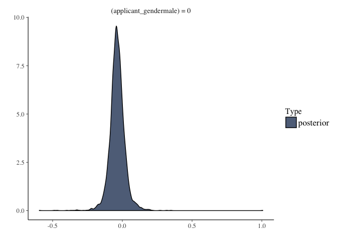
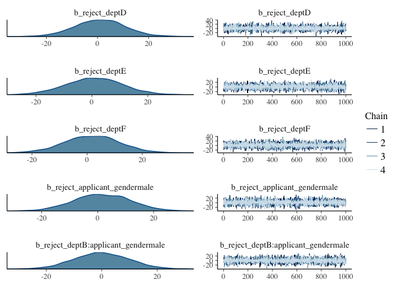
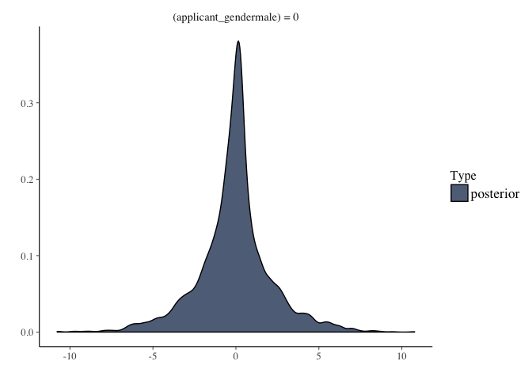

# Jan06AssignmentQs
Xiaoyan Yue  
1/5/2017  


##Exercises

###To gain familiarity with brms I am going to have you refit models from Statistical Rethinking with brms. In all cases compare the brms and map2stan parameter estimates; they should be effectively the same if you have specified them correctly.

###Q1:Fit model 10.9 (R code 10.28) with brms. Remember that you should not need to transform the predictors, create dummy variables, nor coerce indexes to use brms. Compare to the map2stan fit. Test whether the coefficient for gender is different from 0 in the brms model.

```r
#Load the data 
data(UCBadmit)
d <- UCBadmit

d
```

```
##    dept applicant.gender admit reject applications
## 1     A             male   512    313          825
## 2     A           female    89     19          108
## 3     B             male   353    207          560
## 4     B           female    17      8           25
## 5     C             male   120    205          325
## 6     C           female   202    391          593
## 7     D             male   138    279          417
## 8     D           female   131    244          375
## 9     E             male    53    138          191
## 10    E           female    94    299          393
## 11    F             male    22    351          373
## 12    F           female    24    317          341
```

```r
summary(d)
```

```
##  dept  applicant.gender     admit            reject       applications  
##  A:2   female:6         Min.   : 17.00   Min.   :  8.0   Min.   : 25.0  
##  B:2   male  :6         1st Qu.: 45.75   1st Qu.:188.2   1st Qu.:291.5  
##  C:2                    Median :107.00   Median :261.5   Median :374.0  
##  D:2                    Mean   :146.25   Mean   :230.9   Mean   :377.2  
##  E:2                    3rd Qu.:154.00   3rd Qu.:314.0   3rd Qu.:452.8  
##  F:2                    Max.   :512.00   Max.   :391.0   Max.   :825.0
```

```r
#Fit the model with map2stan
#First, creat a dummy variable for "application.gender"
d$male <- ifelse( d$applicant.gender=="male" , 1 , 0 )
#Second, make index for each dpartment
d$dept_id <- coerce_index( d$dept )
#Third, get rid of "." in the colum name "application.gender"
colnames(d) <- sub(".","_",colnames(d),fixed = TRUE)

mQ1.stan <- map2stan(
    alist(
        admit ~ dbinom( applications , p ) ,
        logit(p) <- a_dept[dept_id] + bm*male ,
        a_dept[dept_id] ~ dnorm(0,10) ,
        bm ~ dnorm(0,10)
) , data=d, chains = 4)
```

```
## In file included from file10a4d398053.cpp:8:
## In file included from /Library/Frameworks/R.framework/Versions/3.3/Resources/library/StanHeaders/include/src/stan/model/model_header.hpp:4:
## In file included from /Library/Frameworks/R.framework/Versions/3.3/Resources/library/StanHeaders/include/stan/math.hpp:4:
## In file included from /Library/Frameworks/R.framework/Versions/3.3/Resources/library/StanHeaders/include/stan/math/rev/mat.hpp:4:
## In file included from /Library/Frameworks/R.framework/Versions/3.3/Resources/library/StanHeaders/include/stan/math/rev/core.hpp:12:
## In file included from /Library/Frameworks/R.framework/Versions/3.3/Resources/library/StanHeaders/include/stan/math/rev/core/gevv_vvv_vari.hpp:5:
## In file included from /Library/Frameworks/R.framework/Versions/3.3/Resources/library/StanHeaders/include/stan/math/rev/core/var.hpp:7:
## In file included from /Library/Frameworks/R.framework/Versions/3.3/Resources/library/BH/include/boost/math/tools/config.hpp:13:
## In file included from /Library/Frameworks/R.framework/Versions/3.3/Resources/library/BH/include/boost/config.hpp:39:
## /Library/Frameworks/R.framework/Versions/3.3/Resources/library/BH/include/boost/config/compiler/clang.hpp:196:11: warning: 'BOOST_NO_CXX11_RVALUE_REFERENCES' macro redefined [-Wmacro-redefined]
## #  define BOOST_NO_CXX11_RVALUE_REFERENCES
##           ^
## <command line>:6:9: note: previous definition is here
## #define BOOST_NO_CXX11_RVALUE_REFERENCES 1
##         ^
## 1 warning generated.
## 
## SAMPLING FOR MODEL 'admit ~ dbinom(applications, p)' NOW (CHAIN 1).
## 
## Chain 1, Iteration:    1 / 2000 [  0%]  (Warmup)
## Chain 1, Iteration:  200 / 2000 [ 10%]  (Warmup)
## Chain 1, Iteration:  400 / 2000 [ 20%]  (Warmup)
## Chain 1, Iteration:  600 / 2000 [ 30%]  (Warmup)
## Chain 1, Iteration:  800 / 2000 [ 40%]  (Warmup)
## Chain 1, Iteration: 1000 / 2000 [ 50%]  (Warmup)
## Chain 1, Iteration: 1001 / 2000 [ 50%]  (Sampling)
## Chain 1, Iteration: 1200 / 2000 [ 60%]  (Sampling)
## Chain 1, Iteration: 1400 / 2000 [ 70%]  (Sampling)
## Chain 1, Iteration: 1600 / 2000 [ 80%]  (Sampling)
## Chain 1, Iteration: 1800 / 2000 [ 90%]  (Sampling)
## Chain 1, Iteration: 2000 / 2000 [100%]  (Sampling)
##  Elapsed Time: 0.050203 seconds (Warm-up)
##                0.038984 seconds (Sampling)
##                0.089187 seconds (Total)
## 
## 
## SAMPLING FOR MODEL 'admit ~ dbinom(applications, p)' NOW (CHAIN 2).
## 
## Chain 2, Iteration:    1 / 2000 [  0%]  (Warmup)
## Chain 2, Iteration:  200 / 2000 [ 10%]  (Warmup)
## Chain 2, Iteration:  400 / 2000 [ 20%]  (Warmup)
## Chain 2, Iteration:  600 / 2000 [ 30%]  (Warmup)
## Chain 2, Iteration:  800 / 2000 [ 40%]  (Warmup)
## Chain 2, Iteration: 1000 / 2000 [ 50%]  (Warmup)
## Chain 2, Iteration: 1001 / 2000 [ 50%]  (Sampling)
## Chain 2, Iteration: 1200 / 2000 [ 60%]  (Sampling)
## Chain 2, Iteration: 1400 / 2000 [ 70%]  (Sampling)
## Chain 2, Iteration: 1600 / 2000 [ 80%]  (Sampling)
## Chain 2, Iteration: 1800 / 2000 [ 90%]  (Sampling)
## Chain 2, Iteration: 2000 / 2000 [100%]  (Sampling)
##  Elapsed Time: 0.048116 seconds (Warm-up)
##                0.044374 seconds (Sampling)
##                0.09249 seconds (Total)
## 
## 
## SAMPLING FOR MODEL 'admit ~ dbinom(applications, p)' NOW (CHAIN 3).
## 
## Chain 3, Iteration:    1 / 2000 [  0%]  (Warmup)
## Chain 3, Iteration:  200 / 2000 [ 10%]  (Warmup)
## Chain 3, Iteration:  400 / 2000 [ 20%]  (Warmup)
## Chain 3, Iteration:  600 / 2000 [ 30%]  (Warmup)
## Chain 3, Iteration:  800 / 2000 [ 40%]  (Warmup)
## Chain 3, Iteration: 1000 / 2000 [ 50%]  (Warmup)
## Chain 3, Iteration: 1001 / 2000 [ 50%]  (Sampling)
## Chain 3, Iteration: 1200 / 2000 [ 60%]  (Sampling)
## Chain 3, Iteration: 1400 / 2000 [ 70%]  (Sampling)
## Chain 3, Iteration: 1600 / 2000 [ 80%]  (Sampling)
## Chain 3, Iteration: 1800 / 2000 [ 90%]  (Sampling)
## Chain 3, Iteration: 2000 / 2000 [100%]  (Sampling)
##  Elapsed Time: 0.051587 seconds (Warm-up)
##                0.05759 seconds (Sampling)
##                0.109177 seconds (Total)
## 
## 
## SAMPLING FOR MODEL 'admit ~ dbinom(applications, p)' NOW (CHAIN 4).
## 
## Chain 4, Iteration:    1 / 2000 [  0%]  (Warmup)
## Chain 4, Iteration:  200 / 2000 [ 10%]  (Warmup)
## Chain 4, Iteration:  400 / 2000 [ 20%]  (Warmup)
## Chain 4, Iteration:  600 / 2000 [ 30%]  (Warmup)
## Chain 4, Iteration:  800 / 2000 [ 40%]  (Warmup)
## Chain 4, Iteration: 1000 / 2000 [ 50%]  (Warmup)
## Chain 4, Iteration: 1001 / 2000 [ 50%]  (Sampling)
## Chain 4, Iteration: 1200 / 2000 [ 60%]  (Sampling)
## Chain 4, Iteration: 1400 / 2000 [ 70%]  (Sampling)
## Chain 4, Iteration: 1600 / 2000 [ 80%]  (Sampling)
## Chain 4, Iteration: 1800 / 2000 [ 90%]  (Sampling)
## Chain 4, Iteration: 2000 / 2000 [100%]  (Sampling)
##  Elapsed Time: 0.056264 seconds (Warm-up)
##                0.04476 seconds (Sampling)
##                0.101024 seconds (Total)
## 
## 
## SAMPLING FOR MODEL 'admit ~ dbinom(applications, p)' NOW (CHAIN 1).
## WARNING: No variance estimation is
##          performed for num_warmup < 20
## 
## 
## Chain 1, Iteration: 1 / 1 [100%]  (Sampling)
##  Elapsed Time: 3e-06 seconds (Warm-up)
##                3.8e-05 seconds (Sampling)
##                4.1e-05 seconds (Total)
```

```
## Computing WAIC
```

```
## Constructing posterior predictions
```

```
## [ 400 / 4000 ]
[ 800 / 4000 ]
[ 1200 / 4000 ]
[ 1600 / 4000 ]
[ 2000 / 4000 ]
[ 2400 / 4000 ]
[ 2800 / 4000 ]
[ 3200 / 4000 ]
[ 3600 / 4000 ]
[ 4000 / 4000 ]
```

```
## Aggregated binomial counts detected. Splitting to 0/1 outcome for WAIC calculation.
```

```r
#test the model
precis(mQ1.stan,depth = 2)
```

```
##            Mean StdDev lower 0.89 upper 0.89 n_eff Rhat
## a_dept[1]  0.68   0.10       0.51       0.83  2799    1
## a_dept[2]  0.64   0.12       0.46       0.83  3026    1
## a_dept[3] -0.58   0.07      -0.69      -0.46  4000    1
## a_dept[4] -0.61   0.09      -0.74      -0.47  4000    1
## a_dept[5] -1.06   0.10      -1.22      -0.91  4000    1
## a_dept[6] -2.64   0.16      -2.89      -2.38  4000    1
## bm        -0.10   0.08      -0.23       0.03  2322    1
```

```r
pairs(mQ1.stan)

summary(mQ1.stan)
```

```
## Inference for Stan model: admit ~ dbinom(applications, p).
## 4 chains, each with iter=2000; warmup=1000; thin=1; 
## post-warmup draws per chain=1000, total post-warmup draws=4000.
## 
##               mean se_mean   sd     2.5%      25%      50%      75%
## a_dept[1]     0.68    0.00 0.10     0.49     0.62     0.68     0.75
## a_dept[2]     0.64    0.00 0.12     0.41     0.56     0.64     0.72
## a_dept[3]    -0.58    0.00 0.07    -0.73    -0.63    -0.58    -0.53
## a_dept[4]    -0.61    0.00 0.09    -0.79    -0.67    -0.61    -0.56
## a_dept[5]    -1.06    0.00 0.10    -1.26    -1.13    -1.06    -0.99
## a_dept[6]    -2.64    0.00 0.16    -2.96    -2.74    -2.63    -2.52
## bm           -0.10    0.00 0.08    -0.26    -0.16    -0.10    -0.05
## dev          96.13    0.09 3.80    90.78    93.25    95.48    98.26
## lp__      -2597.29    0.04 1.90 -2601.92 -2598.35 -2596.96 -2595.85
##              97.5% n_eff Rhat
## a_dept[1]     0.89  2799    1
## a_dept[2]     0.87  3026    1
## a_dept[3]    -0.44  4000    1
## a_dept[4]    -0.44  4000    1
## a_dept[5]    -0.87  4000    1
## a_dept[6]    -2.34  4000    1
## bm            0.05  2322    1
## dev         105.38  1917    1
## lp__      -2594.61  1917    1
## 
## Samples were drawn using NUTS(diag_e) at Thu Jan  5 18:19:29 2017.
## For each parameter, n_eff is a crude measure of effective sample size,
## and Rhat is the potential scale reduction factor on split chains (at 
## convergence, Rhat=1).
```

```r
#Fit the model by brms, I'm confused by how to create the outcome variable, so I tried different ways

#(in chapter10, 10.1.4, an aggregated binomial uses cbind to build the outcome variable)
mQ1.brms1 <- brm(cbind(admit,reject) ~ 0 + dept + applicant_gender,#separate intercept for each dept
                #family = "binomial",#Multivariate models are not yet implemented for family 'binomial'.
                prior=set_prior("normal(0,10)", class="b"),
                data = d)
```

```
## Compiling the C++ model
```

```
## Start sampling
```

```r
summary(mQ1.brms1)
```

```
##  Family: gaussian (identity) 
## Formula: cbind(admit, reject) ~ 0 + dept + applicant_gender 
##    Data: d (Number of observations: 12) 
## Samples: 4 chains, each with iter = 2000; warmup = 1000; thin = 1; 
##          total post-warmup samples = 4000
##    WAIC: Not computed
##  
## Population-Level Effects: 
##                             Estimate Est.Error l-95% CI u-95% CI
## admit_deptA                     2.11     10.04   -17.51    21.77
## admit_deptB                     1.32     10.06   -18.32    21.73
## admit_deptC                     0.04      9.86   -18.69    19.58
## admit_deptD                     0.08     10.10   -19.49    20.17
## admit_deptE                    -0.38     10.09   -19.65    19.14
## admit_deptF                    -1.38      9.62   -20.19    17.57
## admit_applicant_gendermale      2.14      9.96   -17.45    21.62
## reject_deptA                   -0.43      9.73   -19.59    18.84
## reject_deptB                   -0.26      9.65   -19.48    18.51
## reject_deptC                    0.99     10.05   -18.69    20.78
## reject_deptD                    0.89      9.77   -19.19    20.29
## reject_deptE                    1.03     10.02   -18.70    21.04
## reject_deptF                    1.89      9.83   -16.94    21.22
## reject_applicant_gendermale     1.47     10.12   -18.04    21.42
##                             Eff.Sample Rhat
## admit_deptA                       4000    1
## admit_deptB                       4000    1
## admit_deptC                       4000    1
## admit_deptD                       4000    1
## admit_deptE                       4000    1
## admit_deptF                       4000    1
## admit_applicant_gendermale        4000    1
## reject_deptA                      4000    1
## reject_deptB                      4000    1
## reject_deptC                      4000    1
## reject_deptD                      4000    1
## reject_deptE                      4000    1
## reject_deptF                      4000    1
## reject_applicant_gendermale       4000    1
## 
## Family Specific Parameters: 
##                      Estimate Est.Error l-95% CI u-95% CI Eff.Sample Rhat
## sigma(admit)           203.77     39.88   143.53   298.03       4000    1
## sigma(reject)          256.81     52.83   178.56   377.04       4000    1
## rescor(admit,reject)     0.61      0.17     0.19     0.86       4000    1
## 
## Samples were drawn using sampling(NUTS). For each parameter, Eff.Sample 
## is a crude measure of effective sample size, and Rhat is the potential 
## scale reduction factor on split chains (at convergence, Rhat = 1).
```

```r
plot(mQ1.brms1, ask = FALSE)
```

<!-- --><!-- --><!-- --><!-- --><!-- -->

```r
#then, I create a outcome variable for the model, calculate the probablity of admit in each department
d$admit_p <- d$admit/d$applications
mQ1.brms2 <- brm(admit_p ~ 0 + dept + applicant_gender,#separate intercept for each dept
                prior=set_prior("normal(0,10)", class="b"),
                data = d)
```

```
## Compiling the C++ model
## Start sampling
```

```r
summary(mQ1.brms2)
```

```
##  Family: gaussian (identity) 
## Formula: admit_p ~ 0 + dept + applicant_gender 
##    Data: d (Number of observations: 12) 
## Samples: 4 chains, each with iter = 2000; warmup = 1000; thin = 1; 
##          total post-warmup samples = 4000
##    WAIC: Not computed
##  
## Population-Level Effects: 
##                      Estimate Est.Error l-95% CI u-95% CI Eff.Sample Rhat
## deptA                    0.74      0.09     0.60     0.89       4000    1
## deptB                    0.67      0.08     0.53     0.82       3748    1
## deptC                    0.37      0.08     0.23     0.52       3762    1
## deptD                    0.36      0.08     0.20     0.50       3424    1
## deptE                    0.28      0.08     0.13     0.43       3135    1
## deptF                    0.08      0.08    -0.07     0.24       2632    1
## applicant_gendermale    -0.04      0.06    -0.14     0.08       2942    1
## 
## Family Specific Parameters: 
##       Estimate Est.Error l-95% CI u-95% CI Eff.Sample Rhat
## sigma     0.09      0.06     0.04     0.21        483 1.01
## 
## Samples were drawn using sampling(NUTS). For each parameter, Eff.Sample 
## is a crude measure of effective sample size, and Rhat is the potential 
## scale reduction factor on split chains (at convergence, Rhat = 1).
```

```r
plot(mQ1.brms2, ask = FALSE)
```

<!-- --><!-- -->

```r
#Test whether the coefficient for gender is different from 0 in the brms model
hypothesis(mQ1.brms1,"admit_applicant_gendermale = 0") 
```

```
## Hypothesis Tests for class b:
##                          Estimate Est.Error l-95% CI u-95% CI Evid.Ratio 
## (admit_applicant_... = 0     2.14      9.96   -17.45    21.62         NA 
## ---
## '*': The expected value under the hypothesis lies outside the 95% CI.
```

```r
plot(hypothesis(mQ1.brms1,"admit_applicant_gendermale = 0"))
```

<!-- -->

```r
hypothesis(mQ1.brms2,"applicant_gendermale = 0")
```

```
## Hypothesis Tests for class b:
##                          Estimate Est.Error l-95% CI u-95% CI Evid.Ratio 
## (applicant_gender... = 0    -0.04      0.06    -0.14     0.08         NA 
## ---
## '*': The expected value under the hypothesis lies outside the 95% CI.
```

```r
plot(hypothesis(mQ1.brms2,"applicant_gendermale = 0"))
```

<!-- -->

```r
#fit model with interactions between department and gender
#(1)
mQ1.brms3 <- brm(cbind(admit,reject) ~ 0 + dept * applicant_gender,
                prior=set_prior("normal(0,10)", class="b"),
                data = d)
```

```
## Compiling the C++ model
## Start sampling
```

```r
summary(mQ1.brms3)
```

```
##  Family: gaussian (identity) 
## Formula: cbind(admit, reject) ~ 0 + dept * applicant_gender 
##    Data: d (Number of observations: 12) 
## Samples: 4 chains, each with iter = 2000; warmup = 1000; thin = 1; 
##          total post-warmup samples = 4000
##    WAIC: Not computed
##  
## Population-Level Effects: 
##                                   Estimate Est.Error l-95% CI u-95% CI
## admit_deptA                           2.06     10.15   -17.47    21.87
## admit_deptB                           1.23     10.16   -18.30    20.62
## admit_deptC                          -0.10     10.09   -19.59    19.70
## admit_deptD                          -0.09     10.03   -19.64    19.18
## admit_deptE                          -0.25     10.18   -19.82    19.41
## admit_deptF                          -1.31      9.96   -20.82    18.62
## admit_applicant_gendermale            2.19      9.69   -16.89    20.69
## admit_deptB:applicant_gendermale      1.06      9.94   -18.19    20.13
## admit_deptC:applicant_gendermale     -0.06      9.96   -18.90    19.25
## admit_deptD:applicant_gendermale      0.08      9.56   -18.49    18.82
## admit_deptE:applicant_gendermale      0.02     10.16   -19.75    19.80
## admit_deptF:applicant_gendermale     -0.70      9.89   -19.97    18.17
## reject_deptA                         -0.61      9.62   -19.22    17.86
## reject_deptB                         -0.36      9.88   -19.93    18.91
## reject_deptC                          1.07     10.08   -18.49    20.72
## reject_deptD                          1.01      9.82   -18.33    20.24
## reject_deptE                          0.86      9.93   -18.64    20.32
## reject_deptF                          1.79      9.79   -17.66    20.80
## reject_applicant_gendermale           1.62      9.88   -17.36    20.90
## reject_deptB:applicant_gendermale    -0.05      9.83   -19.20    19.27
## reject_deptC:applicant_gendermale     0.23     10.08   -19.14    20.00
## reject_deptD:applicant_gendermale     0.54      9.54   -18.35    19.03
## reject_deptE:applicant_gendermale     0.42      9.51   -18.18    19.38
## reject_deptF:applicant_gendermale     1.01     10.00   -18.94    20.76
##                                   Eff.Sample Rhat
## admit_deptA                             4000    1
## admit_deptB                             4000    1
## admit_deptC                             4000    1
## admit_deptD                             4000    1
## admit_deptE                             4000    1
## admit_deptF                             4000    1
## admit_applicant_gendermale              4000    1
## admit_deptB:applicant_gendermale        4000    1
## admit_deptC:applicant_gendermale        4000    1
## admit_deptD:applicant_gendermale        4000    1
## admit_deptE:applicant_gendermale        4000    1
## admit_deptF:applicant_gendermale        4000    1
## reject_deptA                            4000    1
## reject_deptB                            4000    1
## reject_deptC                            4000    1
## reject_deptD                            4000    1
## reject_deptE                            4000    1
## reject_deptF                            4000    1
## reject_applicant_gendermale             4000    1
## reject_deptB:applicant_gendermale       4000    1
## reject_deptC:applicant_gendermale       4000    1
## reject_deptD:applicant_gendermale       4000    1
## reject_deptE:applicant_gendermale       4000    1
## reject_deptF:applicant_gendermale       4000    1
## 
## Family Specific Parameters: 
##                      Estimate Est.Error l-95% CI u-95% CI Eff.Sample Rhat
## sigma(admit)           203.69     41.01   142.10   303.57       4000    1
## sigma(reject)          256.18     50.63   179.50   372.64       4000    1
## rescor(admit,reject)     0.61      0.17     0.21     0.85       4000    1
## 
## Samples were drawn using sampling(NUTS). For each parameter, Eff.Sample 
## is a crude measure of effective sample size, and Rhat is the potential 
## scale reduction factor on split chains (at convergence, Rhat = 1).
```

```r
plot(mQ1.brms3, ask = FALSE)
```

<!-- --><!-- --><!-- --><!-- --><!-- --><!-- -->

```r
#(2)
mQ1.brms4 <- brm(admit_p ~ 0 + dept * applicant_gender,#separate intercept for each dept
                prior=set_prior("normal(0,10)", class="b"),
                data = d)
```

```
## Compiling the C++ model
## Start sampling
```

```
## Warning: There were 402 divergent transitions after warmup. Increasing adapt_delta above 0.8 may help. See
## http://mc-stan.org/misc/warnings.html#divergent-transitions-after-warmup
```

```
## Warning: There were 4 chains where the estimated Bayesian Fraction of Missing Information was low. See
## http://mc-stan.org/misc/warnings.html#bfmi-low
```

```
## Warning: Examine the pairs() plot to diagnose sampling problems
```

```r
summary(mQ1.brms4)
```

```
## Warning: The model has not converged (some Rhats are > 1.1). Do not analyse the results! 
## We recommend running more iterations and/or setting stronger priors.
```

```
##  Family: gaussian (identity) 
## Formula: admit_p ~ 0 + dept * applicant_gender 
##    Data: d (Number of observations: 12) 
## Samples: 4 chains, each with iter = 2000; warmup = 1000; thin = 1; 
##          total post-warmup samples = 4000
##    WAIC: Not computed
##  
## Population-Level Effects: 
##                            Estimate Est.Error l-95% CI u-95% CI Eff.Sample
## deptA                          0.72      1.93    -3.75     4.79       2615
## deptB                          0.69      2.14    -3.78     5.64       2925
## deptC                          0.28      2.14    -4.33     4.74       3531
## deptD                          0.40      2.25    -4.45     5.44       3637
## deptE                          0.24      2.13    -4.45     4.93       3235
## deptF                          0.13      2.16    -4.59     4.54       4000
## applicant_gendermale          -0.08      2.19    -5.00     4.74       1754
## deptB:applicant_gendermale    -0.03      3.38    -7.29     7.24       2246
## deptC:applicant_gendermale     0.16      3.37    -7.10     7.34       2234
## deptD:applicant_gendermale    -0.04      3.46    -7.48     7.75       2322
## deptE:applicant_gendermale     0.12      3.29    -6.89     7.55       2200
## deptF:applicant_gendermale     0.05      3.60    -7.62     8.25       2106
##                            Rhat
## deptA                         1
## deptB                         1
## deptC                         1
## deptD                         1
## deptE                         1
## deptF                         1
## applicant_gendermale          1
## deptB:applicant_gendermale    1
## deptC:applicant_gendermale    1
## deptD:applicant_gendermale    1
## deptE:applicant_gendermale    1
## deptF:applicant_gendermale    1
## 
## Family Specific Parameters: 
##       Estimate Est.Error l-95% CI u-95% CI Eff.Sample Rhat
## sigma     1.89      1.57     0.21     5.71         22 1.16
## 
## Samples were drawn using sampling(NUTS). For each parameter, Eff.Sample 
## is a crude measure of effective sample size, and Rhat is the potential 
## scale reduction factor on split chains (at convergence, Rhat = 1).
```

```r
plot(mQ1.brms4, ask = FALSE)
```

<!-- --><!-- --><!-- -->

```r
#Test whether the coefficient for gender is different from 0 in the brms model
hypothesis(mQ1.brms3,"admit_applicant_gendermale = 0") 
```

```
## Hypothesis Tests for class b:
##                          Estimate Est.Error l-95% CI u-95% CI Evid.Ratio 
## (admit_applicant_... = 0     2.19      9.69   -16.89    20.69         NA 
## ---
## '*': The expected value under the hypothesis lies outside the 95% CI.
```

```r
plot(hypothesis(mQ1.brms3,"admit_applicant_gendermale = 0"))
```

<!-- -->

```r
hypothesis(mQ1.brms4,"applicant_gendermale = 0")
```

```
## Hypothesis Tests for class b:
##                          Estimate Est.Error l-95% CI u-95% CI Evid.Ratio 
## (applicant_gender... = 0    -0.08      2.19       -5     4.74         NA 
## ---
## '*': The expected value under the hypothesis lies outside the 95% CI.
```

```r
plot(hypothesis(mQ1.brms4,"applicant_gendermale = 0"))
```

<!-- -->
###Q2:Refit models 12.1 and 12.2 (Rcode 12.2 and 12.3) with brms

```r
data(reedfrogs)
d2 <- reedfrogs

d2
```

```
##    density pred  size surv  propsurv
## 1       10   no   big    9 0.9000000
## 2       10   no   big   10 1.0000000
## 3       10   no   big    7 0.7000000
## 4       10   no   big   10 1.0000000
## 5       10   no small    9 0.9000000
## 6       10   no small    9 0.9000000
## 7       10   no small   10 1.0000000
## 8       10   no small    9 0.9000000
## 9       10 pred   big    4 0.4000000
## 10      10 pred   big    9 0.9000000
## 11      10 pred   big    7 0.7000000
## 12      10 pred   big    6 0.6000000
## 13      10 pred small    7 0.7000000
## 14      10 pred small    5 0.5000000
## 15      10 pred small    9 0.9000000
## 16      10 pred small    9 0.9000000
## 17      25   no   big   24 0.9600000
## 18      25   no   big   23 0.9200000
## 19      25   no   big   22 0.8800000
## 20      25   no   big   25 1.0000000
## 21      25   no small   23 0.9200000
## 22      25   no small   23 0.9200000
## 23      25   no small   23 0.9200000
## 24      25   no small   21 0.8400000
## 25      25 pred   big    6 0.2400000
## 26      25 pred   big   13 0.5200000
## 27      25 pred   big    4 0.1600000
## 28      25 pred   big    9 0.3600000
## 29      25 pred small   13 0.5200000
## 30      25 pred small   20 0.8000000
## 31      25 pred small    8 0.3200000
## 32      25 pred small   10 0.4000000
## 33      35   no   big   34 0.9714286
## 34      35   no   big   33 0.9428571
## 35      35   no   big   33 0.9428571
## 36      35   no   big   31 0.8857143
## 37      35   no small   31 0.8857143
## 38      35   no small   35 1.0000000
## 39      35   no small   33 0.9428571
## 40      35   no small   32 0.9142857
## 41      35 pred   big    4 0.1142857
## 42      35 pred   big   12 0.3428571
## 43      35 pred   big   13 0.3714286
## 44      35 pred   big   14 0.4000000
## 45      35 pred small   22 0.6285714
## 46      35 pred small   12 0.3428571
## 47      35 pred small   31 0.8857143
## 48      35 pred small   17 0.4857143
```

```r
# make the tank cluster variable
d2$tank <- 1:nrow(d2)
#fit the model with stan
m12.1.stan <- map2stan(
    alist(
        surv ~ dbinom( density , p ) ,
        logit(p) <- a_tank[tank] ,
        a_tank[tank] ~ dnorm( 0 , 5 )
), data=d2 )
```

```
## In file included from file10a46fa2057e.cpp:8:
## In file included from /Library/Frameworks/R.framework/Versions/3.3/Resources/library/StanHeaders/include/src/stan/model/model_header.hpp:4:
## In file included from /Library/Frameworks/R.framework/Versions/3.3/Resources/library/StanHeaders/include/stan/math.hpp:4:
## In file included from /Library/Frameworks/R.framework/Versions/3.3/Resources/library/StanHeaders/include/stan/math/rev/mat.hpp:4:
## In file included from /Library/Frameworks/R.framework/Versions/3.3/Resources/library/StanHeaders/include/stan/math/rev/core.hpp:12:
## In file included from /Library/Frameworks/R.framework/Versions/3.3/Resources/library/StanHeaders/include/stan/math/rev/core/gevv_vvv_vari.hpp:5:
## In file included from /Library/Frameworks/R.framework/Versions/3.3/Resources/library/StanHeaders/include/stan/math/rev/core/var.hpp:7:
## In file included from /Library/Frameworks/R.framework/Versions/3.3/Resources/library/BH/include/boost/math/tools/config.hpp:13:
## In file included from /Library/Frameworks/R.framework/Versions/3.3/Resources/library/BH/include/boost/config.hpp:39:
## /Library/Frameworks/R.framework/Versions/3.3/Resources/library/BH/include/boost/config/compiler/clang.hpp:196:11: warning: 'BOOST_NO_CXX11_RVALUE_REFERENCES' macro redefined [-Wmacro-redefined]
## #  define BOOST_NO_CXX11_RVALUE_REFERENCES
##           ^
## <command line>:6:9: note: previous definition is here
## #define BOOST_NO_CXX11_RVALUE_REFERENCES 1
##         ^
## 1 warning generated.
## 
## SAMPLING FOR MODEL 'surv ~ dbinom(density, p)' NOW (CHAIN 1).
## 
## Chain 1, Iteration:    1 / 2000 [  0%]  (Warmup)
## Chain 1, Iteration:  200 / 2000 [ 10%]  (Warmup)
## Chain 1, Iteration:  400 / 2000 [ 20%]  (Warmup)
## Chain 1, Iteration:  600 / 2000 [ 30%]  (Warmup)
## Chain 1, Iteration:  800 / 2000 [ 40%]  (Warmup)
## Chain 1, Iteration: 1000 / 2000 [ 50%]  (Warmup)
## Chain 1, Iteration: 1001 / 2000 [ 50%]  (Sampling)
## Chain 1, Iteration: 1200 / 2000 [ 60%]  (Sampling)
## Chain 1, Iteration: 1400 / 2000 [ 70%]  (Sampling)
## Chain 1, Iteration: 1600 / 2000 [ 80%]  (Sampling)
## Chain 1, Iteration: 1800 / 2000 [ 90%]  (Sampling)
## Chain 1, Iteration: 2000 / 2000 [100%]  (Sampling)
##  Elapsed Time: 0.174301 seconds (Warm-up)
##                0.154378 seconds (Sampling)
##                0.328679 seconds (Total)
## 
## 
## SAMPLING FOR MODEL 'surv ~ dbinom(density, p)' NOW (CHAIN 1).
## WARNING: No variance estimation is
##          performed for num_warmup < 20
## 
## 
## Chain 1, Iteration: 1 / 1 [100%]  (Sampling)
##  Elapsed Time: 3e-06 seconds (Warm-up)
##                0.0001 seconds (Sampling)
##                0.000103 seconds (Total)
```

```
## Computing WAIC
```

```
## Constructing posterior predictions
```

```
## [ 100 / 1000 ]
[ 200 / 1000 ]
[ 300 / 1000 ]
[ 400 / 1000 ]
[ 500 / 1000 ]
[ 600 / 1000 ]
[ 700 / 1000 ]
[ 800 / 1000 ]
[ 900 / 1000 ]
[ 1000 / 1000 ]
```

```
## Aggregated binomial counts detected. Splitting to 0/1 outcome for WAIC calculation.
```

```r
precis(m12.1.stan,depth = 2)
```

```
##             Mean StdDev lower 0.89 upper 0.89 n_eff Rhat
## a_tank[1]   2.54   1.26       0.73       4.36   484 1.00
## a_tank[2]   5.61   2.64       1.62       9.53   586 1.00
## a_tank[3]   0.89   0.72      -0.19       2.00   771 1.00
## a_tank[4]   5.73   2.79       1.63       9.75   666 1.00
## a_tank[5]   2.54   1.23       0.74       4.42   764 1.00
## a_tank[6]   2.58   1.28       0.76       4.50   639 1.00
## a_tank[7]   5.78   2.87       1.85       9.83   407 1.01
## a_tank[8]   2.59   1.16       0.78       4.27   728 1.00
## a_tank[9]  -0.45   0.70      -1.61       0.62  1000 1.00
## a_tank[10]  2.57   1.21       0.69       4.37   572 1.00
## a_tank[11]  0.94   0.74      -0.31       2.01   818 1.00
## a_tank[12]  0.44   0.69      -0.60       1.54  1000 1.00
## a_tank[13]  0.93   0.75      -0.34       1.95  1000 1.00
## a_tank[14]  0.01   0.68      -1.08       1.05  1000 1.00
## a_tank[15]  2.48   1.10       0.75       4.06   919 1.00
## a_tank[16]  2.52   1.18       0.80       4.37   481 1.00
## a_tank[17]  3.53   1.21       1.70       5.29   559 1.00
## a_tank[18]  2.56   0.75       1.46       3.73  1000 1.00
## a_tank[19]  2.09   0.65       1.07       3.06  1000 1.00
## a_tank[20]  6.54   2.81       2.50      10.28   510 1.00
## a_tank[21]  2.62   0.81       1.48       3.96   887 1.00
## a_tank[22]  2.64   0.77       1.42       3.78   720 1.00
## a_tank[23]  2.59   0.77       1.51       3.91   785 1.00
## a_tank[24]  1.75   0.59       0.87       2.64   814 1.00
## a_tank[25] -1.19   0.47      -1.91      -0.44   974 1.00
## a_tank[26]  0.10   0.40      -0.52       0.75  1000 1.00
## a_tank[27] -1.70   0.52      -2.51      -0.86  1000 1.00
## a_tank[28] -0.60   0.41      -1.25       0.03  1000 1.00
## a_tank[29]  0.07   0.42      -0.56       0.74   645 1.00
## a_tank[30]  1.41   0.51       0.62       2.18  1000 1.00
## a_tank[31] -0.78   0.45      -1.53      -0.11   920 1.00
## a_tank[32] -0.43   0.41      -1.02       0.32  1000 1.00
## a_tank[33]  3.77   1.08       2.00       5.21   604 1.00
## a_tank[34]  2.94   0.76       1.78       4.08   875 1.00
## a_tank[35]  2.98   0.77       1.80       4.16   866 1.00
## a_tank[36]  2.14   0.56       1.26       2.97   794 1.00
## a_tank[37]  2.13   0.54       1.29       2.96   865 1.00
## a_tank[38]  6.78   2.48       3.13      10.32   652 1.00
## a_tank[39]  2.95   0.80       1.60       4.05   986 1.00
## a_tank[40]  2.48   0.59       1.47       3.31  1000 1.00
## a_tank[41] -2.11   0.52      -2.97      -1.33   808 1.00
## a_tank[42] -0.67   0.36      -1.21      -0.08  1000 1.00
## a_tank[43] -0.54   0.36      -1.07       0.10  1000 1.00
## a_tank[44] -0.43   0.34      -0.97       0.12   885 1.00
## a_tank[45]  0.54   0.35      -0.03       1.08  1000 1.00
## a_tank[46] -0.68   0.36      -1.22      -0.10   672 1.00
## a_tank[47]  2.16   0.57       1.26       3.06   794 1.00
## a_tank[48] -0.06   0.32      -0.59       0.43  1000 1.00
```

```r
#refit the model 12.1 with brms
#(1)without interaction
m12.1.brms1 <- brm(propsurv ~ pred + size,
                prior=set_prior("normal(0,5)", class="b"),
                data = d2)
```

```
## Compiling the C++ model
```

```
## Start sampling
```

```r
summary(m12.1.brms1)
```

```
##  Family: gaussian (identity) 
## Formula: propsurv ~ pred + size 
##    Data: d2 (Number of observations: 48) 
## Samples: 4 chains, each with iter = 2000; warmup = 1000; thin = 1; 
##          total post-warmup samples = 4000
##    WAIC: Not computed
##  
## Population-Level Effects: 
##           Estimate Est.Error l-95% CI u-95% CI Eff.Sample Rhat
## Intercept     0.88      0.04     0.79     0.96       4000    1
## predpred     -0.40      0.05    -0.50    -0.31       4000    1
## sizesmall     0.09      0.05    -0.01     0.19       4000    1
## 
## Family Specific Parameters: 
##       Estimate Est.Error l-95% CI u-95% CI Eff.Sample Rhat
## sigma     0.17      0.02     0.14     0.22       4000    1
## 
## Samples were drawn using sampling(NUTS). For each parameter, Eff.Sample 
## is a crude measure of effective sample size, and Rhat is the potential 
## scale reduction factor on split chains (at convergence, Rhat = 1).
```

```r
plot(m12.1.brms1,ask=FALSE)
```

<!-- -->

```r
#(2)with
m12.1.brms2 <- brm(propsurv ~ pred*size,
                prior=set_prior("normal(0,5)", class="b"),
                data = d2)
```

```
## Compiling the C++ model
## Start sampling
```

```r
summary(m12.1.brms2)
```

```
##  Family: gaussian (identity) 
## Formula: propsurv ~ pred * size 
##    Data: d2 (Number of observations: 48) 
## Samples: 4 chains, each with iter = 2000; warmup = 1000; thin = 1; 
##          total post-warmup samples = 4000
##    WAIC: Not computed
##  
## Population-Level Effects: 
##                    Estimate Est.Error l-95% CI u-95% CI Eff.Sample Rhat
## Intercept              0.93      0.05     0.83     1.02       2793    1
## predpred              -0.50      0.07    -0.64    -0.37       2522    1
## sizesmall             -0.01      0.07    -0.15     0.13       2449    1
## predpred:sizesmall     0.20      0.10     0.01     0.40       2250    1
## 
## Family Specific Parameters: 
##       Estimate Est.Error l-95% CI u-95% CI Eff.Sample Rhat
## sigma     0.17      0.02     0.14     0.21       3671    1
## 
## Samples were drawn using sampling(NUTS). For each parameter, Eff.Sample 
## is a crude measure of effective sample size, and Rhat is the potential 
## scale reduction factor on split chains (at convergence, Rhat = 1).
```

```r
plot(m12.1.brms2,ask=FALSE)
```

<!-- -->

```r
#fit model 12.2 with stan
m12.2.stan <- map2stan(
    alist(
        surv ~ dbinom( density , p ) ,
        logit(p) <- a_tank[tank] ,
        a_tank[tank] ~ dnorm( a , sigma ) ,
        a ~ dnorm(0,1) ,
        sigma ~ dcauchy(0,1)
    ), data=d2 , chains=4 )
```

```
## In file included from file10a478873559.cpp:8:
## In file included from /Library/Frameworks/R.framework/Versions/3.3/Resources/library/StanHeaders/include/src/stan/model/model_header.hpp:4:
## In file included from /Library/Frameworks/R.framework/Versions/3.3/Resources/library/StanHeaders/include/stan/math.hpp:4:
## In file included from /Library/Frameworks/R.framework/Versions/3.3/Resources/library/StanHeaders/include/stan/math/rev/mat.hpp:4:
## In file included from /Library/Frameworks/R.framework/Versions/3.3/Resources/library/StanHeaders/include/stan/math/rev/core.hpp:12:
## In file included from /Library/Frameworks/R.framework/Versions/3.3/Resources/library/StanHeaders/include/stan/math/rev/core/gevv_vvv_vari.hpp:5:
## In file included from /Library/Frameworks/R.framework/Versions/3.3/Resources/library/StanHeaders/include/stan/math/rev/core/var.hpp:7:
## In file included from /Library/Frameworks/R.framework/Versions/3.3/Resources/library/BH/include/boost/math/tools/config.hpp:13:
## In file included from /Library/Frameworks/R.framework/Versions/3.3/Resources/library/BH/include/boost/config.hpp:39:
## /Library/Frameworks/R.framework/Versions/3.3/Resources/library/BH/include/boost/config/compiler/clang.hpp:196:11: warning: 'BOOST_NO_CXX11_RVALUE_REFERENCES' macro redefined [-Wmacro-redefined]
## #  define BOOST_NO_CXX11_RVALUE_REFERENCES
##           ^
## <command line>:6:9: note: previous definition is here
## #define BOOST_NO_CXX11_RVALUE_REFERENCES 1
##         ^
## 1 warning generated.
## 
## SAMPLING FOR MODEL 'surv ~ dbinom(density, p)' NOW (CHAIN 1).
## 
## Chain 1, Iteration:    1 / 2000 [  0%]  (Warmup)
## Chain 1, Iteration:  200 / 2000 [ 10%]  (Warmup)
## Chain 1, Iteration:  400 / 2000 [ 20%]  (Warmup)
## Chain 1, Iteration:  600 / 2000 [ 30%]  (Warmup)
## Chain 1, Iteration:  800 / 2000 [ 40%]  (Warmup)
## Chain 1, Iteration: 1000 / 2000 [ 50%]  (Warmup)
## Chain 1, Iteration: 1001 / 2000 [ 50%]  (Sampling)
## Chain 1, Iteration: 1200 / 2000 [ 60%]  (Sampling)
## Chain 1, Iteration: 1400 / 2000 [ 70%]  (Sampling)
## Chain 1, Iteration: 1600 / 2000 [ 80%]  (Sampling)
## Chain 1, Iteration: 1800 / 2000 [ 90%]  (Sampling)
## Chain 1, Iteration: 2000 / 2000 [100%]  (Sampling)
##  Elapsed Time: 0.177463 seconds (Warm-up)
##                0.105072 seconds (Sampling)
##                0.282535 seconds (Total)
```

```
## The following numerical problems occured the indicated number of times on chain 1
```

```
##                                                                                 count
## Exception thrown at line 17: normal_log: Scale parameter is 0, but must be > 0!     1
```

```
## When a numerical problem occurs, the Hamiltonian proposal gets rejected.
```

```
## See http://mc-stan.org/misc/warnings.html#exception-hamiltonian-proposal-rejected
```

```
## If the number in the 'count' column is small, do not ask about this message on stan-users.
```

```
## 
## SAMPLING FOR MODEL 'surv ~ dbinom(density, p)' NOW (CHAIN 2).
## 
## Chain 2, Iteration:    1 / 2000 [  0%]  (Warmup)
## Chain 2, Iteration:  200 / 2000 [ 10%]  (Warmup)
## Chain 2, Iteration:  400 / 2000 [ 20%]  (Warmup)
## Chain 2, Iteration:  600 / 2000 [ 30%]  (Warmup)
## Chain 2, Iteration:  800 / 2000 [ 40%]  (Warmup)
## Chain 2, Iteration: 1000 / 2000 [ 50%]  (Warmup)
## Chain 2, Iteration: 1001 / 2000 [ 50%]  (Sampling)
## Chain 2, Iteration: 1200 / 2000 [ 60%]  (Sampling)
## Chain 2, Iteration: 1400 / 2000 [ 70%]  (Sampling)
## Chain 2, Iteration: 1600 / 2000 [ 80%]  (Sampling)
## Chain 2, Iteration: 1800 / 2000 [ 90%]  (Sampling)
## Chain 2, Iteration: 2000 / 2000 [100%]  (Sampling)
##  Elapsed Time: 0.18435 seconds (Warm-up)
##                0.112896 seconds (Sampling)
##                0.297246 seconds (Total)
## 
## 
## SAMPLING FOR MODEL 'surv ~ dbinom(density, p)' NOW (CHAIN 3).
## 
## Chain 3, Iteration:    1 / 2000 [  0%]  (Warmup)
## Chain 3, Iteration:  200 / 2000 [ 10%]  (Warmup)
## Chain 3, Iteration:  400 / 2000 [ 20%]  (Warmup)
## Chain 3, Iteration:  600 / 2000 [ 30%]  (Warmup)
## Chain 3, Iteration:  800 / 2000 [ 40%]  (Warmup)
## Chain 3, Iteration: 1000 / 2000 [ 50%]  (Warmup)
## Chain 3, Iteration: 1001 / 2000 [ 50%]  (Sampling)
## Chain 3, Iteration: 1200 / 2000 [ 60%]  (Sampling)
## Chain 3, Iteration: 1400 / 2000 [ 70%]  (Sampling)
## Chain 3, Iteration: 1600 / 2000 [ 80%]  (Sampling)
## Chain 3, Iteration: 1800 / 2000 [ 90%]  (Sampling)
## Chain 3, Iteration: 2000 / 2000 [100%]  (Sampling)
##  Elapsed Time: 0.174656 seconds (Warm-up)
##                0.103942 seconds (Sampling)
##                0.278598 seconds (Total)
## 
## 
## SAMPLING FOR MODEL 'surv ~ dbinom(density, p)' NOW (CHAIN 4).
## 
## Chain 4, Iteration:    1 / 2000 [  0%]  (Warmup)
## Chain 4, Iteration:  200 / 2000 [ 10%]  (Warmup)
## Chain 4, Iteration:  400 / 2000 [ 20%]  (Warmup)
## Chain 4, Iteration:  600 / 2000 [ 30%]  (Warmup)
## Chain 4, Iteration:  800 / 2000 [ 40%]  (Warmup)
## Chain 4, Iteration: 1000 / 2000 [ 50%]  (Warmup)
## Chain 4, Iteration: 1001 / 2000 [ 50%]  (Sampling)
## Chain 4, Iteration: 1200 / 2000 [ 60%]  (Sampling)
## Chain 4, Iteration: 1400 / 2000 [ 70%]  (Sampling)
## Chain 4, Iteration: 1600 / 2000 [ 80%]  (Sampling)
## Chain 4, Iteration: 1800 / 2000 [ 90%]  (Sampling)
## Chain 4, Iteration: 2000 / 2000 [100%]  (Sampling)
##  Elapsed Time: 0.180502 seconds (Warm-up)
##                0.107807 seconds (Sampling)
##                0.288309 seconds (Total)
## 
## 
## SAMPLING FOR MODEL 'surv ~ dbinom(density, p)' NOW (CHAIN 1).
## WARNING: No variance estimation is
##          performed for num_warmup < 20
## 
## 
## Chain 1, Iteration: 1 / 1 [100%]  (Sampling)
##  Elapsed Time: 4e-06 seconds (Warm-up)
##                8.1e-05 seconds (Sampling)
##                8.5e-05 seconds (Total)
```

```
## Computing WAIC
```

```
## Constructing posterior predictions
```

```
## [ 400 / 4000 ]
[ 800 / 4000 ]
[ 1200 / 4000 ]
[ 1600 / 4000 ]
[ 2000 / 4000 ]
[ 2400 / 4000 ]
[ 2800 / 4000 ]
[ 3200 / 4000 ]
[ 3600 / 4000 ]
[ 4000 / 4000 ]
```

```
## Aggregated binomial counts detected. Splitting to 0/1 outcome for WAIC calculation.
```

```r
precis(m12.2.stan, depth = 2)
```

```
##             Mean StdDev lower 0.89 upper 0.89 n_eff Rhat
## a_tank[1]   2.12   0.87       0.84       3.60  4000    1
## a_tank[2]   3.04   1.10       1.33       4.72  4000    1
## a_tank[3]   1.00   0.67      -0.07       2.02  4000    1
## a_tank[4]   3.04   1.11       1.21       4.66  4000    1
## a_tank[5]   2.13   0.89       0.59       3.44  4000    1
## a_tank[6]   2.11   0.86       0.74       3.40  4000    1
## a_tank[7]   3.03   1.10       1.34       4.70  4000    1
## a_tank[8]   2.12   0.84       0.83       3.46  4000    1
## a_tank[9]  -0.19   0.63      -1.20       0.80  4000    1
## a_tank[10]  2.10   0.85       0.72       3.44  4000    1
## a_tank[11]  1.00   0.67      -0.05       2.06  4000    1
## a_tank[12]  0.57   0.61      -0.35       1.58  4000    1
## a_tank[13]  1.00   0.67       0.00       2.13  4000    1
## a_tank[14]  0.19   0.62      -0.78       1.19  4000    1
## a_tank[15]  2.13   0.87       0.78       3.47  4000    1
## a_tank[16]  2.11   0.84       0.74       3.40  4000    1
## a_tank[17]  2.89   0.78       1.68       4.10  4000    1
## a_tank[18]  2.40   0.68       1.25       3.37  4000    1
## a_tank[19]  2.00   0.57       1.05       2.83  4000    1
## a_tank[20]  3.67   1.00       2.15       5.16  4000    1
## a_tank[21]  2.39   0.67       1.35       3.45  4000    1
## a_tank[22]  2.38   0.66       1.40       3.47  4000    1
## a_tank[23]  2.39   0.66       1.34       3.42  4000    1
## a_tank[24]  1.70   0.54       0.79       2.49  4000    1
## a_tank[25] -1.00   0.45      -1.69      -0.27  4000    1
## a_tank[26]  0.15   0.40      -0.47       0.82  4000    1
## a_tank[27] -1.43   0.49      -2.19      -0.66  4000    1
## a_tank[28] -0.47   0.41      -1.08       0.21  4000    1
## a_tank[29]  0.15   0.41      -0.51       0.80  4000    1
## a_tank[30]  1.44   0.49       0.73       2.28  4000    1
## a_tank[31] -0.64   0.42      -1.29       0.06  4000    1
## a_tank[32] -0.31   0.41      -0.91       0.37  4000    1
## a_tank[33]  3.18   0.78       2.01       4.43  4000    1
## a_tank[34]  2.71   0.65       1.73       3.75  4000    1
## a_tank[35]  2.70   0.66       1.67       3.72  4000    1
## a_tank[36]  2.06   0.51       1.23       2.82  4000    1
## a_tank[37]  2.05   0.49       1.28       2.83  4000    1
## a_tank[38]  3.86   0.96       2.29       5.24  4000    1
## a_tank[39]  2.71   0.67       1.65       3.76  4000    1
## a_tank[40]  2.34   0.56       1.43       3.16  4000    1
## a_tank[41] -1.82   0.48      -2.61      -1.11  4000    1
## a_tank[42] -0.56   0.35      -1.16      -0.03  4000    1
## a_tank[43] -0.46   0.34      -0.98       0.08  4000    1
## a_tank[44] -0.33   0.34      -0.86       0.23  4000    1
## a_tank[45]  0.59   0.34       0.04       1.12  4000    1
## a_tank[46] -0.57   0.35      -1.10       0.00  4000    1
## a_tank[47]  2.06   0.52       1.22       2.84  4000    1
## a_tank[48]  0.00   0.34      -0.55       0.52  4000    1
## a           1.30   0.26       0.88       1.69  4000    1
## sigma       1.62   0.22       1.29       1.96  2729    1
```

```r
#refit the model 12.2 with brms, by specifying different priors for specific coefficients
#(1)without interaction
m12.2.brms1 <- brm(propsurv ~ pred + size,
                   data = d2,
                   prior= c(
                     set_prior("normal(0,1)", class="Intercept"),
                     set_prior("normal(0,1)", class="b"),
                     set_prior("cauchy(0,1)", class = "sigma")))
```

```
## Compiling the C++ model
```

```
## Start sampling
```

```r
summary(m12.2.brms1)
```

```
##  Family: gaussian (identity) 
## Formula: propsurv ~ pred + size 
##    Data: d2 (Number of observations: 48) 
## Samples: 4 chains, each with iter = 2000; warmup = 1000; thin = 1; 
##          total post-warmup samples = 4000
##    WAIC: Not computed
##  
## Population-Level Effects: 
##           Estimate Est.Error l-95% CI u-95% CI Eff.Sample Rhat
## Intercept     0.88      0.04     0.79     0.96       4000    1
## predpred     -0.40      0.05    -0.50    -0.30       4000    1
## sizesmall     0.09      0.05    -0.01     0.19       4000    1
## 
## Family Specific Parameters: 
##       Estimate Est.Error l-95% CI u-95% CI Eff.Sample Rhat
## sigma     0.17      0.02     0.14     0.22       4000    1
## 
## Samples were drawn using sampling(NUTS). For each parameter, Eff.Sample 
## is a crude measure of effective sample size, and Rhat is the potential 
## scale reduction factor on split chains (at convergence, Rhat = 1).
```

```r
plot(m12.2.brms1,ask=FALSE)
```

<!-- -->

```r
#(2)with interaction
m12.2.brms2 <- brm(propsurv ~ pred * size,
                   data = d2,
                   prior= c(
                     set_prior("normal(0,1)", class="Intercept"),
                     set_prior("normal(0,1)", class="b"),
                     set_prior("cauchy(0,1)", class = "sigma")))
```

```
## Compiling the C++ model
## Start sampling
```

```r
summary(m12.2.brms2)
```

```
##  Family: gaussian (identity) 
## Formula: propsurv ~ pred * size 
##    Data: d2 (Number of observations: 48) 
## Samples: 4 chains, each with iter = 2000; warmup = 1000; thin = 1; 
##          total post-warmup samples = 4000
##    WAIC: Not computed
##  
## Population-Level Effects: 
##                    Estimate Est.Error l-95% CI u-95% CI Eff.Sample Rhat
## Intercept              0.92      0.05     0.83     1.02       2459    1
## predpred              -0.50      0.07    -0.63    -0.37       2435    1
## sizesmall              0.00      0.07    -0.14     0.13       2264    1
## predpred:sizesmall     0.19      0.10     0.00     0.38       2175    1
## 
## Family Specific Parameters: 
##       Estimate Est.Error l-95% CI u-95% CI Eff.Sample Rhat
## sigma     0.17      0.02     0.14     0.21       3294    1
## 
## Samples were drawn using sampling(NUTS). For each parameter, Eff.Sample 
## is a crude measure of effective sample size, and Rhat is the potential 
## scale reduction factor on split chains (at convergence, Rhat = 1).
```

```r
plot(m12.2.brms2,ask=FALSE)
```

<!-- -->

```r
#comparing models
loo(m12.1.brms1,m12.1.brms2,m12.2.brms1,m12.2.brms2)
```

```
## Warning: Some Pareto k diagnostic values are slightly high. See
## help('pareto-k-diagnostic') for details.

## Warning: Some Pareto k diagnostic values are slightly high. See
## help('pareto-k-diagnostic') for details.
```

```
##                            LOOIC    SE
## m12.1.brms1               -28.91 10.61
## m12.1.brms2               -30.49 12.27
## m12.2.brms1               -28.84 10.68
## m12.2.brms2               -30.48 12.24
## m12.1.brms1 - m12.1.brms2   1.58  4.69
## m12.1.brms1 - m12.2.brms1  -0.07  0.10
## m12.1.brms1 - m12.2.brms2   1.57  4.50
## m12.1.brms2 - m12.2.brms1  -1.65  4.74
## m12.1.brms2 - m12.2.brms2  -0.01  0.23
## m12.2.brms1 - m12.2.brms2   1.65  4.55
```

###Q3:For the tomato data set, use both brms and map2stan to fit a model for intleng as a function of species, trt and their interaction, and include shelf as a random effect.

```r
d3 <- read.csv("/Users/xyyue/Documents/RClub/Rclub-rethinking_Xiaoyan.Yue/Assignment_Chapter_09/TomatoR2CSHL.csv")

head(d3)
```

```
##   shelf flat col row    acs trt days   date   hyp int1 int2 int3 int4
## 1     Z    1   B   1 LA2580   H   28 5/5/08 19.46 2.37 1.59 1.87 0.51
## 2     Z    1   C   1 LA1305   H   28 5/5/08 31.28 3.34 0.01 9.19 1.62
## 3     Z    1   D   1 LA1973   H   28 5/5/08 56.65 8.43 2.39 6.70 3.69
## 4     Z    1   E   1 LA2748   H   28 5/5/08 35.18 0.56 0.00 1.60 0.61
## 5     Z    1   F   1 LA2931   H   28 5/5/08 35.32 0.82 0.02 1.49 0.46
## 6     Z    1   G   1 LA1317   H   28 5/5/08 28.74 1.07 6.69 5.72 4.76
##   intleng totleng petleng leafleng leafwid leafnum ndvi      lat      lon
## 1    6.34   25.80   15.78    30.53   34.44       5  111  -9.5167 -78.0083
## 2   14.16   45.44   12.36    22.93   13.99       4  120 -13.3833 -75.3583
## 3   21.21   77.86   13.05    46.71   43.78       5  110 -16.2333 -71.7000
## 4    2.77   37.95    8.08    26.82   33.28       5  105 -20.4833 -69.9833
## 5    2.79   38.11    7.68    22.40   23.61       5  106 -20.9167 -69.0667
## 6   18.24   46.98   23.66    42.35   42.35       5  132 -13.4167 -73.8417
##    alt         species who
## 1  740    S. pennellii Dan
## 2 3360   S. peruvianum Dan
## 3 2585   S. peruvianum Dan
## 4 1020     S. chilense Dan
## 5 2460     S. chilense Dan
## 6 2000 S. chmielewskii Dan
```

```r
#fit a model with stan for intleng as a function of species, trt and their interaction
#categorical variable for trt, species and shelf
d3$trt2 <- as.numeric(d3$trt)-1 #0 = H, 1=L
d3$species_id <- coerce_index(d3$species)
d3$shelf_id <- coerce_index(d3$shelf)

d3.subset <- d3[,c("shelf_id","trt2","intleng","species_id")]

head(d3.subset)
```

```
##   shelf_id trt2 intleng species_id
## 1        6    0    6.34          4
## 2        6    0   14.16          5
## 3        6    0   21.21          5
## 4        6    0    2.77          1
## 5        6    0    2.79          1
## 6        6    0   18.24          2
```

```r
summary(d3.subset)
```

```
##     shelf_id          trt2           intleng         species_id   
##  Min.   :1.000   Min.   :0.0000   Min.   : 0.000   Min.   :1.000  
##  1st Qu.:2.000   1st Qu.:0.0000   1st Qu.: 9.637   1st Qu.:2.000  
##  Median :3.000   Median :1.0000   Median :17.255   Median :3.000  
##  Mean   :3.512   Mean   :0.5089   Mean   :20.340   Mean   :2.927  
##  3rd Qu.:5.000   3rd Qu.:1.0000   3rd Qu.:28.145   3rd Qu.:4.000  
##  Max.   :6.000   Max.   :1.0000   Max.   :92.420   Max.   :5.000
```

```r
#fit the model
mQ3.stan <- map2stan(
  alist(
    intleng ~ dnorm(mu,sigma),
    mu <- a + a_shelf[shelf_id] + bs[species_id] + bt*trt2 + bst[species_id]*trt2,
    a ~ dnorm(20,100),
    a_shelf[shelf_id] ~ dnorm(0,sigma_shelf),
    bs[species_id] ~ dnorm(0,10),
    bt ~ dnorm(0,20),
    bst[species_id] ~ dnorm(0,10),
    sigma ~ dcauchy(0,1),
    sigma_shelf ~ dexp(1) 
  ),
  data = d3.subset,
  iter = 4000, 
  warmup = 1000,
  chains=4,
  cores=2
)
```

```
## In file included from file10a42593103f.cpp:8:
## In file included from /Library/Frameworks/R.framework/Versions/3.3/Resources/library/StanHeaders/include/src/stan/model/model_header.hpp:4:
## In file included from /Library/Frameworks/R.framework/Versions/3.3/Resources/library/StanHeaders/include/stan/math.hpp:4:
## In file included from /Library/Frameworks/R.framework/Versions/3.3/Resources/library/StanHeaders/include/stan/math/rev/mat.hpp:4:
## In file included from /Library/Frameworks/R.framework/Versions/3.3/Resources/library/StanHeaders/include/stan/math/rev/core.hpp:12:
## In file included from /Library/Frameworks/R.framework/Versions/3.3/Resources/library/StanHeaders/include/stan/math/rev/core/gevv_vvv_vari.hpp:5:
## In file included from /Library/Frameworks/R.framework/Versions/3.3/Resources/library/StanHeaders/include/stan/math/rev/core/var.hpp:7:
## In file included from /Library/Frameworks/R.framework/Versions/3.3/Resources/library/BH/include/boost/math/tools/config.hpp:13:
## In file included from /Library/Frameworks/R.framework/Versions/3.3/Resources/library/BH/include/boost/config.hpp:39:
## /Library/Frameworks/R.framework/Versions/3.3/Resources/library/BH/include/boost/config/compiler/clang.hpp:196:11: warning: 'BOOST_NO_CXX11_RVALUE_REFERENCES' macro redefined [-Wmacro-redefined]
## #  define BOOST_NO_CXX11_RVALUE_REFERENCES
##           ^
## <command line>:6:9: note: previous definition is here
## #define BOOST_NO_CXX11_RVALUE_REFERENCES 1
##         ^
## 1 warning generated.
```

```
## Warning: There were 1 divergent transitions after warmup. Increasing adapt_delta above 0.8 may help. See
## http://mc-stan.org/misc/warnings.html#divergent-transitions-after-warmup
```

```
## Warning: Examine the pairs() plot to diagnose sampling problems
```

```
## 
## SAMPLING FOR MODEL 'intleng ~ dnorm(mu, sigma)' NOW (CHAIN 1).
## WARNING: No variance estimation is
##          performed for num_warmup < 20
## 
## 
## Chain 1, Iteration: 1 / 1 [100%]  (Sampling)
##  Elapsed Time: 4e-06 seconds (Warm-up)
##                0.000257 seconds (Sampling)
##                0.000261 seconds (Total)
```

```
## Computing WAIC
```

```
## Constructing posterior predictions
```

```
## [ 1200 / 12000 ]
[ 2400 / 12000 ]
[ 3600 / 12000 ]
[ 4800 / 12000 ]
[ 6000 / 12000 ]
[ 7200 / 12000 ]
[ 8400 / 12000 ]
[ 9600 / 12000 ]
[ 10800 / 12000 ]
[ 12000 / 12000 ]
```

```
## Warning in map2stan(alist(intleng ~ dnorm(mu, sigma), mu <- a + a_shelf[shelf_id] + : There were 1 divergent iterations during sampling.
## Check the chains (trace plots, n_eff, Rhat) carefully to ensure they are valid.
```

```r
precis(mQ3.stan)
```

```
## Warning in precis(mQ3.stan): There were 1 divergent iterations during sampling.
## Check the chains (trace plots, n_eff, Rhat) carefully to ensure they are valid.
```

```
## 16 vector or matrix parameters omitted in display. Use depth=2 to show them.
```

```
##              Mean StdDev lower 0.89 upper 0.89 n_eff Rhat
## a           10.67   4.62       2.93      17.67  3228    1
## bt          17.03   4.64       9.27      24.07  3461    1
## sigma       10.61   0.24      10.20      10.97 10429    1
## sigma_shelf  1.42   0.68       0.39       2.44  2920    1
```

```r
pairs(mQ3.stan)

#fit a model with brm
#(1)without interaction
mQ3.brms1 <- brm(intleng ~ 0 + species + trt + (1|shelf),
            data = d3,
            prior = c(
              set_prior("normal(0,10)",class="b"), # sets prior for all b coefficients
              set_prior("normal(0,5)",class="b", coef = "trtL"), #set prior for "trtL"
              set_prior("cauchy(0,1)", class = "sigma"), #half cauchy prior for sigma
              set_prior("normal(0,1)", class = "sd", group = "shelf") #prior for shelf
            )
)
```

```
## Compiling the C++ model
```

```
## Start sampling
```

```r
summary(mQ3.brms1)
```

```
##  Family: gaussian (identity) 
## Formula: intleng ~ 0 + species + trt + (1 | shelf) 
##    Data: d3 (Number of observations: 1008) 
## Samples: 4 chains, each with iter = 2000; warmup = 1000; thin = 1; 
##          total post-warmup samples = 4000
##    WAIC: Not computed
##  
## Group-Level Effects: 
## ~shelf (Number of levels: 6) 
##               Estimate Est.Error l-95% CI u-95% CI Eff.Sample Rhat
## sd(Intercept)     1.29      0.49     0.44     2.36       1460    1
## 
## Population-Level Effects: 
##                       Estimate Est.Error l-95% CI u-95% CI Eff.Sample Rhat
## speciesS.chilense         7.82      1.11     5.57     9.98       1561    1
## speciesS.chmielewskii    11.89      1.10     9.68    14.07       1566    1
## speciesS.habrochaites    15.11      1.11    13.00    17.38       1579    1
## speciesS.pennellii        5.49      1.24     3.13     7.93       1921    1
## speciesS.peruvianum      13.75      1.11    11.54    15.94       1487    1
## trtL                     17.13      1.30    14.30    19.50       1302    1
## 
## Family Specific Parameters: 
##       Estimate Est.Error l-95% CI u-95% CI Eff.Sample Rhat
## sigma    10.67      0.24    10.21    11.13       4000    1
## 
## Samples were drawn using sampling(NUTS). For each parameter, Eff.Sample 
## is a crude measure of effective sample size, and Rhat is the potential 
## scale reduction factor on split chains (at convergence, Rhat = 1).
```

```r
plot(mQ3.brms1)
```

<!-- --><!-- --><!-- -->

```r
#(2)with interaction
mQ3.brms2 <- brm(intleng ~ 0 + trt * species + (1|shelf),
            data = d3,
            prior = c(
              set_prior("normal(0,10)",class="b"), # sets prior for all b coefficients
              set_prior("normal(0,5)",class="b", coef = "trtL"), #set prior for "trtL"
              set_prior("cauchy(0,1)", class = "sigma"), #half cauchy prior for sigma
              set_prior("normal(0,1)", class = "sd", group = "shelf") #prior for shelf
            )
)
```

```
## Compiling the C++ model
## Start sampling
```

```
## Warning: There were 2 divergent transitions after warmup. Increasing adapt_delta above 0.8 may help. See
## http://mc-stan.org/misc/warnings.html#divergent-transitions-after-warmup

## Warning: Examine the pairs() plot to diagnose sampling problems
```

```r
summary(mQ3.brms2)
```

```
##  Family: gaussian (identity) 
## Formula: intleng ~ 0 + trt * species + (1 | shelf) 
##    Data: d3 (Number of observations: 1008) 
## Samples: 4 chains, each with iter = 2000; warmup = 1000; thin = 1; 
##          total post-warmup samples = 4000
##    WAIC: Not computed
##  
## Group-Level Effects: 
## ~shelf (Number of levels: 6) 
##               Estimate Est.Error l-95% CI u-95% CI Eff.Sample Rhat
## sd(Intercept)     1.39      0.56     0.39     2.62       1270    1
## 
## Population-Level Effects: 
##                            Estimate Est.Error l-95% CI u-95% CI Eff.Sample
## trtH                           5.87      1.30     3.24     8.39       1745
## trtL                          25.57      1.41    22.61    28.13       1077
## speciesS.chmielewskii          7.75      1.41     4.93    10.45       2120
## speciesS.habrochaites          9.30      1.37     6.59    12.09       1925
## speciesS.pennellii            -0.48      1.67    -3.80     2.74       2110
## speciesS.peruvianum            7.41      1.38     4.67    10.01       1817
## trtL:speciesS.chmielewskii    -6.26      1.94   -10.05    -2.47       2141
## trtL:speciesS.habrochaites    -3.04      1.92    -6.81     0.64       2114
## trtL:speciesS.pennellii       -2.63      2.25    -7.09     1.73       1869
## trtL:speciesS.peruvianum      -1.97      1.97    -5.85     1.91       2018
##                            Rhat
## trtH                          1
## trtL                          1
## speciesS.chmielewskii         1
## speciesS.habrochaites         1
## speciesS.pennellii            1
## speciesS.peruvianum           1
## trtL:speciesS.chmielewskii    1
## trtL:speciesS.habrochaites    1
## trtL:speciesS.pennellii       1
## trtL:speciesS.peruvianum      1
## 
## Family Specific Parameters: 
##       Estimate Est.Error l-95% CI u-95% CI Eff.Sample Rhat
## sigma    10.61      0.24    10.16    11.07       4000    1
## 
## Samples were drawn using sampling(NUTS). For each parameter, Eff.Sample 
## is a crude measure of effective sample size, and Rhat is the potential 
## scale reduction factor on split chains (at convergence, Rhat = 1).
```

```r
plot(mQ3.brms2)
```

<!-- --><!-- --><!-- -->

```r
#compare the model
loo(mQ3.brms1, mQ3.brms2)
```

```
##                         LOOIC    SE
## mQ3.brms1             7645.14 64.73
## mQ3.brms2             7638.18 65.98
## mQ3.brms1 - mQ3.brms2    6.96  5.60
```
