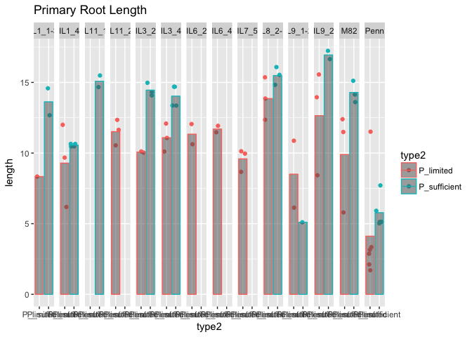
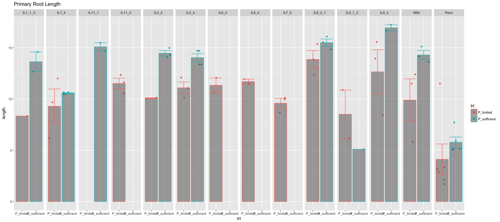

# Fit own data
Xiaoyan Yue  
1/12/2017  


```r
d_own <- read.csv("/Users/xyyue/Documents/Phosphrous_project/Data_Jan6th/RSA_ILs")

d_own
```

```
##      X     image             root_name    length n_child child_density
## 1    7 P-_10_036      p-10_root_10_pen  1.698664       6     4.3635800
## 2   12 P-_10_036      p-10_root_11_pen  2.117296       4    13.0326880
## 3   17 P-_10_036      p-10_root_12_pen 11.513583       4     2.6203601
## 4   28 P-_10_036    p-10_root_9_il11-2 11.638615       9     1.6560458
## 5   39 P-_10_036    p-10_root_7_il11-2 10.552052      11     1.8762233
## 6   54 P-_10_036    p-10_root_8_il11-2 12.348566      14     1.8749233
## 7   59 P-_10_036   p-10_root_5_il1-1-3  8.334159       4     0.6909702
## 8   68 P-_10_036   p-10_root_3_il9-1-2 10.871730       8     2.1395402
## 9   73 P-_10_036   p-10_root_2_il9-1-2  6.137505       4     2.1801226
## 10  71 P-_11_012    p-11_ root_9_il9-2  8.424824       6     3.4982020
## 11  21 P-_11_012  p-11_  root_11_il3-2 10.116691      13     3.6958747
## 12  34 P-_11_012  p-11_  root_10_il3-2 10.027766      12     3.0850255
## 13 391 P-_11_012   p-11_  root_8_il9-2 15.564192       4     1.5294716
## 14  47 P-_11_012    p-11_ root_7_il9-2 13.946051       7     1.6408589
## 15  50 P-_11_012 p-11_  root_6_il8-2-1 12.358492       2     1.2787602
## 16 541 P-_11_012  p-11_ root_5_il8-2-1 13.854084       3     0.6171312
## 17  58 P-_11_012  p-11_ root_4_il8-2-1 15.358059       3     0.8074206
## 18  65 P-_11_012      p-11_ root_3_m82 11.494813       5     1.2159433
## 19  70 P-_11_012      p-11_ root_2_m82 12.397941       5     0.5975382
## 20  72 P-_20_030      p-20_root_12_pen  3.339932       5     2.4445934
## 21  15 P-_20_030      p-20_root_11_pen  2.869081       8     3.4449490
## 22  22 P-_20_030      p-20_root_10_pen  3.155843       6     6.6022863
## 23  27 P-_20_030     p-20_root_6_il3-4 10.105528       4     1.6977400
## 24  33 P-_20_030     p-20_root_5_il3-4 12.085549       5     1.8527883
## 25  37 P-_20_030     p-20_root_4_il3-4 11.064781       3     3.0612588
## 26 392 P-_20_030     p-20_root_3_il1-4 12.000831       1     0.0000000
## 27  41 P-_20_030     p-20_root_2_il1-4  9.677206       1     0.0000000
## 28  44 P-_20_030     p-20_root_1_il1-4  6.185345       2     2.2134984
## 29  11  P-_2_034      p-_2_root_10_m82  5.795228      11     3.1798837
## 30  19  P-_2_034     p-_2_root_9_il7-5 10.128946       7     1.2900501
## 31  25  P-_2_034     p-_2_root_8_il7-5  8.669356       5     1.8917305
## 32 393  P-_2_034     p-_2_root_7_il7-5  9.963184      12     1.8312205
## 33  46  P-_2_034     p-_2_root_6_il6-4 11.467430       7     1.4010131
## 34  52  P-_2_034     p-_2_root_5_il6-4 11.927346       5     2.7927065
## 35  62  P-_2_034     p-_2_root_1_il6-2 10.621942       9     2.0919025
## 36  69  P-_2_034     p-_2_root_3_il6-2 12.050211       6     1.4385352
## 37   8 P+_20_029           root_11_pen  5.126530       7     3.4254076
## 38 191 P+_20_029          root_6_il3-4 13.362432       5     8.3069100
## 39 251 P+_20_029          root_5_il3-4 14.693349       4     3.5146737
## 40  30 P+_20_029          root_3_il1-4 10.470282       4     1.2673534
## 41 371 P+_20_029     p+20_root_2_il1-4 10.647285       6     1.6910731
## 42   1 P+_10_037     p+10_root_12_penn  5.910237       8     5.0310140
## 43  10 P+_10_037      p+10_root_11_pen  5.024827       4     1.5548745
## 44 151 P+_10_037      p+10_root_10_pen  7.706285       9     3.1889563
## 45 252 P+_10_037    p+10_root_9_il11-1 14.670261       5     8.6895170
## 46  31 P+_10_037   p+10_ root_8_il11-1 15.488557       5     1.1310570
## 47 372 P+_10_037   p+10_root_6_il1-1-3 12.671933       1     0.0000000
## 48  40 P+_10_037   p+10_root_4_il1-1-3 14.581784       3    15.4389150
## 49 441 P+_10_037   p+10_root_2_il9-1-2  5.098241       4    13.0545630
## 50   5 P+_11_011    p+11_root_12_il3-2 14.972816       3     0.4272118
## 51   9 P+_11_011    p+11_root_11_il3-2 14.084603       3     0.8959482
## 52  13 P+_11_011    p+11_root_10_il3-2 14.305742       4     0.5703101
## 53 152 P+_11_011     p+11_root_9_il9-2 17.233753       1     0.0000000
## 54  16 P+_11_011     p+11_root_8_il9-2 16.647161       0     0.0000000
## 55  18 P+_11_011   p+11_root_6_il8-2-1 15.537020       1     0.0000000
## 56 192 P+_11_011   p+11_root_5_il8-2-1 14.831728       0     0.0000000
## 57  23 P+_11_011   p+11_root_4_il8-2-1 16.087400       2     0.3738025
## 58  26 P+_11_011       p+11_root_3_m82 15.115747       3     0.5304894
## 59  29 P+_11_011       p+11_root_2_m82 14.141966       2     0.0000000
## 60 311 P+_11_011       p+11_root_1_m82 13.606265       1     0.0000000
## 61  81 P+_20_029           root_11_pen  5.126530       7     3.4254076
## 62 193 P+_20_029          root_6_il3-4 13.362432       5     8.3069100
## 63 253 P+_20_029          root_5_il3-4 14.693349       4     3.5146737
## 64 301 P+_20_029          root_3_il1-4 10.470282       4     1.2673534
## 65 373 P+_20_029     p+20_root_2_il1-4 10.647285       6     1.6910731
##    length_lat_ave n_lat_child type  sample
## 1       0.8115839           0   P-    Penn
## 2       0.6483778           0   P-    Penn
## 3       0.6885342           0   P-    Penn
## 4       0.6446518           0   P-  IL11-2
## 5       1.0611438           0   P-  IL11-2
## 6       0.6754522           0   P-  IL11-2
## 7       0.8153113           0   P- IL1-1-3
## 8       1.1607789           0   P- IL9-1-2
## 9       1.6802391           0   P- IL9-1-2
## 10      1.9742872           0   P-   IL9-2
## 11      1.1818572           0   P-   IL3-2
## 12      1.5391146           0   P-   IL3-2
## 13      1.8362245           0   P-   IL9-2
## 14      0.9647519           0   P-   IL9-2
## 15      0.6991612           0   P- IL8-2-1
## 16      0.8786782           0   P- IL8-2-1
## 17      0.6911483           0   P- IL8-2-1
## 18      1.7611045           0   P-     M82
## 19      1.6852796           0   P-     M82
## 20      0.3890013           0   P-    Penn
## 21      0.4717356           0   P-    Penn
## 22      0.6140887           0   P-    Penn
## 23      0.7567273           0   P-   IL3-4
## 24      0.8601305           0   P-   IL3-4
## 25      2.6184974           0   P-   IL3-4
## 26      4.7416190           0   P-   IL1-4
## 27      1.8332281           0   P-   IL1-4
## 28      0.1732531           0   P-   IL1-4
## 29      1.4149112           0   P-     M82
## 30      1.4093962           0   P-   IL7-5
## 31      0.8478235           0   P-   IL7-5
## 32      0.8860567           0   P-   IL7-5
## 33      1.0441410           0   P-   IL6-4
## 34      2.1653878           0   P-   IL6-4
## 35      1.4656908           0   P-   IL6-2
## 36      1.4209822           0   P-   IL6-2
## 37      1.1962219           0   P+    Penn
## 38      2.5528446           2   P+   IL3-4
## 39      2.6223104           4   P+   IL3-4
## 40      1.4727894           0   P+   IL1-4
## 41      0.7559788           0   P+   IL1-4
## 42      1.0361525           0   P+    Penn
## 43      0.6281025           0   P+    Penn
## 44      0.7556837           0   P+    Penn
## 45      1.1512233           0   P+  IL11-1
## 46      1.1563219           0   P+  IL11-1
## 47      1.0553788           1   P+ IL1-1-3
## 48      1.3827010           0   P+ IL1-1-3
## 49      2.7817244           0   P+ IL9-1-2
## 50      1.2368990           0   P+   IL3-2
## 51      1.1944955           0   P+   IL3-2
## 52      1.5897976           0   P+   IL3-2
## 53      0.5266225           0   P+   IL9-2
## 54     15.1422000           0   P+   IL9-2
## 55      0.3061193           0   P+ IL8-2-1
## 56     15.1422000           0   P+ IL8-2-1
## 57      1.3577389           0   P+ IL8-2-1
## 58      1.7755923           0   P+     M82
## 59      0.5747322           0   P+     M82
## 60      1.2932142           0   P+     M82
## 61      1.1962219           0   P+    Penn
## 62      2.5528446           2   P+   IL3-4
## 63      2.6223104           4   P+   IL3-4
## 64      1.4727894           0   P+   IL1-4
## 65      0.7559788           0   P+   IL1-4
```

```r
#change the name of P-/P+
d_own$type2 <- ifelse(d_own$type=="P-","P_limited","P_sufficient")
d_own$sample <- sub("-","_",d_own$sample,fixed = TRUE)

summary(d_own)
```

```
##        X               image                 root_name      length      
##  Min.   :  1.0   P-_10_036: 9    p+20_root_2_il1-4: 2   Min.   : 1.699  
##  1st Qu.: 23.0   P-_11_012:10    root_11_pen      : 2   1st Qu.: 8.669  
##  Median : 47.0   P-_2_034 : 8    root_3_il1-4     : 2   Median :11.495  
##  Mean   :110.9   P-_20_030: 9    root_5_il3-4     : 2   Mean   :10.864  
##  3rd Qu.:152.0   P+_10_037: 8    root_6_il3-4     : 2   3rd Qu.:14.085  
##  Max.   :541.0   P+_11_011:11     p+10_root_10_pen: 1   Max.   :17.234  
##                  P+_20_029:10   (Other)           :54                   
##     n_child       child_density     length_lat_ave     n_lat_child 
##  Min.   : 0.000   Min.   : 0.0000   Min.   : 0.1733   Min.   :0.0  
##  1st Qu.: 3.000   1st Qu.: 0.8074   1st Qu.: 0.7560   1st Qu.:0.0  
##  Median : 5.000   Median : 1.6977   Median : 1.1819   Median :0.0  
##  Mean   : 5.108   Mean   : 2.6605   Mean   : 1.7200   Mean   :0.2  
##  3rd Qu.: 7.000   3rd Qu.: 3.1890   3rd Qu.: 1.6802   3rd Qu.:0.0  
##  Max.   :14.000   Max.   :15.4389   Max.   :15.1422   Max.   :4.0  
##                                                                    
##  type       sample             type2          
##  P-:36   Length:65          Length:65         
##  P+:29   Class :character   Class :character  
##          Mode  :character   Mode  :character  
##                                               
##                                               
##                                               
## 
```

```r
str(d_own)
```

```
## 'data.frame':	65 obs. of  11 variables:
##  $ X             : int  7 12 17 28 39 54 59 68 73 71 ...
##  $ image         : Factor w/ 7 levels "P-_10_036","P-_11_012",..: 1 1 1 1 1 1 1 1 1 2 ...
##  $ root_name     : Factor w/ 60 levels "  p+10_root_10_pen",..: 15 16 17 23 21 22 20 19 18 60 ...
##  $ length        : num  1.7 2.12 11.51 11.64 10.55 ...
##  $ n_child       : int  6 4 4 9 11 14 4 8 4 6 ...
##  $ child_density : num  4.36 13.03 2.62 1.66 1.88 ...
##  $ length_lat_ave: num  0.812 0.648 0.689 0.645 1.061 ...
##  $ n_lat_child   : int  0 0 0 0 0 0 0 0 0 0 ...
##  $ type          : Factor w/ 2 levels "P-","P+": 1 1 1 1 1 1 1 1 1 1 ...
##  $ sample        : chr  "Penn" "Penn" "Penn" "IL11_2" ...
##  $ type2         : chr  "P_limited" "P_limited" "P_limited" "P_limited" ...
```

```r
#plot the raw data
#plot for primary root length
source("/Users/xyyue/function.R")
p <- ggplot(data=d_own,aes(x=type2,y=length,color=type2)) 
p <- p + geom_jitter()
p <- p + stat_summary(fun.y="mean",geom="bar",alpha=0.5)
p <- p + stat_summary(fun.data="calc.sem",geom="errorbar",position="dodge") 
p <- p + facet_grid(.~sample)
p <- p + labs(title="Primary Root Length")
p
```

```
## Warning: Removed 2 rows containing missing values (geom_errorbar).
```

<!-- -->


```r
#plot for number of later root
p <- ggplot(data=d_own,aes(x=type2,y=n_child,color=type2)) 
p <- p + geom_jitter()
p <- p + stat_summary(fun.y="mean",geom="bar",alpha=0.5)
p <- p + stat_summary(fun.data="calc.sem",geom="errorbar",position="dodge") 
p <- p + facet_grid(.~sample)
p <- p + labs(title="Number of Later Root")
p
```

```
## Warning: Removed 2 rows containing missing values (geom_errorbar).
```

<!-- -->

```r
#fit the model for primary root length
m.brms <- brm(length ~ 0 + sample * type2 + (1|image),#the average of random effect is 0, so the estimate is the standard deviation
            data = d_own,
            prior = c(
              set_prior("normal(0,10)",class="b"), # sets prior for all b coefficients
              set_prior("normal(0,20)",class="b", coef = "type2P_sufficient"), #set prior for "typeP_sufficient"
              set_prior("cauchy(0,1)", class = "sigma"), #half cauchy prior for sigma
              set_prior("normal(0,1)", class = "sd", group = "image") #prior for plate
            ))
```

```
## Compiling the C++ model
```

```
## Start sampling
```

```
## Warning: There were 10 divergent transitions after warmup. Increasing adapt_delta above 0.8 may help. See
## http://mc-stan.org/misc/warnings.html#divergent-transitions-after-warmup
```

```
## Warning: Examine the pairs() plot to diagnose sampling problems
```

```r
summary(m.brms)
```

```
##  Family: gaussian (identity) 
## Formula: length ~ 0 + sample * type2 + (1 | image) 
##    Data: d_own (Number of observations: 65) 
## Samples: 4 chains, each with iter = 2000; warmup = 1000; thin = 1; 
##          total post-warmup samples = 4000
##    WAIC: Not computed
##  
## Group-Level Effects: 
## ~image (Number of levels: 7) 
##               Estimate Est.Error l-95% CI u-95% CI Eff.Sample Rhat
## sd(Intercept)     1.11      0.69     0.05     2.59        579    1
## 
## Population-Level Effects: 
##                                 Estimate Est.Error l-95% CI u-95% CI
## sampleIL1_1M3                       7.58      2.06     3.49    11.46
## sampleIL1_4                         9.11      1.46     6.17    12.05
## sampleIL11_1                        4.54      7.51    -9.64    19.71
## sampleIL11_2                       10.50      1.68     6.93    13.53
## sampleIL3_2                         8.45      2.04     4.03    12.13
## sampleIL3_4                        10.92      1.50     7.87    13.81
## sampleIL6_2                        11.41      1.84     7.64    14.99
## sampleIL6_4                        11.82      1.81     8.29    15.39
## sampleIL7_5                         9.80      1.61     6.71    13.01
## sampleIL8_2M1                      12.19      1.92     7.97    15.45
## sampleIL9_1M2                       7.32      1.82     3.51    10.67
## sampleIL9_2                        11.05      1.90     6.86    14.47
## sampleM82                           8.93      1.55     5.60    11.67
## samplePenn                          3.62      1.25     0.78     5.79
## type2P_sufficient                   5.50      2.39     0.97    10.25
## sampleIL1_4:type2P_sufficient      -3.78      2.76    -9.33     1.63
## sampleIL11_1:type2P_sufficient      4.66      7.44   -10.18    18.90
## sampleIL11_2:type2P_sufficient     -0.14     10.00   -19.54    19.37
## sampleIL3_2:type2P_sufficient       0.48      3.14    -5.79     6.84
## sampleIL3_4:type2P_sufficient      -2.13      2.77    -7.76     3.44
## sampleIL6_2:type2P_sufficient      -0.05     10.07   -19.83    19.16
## sampleIL6_4:type2P_sufficient       0.03      9.85   -19.52    19.27
## sampleIL7_5:type2P_sufficient      -0.13      9.88   -19.98    19.05
## sampleIL8_2M1:type2P_sufficient    -2.18      3.10    -8.17     4.01
## sampleIL9_1M2:type2P_sufficient    -7.72      3.02   -13.48    -1.65
## sampleIL9_2:type2P_sufficient       0.35      3.18    -5.80     6.76
## sampleM82:type2P_sufficient        -0.15      2.96    -5.98     5.56
## samplePenn:type2P_sufficient       -3.39      2.36    -8.08     1.17
##                                 Eff.Sample Rhat
## sampleIL1_1M3                         1161    1
## sampleIL1_4                           2074    1
## sampleIL11_1                          2309    1
## sampleIL11_2                          1496    1
## sampleIL3_2                            940    1
## sampleIL3_4                           2114    1
## sampleIL6_2                           2322    1
## sampleIL6_4                           2442    1
## sampleIL7_5                           2057    1
## sampleIL8_2M1                          745    1
## sampleIL9_1M2                         1610    1
## sampleIL9_2                            773    1
## sampleM82                              972    1
## samplePenn                            1244    1
## type2P_sufficient                      894    1
## sampleIL1_4:type2P_sufficient         1235    1
## sampleIL11_1:type2P_sufficient        2412    1
## sampleIL11_2:type2P_sufficient        4000    1
## sampleIL3_2:type2P_sufficient         1036    1
## sampleIL3_4:type2P_sufficient         1306    1
## sampleIL6_2:type2P_sufficient         4000    1
## sampleIL6_4:type2P_sufficient         4000    1
## sampleIL7_5:type2P_sufficient         4000    1
## sampleIL8_2M1:type2P_sufficient        951    1
## sampleIL9_1M2:type2P_sufficient       2086    1
## sampleIL9_2:type2P_sufficient         1053    1
## sampleM82:type2P_sufficient           1043    1
## samplePenn:type2P_sufficient          1125    1
## 
## Family Specific Parameters: 
##       Estimate Est.Error l-95% CI u-95% CI Eff.Sample Rhat
## sigma     1.96      0.23     1.56     2.46       2059    1
## 
## Samples were drawn using sampling(NUTS). For each parameter, Eff.Sample 
## is a crude measure of effective sample size, and Rhat is the potential 
## scale reduction factor on split chains (at convergence, Rhat = 1).
```

```r
#family specified parameter: it is the overall standard deviation for gussian distribution of the model

#test the effect of type of plate:
(Primary_root_length <- hypothesis(m.brms,"type2P_sufficient=0"))
```

```
## Hypothesis Tests for class b:
##                         Estimate Est.Error l-95% CI u-95% CI Evid.Ratio  
## (type2P_sufficient) = 0      5.5      2.39     0.97    10.25         NA *
## ---
## '*': The expected value under the hypothesis lies outside the 95% CI.
```

```r
#test the effect of type of plate for M82 only
(Primary_root_lengthM82 <- hypothesis(m.brms,"sampleM82:type2P_sufficient=0"))
```

```
## Hypothesis Tests for class b:
##                          Estimate Est.Error l-95% CI u-95% CI Evid.Ratio 
## (sampleM82:type2P... = 0    -0.15      2.96    -5.98     5.56         NA 
## ---
## '*': The expected value under the hypothesis lies outside the 95% CI.
```

```r
#fit the model for number of later root
m.brms2 <- brm(n_child ~ 0 + sample * type2 + (1|image),
            data = d_own,
            prior = c(
              set_prior("normal(0,10)",class="b"), # sets prior for all b coefficients
              set_prior("normal(0,20)",class="b", coef = "type2P_sufficient"), #set prior for "typeP_sufficient"
              set_prior("cauchy(0,1)", class = "sigma"), #half cauchy prior for sigma
              set_prior("normal(0,1)", class = "sd", group = "image") #prior for plate
            ))
```

```
## Compiling the C++ model
## Start sampling
```

```
## Warning: There were 6 divergent transitions after warmup. Increasing adapt_delta above 0.8 may help. See
## http://mc-stan.org/misc/warnings.html#divergent-transitions-after-warmup

## Warning: Examine the pairs() plot to diagnose sampling problems
```

```r
summary(m.brms2)
```

```
##  Family: gaussian (identity) 
## Formula: n_child ~ 0 + sample * type2 + (1 | image) 
##    Data: d_own (Number of observations: 65) 
## Samples: 4 chains, each with iter = 2000; warmup = 1000; thin = 1; 
##          total post-warmup samples = 4000
##    WAIC: Not computed
##  
## Group-Level Effects: 
## ~image (Number of levels: 7) 
##               Estimate Est.Error l-95% CI u-95% CI Eff.Sample Rhat
## sd(Intercept)     1.03      0.61     0.07     2.36        835    1
## 
## Population-Level Effects: 
##                                 Estimate Est.Error l-95% CI u-95% CI
## sampleIL1_1M3                       4.05      1.71     0.63     7.37
## sampleIL1_4                         0.88      1.36    -1.93     3.41
## sampleIL11_1                        3.58      7.03   -10.19    17.24
## sampleIL11_2                       11.43      1.29     8.95    14.08
## sampleIL3_2                        12.77      1.54     9.84    15.79
## sampleIL3_4                         3.48      1.35     0.70     5.97
## sampleIL6_2                         6.11      1.79     2.16     9.31
## sampleIL6_4                         4.62      1.79     0.68     7.77
## sampleIL7_5                         6.61      1.71     2.82     9.50
## sampleIL8_2M1                       3.21      1.42     0.54     6.16
## sampleIL9_1M2                       6.14      1.46     3.33     9.17
## sampleIL9_2                         6.14      1.38     3.56     8.96
## sampleM82                           6.86      1.27     4.24     9.36
## samplePenn                          5.33      1.02     3.17     7.25
## type2P_sufficient                  -2.04      2.06    -5.97     1.96
## sampleIL1_4:type2P_sufficient       6.06      2.44     1.26    10.76
## sampleIL11_1:type2P_sufficient      3.38      7.01   -10.33    16.72
## sampleIL11_2:type2P_sufficient     -0.08     10.05   -19.60    19.83
## sampleIL3_2:type2P_sufficient      -7.14      2.83   -12.73    -1.63
## sampleIL3_4:type2P_sufficient       2.98      2.46    -1.80     7.67
## sampleIL6_2:type2P_sufficient       0.00      9.97   -19.08    19.45
## sampleIL6_4:type2P_sufficient      -0.14     10.25   -20.02    20.92
## sampleIL7_5:type2P_sufficient       0.16     10.13   -19.87    19.69
## sampleIL8_2M1:type2P_sufficient     0.04      2.72    -5.28     5.30
## sampleIL9_1M2:type2P_sufficient    -0.16      2.64    -5.27     5.14
## sampleIL9_2:type2P_sufficient      -3.39      2.77    -8.86     1.95
## sampleM82:type2P_sufficient        -2.60      2.68    -7.65     2.79
## samplePenn:type2P_sufficient        3.63      2.09    -0.48     7.69
##                                 Eff.Sample Rhat
## sampleIL1_1M3                         1467 1.00
## sampleIL1_4                           1913 1.00
## sampleIL11_1                          2828 1.00
## sampleIL11_2                          2268 1.00
## sampleIL3_2                           1491 1.00
## sampleIL3_4                           2067 1.00
## sampleIL6_2                           1366 1.00
## sampleIL6_4                           1380 1.00
## sampleIL7_5                           1201 1.00
## sampleIL8_2M1                         1354 1.00
## sampleIL9_1M2                         1769 1.00
## sampleIL9_2                           1462 1.00
## sampleM82                             1885 1.00
## samplePenn                            1236 1.00
## type2P_sufficient                     1086 1.00
## sampleIL1_4:type2P_sufficient         1374 1.00
## sampleIL11_1:type2P_sufficient        2791 1.00
## sampleIL11_2:type2P_sufficient        4000 1.00
## sampleIL3_2:type2P_sufficient         1140 1.01
## sampleIL3_4:type2P_sufficient         1447 1.00
## sampleIL6_2:type2P_sufficient         4000 1.00
## sampleIL6_4:type2P_sufficient         4000 1.00
## sampleIL7_5:type2P_sufficient         4000 1.00
## sampleIL8_2M1:type2P_sufficient       1217 1.00
## sampleIL9_1M2:type2P_sufficient       2462 1.00
## sampleIL9_2:type2P_sufficient         1252 1.00
## sampleM82:type2P_sufficient           1201 1.00
## samplePenn:type2P_sufficient          1449 1.00
## 
## Family Specific Parameters: 
##       Estimate Est.Error l-95% CI u-95% CI Eff.Sample Rhat
## sigma     1.65      0.19     1.33     2.06       1784    1
## 
## Samples were drawn using sampling(NUTS). For each parameter, Eff.Sample 
## is a crude measure of effective sample size, and Rhat is the potential 
## scale reduction factor on split chains (at convergence, Rhat = 1).
```

```r
#test the effect of type of plate:
(Primary_root_length <- hypothesis(m.brms2,"type2P_sufficient=0"))
```

```
## Hypothesis Tests for class b:
##                         Estimate Est.Error l-95% CI u-95% CI Evid.Ratio 
## (type2P_sufficient) = 0    -2.04      2.06    -5.97     1.96         NA 
## ---
## '*': The expected value under the hypothesis lies outside the 95% CI.
```

```r
#test the effect of type of plate for M82 only
(Primary_root_lengthM82 <- hypothesis(m.brms2,"sampleM82:type2P_sufficient=0"))
```

```
## Hypothesis Tests for class b:
##                          Estimate Est.Error l-95% CI u-95% CI Evid.Ratio 
## (sampleM82:type2P... = 0     -2.6      2.68    -7.65     2.79         NA 
## ---
## '*': The expected value under the hypothesis lies outside the 95% CI.
```

