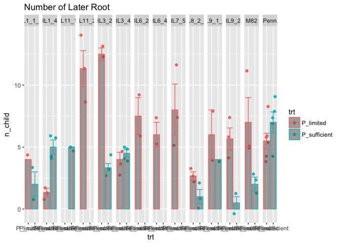

# Fit own data
Xiaoyan Yue  
1/12/2017  


#Load the data

```r
d_own <- read.csv("/Users/xyyue/Documents/Phosphrous_project/Data_Jan6th/RSA_ILs")

#change the name of P-/P+
d_own$trt <- ifelse(d_own$type=="P-","P_limited","P_sufficient")
#d_own$sample <- sub("-","_",d_own$sample,fixed = TRUE)#run twice,more than one "-"in "sample"
d_own$sample <- gsub("-","_",d_own$sample)# only run once

d_own$plate_id <- d_own$image

#look at the data
summary(d_own)
```

```
##        X               image                 root_name      length      
##  Min.   :  1.0   P-_10_036: 9    p+20_root_2_il1-4: 2   Min.   : 1.699  
##  1st Qu.: 23.0   P-_11_012:10    root_11_pen      : 2   1st Qu.: 8.669  
##  Median : 47.0   P-_2_034 : 8    root_3_il1-4     : 2   Median :11.495  
##  Mean   :110.9   P-_20_030: 9    root_5_il3-4     : 2   Mean   :10.864  
##  3rd Qu.:152.0   P+_10_037: 8    root_6_il3-4     : 2   3rd Qu.:14.085  
##  Max.   :541.0   P+_11_011:11     p+10_root_10_pen: 1   Max.   :17.234  
##                  P+_20_029:10   (Other)           :54                   
##     n_child       child_density     length_lat_ave     n_lat_child 
##  Min.   : 0.000   Min.   : 0.0000   Min.   : 0.1733   Min.   :0.0  
##  1st Qu.: 3.000   1st Qu.: 0.8074   1st Qu.: 0.7560   1st Qu.:0.0  
##  Median : 5.000   Median : 1.6977   Median : 1.1819   Median :0.0  
##  Mean   : 5.108   Mean   : 2.6605   Mean   : 1.7200   Mean   :0.2  
##  3rd Qu.: 7.000   3rd Qu.: 3.1890   3rd Qu.: 1.6802   3rd Qu.:0.0  
##  Max.   :14.000   Max.   :15.4389   Max.   :15.1422   Max.   :4.0  
##                                                                    
##  type       sample              trt                 plate_id 
##  P-:36   Length:65          Length:65          P-_10_036: 9  
##  P+:29   Class :character   Class :character   P-_11_012:10  
##          Mode  :character   Mode  :character   P-_2_034 : 8  
##                                                P-_20_030: 9  
##                                                P+_10_037: 8  
##                                                P+_11_011:11  
##                                                P+_20_029:10
```

```r
str(d_own)
```

```
## 'data.frame':	65 obs. of  12 variables:
##  $ X             : int  7 12 17 28 39 54 59 68 73 71 ...
##  $ image         : Factor w/ 7 levels "P-_10_036","P-_11_012",..: 1 1 1 1 1 1 1 1 1 2 ...
##  $ root_name     : Factor w/ 60 levels "  p+10_root_10_pen",..: 15 16 17 23 21 22 20 19 18 60 ...
##  $ length        : num  1.7 2.12 11.51 11.64 10.55 ...
##  $ n_child       : int  6 4 4 9 11 14 4 8 4 6 ...
##  $ child_density : num  4.36 13.03 2.62 1.66 1.88 ...
##  $ length_lat_ave: num  0.812 0.648 0.689 0.645 1.061 ...
##  $ n_lat_child   : int  0 0 0 0 0 0 0 0 0 0 ...
##  $ type          : Factor w/ 2 levels "P-","P+": 1 1 1 1 1 1 1 1 1 1 ...
##  $ sample        : chr  "Penn" "Penn" "Penn" "IL11_2" ...
##  $ trt           : chr  "P_limited" "P_limited" "P_limited" "P_limited" ...
##  $ plate_id      : Factor w/ 7 levels "P-_10_036","P-_11_012",..: 1 1 1 1 1 1 1 1 1 2 ...
```

#Plot the raw data

```r
#plot for primary root length
source("/Users/xyyue/function.R")
p <- ggplot(data=d_own,aes(x=trt,y=length,color=trt)) 
p <- p + geom_jitter()
p <- p + stat_summary(fun.y="mean",geom="bar",alpha=0.5)
p <- p + stat_summary(fun.data="calc.sem",geom="errorbar",position="dodge") 
p <- p + facet_grid(.~sample)
p <- p + labs(title="Primary Root Length")
p
```

```
## Warning: Removed 2 rows containing missing values (geom_errorbar).
```

<!-- -->


```r
#plot for number of later root
p <- ggplot(data=d_own,aes(x=trt,y=n_child,color=trt)) 
p <- p + geom_jitter()
p <- p + stat_summary(fun.y="mean",geom="bar",alpha=0.5)
p <- p + stat_summary(fun.data="calc.sem",geom="errorbar",position="dodge") 
p <- p + facet_grid(.~sample)
p <- p + labs(title="Number of Later Root")
p
```

```
## Warning: Removed 2 rows containing missing values (geom_errorbar).
```

<!-- -->

#Set the reference

```r
#set M82 and P_sufficient as the reference
d_own$trt <- as.factor(d_own$trt)
d_own$sample <- as.factor(d_own$sample)

d_own$sample <- relevel(d_own$sample,ref = "M82")#relevel only useful for factors
d_own$trt <- relevel(d_own$trt,ref = "P_sufficient")
```

##Fit model by brm and most of the priors are as default

```r
#fit the model for primary root length 
m.brms1 <- brm(length ~ sample * trt ,#the average of random effect is 0, so the estimate is the standard deviation
            data = d_own,
            prior = c(
              set_prior("normal(10,20)",class="Intercept"),
              set_prior("normal(0,10)",class="b")))#sets the same prior for beta coefficients, the others are as default
```

```
## Compiling the C++ model
```

```
## Start sampling
```

```r
summary(m.brms1)
```

```
##  Family: gaussian (identity) 
## Formula: length ~ sample * trt 
##    Data: d_own (Number of observations: 65) 
## Samples: 4 chains, each with iter = 2000; warmup = 1000; thin = 1; 
##          total post-warmup samples = 4000
##    WAIC: Not computed
##  
## Population-Level Effects: 
##                            Estimate Est.Error l-95% CI u-95% CI Eff.Sample
## Intercept                     13.87      1.08    11.72    15.96       1483
## sampleIL1_1_3                 -0.27      1.81    -3.78     3.26       2466
## sampleIL1_4                   -3.23      1.49    -6.17    -0.33       2058
## sampleIL11_1                   1.21      1.78    -2.26     4.80       2608
## sampleIL11_2                   0.70      7.36   -14.18    14.83       4000
## sampleIL3_2                    0.60      1.56    -2.48     3.66       2224
## sampleIL3_4                    0.17      1.48    -2.69     3.20       1974
## sampleIL6_2                    0.53      7.15   -13.15    15.13       4000
## sampleIL6_4                    0.84      7.23   -13.28    14.89       3484
## sampleIL7_5                   -0.34      7.30   -14.70    14.17       4000
## sampleIL8_2_1                  1.65      1.56    -1.30     4.66       1924
## sampleIL9_1_2                 -8.20      2.24   -12.47    -3.80       2993
## sampleIL9_2                    2.98      1.78    -0.41     6.61       2636
## samplePenn                    -8.02      1.42   -10.74    -5.21       2241
## trtP_limited                  -3.74      1.47    -6.53    -0.83       1429
## sampleIL1_1_3:trtP_limited    -1.49      2.82    -7.16     4.11       2737
## sampleIL1_4:trtP_limited       2.35      2.12    -1.75     6.48       2065
## sampleIL11_1:trtP_limited     -0.21      9.80   -19.84    18.34       4000
## sampleIL11_2:trtP_limited      0.65      7.41   -13.95    15.50       4000
## sampleIL3_2:trtP_limited      -0.66      2.34    -5.28     3.85       2320
## sampleIL3_4:trtP_limited       0.75      2.11    -3.43     4.84       2071
## sampleIL6_2:trtP_limited       0.69      7.16   -13.93    14.47       4000
## sampleIL6_4:trtP_limited       0.70      7.20   -13.25    14.58       3476
## sampleIL7_5:trtP_limited      -0.23      7.28   -14.79    13.71       4000
## sampleIL8_2_1:trtP_limited     2.05      2.24    -2.35     6.38       2060
## sampleIL9_1_2:trtP_limited     6.39      2.83     0.73    11.77       2910
## sampleIL9_2:trtP_limited      -0.45      2.30    -4.98     3.98       2533
## samplePenn:trtP_limited        1.99      1.92    -1.78     5.61       2006
##                            Rhat
## Intercept                     1
## sampleIL1_1_3                 1
## sampleIL1_4                   1
## sampleIL11_1                  1
## sampleIL11_2                  1
## sampleIL3_2                   1
## sampleIL3_4                   1
## sampleIL6_2                   1
## sampleIL6_4                   1
## sampleIL7_5                   1
## sampleIL8_2_1                 1
## sampleIL9_1_2                 1
## sampleIL9_2                   1
## samplePenn                    1
## trtP_limited                  1
## sampleIL1_1_3:trtP_limited    1
## sampleIL1_4:trtP_limited      1
## sampleIL11_1:trtP_limited     1
## sampleIL11_2:trtP_limited     1
## sampleIL3_2:trtP_limited      1
## sampleIL3_4:trtP_limited      1
## sampleIL6_2:trtP_limited      1
## sampleIL6_4:trtP_limited      1
## sampleIL7_5:trtP_limited      1
## sampleIL8_2_1:trtP_limited    1
## sampleIL9_1_2:trtP_limited    1
## sampleIL9_2:trtP_limited      1
## samplePenn:trtP_limited       1
## 
## Family Specific Parameters: 
##       Estimate Est.Error l-95% CI u-95% CI Eff.Sample Rhat
## sigma     2.07      0.23     1.68     2.57       2413    1
## 
## Samples were drawn using sampling(NUTS). For each parameter, Eff.Sample 
## is a crude measure of effective sample size, and Rhat is the potential 
## scale reduction factor on split chains (at convergence, Rhat = 1).
```

```r
m.brms2 <- brm(length ~ sample * trt + (1|plate_id),#the average of random effect is 0, so the estimate is the standard deviation
            data = d_own,
            prior = c(
              set_prior("normal(10,20)",class="Intercept"),
              set_prior("normal(0,10)",class="b")))#sets the same prior for beta coefficients, the others are as default
```

```
## Compiling the C++ model
## Start sampling
```

```
## Warning: There were 13 divergent transitions after warmup. Increasing adapt_delta above 0.8 may help. See
## http://mc-stan.org/misc/warnings.html#divergent-transitions-after-warmup
```

```
## Warning: Examine the pairs() plot to diagnose sampling problems
```

```r
summary(m.brms2)
```

```
##  Family: gaussian (identity) 
## Formula: length ~ sample * trt + (1 | plate_id) 
##    Data: d_own (Number of observations: 65) 
## Samples: 4 chains, each with iter = 2000; warmup = 1000; thin = 1; 
##          total post-warmup samples = 4000
##    WAIC: Not computed
##  
## Group-Level Effects: 
## ~plate_id (Number of levels: 7) 
##               Estimate Est.Error l-95% CI u-95% CI Eff.Sample Rhat
## sd(Intercept)     2.27      1.59     0.15     6.32        787    1
## 
## Population-Level Effects: 
##                            Estimate Est.Error l-95% CI u-95% CI Eff.Sample
## Intercept                     13.20      2.16     8.52    17.19       1425
## sampleIL1_1_3                  0.37      2.56    -4.32     5.70       1280
## sampleIL1_4                   -1.98      2.49    -6.46     3.41       1047
## sampleIL11_1                   1.85      2.53    -3.00     7.10       1247
## sampleIL11_2                   0.46      7.22   -14.16    14.44       3456
## sampleIL3_2                    0.34      1.51    -2.61     3.29       4000
## sampleIL3_4                    1.46      2.50    -3.05     6.85       1063
## sampleIL6_2                    1.80      7.32   -12.83    16.09       4000
## sampleIL6_4                    1.62      7.07   -12.10    15.46       3666
## sampleIL7_5                    1.20      7.04   -12.72    14.58       3539
## sampleIL8_2_1                  1.42      1.53    -1.55     4.45       3319
## sampleIL9_1_2                 -7.59      2.78   -13.00    -1.88       1561
## sampleIL9_2                    2.76      1.72    -0.61     6.14       4000
## samplePenn                    -7.07      2.31   -11.14    -2.01        997
## trtP_limited                  -3.47      2.62    -8.48     2.32       1526
## sampleIL1_1_3:trtP_limited    -2.55      3.61    -9.99     4.16       1548
## sampleIL1_4:trtP_limited       1.99      3.15    -4.71     7.95       1267
## sampleIL11_1:trtP_limited      0.09     10.18   -19.44    19.70       4000
## sampleIL11_2:trtP_limited      0.44      7.22   -13.18    14.91       3270
## sampleIL3_2:trtP_limited      -1.34      2.40    -6.08     3.48       2685
## sampleIL3_4:trtP_limited       0.36      3.15    -6.22     6.32       1344
## sampleIL6_2:trtP_limited       1.56      7.34   -13.05    15.87       4000
## sampleIL6_4:trtP_limited       2.06      7.17   -12.02    16.20       4000
## sampleIL7_5:trtP_limited       0.39      7.04   -13.42    14.06       3448
## sampleIL8_2_1:trtP_limited     1.31      2.30    -3.21     5.93       3033
## sampleIL9_1_2:trtP_limited     5.33      3.54    -1.83    12.10       1553
## sampleIL9_2:trtP_limited      -1.19      2.38    -5.96     3.50       2523
## samplePenn:trtP_limited        1.25      2.95    -5.19     6.75       1151
##                            Rhat
## Intercept                     1
## sampleIL1_1_3                 1
## sampleIL1_4                   1
## sampleIL11_1                  1
## sampleIL11_2                  1
## sampleIL3_2                   1
## sampleIL3_4                   1
## sampleIL6_2                   1
## sampleIL6_4                   1
## sampleIL7_5                   1
## sampleIL8_2_1                 1
## sampleIL9_1_2                 1
## sampleIL9_2                   1
## samplePenn                    1
## trtP_limited                  1
## sampleIL1_1_3:trtP_limited    1
## sampleIL1_4:trtP_limited      1
## sampleIL11_1:trtP_limited     1
## sampleIL11_2:trtP_limited     1
## sampleIL3_2:trtP_limited      1
## sampleIL3_4:trtP_limited      1
## sampleIL6_2:trtP_limited      1
## sampleIL6_4:trtP_limited      1
## sampleIL7_5:trtP_limited      1
## sampleIL8_2_1:trtP_limited    1
## sampleIL9_1_2:trtP_limited    1
## sampleIL9_2:trtP_limited      1
## samplePenn:trtP_limited       1
## 
## Family Specific Parameters: 
##       Estimate Est.Error l-95% CI u-95% CI Eff.Sample Rhat
## sigma     1.97      0.23     1.57     2.49       1759    1
## 
## Samples were drawn using sampling(NUTS). For each parameter, Eff.Sample 
## is a crude measure of effective sample size, and Rhat is the potential 
## scale reduction factor on split chains (at convergence, Rhat = 1).
```

```r
loo(m.brms1,m.brms2)#almost the same
```

```
## Warning: Some Pareto k diagnostic values are too high. See help('pareto-k-
## diagnostic') for details.
```

```
## Warning: Some Pareto k diagnostic values are too high. See help('pareto-k-
## diagnostic') for details.
```

```
##                    LOOIC    SE
## m.brms1           305.44 21.16
## m.brms2           303.91 21.48
## m.brms1 - m.brms2   1.54  4.30
```

##Set more specific priors

```r
m.brms3 <- brm(length ~ sample * trt,#the average of random effect is 0, so the estimate is the standard deviation
            data = d_own,
            prior = c(
              set_prior("normal(10,20)",class="Intercept"),
              set_prior("normal(0,10)",class="b"), # sets prior for all b coefficients
              set_prior("normal(0,20)",class="b", coef = "trtP_limited"), 
              set_prior("cauchy(0,1)", class = "sigma") #half cauchy prior for sigma
            ))
```

```
## Compiling the C++ model
```

```
## Start sampling
```

```r
summary(m.brms3)
```

```
##  Family: gaussian (identity) 
## Formula: length ~ sample * trt 
##    Data: d_own (Number of observations: 65) 
## Samples: 4 chains, each with iter = 2000; warmup = 1000; thin = 1; 
##          total post-warmup samples = 4000
##    WAIC: Not computed
##  
## Population-Level Effects: 
##                            Estimate Est.Error l-95% CI u-95% CI Eff.Sample
## Intercept                     13.95      1.09    11.82    16.04       1216
## sampleIL1_1_3                 -0.35      1.74    -3.68     3.07       1810
## sampleIL1_4                   -3.34      1.49    -6.21    -0.35       1690
## sampleIL11_1                   1.09      1.80    -2.42     4.74       2303
## sampleIL11_2                   0.47      7.23   -14.24    14.44       3023
## sampleIL3_2                    0.48      1.57    -2.66     3.56       1785
## sampleIL3_4                    0.08      1.48    -2.86     2.93       1712
## sampleIL6_2                    0.77      7.17   -13.36    14.98       3000
## sampleIL6_4                    0.85      7.27   -13.70    15.24       2819
## sampleIL7_5                   -0.40      6.99   -13.76    13.72       2638
## sampleIL8_2_1                  1.51      1.60    -1.56     4.75       1864
## sampleIL9_1_2                 -8.29      2.20   -12.62    -3.86       2439
## sampleIL9_2                    2.89      1.80    -0.65     6.44       1888
## samplePenn                    -8.10      1.39   -10.81    -5.34       1347
## trtP_limited                  -3.89      1.48    -6.76    -0.94       1182
## sampleIL1_1_3:trtP_limited    -1.28      2.76    -6.57     4.12       2514
## sampleIL1_4:trtP_limited       2.54      2.12    -1.82     6.64       1794
## sampleIL11_1:trtP_limited     -0.20      9.94   -20.25    19.23       4000
## sampleIL11_2:trtP_limited      0.97      7.25   -12.99    15.65       3025
## sampleIL3_2:trtP_limited      -0.43      2.32    -5.12     4.20       1870
## sampleIL3_4:trtP_limited       0.94      2.11    -3.16     5.15       1837
## sampleIL6_2:trtP_limited       0.51      7.17   -13.55    14.33       2645
## sampleIL6_4:trtP_limited       0.78      7.27   -13.55    15.16       2808
## sampleIL7_5:trtP_limited      -0.06      6.99   -13.86    13.54       2632
## sampleIL8_2_1:trtP_limited     2.27      2.18    -2.09     6.53       1821
## sampleIL9_1_2:trtP_limited     6.60      2.73     1.08    11.96       2406
## sampleIL9_2:trtP_limited      -0.29      2.32    -4.80     4.33       1937
## samplePenn:trtP_limited        2.15      1.87    -1.51     5.76       1498
##                            Rhat
## Intercept                     1
## sampleIL1_1_3                 1
## sampleIL1_4                   1
## sampleIL11_1                  1
## sampleIL11_2                  1
## sampleIL3_2                   1
## sampleIL3_4                   1
## sampleIL6_2                   1
## sampleIL6_4                   1
## sampleIL7_5                   1
## sampleIL8_2_1                 1
## sampleIL9_1_2                 1
## sampleIL9_2                   1
## samplePenn                    1
## trtP_limited                  1
## sampleIL1_1_3:trtP_limited    1
## sampleIL1_4:trtP_limited      1
## sampleIL11_1:trtP_limited     1
## sampleIL11_2:trtP_limited     1
## sampleIL3_2:trtP_limited      1
## sampleIL3_4:trtP_limited      1
## sampleIL6_2:trtP_limited      1
## sampleIL6_4:trtP_limited      1
## sampleIL7_5:trtP_limited      1
## sampleIL8_2_1:trtP_limited    1
## sampleIL9_1_2:trtP_limited    1
## sampleIL9_2:trtP_limited      1
## samplePenn:trtP_limited       1
## 
## Family Specific Parameters: 
##       Estimate Est.Error l-95% CI u-95% CI Eff.Sample Rhat
## sigma     2.03      0.22     1.64     2.52       2695    1
## 
## Samples were drawn using sampling(NUTS). For each parameter, Eff.Sample 
## is a crude measure of effective sample size, and Rhat is the potential 
## scale reduction factor on split chains (at convergence, Rhat = 1).
```

```r
m.brms4 <- brm(length ~ sample * trt + (1|plate_id),#the average of random effect is 0, so the estimate is the standard deviation
            data = d_own,
            prior = c(
              set_prior("normal(10,20)",class="Intercept"),
              set_prior("normal(0,10)",class="b"), # sets prior for all b coefficients
              set_prior("normal(0,20)",class="b", coef = "trtP_limited"), 
              set_prior("cauchy(0,1)", class = "sigma"), #half cauchy prior for sigma
              set_prior("normal(0,5)", class = "sd", group = "plate_id") #prior for plate
            ))
```

```
## Compiling the C++ model
## Start sampling
```

```
## Warning: There were 12 divergent transitions after warmup. Increasing adapt_delta above 0.8 may help. See
## http://mc-stan.org/misc/warnings.html#divergent-transitions-after-warmup
```

```
## Warning: Examine the pairs() plot to diagnose sampling problems
```

```r
summary(m.brms4)#family specified parameter: it is the overall standard deviation for gussian distribution of the model
```

```
##  Family: gaussian (identity) 
## Formula: length ~ sample * trt + (1 | plate_id) 
##    Data: d_own (Number of observations: 65) 
## Samples: 4 chains, each with iter = 2000; warmup = 1000; thin = 1; 
##          total post-warmup samples = 4000
##    WAIC: Not computed
##  
## Group-Level Effects: 
## ~plate_id (Number of levels: 7) 
##               Estimate Est.Error l-95% CI u-95% CI Eff.Sample Rhat
## sd(Intercept)     2.14      1.39     0.15     5.55        915    1
## 
## Population-Level Effects: 
##                            Estimate Est.Error l-95% CI u-95% CI Eff.Sample
## Intercept                     13.24      2.18     8.14    17.15       1076
## sampleIL1_1_3                  0.40      2.55    -4.29     5.82       1075
## sampleIL1_4                   -1.95      2.47    -6.32     3.19       1059
## sampleIL11_1                   1.86      2.59    -2.94     7.30       1124
## sampleIL11_2                   0.31      7.20   -13.80    14.62       4000
## sampleIL3_2                    0.34      1.48    -2.58     3.30       3523
## sampleIL3_4                    1.46      2.48    -2.91     6.74       1000
## sampleIL6_2                    1.60      7.21   -12.86    16.00       4000
## sampleIL6_4                    1.94      7.24   -12.03    16.02       3701
## sampleIL7_5                    0.95      7.10   -13.17    14.99       4000
## sampleIL8_2_1                  1.42      1.53    -1.54     4.39       3205
## sampleIL9_1_2                 -7.58      2.86   -13.02    -1.87       1302
## sampleIL9_2                    2.81      1.65    -0.55     6.09       4000
## samplePenn                    -7.06      2.32   -11.22    -2.02        938
## trtP_limited                  -3.50      2.85    -8.92     2.81       1214
## sampleIL1_1_3:trtP_limited    -2.51      3.54   -10.04     4.18       1241
## sampleIL1_4:trtP_limited       1.98      3.12    -4.59     7.85       1206
## sampleIL11_1:trtP_limited      0.15      9.99   -19.09    19.72       4000
## sampleIL11_2:trtP_limited      0.65      7.20   -13.90    14.98       4000
## sampleIL3_2:trtP_limited      -1.35      2.31    -5.84     3.12       3004
## sampleIL3_4:trtP_limited       0.36      3.13    -6.37     6.25       1145
## sampleIL6_2:trtP_limited       1.78      7.26   -12.34    16.31       4000
## sampleIL6_4:trtP_limited       1.77      7.30   -12.49    15.76       3641
## sampleIL7_5:trtP_limited       0.64      7.17   -13.54    14.74       4000
## sampleIL8_2_1:trtP_limited     1.29      2.20    -3.01     5.52       2357
## sampleIL9_1_2:trtP_limited     5.46      3.58    -1.83    12.25       1247
## sampleIL9_2:trtP_limited      -1.24      2.33    -5.80     3.40       3083
## samplePenn:trtP_limited        1.29      2.92    -5.03     6.71       1014
##                            Rhat
## Intercept                     1
## sampleIL1_1_3                 1
## sampleIL1_4                   1
## sampleIL11_1                  1
## sampleIL11_2                  1
## sampleIL3_2                   1
## sampleIL3_4                   1
## sampleIL6_2                   1
## sampleIL6_4                   1
## sampleIL7_5                   1
## sampleIL8_2_1                 1
## sampleIL9_1_2                 1
## sampleIL9_2                   1
## samplePenn                    1
## trtP_limited                  1
## sampleIL1_1_3:trtP_limited    1
## sampleIL1_4:trtP_limited      1
## sampleIL11_1:trtP_limited     1
## sampleIL11_2:trtP_limited     1
## sampleIL3_2:trtP_limited      1
## sampleIL3_4:trtP_limited      1
## sampleIL6_2:trtP_limited      1
## sampleIL6_4:trtP_limited      1
## sampleIL7_5:trtP_limited      1
## sampleIL8_2_1:trtP_limited    1
## sampleIL9_1_2:trtP_limited    1
## sampleIL9_2:trtP_limited      1
## samplePenn:trtP_limited       1
## 
## Family Specific Parameters: 
##       Estimate Est.Error l-95% CI u-95% CI Eff.Sample Rhat
## sigma     1.93      0.22     1.55     2.42       2100    1
## 
## Samples were drawn using sampling(NUTS). For each parameter, Eff.Sample 
## is a crude measure of effective sample size, and Rhat is the potential 
## scale reduction factor on split chains (at convergence, Rhat = 1).
```

```r
loo(m.brms3,m.brms4)
```

```
## Warning: Some Pareto k diagnostic values are too high. See help('pareto-k-
## diagnostic') for details.
```

```
## Warning: Some Pareto k diagnostic values are too high. See help('pareto-k-
## diagnostic') for details.
```

```
##                   LOOIC    SE
## m.brms3           304.6 22.07
## m.brms4           305.4 23.25
## m.brms3 - m.brms4  -0.8  4.69
```

```r
loo(m.brms1,m.brms2,m.brms3,m.brms4)
```

```
## Warning: Some Pareto k diagnostic values are too high. See help('pareto-k-
## diagnostic') for details.

## Warning: Some Pareto k diagnostic values are too high. See help('pareto-k-
## diagnostic') for details.

## Warning: Some Pareto k diagnostic values are too high. See help('pareto-k-
## diagnostic') for details.

## Warning: Some Pareto k diagnostic values are too high. See help('pareto-k-
## diagnostic') for details.
```

```
##                    LOOIC    SE
## m.brms1           305.44 21.16
## m.brms2           303.91 21.48
## m.brms3           304.60 22.07
## m.brms4           305.40 23.25
## m.brms1 - m.brms2   1.54  4.30
## m.brms1 - m.brms3   0.84  1.12
## m.brms1 - m.brms4   0.04  5.01
## m.brms2 - m.brms3  -0.69  4.39
## m.brms2 - m.brms4  -1.50  2.00
## m.brms3 - m.brms4  -0.80  4.69
```

```r
# If the first one is the best one? 
#How do I make a good specific priors for each parameter?
```

##Test the hypothesis in the first model (m.brms1)

```r
#test the effect of treatment:
(Primary_root_length <- hypothesis(m.brms1,"trtP_limited<0")) 
```

```
## Hypothesis Tests for class b:
##                    Estimate Est.Error l-95% CI u-95% CI Evid.Ratio  
## (trtP_limited) < 0    -3.74      1.47     -Inf    -1.34     128.03 *
## ---
## '*': The expected value under the hypothesis lies outside the 95% CI.
```

```r
#what's this tested for? For the intercept M82 on two different treatment or for the mean of all samples on two conditions?

#If the result means the treatment effect is significant?

#How can I test the effect of treatment for each sample? 
```

##How about fit the model by lmer

```r
library(lme4);library(lmerTest);library(ggplot2);library(reshape2)

m.lmer1 <- lmer(length ~ sample * trt + (1|plate_id),data = d_own)
```

```
## fixed-effect model matrix is rank deficient so dropping 5 columns / coefficients
```

```r
m.lmer2 <- lmer(length ~ sample  + (1|plate_id),data = d_own)
m.lmer3 <- lmer(length ~ sample + trt  + (1|plate_id),data = d_own)

anova(m.lmer1,m.lmer2)
```

```
## refitting model(s) with ML (instead of REML)
```

```
## Data: d_own
## Models:
## ..1: length ~ sample + (1 | plate_id)
## object: length ~ sample * trt + (1 | plate_id)
##        Df    AIC    BIC  logLik deviance  Chisq Chi Df Pr(>Chisq)   
## ..1    16 306.59 341.38 -137.30   274.59                            
## object 25 297.65 352.01 -123.82   247.65 26.945      9   0.001428 **
## ---
## Signif. codes:  0 '***' 0.001 '**' 0.01 '*' 0.05 '.' 0.1 ' ' 1
```

```r
anova(m.lmer1,m.lmer3)
```

```
## refitting model(s) with ML (instead of REML)
```

```
## Data: d_own
## Models:
## ..1: length ~ sample + trt + (1 | plate_id)
## object: length ~ sample * trt + (1 | plate_id)
##        Df    AIC    BIC  logLik deviance  Chisq Chi Df Pr(>Chisq)  
## ..1    17 297.63 334.60 -131.82   263.63                           
## object 25 297.65 352.01 -123.82   247.65 15.988      8    0.04255 *
## ---
## Signif. codes:  0 '***' 0.001 '**' 0.01 '*' 0.05 '.' 0.1 ' ' 1
```

```r
#It seems lmer must contain a random effect?
#If m.lmer1 is the best model?
```
